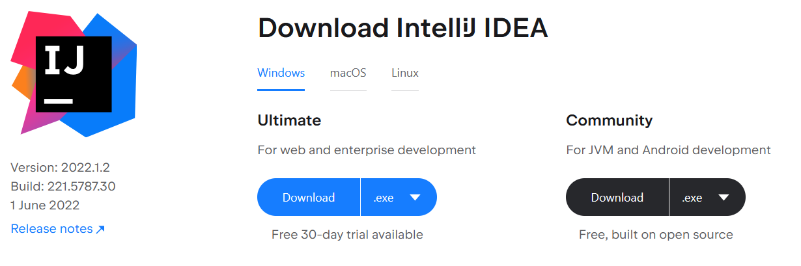

# 第01章 - 初探（First steps）

本书将介绍使用[OpenGL](https://www.opengl.org)开发3D游戏的核心技术。我们将使用Java语言编写示例代码，并采用**轻量级Java游戏库**（Lightweight Java Game Library，简称[LWJGL](http://www.lwjgl.org/) 。LWJGL库提供了从Java访问底层API（应用程序编程接口）如OpenGL的能力。

LWJGL是一个底层API，它充当了OpenGL的封装层。因此，如果你的目标是快速开发3D游戏，或许应该考虑其他方案，例如[jMonkeyEngine](https://jmonkeyengine.org)或[Unity](https::/unity.com)。使用这个底层API意味着你需要理解大量概念并编写许多代码才能看到成果。这样做的优势在于，你将更深入地理解3D图形技术，并始终掌握控制权。

关于Java，你需要至少Java 17版本。因此，第一步（如果你尚未安装该版本）是下载Java SDK。你可以从[这里](https://jdk.java.net/17/)获取OpenJDK二进制文件。本书假设你已具备Java语言的中级知识。如果不符合你的情况，建议先系统学习Java语言。

最佳实践是克隆GitHub仓库来运行示例代码。你可以下载整个仓库的zip包并解压到目标文件夹，或通过以下命令克隆：`git clone https://github.com/lwjglgamedev/lwjglbook.git`。无论哪种方式，你都会得到一个根目录，其中包含每章的独立子文件夹。

你可以使用任何Java IDE来运行示例代码。推荐下载IntelliJ IDEA，它对Java有良好的支持。IntelliJ提供免费的社区版，下载地址：[https://www.jetbrains.com/idea/download/](https://www.jetbrains.com/idea/download/ "IntelliJ")。



在IDE中打开源代码时，可以选择打开包含所有章节的根目录（父项目），或单独打开每个章节。如果选择前者，请确保为每个章节正确设置工作目录为章节的根文件夹。示例代码会基于相对路径访问文件，假设根目录是章节的基础文件夹。

我们将使用[Maven](https://maven.apache.org/)构建示例项目。Maven已集成在大多数IDE中，你可以直接在IDE中打开各章节的示例代码。只需打开包含章节示例的文件夹，IntelliJ会自动识别为Maven项目。


Maven基于名为`pom.xml`（项目对象模型）的XML文件构建项目。该文件管理项目依赖（所需的库）和构建过程中的步骤。Maven遵循“约定优于配置”原则，即如果你遵循标准的项目结构和命名约定，配置文件无需显式指定源代码位置或编译后的类文件存放路径。

本书并非Maven教程，如需了解更多信息，请查阅网络资源。源代码根目录定义了一个父项目，其中指定了使用的插件和库版本。因此，你会在这里找到一个`pom.xml`文件，它定义了所有章节的通用操作和属性，各章节作为子项目处理。

LWJGL 3.1在项目构建方式上引入了一些变化。现在基础代码更加模块化，我们可以更精确地选择所需的包，而不再使用一个庞大的单体jar文件。但这带来了一些复杂性：你需要逐一仔细指定依赖项。不过，[下载](https://www.lwjgl.org/download)页面提供了一个便捷工具，可为你生成pom文件。在我们的示例中，我们将首先使用GLFW和OpenGL绑定。你可以在源代码中查看pom文件的具体内容。

LWJGL平台依赖已自动处理本地库的解压，因此无需使用其他插件（如`mavennatives`）。我们只需设置三个配置文件，为Windows、Linux和MacOS配置正确的属性值。

```xml
    <profiles>
        <profile>
            <id>windows-profile</id>
            <activation>
                <os>
                    <family>Windows</family>
                </os>
            </activation>
            <properties>
                <native.target>natives-windows</native.target>
            </properties>                
        </profile>
        <profile>
            <id>linux-profile</id>
            <activation>
                <os>
                    <family>Linux</family>
                </os>
            </activation>
            <properties>
                <native.target>natives-linux</native.target>
            </properties>                
        </profile>
        <profile>
            <id>OSX-profile</id>
            <activation>
                <os>
                    <family>mac</family>
                </os>
            </activation>
            <properties>
                <native.target>natives-osx</native.target>
            </properties>
        </profile>
    </profiles>
```

在每个项目中，LWJGL平台依赖会根据当前平台的配置文件使用正确的属性值。

```xml
        <dependency>
            <groupId>org.lwjgl</groupId>
            <artifactId>lwjgl-platform</artifactId>
            <version>${lwjgl.version}</version>
            <classifier>${native.target}</classifier>
        </dependency>
```

此外，每个项目会生成一个可运行的jar文件（可通过`java -jar jar文件名.jar`命令执行）。这是通过maven-jar-plugin实现的，它会创建一个包含`MANIFEST.MF`文件的jar文件，其中设置了正确的属性值。该文件最重要的属性是`Main-Class`，它指定了程序的入口点。同时，所有依赖项都会作为`Class-Path`属性的条目写入该文件。要在其他计算机上运行，只需复制主jar文件和target目录下的lib文件夹（包含所有jar文件）。

包含LWJGL类的jar文件也包含了原生库。LWJGL会自动解压这些库并将其添加到JVM的库搜索路径中。

本章的源代码直接取自LWJGL官网的入门示例：[http://www.lwjgl.org/guide](http://www.lwjgl.org/guide)。尽管其文档非常详细，我们仍将解析代码并解释关键部分。为了避免代码过长影响阅读，我们将分段展示代码片段。为了帮助你理解每个片段所属的类，我们会在每个片段中包含类头。用三个点（`...`）表示片段前后还有其他代码。示例代码包含在一个名为`HelloWorld`的类中，其开头如下：
```java
package org.lwjglb;

import org.lwjgl.Version;
import org.lwjgl.glfw.*;
import org.lwjgl.opengl.GL;
import org.lwjgl.system.MemoryStack;

import java.nio.IntBuffer;

import static org.lwjgl.glfw.Callbacks.glfwFreeCallbacks;
import static org.lwjgl.glfw.GLFW.*;
import static org.lwjgl.opengl.GL11.*;
import static org.lwjgl.system.MemoryStack.stackPush;
import static org.lwjgl.system.MemoryUtil.NULL;

public class HelloWorld {

    // 窗口句柄
    private long window;

    public static void main(String[] args) {
        new HelloWorld().run();
    }
    ...
}
```

该类仅存储了一个窗口句柄的引用（稍后会解释其含义），在`main`方法中调用了`run`方法。让我们逐步解析这个方法：
```java
public class HelloWorld {
    ...
    public void run() {
        System.out.println("Hello LWJGL " + Version.getVersion() + "!");

        init();
        loop();

        // 释放窗口回调并销毁窗口
        glfwFreeCallbacks(window);
        glfwDestroyWindow(window);

        // 终止GLFW并释放错误回调
        glfwTerminate();
        glfwSetErrorCallback(null).free();
    }
    ...
}
```
该方法调用了`init`方法初始化应用程序，然后调用`loop`方法进入渲染窗口的无限循环。当`loop`方法结束时，我们需要释放初始化时创建的资源（GLFW窗口）。让我们从`init`方法开始。

```java
public class HelloWorld {
    ...
    private void init() {
        // 设置错误回调。默认实现会将错误信息打印到System.err。
        GLFWErrorCallback.createPrint(System.err).set();

        // 初始化GLFW。在此之前，大多数GLFW函数无法工作。
        if (!glfwInit())
            throw new IllegalStateException("Unable to initialize GLFW");

        // 配置GLFW
        glfwDefaultWindowHints(); // 可选，当前窗口提示已是默认值
        glfwWindowHint(GLFW_VISIBLE, GLFW_FALSE); // 窗口创建后保持隐藏
        glfwWindowHint(GLFW_RESIZABLE, GLFW_TRUE); // 窗口可调整大小

        // 创建窗口
        window = glfwCreateWindow(300, 300, "Hello World!", NULL, NULL);
        if (window == NULL)
            throw new RuntimeException("Failed to create the GLFW window");

        // 设置按键回调。每次按键按下、重复或释放时都会调用。
        glfwSetKeyCallback(window, (window, key, scancode, action, mods) -> {
            if (key == GLFW_KEY_ESCAPE && action == GLFW_RELEASE)
                glfwSetWindowShouldClose(window, true); // 我们将在渲染循环中检测此事件
        });
        ...
    }
    ...
}
``` 
??? note "按键回调中“mods”是什么"
    mods参数使得开发者能够检测组合键操作（如 Ctrl+C、Shift+Click 等）

    | 修饰键常量             | 值（十六进制） | 对应按键               |
    |------------------------|---------------|------------------------|
    | `GLFW_MOD_SHIFT`        | `0x0001`       | Shift键               |
    | `GLFW_MOD_CONTROL`      | `0x0002`       | Ctrl键                |
    | `GLFW_MOD_ALT`          | `0x0004`       | Alt/Option键          |
    | `GLFW_MOD_SUPER`        | `0x0008`       | Windows/Command键     |
    | `GLFW_MOD_CAPS_LOCK`    | `0x0010`       | Caps Lock激活状态     |
    | `GLFW_MOD_NUM_LOCK`     | `0x0020`       | Num Lock激活状态      |

    | 组合键检测代码                          | 功能描述                     |
    |----------------------------------------|-----------------------------|
    | `(mods & GLFW_MOD_CONTROL) != 0`       | 检测Ctrl键是否按下           |
    | `(mods & (GLFW_MOD_CONTROL\|GLFW_MOD_SHIFT)) == (GLFW_MOD_CONTROL\|   GLFW_MOD_SHIFT)` | 精确检测Ctrl+Shift组合       |
    | `mods == GLFW_MOD_CONTROL`             | 仅Ctrl键按下（无其他修饰键） |


我们首先调用[GLFW](https://www.glfw.org/)，这是一个用于以简单方式处理GUI组件（窗口等）和事件（按键、鼠标移动等）并附加OpenGL上下文的库。目前，你不能直接使用Swing或AWT渲染OpenGL。如果想使用AWT，可以查看[lwjgl3-awt](https://github.com/LWJGLX/lwjgl3-awt)，但本书将坚持使用GLFW。我们首先初始化GLFW库，并设置一些窗口初始化参数（例如是否可调整大小）。窗口通过调用`glfwCreateWindow`创建，该函数接收窗口的宽度、高度和标题，返回一个句柄，我们需要保存该句柄以便在其他GLFW相关函数中使用。接着，我们设置了一个键盘回调函数，当按键被按下时会调用该函数。在本例中，我们仅检测`ESC`键是否被按下以关闭窗口。让我们继续看`init`方法：
```java
public class HelloWorld {
    ...
    private void init() {
        ...
        // 获取线程栈并压入一个新帧
        try (MemoryStack stack = stackPush()) {
            IntBuffer pWidth = stack.mallocInt(1); // int*
            IntBuffer pHeight = stack.mallocInt(1); // int*

            // 获取传递给glfwCreateWindow的窗口尺寸
            glfwGetWindowSize(window, pWidth, pHeight);

            // 获取主显示器的分辨率
            GLFWVidMode vidmode = glfwGetVideoMode(glfwGetPrimaryMonitor());

            // 居中窗口
            glfwSetWindowPos(
                    window,
                    (vidmode.width() - pWidth.get(0)) / 2,
                    (vidmode.height() - pHeight.get(0)) / 2
            );
        } // 栈帧会自动弹出

        // 绑定OpenGL上下文
        glfwMakeContextCurrent(window);
        // 启用垂直同步
        glfwSwapInterval(1);

        // 显示窗口
        glfwShowWindow(window);
    }
    ...
}
```

尽管我们将在后续章节详细解释，但这里你会看到LWJGL中的一个关键类`MemoryStack`。如前所述，LWJGL是对本地库（基于C的函数）的封装。Java没有指针的概念（至少从C的角度来看），因此向C函数传递结构并非易事。为了共享这些结构，并实现引用传递参数（如上面的示例），我们需要分配可以被本地代码访问的内存。LWJGL提供了`MemoryStack`类，允许我们分配可被本地代码访问的内存/结构，这些内存会在`stackPush`方法调用的作用域结束时自动清理（实际上是返回到一个类似池的结构中以供重用）。所有可被本地代码访问的内存/结构都是通过这个栈类实例化的。在上面的示例中，我们需要调用`glfwGetWindowSize`获取窗口尺寸。返回值通过引用传递的方式返回，因此我们需要分配两个int（以两个`IntBuffer`的形式）。通过这些信息和显示器的尺寸，我们可以居中窗口，设置OpenGL，启用**垂直同步**（Vertical Synchronization，更多内容见下一章），最后显示窗口。

现在我们需要一个无限循环来持续渲染内容：<p id="a1"></p>
```java
public class HelloWorld {
    ...
    private void loop() {
        // 这一行对于LWJGL与GLFW的OpenGL上下文（或任何外部管理的上下文）的交互至关重要。
        // LWJGL会检测当前线程中的上下文，创建GLCapabilities实例，并使OpenGL绑定可用。
        GL.createCapabilities();

        // 设置清除颜色
        glClearColor(1.0f, 0.0f, 0.0f, 0.0f);

        // 运行渲染循环，直到用户尝试关闭窗口或按下ESCAPE键。
        while (!glfwWindowShouldClose(window)) {
            glClear(GL_COLOR_BUFFER_BIT | GL_DEPTH_BUFFER_BIT); // 清除帧缓冲区

            glfwSwapBuffers(window); // 交换颜色缓冲区

            // 轮询窗口事件。上面的按键回调只会在此时被调用。
            glfwPollEvents();
        }
    }
    ...
}
```

??? note "openGL绑定上下文"
    # 为什么要绑定openGL上下文
    OpenGL本身是一个全局状态机，所有操作（如绘制、着色器、纹理绑定）都依赖于当前上下文的状态。

    例如：
    ```
    glClearColor(1.0f, 0.0f, 0.0f, 1.0f); // 设置清除颜色（存储在上下文中）
    glClear(GL_COLOR_BUFFER_BIT);         // 使用当前上下文的清除颜色
    ```

    如果没有绑定上下文，这些操作不知道应该修改哪个窗口/渲染目标的状态。
    # GLFW上下文绑定与LWJGL能力加载分工对比
    | 功能/特性                | `glfwMakeContextCurrent(window)`                          | `GL.createCapabilities()`                                |
    |---|---| ---|
    | **核心职责**            | 将指定窗口的OpenGL上下文绑定到当前线程                   | 加载 当前上下文支持的OpenGL函数指针到JVM                  |
    | **调用阶段**            | 上下文绑定阶段                                           | 函   数初始化阶段                                           |
    | **线程关联性**          | 设置当前线程的渲染目标窗口                               | 为当 前线程初始化OpenGL函数调用能力                       |
    | **是否加载OpenGL函数**  |  否                                                    |    是                                                    |
    | **依赖关系**            | 必须在`createCapabilities()`前调用                       | 必   须在有效的上下文绑定后调用                             |
    | **失败后果**            | 后续OpenGL调用无效或崩溃                                 | 调   用OpenGL函数会抛出`UnsatisfiedLinkError`              |
    | **多窗口场景**          | 切换窗口时需要重新调用                                   | 每个 新上下文需要单独调用                                 |
    | **典型调用位置**        | 窗口创建后/线程切换渲染目标时                           | 上下文    绑定后首次使用OpenGL前                            |
    | **底层操作**            | 驱动级上下文切换                                         | 动   态链接OpenGL函数地址                                   |
    | **类比说明**            | 指定当前线程使用哪个画布                                 | 准备 当前画布可用的绘画工具                              |

??? note "事件轮询"
    <a href="#a1">前文</a>init初始化时注册了glfwSetKeyCallback
    
    每次循环都会通过 glfwPollEvents() 检查是否有新事件（如 ESC 键释放），若有则触发回调函数glfwSetKeyCallback

我们首先创建OpenGL上下文，设置清除颜色，并在每次循环中执行清除操作（针对颜色和深度缓冲区），同时轮询键盘事件以检测是否需要关闭窗口。我们将在后续章节详细解释这些概念。不过，为了完整性，渲染是在一个目标上进行的，本例中是一个包含颜色信息和深度值（用于3D）的缓冲区。完成渲染后，我们只需通过调用`glfwSwapBuffers`通知GLFW缓冲区已准备好显示。GLFW会维护多个缓冲区，因此我们可以在一个缓冲区上执行渲染操作，同时另一个缓冲区显示在窗口中（否则会出现闪烁问题）。

如果你的环境配置正确，运行代码后应该能看到一个红色背景的窗口。


本章的源代码位于[这里](https://github.com/lwjglgamedev/lwjglbook/tree/main/chapter-01)。

[下一章](02-the-game-loop.md)