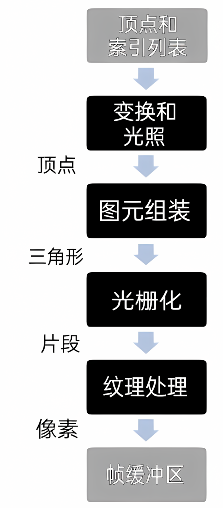
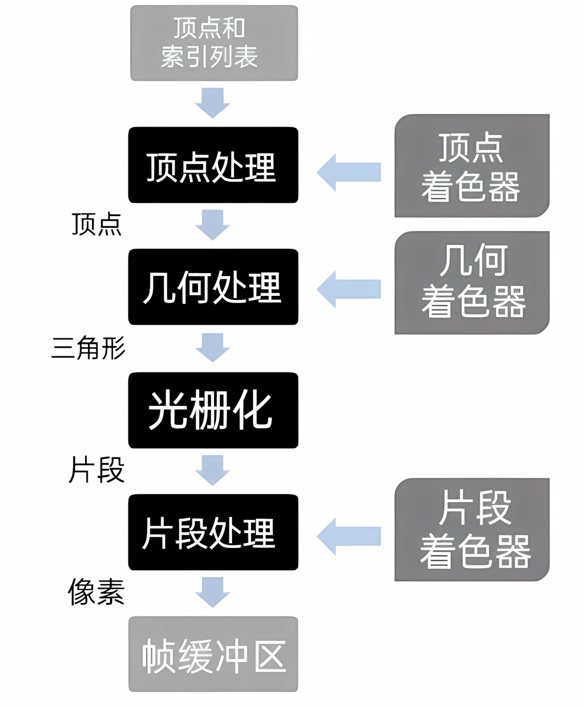
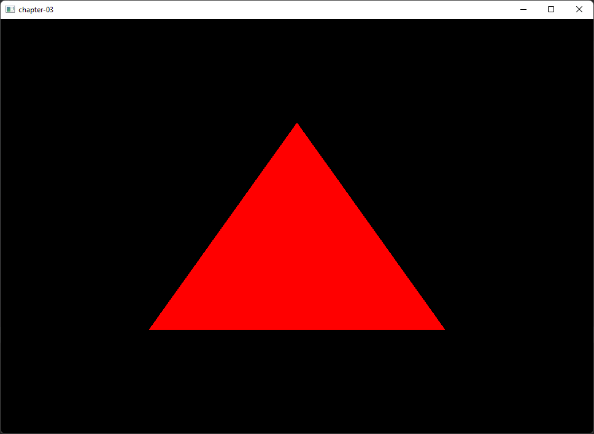

# 第03章 - 你的第一个三角形（our first triangle）

在本章中，我们将向屏幕渲染第一个三角形，并介绍可编程图形管线的基础知识。在此之前，我们将首先解释坐标系的基础概念，尝试用简单的方式介绍一些基础数学概念，为后续章节要讨论的技术和主题奠定基础。出于可读性考虑，我们会进行一些简化处理，可能牺牲部分精确性。

你可以在[这里](https://github.com/lwjglgamedev/lwjglbook/tree/main/chapter-03)找到本章的完整源代码。

## 坐标系简介

我们通过指定坐标来定位空间中的物体。想象一张地图，你可以通过经度和纬度来标记地图上的某个点。仅需一对数字就能精确定位一个点，这对数字就是点的坐标（现实中情况稍复杂，因为地图是地球这个非完美椭球体的投影，需要更多数据，但这个类比很合适）。

坐标系是一个使用一个或多个数字（即一个或多个分量）来唯一确定点位置的系统。存在不同类型的坐标系（笛卡尔坐标系、极坐标系等），且可以在不同坐标系间转换坐标。我们将使用**笛卡尔坐标系**（Cartesian coordinate system）。

在二维笛卡尔坐标系中，坐标由两个数字定义，分别表示到两条垂直轴（x轴和y轴）的有符号距离。


继续以地图为例，坐标系需要定义原点。地理坐标系将原点设在赤道与本初子午线的交点。根据原点设置的不同，同一个点的坐标也会不同。坐标系还可以定义轴的方向。上图中，x坐标向右增大，y坐标向上增大。但我们也可以定义另一个轴方向不同的笛卡尔坐标系，从而得到不同的坐标。
 


如你所见，我们需要定义一些任意参数（如原点和轴方向）来赋予构成坐标的数字对特定含义。我们将带有这组任意参数的坐标系称为**坐标空间**（coordinate space）。要使用一组坐标，必须在同一坐标空间中进行操作。好消息是，我们可以通过平移和旋转将坐标从一个空间转换到另一个空间。

对于三维坐标，我们需要增加一个z轴。三维坐标由三个数字（x, y, z）组成。
 


与二维笛卡尔坐标空间一样，在三维坐标空间中只要保持轴垂直，我们可以改变轴的方向。下图展示了另一个三维坐标空间。
 


三维坐标可分为两类：左手系和右手系。如何判断属于哪一类？伸出你的手，用拇指和食指摆出"L"形，中指应垂直于另外两指。拇指指向x轴增大的方向，食指指向y轴增大的方向，中指指向z轴增大的方向。如果能用左手做到，就是左手系；若需用右手，则是右手系。

 

二维坐标空间都是等价的，因为通过旋转可以在它们之间转换。而三维坐标空间则不尽相同。只有当两个空间具有相同的手性（即同为左手系或右手系）时，才能通过旋转进行转换。

现在我们已经介绍了一些基本概念，接下来谈谈3D图形处理中常用的术语。在后文讲解如何渲染3D模型时，我们会看到使用了不同的3D坐标空间，这是因为每个坐标空间都有其特定的上下文和用途。一组坐标除非有所指代，否则毫无意义。当你看到坐标（40.438031, -3.676626）时，可能不知所云。但如果我说这是地理坐标（纬度和经度），你就会知道这是马德里某地的坐标。

加载3D对象时，我们会得到一组3D坐标。这些坐标表示在称为物体坐标空间的3D坐标空间中。图形设计师在创建这些3D模型时，并不知晓模型将显示在什么3D场景中，因此只能用仅与模型相关的坐标空间来定义坐标。

绘制3D场景时，所有3D对象都将相对于所谓的世界坐标空间。我们需要将3D物体空间坐标转换为世界空间坐标。有些对象需要旋转、拉伸、放大或平移才能在3D场景中正确显示。

我们还需要限制显示的3D空间范围，这类似于在3D空间中移动摄像机。然后需要将世界空间坐标转换为摄像机或视图空间坐标。最后，这些坐标需要转换为屏幕坐标（2D），因此我们需要将3D视图坐标投影到2D屏幕坐标空间。

下图展示了OpenGL的坐标（z轴垂直于屏幕），坐标范围在-1到+1之间。


## 你的第一个三角形

现在我们可以开始学习使用OpenGL渲染场景的过程。如果你熟悉旧版OpenGL（即固定功能管线），可能会在本章结束时疑惑为何需要如此复杂。你可能会认为在屏幕上绘制一个简单形状不应需要这么多概念和代码。让我给有这种想法的读者一个建议：它实际上更简单且灵活得多。你只需给它一个机会。现代OpenGL让你可以一次只思考一个问题，并以更符合逻辑的方式组织代码和流程。

将3D表示绘制到2D屏幕上的步骤序列称为**图形管线**（graphics pipeline）。早期版本的OpenGL采用称为**固定功能管线**（fixed-function pipeline）的模型。该模型在渲染过程中使用一组固定操作步骤。程序员受限于每个步骤可用的函数集，只能设置一些参数进行调整。因此，可应用的效果和操作受API本身限制（例如"设置雾效"或"添加光源"，但这些函数的实现是固定的，无法更改）。

图形管线由以下步骤组成：



OpenGL 2.0引入了**可编程管线**（programmable pipeline）的概念。在该模型中，组成图形管线的不同步骤可以通过使用一组称为**着色器**（shaders）的特定程序来控制或编程。下图展示了简化版的OpenGL可编程管线：



渲染开始时，以**顶点缓冲区**（Vertex Buffers）形式的顶点列表作为输入。那么，什么是顶点？顶点是可用于渲染场景的任何数据结构。现在你可以将其视为描述2D或3D空间中点的结构。如何在3D空间中描述一个点？通过指定其x、y和z坐标。什么是顶点缓冲区？顶点缓冲区是另一种数据结构，它打包了需要渲染的所有顶点（使用顶点数组），并将这些信息提供给图形管线中的着色器。

这些顶点由**顶点着色器**（vertex shader）处理，其主要目的是计算每个顶点在屏幕空间中的投影位置。该着色器还可以生成与颜色或纹理相关的其他输出，但其主要目标是将顶点投影到屏幕空间，即生成点。

**几何处理阶段**（geometry processing stage）将顶点着色器转换后的顶点连接起来形成三角形。它通过考虑顶点存储的顺序并使用不同模型对它们进行分组来实现这一点。为什么是三角形？三角形就像是图形卡的基本工作单元。它是一个简单的几何形状，可以组合和变换以构建复杂的3D场景。此阶段还可以使用特定着色器来分组顶点。

**光栅化阶段**（rasterization stage）接收前一阶段生成的三角形，对其进行裁剪并将其转换为像素大小的片段。这些片段在**片段处理阶段**（fragment processing stage）由**片段着色器**（fragment shader）使用，通过为每个片段分配最终颜色来生成像素，这些颜色将被写入**帧缓冲区**（framebuffer）。帧缓冲区是图形管线的最终结果。它保存应绘制到屏幕上的每个像素的值。

请记住，3D卡的设计目的是并行化上述所有操作。输入数据被并行处理以生成最终场景。

让我们开始编写第一个着色器程序。着色器使用基于ANSI C的GLSL语言编写。首先，我们将在`resources\shaders`目录下创建一个名为"`scene.vert`"的文件（扩展名表示顶点着色器），内容如下：

```glsl
#version 330

layout (location=0) in vec3 inPosition;

void main()
{
    gl_Position = vec4(inPosition, 1.0);
}
```

第一行是指令，声明我们使用的GLSL语言版本。下表列出了GLSL版本、对应的OpenGL版本及应使用的指令（维基百科：[https://en.wikipedia.org/wiki/OpenGL\_Shading\_Language\#Versions](https://en.wikipedia.org/wiki/OpenGL_Shading_Language#Versions)）。

| GLSL版本 | OpenGL版本 | 着色器预处理器 |
| --- | --- | --- |
| 1.10.59 | 2.0 | \#version 110 |
| 1.20.8 | 2.1 | \#version 120 |
| 1.30.10 | 3.0 | \#version 130 |
| 1.40.08 | 3.1 | \#version 140 |
| 1.50.11 | 3.2 | \#version 150 |
| 3.30.6 | 3.3 | \#version 330 |
| 4.00.9 | 4.0 | \#version 400 |
| 4.10.6 | 4.1 | \#version 410 |
| 4.20.11 | 4.2 | \#version 420 |
| 4.30.8 | 4.3 | \#version 430 |
| 4.40 | 4.4 | \#version 440 |
| 4.50 | 4.5 | \#version 450 |

第二行指定了该着色器的输入格式。OpenGL缓冲区中的数据可以是任何我们想要的形式，即该语言不强制你传递具有预定义语义的特定数据结构。从着色器的角度来看，它期望接收带有数据的缓冲区。它可以是一个位置、带有附加信息的位置或任何我们想要的内容。在本例中，从顶点着色器的角度来看，它只是接收一个浮点数数组。当我们填充缓冲区时，我们定义了将由着色器处理的缓冲区块。

因此，首先我们需要将该块转换为对我们有意义的内容。在本例中，我们表示从位置0开始，期望接收一个由3个属性（x, y, z）组成的向量。

着色器有一个像任何其他C程序一样的main块，在本例中非常简单。它只是将接收到的位置返回到输出变量`gl_Position`中，不进行任何变换。你现在可能想知道为什么三个属性的向量被转换为四个属性的向量（vec4）。这是因为`gl_Position`期望结果以vec4格式表示，因为它使用的是**齐次坐标**（homogeneous coordinates）。即它期望的形式为（x, y, z, w），其中w代表一个额外的维度。为什么要增加一个维度？在后面的章节中你会看到，我们需要做的大多数操作都基于向量和矩阵。如果没有这个额外的维度，其中一些操作就无法组合。例如，我们无法组合旋转和平移操作。（如果你想了解更多，这个额外的维度允许我们组合仿射和线性变换。你可以通过阅读Fletcher Dunn和Ian Parberry的优秀著作《3D Math Primer for Graphics and Game Development》来了解更多。）

现在让我们看看第一个片段着色器。我们将在resources目录下创建一个名为"`scene.frag`"的文件（扩展名表示片段着色器），内容如下：

```glsl
#version 330

out vec4 fragColor;

void main()
{
    fragColor = vec4(1.0, 0.0, 0.0, 1.0);
}
```

结构与顶点着色器非常相似。在本例中，我们将为每个片段设置固定颜色。第二行定义了输出变量，并设置为vec4 fragColor。

现在我们已经创建了着色器，如何使用它们呢？我们需要创建一个名为`ShaderProgram`的新类，它基本上接收不同着色器模块（顶点、片段）的源代码，编译它们并将它们链接在一起以生成着色器程序。
以下是需要遵循的步骤序列：  
1.    创建一个OpenGL程序。  
2.    加载着色器程序模块（顶点或片段着色器）。  
3.    为每个着色器创建一个新的着色器模块并指定其类型（顶点、片段）。  
4.    编译着色器。  
5.    将着色器附加到程序中。  
6.    链接程序。

最后，着色器程序将被加载到GPU中，我们可以通过引用标识符（程序标识符）来使用它。
```java
package org.lwjglb.engine.graph;

import org.lwjgl.opengl.GL30;
import org.lwjglb.engine.Utils;

import java.util.*;

import static org.lwjgl.opengl.GL30.*;

public class ShaderProgram {

    private final int programId;

    public ShaderProgram(List<ShaderModuleData> shaderModuleDataList) {
        programId = glCreateProgram();
        if (programId == 0) {
            throw new RuntimeException("Could not create Shader");
        }

        List<Integer> shaderModules = new ArrayList<>();
        shaderModuleDataList.forEach(s -> shaderModules.add(createShader(Utils.readFile(s.shaderFile), s.shaderType)));

        link(shaderModules);
    }

    public void bind() {
        glUseProgram(programId);
    }

    public void cleanup() {
        unbind();
        if (programId != 0) {
            glDeleteProgram(programId);
        }
    }

    protected int createShader(String shaderCode, int shaderType) {
        int shaderId = glCreateShader(shaderType);
        if (shaderId == 0) {
            throw new RuntimeException("Error creating shader. Type: " + shaderType);
        }

        glShaderSource(shaderId, shaderCode);
        glCompileShader(shaderId);

        if (glGetShaderi(shaderId, GL_COMPILE_STATUS) == 0) {
            throw new RuntimeException("Error compiling Shader code: " + glGetShaderInfoLog(shaderId, 1024));
        }

        glAttachShader(programId, shaderId);

        return shaderId;
    }

    public int getProgramId() {
        return programId;
    }

    private void link(List<Integer> shaderModules) {
        glLinkProgram(programId);
        if (glGetProgrami(programId, GL_LINK_STATUS) == 0) {
            throw new RuntimeException("Error linking Shader code: " + glGetProgramInfoLog(programId, 1024));
        }

        shaderModules.forEach(s -> glDetachShader(programId, s));
        shaderModules.forEach(GL30::glDeleteShader);
    }

    public void unbind() {
        glUseProgram(0);
    }

    public void validate() {
        glValidateProgram(programId);
        if (glGetProgrami(programId, GL_VALIDATE_STATUS) == 0) {
            throw new RuntimeException("Error validating Shader code: " + glGetProgramInfoLog(programId, 1024));
        }
    }

    public record ShaderModuleData(String shaderFile, int shaderType) {
    }
}
```

`ShaderProgram`的构造函数接收一个`ShaderModuleData`实例列表，这些实例定义了着色器模块类型（顶点、片段等）和包含着色器模块代码的源文件路径。构造函数首先通过编译每个着色器模块（通过调用`createShader`方法）创建一个新的OpenGL着色器程序，最后将它们全部链接在一起（通过调用`link`方法）。一旦着色器程序被链接，编译后的顶点和片段着色器就可以被释放（通过调用`glDetachShader`）。

`validate`方法基本上调用了`glValidateProgram`函数。此函数主要用于调试目的，当你的游戏进入生产阶段时不应使用它。该方法尝试验证着色器在**当前OpenGL状态**下是否正确。这意味着，即使着色器是正确的，由于当前状态不足以运行着色器（某些数据可能尚未上传），验证有时也会失败。你应在所有必需的输入和输出数据正确绑定时调用它（最好在执行任何绘制调用之前）。

`ShaderProgram`还提供了用于渲染时使用此程序的方法，即绑定它，另一个方法用于解绑（当我们完成时），最后是一个cleanup方法，用于在不再需要时释放所有资源。

我们将创建一个名为`Utils`的实用类，在本例中定义了一个公共方法，用于将文件加载到`String`中：

```java
package org.lwjglb.engine;

import java.io.IOException;
import java.nio.file.*;

public class Utils {

    private Utils() {
        // Utility class
    }

    public static String readFile(String filePath) {
        String str;
        try {
            str = new String(Files.readAllBytes(Paths.get(filePath)));
        } catch (IOException excp) {
            throw new RuntimeException("Error reading file [" + filePath + "]", excp);
        }
        return str;
    }
}
```

我们还需要一个新类`Scene`，它将保存我们的3D场景的值，如模型、灯光等。目前它只存储我们要绘制的模型的网格（顶点集）。以下是该类的源代码：

```java
package org.lwjglb.engine.scene;

import org.lwjglb.engine.graph.Mesh;

import java.util.*;

public class Scene {

    private Map<String, Mesh> meshMap;

    public Scene() {
        meshMap = new HashMap<>();
    }

    public void addMesh(String meshId, Mesh mesh) {
        meshMap.put(meshId, mesh);
    }

    public void cleanup() {
        meshMap.values().forEach(Mesh::cleanup);
    }

    public Map<String, Mesh> getMeshMap() {
        return meshMap;
    }
}
```

如你所见，它只是将`Mesh`实例存储在Map中，稍后用于绘制。但什么是`Mesh`？它基本上是我们将顶点数据加载到GPU中以供渲染的方式。在详细描述`Mesh`类之前，让我们看看如何在`Main`类中使用它：
```java
public class Main implements IAppLogic {

    public static void main(String[] args) {
        Main main = new Main();
        Engine gameEng = new Engine("chapter-03", new Window.WindowOptions(), main);
        gameEng.start();
    }
    ...
    @Override
    public void init(Window window, Scene scene, Render render) {
        float[] positions = new float[]{
                0.0f, 0.5f, 0.0f,
                -0.5f, -0.5f, 0.0f,
                0.5f, -0.5f, 0.0f
        };
        Mesh mesh = new Mesh(positions, 3);
        scene.addMesh("triangle", mesh);
    }
    ...
}
```

在`init`方法中，我们定义了一个浮点数数组，其中包含三角形顶点的坐标。如你所见，该数组中没有结构，我们只是将所有坐标转储在那里。目前，OpenGL无法知道该数据的结构。它只是一个浮点数序列。下图展示了我们坐标系中的三角形。


定义该数据结构并将其加载到GPU中的类是`Mesh`类，定义如下：
```java
package org.lwjglb.engine.graph;

import org.lwjgl.opengl.GL30;
import org.lwjgl.system.MemoryStack;

import java.nio.FloatBuffer;
import java.util.*;

import static org.lwjgl.opengl.GL30.*;

public class Mesh {

    private int numVertices;
    private int vaoId;
    private List<Integer> vboIdList;

    public Mesh(float[] positions, int numVertices) {
        this.numVertices = numVertices;
        vboIdList = new ArrayList<>();

        vaoId = glGenVertexArrays();
        glBindVertexArray(vaoId);

        // Positions VBO
        int vboId = glGenBuffers();
        vboIdList.add(vboId);
        FloatBuffer positionsBuffer = MemoryUtil.memCallocFloat(positions.length);
        positionsBuffer.put(0, positions);
        glBindBuffer(GL_ARRAY_BUFFER, vboId);
        glBufferData(GL_ARRAY_BUFFER, positionsBuffer, GL_STATIC_DRAW);
        glEnableVertexAttribArray(0);
        glVertexAttribPointer(0, 3, GL_FLOAT, false, 0, 0);

        glBindBuffer(GL_ARRAY_BUFFER, 0);
        glBindVertexArray(0);

        MemoryUtil.memFree(positionsBuffer);
    }

    public void cleanup() {
        vboIdList.forEach(GL30::glDeleteBuffers);
        glDeleteVertexArrays(vaoId);
    }

    public int getNumVertices() {
        return numVertices;
    }

    public final int getVaoId() {
        return vaoId;
    }
}
```

我们现在介绍两个重要概念：**顶点数组对象**（Vertex Array Objects，VAOs）和**顶点缓冲对象**（Vertex Buffer Objects，VBOs）。如果你在上面的代码中迷失了方向，请记住，我们最终所做的是将建模我们想要绘制的对象的数据发送到显卡内存中。当我们存储它时，会获得一个标识符，稍后在绘制时用它来引用它。

让我们首先从顶点缓冲对象（VBOs）开始。VBO只是存储在显卡内存中的内存缓冲区，用于存储顶点。这是我们传输建模三角形的浮点数数组的地方。如前所述，OpenGL对我们的数据结构一无所知。实际上，它不仅可以保存坐标，还可以保存其他信息，如纹理、颜色等。顶点数组对象（VAOs）是包含一个或多个VBO的对象，这些VBO通常称为属性列表。每个属性列表可以保存一种类型的数据：位置、颜色、纹理等。你可以自由地在每个槽中存储任何你想要的内容。

VAO就像一个包装器，它分组了将要存储在显卡中的数据的一组定义。当我们创建VAO时，会获得一个标识符。我们使用该标识符来渲染它及其包含的元素，使用我们在创建时指定的定义。

让我们回顾一下上面的代码。我们做的第一件事是创建VAO（通过调用`glGenVertexArrays`函数）并绑定它（通过调用`glBindVertexArray`函数）。之后，我们需要创建VBO（通过调用`glGenBuffers`）并将数据放入其中。为此，我们将浮点数数组存储到`FloatBuffer`中。这主要是因为我们必须与基于C的OpenGL库接口，因此必须将浮点数数组转换为可由库管理的内容。

我们使用`MemoryUtil`类在堆外内存中创建缓冲区，以便OpenGL库可以访问它。在存储数据（使用put方法）后，我们需要将缓冲区的位置重置为0位置（使用flip方法）（即我们表示已完成写入）。记住，Java对象分配在一个称为堆的空间中。堆是JVM进程内存中保留的一大块内存。堆中存储的内存无法由本机代码访问（JNI，允许从Java调用本机代码的机制不允许这样做）。在Java和本机代码之间共享内存数据的唯一方法是直接在Java中分配内存。

如果你来自以前的LWJGL版本，强调几个主题很重要。你可能已经注意到我们不使用`BufferUtils`实用类来创建缓冲区。相反，我们使用`MemoryUtil`类。这是因为`BufferUtils`效率不高，仅为了向后兼容而保留。相反，LWJGL 3提出了两种缓冲区管理方法：

* 自动管理的缓冲区，即由垃圾收集器自动收集的缓冲区。这些缓冲区主要用于短期操作，或用于传输到GPU且不需要存在于进程内存中的数据。这是通过使用`org.lwjgl.system.MemoryStack`类实现的。
* 手动管理的缓冲区。在这种情况下，我们需要在完成后小心释放它们。这些缓冲区用于长时间操作或大量数据。这是通过使用`MemoryUtil`类实现的。

你可以在此处查阅详细信息：[https://blog.lwjgl.org/memory-management-in-lwjgl-3/](https://blog.lwjgl.org/memory-management-in-lwjgl-3/ "这里")。

在本例中，位置数据是短期的，一旦我们加载了数据，就完成了该缓冲区。你可能会想，那么我们不用`org.lwjgl.system.MemoryStack`类吗？使用第二种方法（`MemoryUtil`类）的原因是LWJGL的堆栈是有限的。如果你最终加载了大量模式，可能会消耗所有可用空间并获得"堆栈空间不足"异常。这种方法的缺点是我们需要在完成后手动释放内存，通过调用`MemoryUtil.memFree`。

之后，我们绑定VBO（通过调用`glBindBuffer`）并将数据加载到其中（通过调用`glBufferData`函数）。现在是最重要的部分。我们需要定义数据的结构并将其存储在VAO的一个属性列表中。这是通过以下行完成的。

```java
glVertexAttribPointer(0, 3, GL_FLOAT, false, 0, 0);
```

参数是：

* index：指定着色器期望此数据的位置。
* size：指定每个顶点属性的组件数（从1到4）。在本例中，我们传递3D坐标，因此应为3。
* type：指定数组中每个组件的类型，本例中为float。
* normalized：指定值是否应被标准化。
* stride：指定连续通用顶点属性之间的字节偏移量。（我们稍后会解释）。
* offset：指定缓冲区中第一个组件的偏移量。

完成VBO和VAO后，我们可以解绑它们（将它们绑定到0）。

由于我们使用自动管理的缓冲区，一旦`try` / `catch`块完成，缓冲区就会自动清理。

`Mesh`类通过`cleanup`方法完成，该方法基本上释放VAO和VBO，以及一些getter方法来获取网格的顶点数和VAO的id。在渲染这些元素时，我们将在使用绘制操作时使用VAO id。

现在让我们将所有内容付诸实践。我们将创建一个名为`SceneRender`的新类，它将执行场景中所有模型的渲染，定义如下：
```java
package org.lwjglb.engine.graph;

import org.lwjglb.engine.Window;
import org.lwjglb.engine.scene.Scene;

import java.util.*;

import static org.lwjgl.opengl.GL30.*;

public class SceneRender {

    private ShaderProgram shaderProgram;

    public SceneRender() {
        List<ShaderProgram.ShaderModuleData> shaderModuleDataList = new ArrayList<>();
        shaderModuleDataList.add(new ShaderProgram.ShaderModuleData("resources/shaders/scene.vert", GL_VERTEX_SHADER));
        shaderModuleDataList.add(new ShaderProgram.ShaderModuleData("resources/shaders/scene.frag", GL_FRAGMENT_SHADER));
        shaderProgram = new ShaderProgram(shaderModuleDataList);
    }

    public void cleanup() {
        shaderProgram.cleanup();
    }

    public void render(Scene scene) {
        shaderProgram.bind();

        scene.getMeshMap().values().forEach(mesh -> {
                    glBindVertexArray(mesh.getVaoId());
                    glDrawArrays(GL_TRIANGLES, 0, mesh.getNumVertices());
                }
        );

        glBindVertexArray(0);

        shaderProgram.unbind();
    }
}
```

如你所见，在构造函数中，我们创建了两个`ShaderModuleData`实例（一个用于顶点着色器，另一个用于片段着色器），并创建了一个着色器程序。我们定义了一个`cleanup`方法来释放资源（在本例中是着色器程序），以及一个执行绘制的`render`方法。该方法首先通过调用其`bind`方法使用着色器程序。然后，我们迭代存储在`Scene`实例中的网格，绑定它们（通过调用`glBindVertexArray`函数）并绘制VAO的顶点（通过调用`glDrawArrays`函数）。最后，我们解绑VAO和着色器程序以恢复状态。

最后，我们只需要更新`Render`类以使用`SceneRender`类。
```java
package org.lwjglb.engine.graph;

import org.lwjgl.opengl.GL;
import org.lwjglb.engine.Window;
import org.lwjglb.engine.scene.Scene;

public class Render {

    private SceneRender sceneRender;

    public Render() {
        GL.createCapabilities();
        sceneRender = new SceneRender();
    }

    public void cleanup() {
        sceneRender.cleanup();
    }

    public void render(Window window, Scene scene) {
        ...
        glViewport(0, 0, window.getWidth(), window.getHeight());
        sceneRender.render(scene);
    }
}
```

 `render`方法首先清除帧缓冲区并将视口（通过调用`glViewport`方法）设置为窗口尺寸。也就是说，我们将渲染区域设置为这些尺寸（这不需要每帧都做，但如果我们想支持窗口调整大小，可以这样做以适应每帧中的潜在变化）。之后，我们只需在`SceneRender`实例上调用`render`方法。就是这样！如果你仔细按照步骤操作，你会看到如下内容：



我们的第一个三角形！你可能会认为这不会进入游戏前十名，你完全正确。你可能还认为绘制一个无聊的三角形工作量太大了。但请记住，我们正在介绍关键概念，并为做更复杂的事情准备基础架构。请耐心并继续阅读。

[下一章](./04-more-on-render.md)