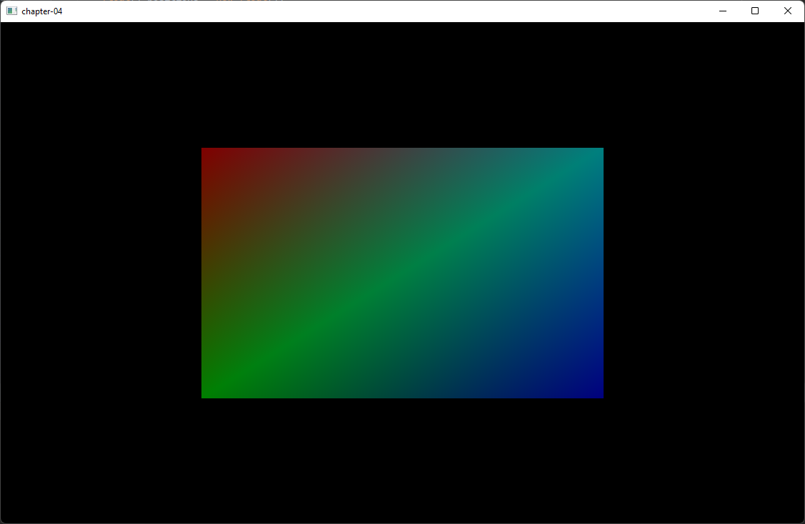

# 渲染一个四边形(Render a quad)

在本章中，我们将继续讨论OpenGL是如何渲染内容的。我们将绘制一个四边形而不是三角形，并向**网格**（Mesh）设置额外的数据，比如给每个顶点设置一个颜色。

你可以在[这里](https://github.com/lwjglgamedev/lwjglbook/tree/main/chapter-04)找到本章的完整源代码。

# 网格修改

正如我们一开始所说的，我们想要绘制一个四边形。一个四边形可以通过使用两个三角形构建出来，如下图所示。


如你所见，每个三角形都是由三个顶点组成的。第一个三角形由顶点V1、V2和V4构成（橙色的那个），第二个三角形由顶点V4、V2和V3构成（绿色的那个）。顶点是以逆时针顺序指定的，因此传递的浮点数组将是\[V1, V2, V4, V4, V2, V3\]。因此，该形状的数据可以是：

```java
float[] positions = new float[] {
    -0.5f,  0.5f, 0.0f,
    -0.5f, -0.5f, 0.0f,
     0.5f,  0.5f, 0.0f,
     0.5f,  0.5f, 0.0f,
    -0.5f, -0.5f, 0.0f,
     0.5f, -0.5f, 0.0f,
}
```

上面的代码仍然存在一些问题。为了表示四边形，我们重复了顶点坐标。我们把V2和V4的坐标传递了两次。对于这个小形状来说似乎问题不大，但想象一下一个更加复杂的三维模型。我们将会多次重复坐标，就像下面的图所示（其中一个顶点可以被六个三角形共享）。


最终我们将需要更多的内存，因为存在这些重复的信息。但更大的问题不在于此，最大的问题是我们将在着色器中为相同的顶点重复处理。这时候，索引缓冲就能派上用场了。为了绘制四边形，我们只需要以这种方式指定每个顶点一次：V1、V2、V3、V4。每个顶点在数组中都有一个位置。V1的位置是0，V2是1，以此类推：

| V1 | V2 | V3 | V4 |
| --- | --- | --- | --- |
| 0 | 1 | 2 | 3 |

然后，我们通过引用它们在数组中的位置来指定绘制这些顶点的顺序：

| 0 | 1 | 3 | 3 | 1 | 2 |
| --- | --- | --- | --- | --- | --- |
| V1 | V2 | V4 | V4 | V2 | V3 |

所以我们需要修改我们的`Mesh`类，来接受另一个参数：索引数组，并且现在要绘制的顶点数量将是索引数组的长度。还要记住，现在我们仅使用三个浮点数来表示一个顶点的位置，但我们还想为每个顶点关联颜色。因此，我们需要这样修改`Mesh`类：

=== "无注释"
    ```java
    public class Mesh {
        ...
        public Mesh(float[] positions, float[] colors, int[] indices) {
            numVertices = indices.length;
            ...
            // 颜色VBO
            vboId = glGenBuffers();
            vboIdList.add(vboId);
            FloatBuffer colorsBuffer = MemoryUtil.memCallocFloat(colors.length);
            colorsBuffer.put(0, colors);
            glBindBuffer(GL_ARRAY_BUFFER, vboId);
            glBufferData(GL_ARRAY_BUFFER, colorsBuffer, GL_STATIC_DRAW);
            glEnableVertexAttribArray(1);
            glVertexAttribPointer(1, 3, GL_FLOAT, false, 0, 0);
    
            // 索引VBO
            vboId = glGenBuffers();
            vboIdList.add(vboId);
            IntBuffer indicesBuffer = MemoryUtil.memCallocInt(indices.length);
            indicesBuffer.put(0, indices);
            glBindBuffer(GL_ELEMENT_ARRAY_BUFFER, vboId);
            glBufferData(GL_ELEMENT_ARRAY_BUFFER, indicesBuffer, GL_STATIC_DRAW);
            ...
            MemoryUtil.memFree(colorsBuffer);
            MemoryUtil.memFree(indicesBuffer);
        }
        ...
    }           
    ```

=== "有注释"
    ```java
    public class Mesh {
        ...
        public Mesh(float[] positions, float[] colors, int[] indices) {
            numVertices = indices.length;//设置顶点数量
            ...
            // 颜色VBO
            vboId = glGenBuffers();//生成一个新的缓冲区对象ID并存储在vboId中
            vboIdList.add(vboId);
            FloatBuffer colorsBuffer = MemoryUtil.memCallocFloat(colors.length);//分配一个足够大的FloatBuffer来存储颜色数据
            colorsBuffer.put(0, colors);//将 colors 数组的数据复制到colorsBuffer中，从索引0开始存放。
            glBindBuffer(GL_ARRAY_BUFFER, vboId);//绑定openGL上下文
            glBufferData(GL_ARRAY_BUFFER, colorsBuffer, GL_STATIC_DRAW);
            glEnableVertexAttribArray(1);//启用顶点属性索引1（通常0是位置，1是颜色，2是纹理坐标）
            glVertexAttribPointer(1, 3, GL_FLOAT, false, 0, 0);
    
            // 索引VBO
            vboId = glGenBuffers();//生成一个新的缓冲区对象ID
            vboIdList.add(vboId);
            IntBuffer indicesBuffer = MemoryUtil.memCallocInt(indices.length);//分配一个足够大的IntBuffer来存储颜色数据
            indicesBuffer.put(0, indices);//将 colors 数组的数据复制到indicesBuffer中，从索引0开始存放。
            glBindBuffer(GL_ELEMENT_ARRAY_BUFFER, vboId);
            glBufferData(GL_ELEMENT_ARRAY_BUFFER, indicesBuffer, GL_STATIC_DRAW);
            ...
            //释放之前分配的（本地内存），避免内存泄漏
            MemoryUtil.memFree(colorsBuffer);
            MemoryUtil.memFree(indicesBuffer);
        }
        ...
    }           
    ```

??? note "为什么要手动释放内存"
    在LWJGL中，很多底层操作（如 OpenGL 缓冲区、纹理等）需要直接操作本地内存，而不是 JVM 管理的堆内存。
    
    * MemoryUtil.memCalloc*() \/ MemoryUtil.memAlloc*()：用于分配本地内存（类似 C 的 malloc/calloc）
    
    * MemoryUtil.memFree()：用于释放这些内存（类似 C 的 free）。
    
    如果不手动释放，这些内存会一直占用，最终导致内存泄漏（即使 Java 对象被 GC 回收，本地内存也不会自动释放）。

??? note "为何opengl绑定上下文绑定了2次？不是只能绑定一个吗？"
    OpenGL的上下文在同一时间确实只能绑定一个缓冲区到某个特定目标（如 GL_ARRAY_BUFFER 或 GL_ELEMENT_ARRAY_BUFFER），但以上代码中的写法是正确的，原因如下：
    
    1. OpenGL 绑定的基本规则
    每个目标（Target）同一时间只能绑定一个缓冲区
    例如：
    GL_ARRAY_BUFFER 目标同一时间只能绑定一个 VBO（存储顶点数据）。
    GL_ELEMENT_ARRAY_BUFFER 目标同一时间只能绑定一个 EBO（存储索引数据）。
    其他目标（如 GL_TEXTURE_BUFFER、GL_UNIFORM_BUFFER）同理。 绑定是全局状态
    调用 glBindBuffer(target, id) 后，后续所有针对该目标的 OpenGL 操作（如 glBufferData、glVertexAttribPointer）都会作用于当前绑定的缓冲区，直到再次绑定其他缓冲区或解绑（绑定 0）。
    2. 代码中的绑定逻辑
    在代码中，两次绑定操作的目标不同，因此不会冲突：
    
    ```
    // 绑定颜色数据到 GL_ARRAY_BUFFER
    glBindBuffer(GL_ARRAY_BUFFER, vboId);//绑定颜色 VBO
    glBufferData(GL_ARRAY_BUFFER, ...);//上传颜色数据
    
    // 绑定索引数据到 GL_ELEMENT_ARRAY_BUFFER
    glBindBuffer(GL_ELEMENT_ARRAY_BUFFER, vboId);//绑定索引 VBO
    glBufferData(GL_ELEMENT_ARRAY_BUFFER, ...);//上传索引数据
    ```
    GL_ARRAY_BUFFER 和 GL_ELEMENT_ARRAY_BUFFER 是两个独立的目标，可以同时绑定不同的缓冲区。
    如果代码尝试对同一个目标（如两次 GL_ARRAY_BUFFER）绑定不同的缓冲区，后一次绑定会覆盖前一次。
在我们创建用于存储位置的VBO之后，我们需要创建另一个用于颜色数据的VBO。然后我们再创建一个用于索引的VBO。创建索引VBO的过程与之前类似，但要注意类型现在是`GL_ELEMENT_ARRAY_BUFFER`。由于我们正在处理整数，所以需要创建一个`IntBuffer`而不是`FloatBuffer`。现在，顶点数组对象将包含三个VBO：一个用于位置，一个用于颜色，一个用于索引，并且将在渲染时使用索引。

之后，我们需要在`SceneRender`类中更改绘制调用以使用索引：

```java
public class SceneRender {
    ...
    public void render(Scene scene) {
        ...
        scene.getMeshMap().values().forEach(mesh -> {
                    glBindVertexArray(mesh.getVaoId());
                    glDrawElements(GL_TRIANGLES, mesh.getNumVertices(), GL_UNSIGNED_INT, 0);
                }
        );
        ...
    }
    ...
}
```

`glDrawElements`方法的参数是：

* mode：指定绘制时的图元类型，这里是三角形。这里没有变化。
* count：指定要渲染的元素数量。
* type：指定索引数据中值的类型。这里我们使用的是整数。
* indices：指定开始渲染时索引数据的偏移量。

现在我们可以在`Main`类中创建一个新的Mesh，带有额外的顶点参数（颜色）和索引：

```java
public class Main implements IAppLogic {
    ...
    public static void main(String[] args) {
        ...
        Engine gameEng = new Engine("chapter-04", new Window.WindowOptions(), main);
        ...
    }
    ...
    public void init(Window window, Scene scene, Render render) {
        float[] positions = new float[]{
                -0.5f, 0.5f, 0.0f,
                -0.5f, -0.5f, 0.0f,
                0.5f, -0.5f, 0.0f,
                0.5f, 0.5f, 0.0f,
        };
        float[] colors = new float[]{
                0.5f, 0.0f, 0.0f,
                0.0f, 0.5f, 0.0f,
                0.0f, 0.0f, 0.5f,
                0.0f, 0.5f, 0.5f,
        };
        int[] indices = new int[]{
                0, 1, 3, 3, 1, 2,
        };
        Mesh mesh = new Mesh(positions, colors, indices);
        scene.addMesh("quad", mesh);
    }
    ...
}
```

??? note "colors"
    colors使用RGB色彩

    在一些图形应用编程接口（API）或渲染引擎中，颜色可以以浮点数的形式来表示，其范围从0.0到1.0。这种表示方法同样涵盖了从完全没有颜色强度到最大强度的整个范围
现在我们需要修改着色器（shader），不是因为索引，而是为了使用每个顶点的颜色。顶点着色器（`scene.vert`）如下所示：

=== "本章的顶点着色器"
    ```glsl
    #version 330
    
    layout (location=0) in vec3 position;
    layout (location=1) in vec3 color;
    
    out vec3 outColor;
    
    void main()
    {
        gl_Position = vec4(position, 1.0);
        outColor = color;
    }
    ```

=== "上一章的顶点着色器"
    ```glsl
    #version 330
    
    layout (location=0) in vec3 inPosition;
    
    void main()
    {
    gl_Position = vec4(inPosition, 1.0);
    }
    ```

在输入参数中，你可以看到我们接收了一个新的`vec3`类型的颜色数据，并且我们直接返回它，供片段着色器（`scene.frag`）使用，如下所示：

=== "本章的片段着色器"
    ```glsl
    #version 330
    
    in  vec3 outColor;
    out vec4 fragColor;
    
    void main()
    {
        fragColor = vec4(outColor, 1.0);
    }
    ```

=== "上一章的片段着色器"
    ```
    #version 330
    
    out vec4 fragColor;
    
    void main()
    {
    fragColor = vec4(1.0, 0.0, 0.0, 1.0);
    }
    ```

我们仅使用输入的颜色参数作为片段颜色返回。需要注意的是，在片段着色器中使用时，颜色值将被插值，因此结果会像下面这样。



[下一章](./05-perspective-projection.md)