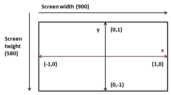
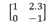
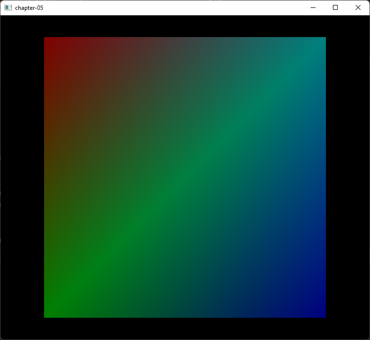

# 第五章 透视投影（Perspective projection）

在本章中，我们将学习两个重要概念，**透视投影**（Perspective Projection）（用于让远处的物体看起来比近处的小）和**统一变量**（Uniforms）（一种类似缓冲区的结构，用于向着色器传递额外数据）。

你可以在[这里](https://github.com/lwjglgamedev/lwjglbook/tree/main/chapter-05)找到本章的完整源代码。

## 透视投影（Perspective Projection）

让我们回到上章中创建的漂亮彩色四边形。如果你仔细观察，会发现这个四边形被扭曲成了一个矩形。你甚至可以把窗口宽度从600像素改成900像素，扭曲现象会更加明显。这是怎么回事呢？

如果你回顾我们的顶点着色器（Vertex Shader）代码，你会看到我们只是直接传递了坐标。也就是说，当我们说一个顶点在x坐标为0.5时，我们实际上是在告诉OpenGL：在屏幕上的x位置0.5处绘制它。下图展示了OpenGL坐标系（仅展示x和y轴）。


这些坐标会根据窗口大小映射到窗口坐标（窗口坐标的原点位于上图的左上角）。所以，如果我们的窗口大小是900x580，OpenGL坐标（1,0）将被映射到窗口坐标（900,0），从而创建了一个矩形而不是一个四边形。



但问题比这更严重。将我们四边形的z坐标从0.0改成1.0和-1.0。你看到了什么？无论它在z轴上移动到哪里，四边形仍然绘制在同一个地方。为什么会这样呢？远离的物体应该被绘制得更小才对。但我们绘制时，x和y坐标保持不变。

但是等等。难道z坐标不应该处理这个问题吗？答案是：是的，也是“不完全是”。z坐标告诉OpenGL物体离我们是近还是远，但OpenGL并不知道物体的实际大小。你可能有两个不同尺寸的物体，一个近一个远，但由于大小不同，它们可以投影到屏幕上相同的尺寸（即具有相同的x和y坐标，但不同的z坐标）。OpenGL只是使用我们传递的坐标，所以我们必须自行正确地投影这些坐标。

既然我们发现了问题，应该怎么解决呢？答案是使用**透视投影矩阵**（Perspective Projection Matrix）。**透视投影矩阵**会处理绘制区域的**纵横比**（Aspect Ratio）（即宽度与高度的关系），避免物体被扭曲。同时它也会根据距离调整物体大小，使远处物体绘制得更小。投影矩阵还会考虑我们的**视野角**（Field of View）和最大可显示距离。

如果你不熟悉矩阵，矩阵是一种二维数组，由行和列排列的数字组成。矩阵中的每个数字被称为元素。矩阵的阶数是其行数和列数。例如，下面是一个2x2矩阵（2行2列）。



矩阵有许多基本运算（如加法、乘法等），你可以在数学书中查阅。与3D图形相关的矩阵的主要特点是，它们非常适合用于空间中点的变换。

你可以把**投影矩阵**想象成一个相机，它有视野范围和最小/最大距离。该相机的可视区域是一个被截断的金字塔。下面的图显示了从顶部视角看到的那片区域。


**投影矩阵**将正确地映射3D坐标，以便它们能在2D屏幕上正确显示。这个矩阵的数学表达式如下（别害怕）。


其中，**纵横比**是屏幕宽度与高度的关系（$$a=width/height$$）。为了获得某个点的投影坐标，我们只需将**投影矩阵**与原始坐标相乘。结果是一个新的向量，包含了投影后的坐标。

因此，我们需要处理一些数学实体，如向量、矩阵，并包含它们的操作。我们可以选择从零开始自己编写所有代码，或者使用已有的库。我们选择简单的方法，使用**轻量级Java游戏库**（Lightweight Java Game Library，简称LWJGL）中的一个专门用于数学运算的库，叫做**Java OpenGL数学库**（Java OpenGL Math Library，简称JOML）。要使用该库，只需在`pom.xml`文件中添加一个依赖。

```xml
        <dependency>
            <groupId>org.joml</groupId>
            <artifactId>joml</artifactId>
            <version>${joml.version}</version>
        </dependency>
```

一切准备好后，我们来定义**投影矩阵**。我们将创建一个名为`Projection`的新类，定义如下：

```java
package org.lwjglb.engine.scene;

import org.joml.Matrix4f;

public class Projection {

    private static final float FOV = (float) Math.toRadians(60.0f);
    private static final float Z_FAR = 1000.f;
    private static final float Z_NEAR = 0.01f;

    private Matrix4f projMatrix;

    public Projection(int width, int height) {
        projMatrix = new Matrix4f();
        updateProjMatrix(width, height);
    }

    public Matrix4f getProjMatrix() {
        return projMatrix;
    }

    public void updateProjMatrix(int width, int height) {
        projMatrix.setPerspective(FOV, (float) width / height, Z_NEAR, Z_FAR);
    }
}
```

如你所见，它依赖JOML库提供的`Matrix4f`类，该类提供了一个名为`setPerspective`的方法来设置**透视投影矩阵**。这个方法需要以下参数：

* **视野角**（Field of View）：以弧度表示的视野角度。这里我们使用`FOV`常量。
* **纵横比**（Aspect Ratio）：即渲染区域宽度与高度的关系。
* **近平面距离**（z-near）。
* **远平面距离**（z-far）。

我们将在`Scene`类中存储一个`Projection`类实例，并在构造函数中初始化它。此外，如果窗口大小发生变化，我们需要重新计算**透视投影矩阵**，因此在`Scene`类中添加一个新方法`resize`。

```java
public class Scene {
    ...
    private Projection projection;

    public Scene(int width, int height) {
        ...
        projection = new Projection(width, height);
    }
    ...
    public Projection getProjection() {
        return projection;
    }

    public void resize(int width, int height) {
        projection.updateProjMatrix(width, height);
    }    
}
```

我们还需要更新`Engine`类，以适应新的`Scene`构造函数参数，并调用`resize`方法。

```java
public class Engine {
    ...
    public Engine(String windowTitle, Window.WindowOptions opts, IAppLogic appLogic) {
        ...
        scene = new Scene(window.getWidth(), window.getHeight());
        ...
    }
    ...
    private void resize() {
        scene.resize(window.getWidth(), window.getHeight());
    }
    ...
}
```

## 统一变量（Uniforms）

现在我们已经有了计算**透视投影矩阵**的基础设施，接下来要怎样使用它呢？我们需要在着色器中使用它，并应用到所有顶点上。最初你可能会想到像坐标和颜色那样，将它打包到顶点输入中。但这样会浪费大量空间，因为**投影矩阵**对所有顶点是一样的。你也可能想到在Java代码中直接将顶点乘以矩阵。但这样，我们的VBO（顶点缓冲对象）就失去了意义，也不会充分利用显卡的处理能力。

答案是使用“统一变量（Uniforms）”。统一变量是GLSL中一种全局变量，可以在着色器中使用，我们将用它来传递对所有元素或模型通用的数据。让我们从着色器程序中如何使用统一变量开始。我们需要修改顶点着色器代码，声明一个新的统一变量`projectionMatrix`，并用它来计算投影后的位置信息。

```glsl
#version 330

layout (location=0) in vec3 position;
layout (location=1) in vec3 color;

out vec3 outColor;

uniform mat4 projectionMatrix;

void main()
{
    gl_Position = projectionMatrix * vec4(position, 1.0);
    outColor = color;
}
```

如你所见，我们将`projectionMatrix`定义为一个4x4矩阵，顶点位置通过将原坐标与投影矩阵相乘得到。现在我们需要把投影矩阵的值传递给着色器。我们将创建一个名为`UniformsMap`的新类，它可以帮助我们创建统一变量引用并设置它们的值。它的起始定义如下：

```java
package org.lwjglb.engine.graph;

import org.joml.Matrix4f;
import org.lwjgl.system.MemoryStack;

import java.util.*;

import static org.lwjgl.opengl.GL20.*;

public class UniformsMap {

    private int programId;
    private Map<String, Integer> uniforms;

    public UniformsMap(int programId) {
        this.programId = programId;
        uniforms = new HashMap<>();
    }

    public void createUniform(String uniformName) {
        int uniformLocation = glGetUniformLocation(programId, uniformName);
        if (uniformLocation < 0) {
            throw new RuntimeException("Could not find uniform [" + uniformName + "] in shader program [" +
                    programId + "]");
        }
        uniforms.put(uniformName, uniformLocation);
    }
    ...
}
```

如你所见，构造函数接收着色器程序的标识符，并定义了一个`Map`来存储统一变量的引用（`Integer`实例），这些引用通过`createUniform`方法创建。统一变量引用是通过调用`glGetUniformLocation`函数获取的，该函数接收两个参数：

* 着色器程序标识符。
* 统一变量名称（应与着色器代码中定义的名称一致）。

你可以看到，统一变量的创建与其数据类型无关。但设置数据时，不同类型需要不同的方法。现在，我们只需要一个方法来加载4x4矩阵：

```java
public class UniformsMap {
    ...
    public void setUniform(String uniformName, Matrix4f value) {
        try (MemoryStack stack = MemoryStack.stackPush()) {
            Integer location = uniforms.get(uniformName);
            if (location == null) {
                throw new RuntimeException("Could not find uniform [" + uniformName + "]");
            }
            glUniformMatrix4fv(location.intValue(), false, value.get(stack.mallocFloat(16)));
        }
    }
}
```

现在，我们可以在`SceneRender`类中使用上述代码了：

```java
public class SceneRender {
    ...
    private UniformsMap uniformsMap;

    public SceneRender() {
        ...
        createUniforms();
    }
    ...
    private void createUniforms() {
        uniformsMap = new UniformsMap(shaderProgram.getProgramId());
        uniformsMap.createUniform("projectionMatrix");
    }
    ...
    public void render(Scene scene) {
        ...
        uniformsMap.setUniform("projectionMatrix", scene.getProjection().getProjMatrix());
        ...
    }
}
```

我们差不多完成了。现在可以正确渲染四边形了。于是你启动程序，结果只看到一个黑色背景，并没有彩色四边形。这是怎么回事？我们是不是哪里搞坏了？其实没有。记得我们现在模拟了一个相机看向场景的效果。而且我们设置了远近平面距离（1000f和0.01f）。而我们的顶点坐标是：

```java
float[] positions = new float[]{
    -0.5f,  0.5f, 0.0f,
    -0.5f, -0.5f, 0.0f,
     0.5f, -0.5f, 0.0f,
     0.5f,  0.5f, 0.0f,
};
```

也就是说，z坐标超出了可见区域。我们可以把它们的值改成`-0.05f`。此时你会看到一个巨大无比的正方形：


这时其实是因为我们绘制的四边形太靠近相机，相当于放大了。如果我们把z坐标改为`-1.0f`，就能看到正常大小的彩色四边形了。

```java
public class Main implements IAppLogic {
    ...
    public static void main(String[] args) {
        ...
        Engine gameEng = new Engine("chapter-05", new Window.WindowOptions(), main);
        ...
    }
    ...
    public void init(Window window, Scene scene, Render render) {
        float[] positions = new float[]{
                -0.5f, 0.5f, -1.0f,
                -0.5f, -0.5f, -1.0f,
                0.5f, -0.5f, -1.0f,
                0.5f, 0.5f, -1.0f,
        };
        ...
    }
    ...
}
```



如果我们继续把四边形往后推，它会变得越来越小。注意到四边形也不会再被扭曲成矩形了。

[下一章](./06-going-3D.md)