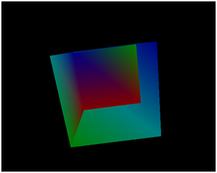

# 第6章 进入三维世界（Going 3D）

本章我们将建立3D模型的基础框架，解释模型变换的概念，并渲染第一个3D图形——一个旋转的立方体。

完整源代码可在[此处](https://github.com/lwjglgamedev/lwjglbook/tree/main/chapter-06)获取。

## 模型与实体

首先让我们定义3D模型的概念。此前我们一直在处理网格。模型则是将顶点、颜色、纹理和材质组合在一起的结构体。一个模型可能由多个网格组成，并可以被多个游戏实体共用。游戏实体代表玩家、敌人、障碍物等任何3D场景中的元素。本书中我们假定实体总是与模型相关联（尽管你可以有不参与渲染的无模型实体）。实体包含特定数据（如位置信息），这些数据在渲染时需要使用。稍后你会看到，我们首先获取模型数据，然后绘制与该模型关联的实体。这种设计出于效率考虑——由于多个实体可以共享同一个模型，最好先设置模型共有的元素，再处理每个实体特有的数据。

表示模型的类名为`Model`，定义如下：

```java
package org.lwjglb.engine.graph;

import org.lwjglb.engine.scene.Entity;

import java.util.*;

public class Model {

 private final String id;
 private List<Entity> entitiesList;
 private List<Mesh> meshList;

 public Model(String id, List<Mesh> meshList) {
  this.id = id;
  this.meshList = meshList;
  entitiesList = new ArrayList<>();
 }

 public void cleanup() {
  meshList.forEach(Mesh::cleanup);
 }

 public List<Entity> getEntitiesList() {
  return entitiesList;
 }

 public String getId() {
  return id;
 }

 public List<Mesh> getMeshList() {
  return meshList;
 }

}
```

模型目前存储网格列表并拥有唯一标识符。此外，我们还存储与该模型关联的游戏实体列表（由`Entity`类建模）。如果要创建完整引擎，你可能希望在其他地方存储这些关系（而非模型中），但为简化起见，我们将这些关联存储在`Model`类中，这样渲染流程会更简单。

在了解`Entity`类之前，让我们先讨论模型变换。为了在3D场景中表示任何模型，我们需要支持对模型进行以下基本操作：

* 平移：沿任意轴移动物体
* 旋转：绕任意轴旋转物体
* 缩放：调整物体大小


上述操作称为**变换**（transformations）。你可能已经猜到，我们将通过坐标与矩阵相乘来实现这些变换（一个矩阵用于平移，一个用于旋转，一个用于缩放）。这三个矩阵将组合成名为世界矩阵的单一矩阵，作为统一变量传递给顶点着色器。

之所以称为世界矩阵，是因为我们要将模型坐标转换为世界坐标。当你学习加载3D模型时会发现，这些模型定义在自己的坐标系中。它们不知道你的3D空间大小，需要被放置其中。因此当我们用矩阵乘以坐标时，实际上是在进行坐标系转换（从模型坐标系到3D世界坐标系）。

世界矩阵计算公式如下（顺序很重要，因为矩阵乘法不满足交换律）：
$$
世界矩阵 = [平移矩阵] \times [旋转矩阵] \times [缩放矩阵]
$$

如果我们在变换矩阵中包含投影矩阵，则如下：
$$
\begin{array}{lcl}
变换矩阵 & = & [投影矩阵] \times [平移矩阵] \times [旋转矩阵] \times [缩放矩阵] \\
 & = & [投影矩阵] \times [世界矩阵]
\end{array}
$$

平移矩阵定义如下：

$$
\begin{bmatrix}
1 & 0 & 0 & dx \\
0 & 1 & 0 & dy \\
0 & 0 & 1 & dz \\
0 & 0 & 0 & 1
\end{bmatrix}
$$

平移矩阵参数：

* dx：沿 x 轴的位移。

* dy：沿 y 轴的位移。

* dz：沿 z 轴的位移。

缩放矩阵定义如下：

$$
\begin{bmatrix}
sx & 0 & 0 & 0 \\
0 & sy & 0 & 0 \\
0 & 0 & sz & 0 \\
0 & 0 & 0 & 1
\end{bmatrix}
$$

缩放矩阵参数：

* sx：沿 x 轴缩放。

* sy：沿 y 轴缩放。

* sz：沿 z 轴缩放。

旋转矩阵更为复杂。但要记住，它可以通过三个单轴旋转矩阵相乘构造，或通过应用四元数（稍后详述）来实现。

`Entity`类定义如下：

=== "无注释"
    ```java
    package org.lwjglb.engine.scene;
    
    import org.joml.*;
    
    public class Entity {
    
        private final String id;
        private final String modelId;
        private Matrix4f modelMatrix;
        private Vector3f position;
        private Quaternionf rotation;
        private float scale;
        
        public Entity(String id, String modelId) {
            this.id = id;
            this.modelId = modelId;
            modelMatrix = new Matrix4f();
            position = new Vector3f();
            rotation = new Quaternionf();
            scale = 1;
        }
    
        public String getId() {
            return id;
        }
    
        public String getModelId() {
            return modelId;
        }
    
        public Matrix4f getModelMatrix() {
            return modelMatrix;
        }
    
        public Vector3f getPosition() {
            return position;
        }
    
        public Quaternionf getRotation() {
            return rotation;
        }
    
        public float getScale() {
            return scale;
        }
    
        public final void setPosition(float x, float y, float z) {
        position.x = x;
        position.y = y;
        position.z = z;
        }
    
        public void setRotation(float x, float y, float z, float angle) {
            this.rotation.fromAxisAngleRad(x, y, z, angle);
        }
    
        public void setScale(float scale) {
            this.scale = scale;
        }
    
        public void updateModelMatrix() {
            modelMatrix.translationRotateScale(position, rotation, scale);
        }
    }
    ```

=== "有注释"
    ```java
    package org.lwjglb.engine.scene;
    
    import org.joml.*;
    
    public class Entity {
    
        private final String id;
        private final String modelId;//关联的模型资源 ID
        private Matrix4f modelMatrix;//最终的模型变换矩阵（组合了位置、旋转、缩放）
        private Vector3f position;//3D位置（Vector3f）
        private Quaternionf rotation;//四元数旋转（Quaternionf，比欧拉角更稳定）
        private float scale;//统一缩放值（float）
        
        public Entity(String id, String modelId) {
            this.id = id;
            this.modelId = modelId;
            modelMatrix = new Matrix4f();
            position = new Vector3f();
            rotation = new Quaternionf();
            scale = 1;
        }
    
        public String getId() {
            return id;
        }
    
        public String getModelId() {
            return modelId;
        }
    
        public Matrix4f getModelMatrix() {
            return modelMatrix;
        }
    
        public Vector3f getPosition() {
            return position;
        }
    
        public Quaternionf getRotation() {
            return rotation;
        }
    
        public float getScale() {
            return scale;
        }
    
        public final void setPosition(float x, float y, float z) {
        position.x = x;
        position.y = y;
        position.z = z;
        }
    
        public void setRotation(float x, float y, float z, float angle) {
            this.rotation.fromAxisAngleRad(x, y, z, angle);
        }
    
        public void setScale(float scale) {
            this.scale = scale;
        }
    
        //更新实体的模型矩阵，将实体的 位置、旋转和缩放组合成一个最终的4x4变换矩阵
        public void updateModelMatrix() {
            modelMatrix.translationRotateScale(position, rotation, scale);
        }
    }
    ```

`Model`实例也拥有唯一标识符，并定义了位置（3分量向量）、缩放（单个浮点数，假设三个轴均匀缩放）和旋转（四元数）属性。我们本可以存储俯仰角（pitch）、偏航角（yaw）和滚转角（roll）来表示旋转，但这里使用了你可能没听说过的数学工具——四元数（quaternion）。使用欧拉角（Euler angles）的问题是万向节锁（gimbal lock）。当应用这些旋转角时，我们可能最终对齐两个旋转轴，失去自由度，导致无法正确旋转物体。四元数没有这个问题。与其让我拙劣地解释四元数是什么，不如推荐一篇优秀的[博客文章](https://www.3dgep.com/understanding-quaternions/)来解释相关概念。如果你不想深入了解，只需记住它们可以表达旋转而不会出现欧拉角的问题。

模型的所有变换由一个4x4矩阵定义，因此`Model`实例存储`Matrix4f`实例，该实例通过JOML的`translationRotateScale`方法使用位置、缩放和旋转自动构造。每次修改`Model`实例属性后，我们需要调用`updateModelMatrix`方法来更新该矩阵。

## 其他代码变更

我们需要修改`Scene`类来存储模型而非直接存储`Mesh`实例。此外，我们需要添加支持将`Entity`实例与模型关联以便后续渲染。

```java
package org.lwjglb.engine.scene;

import org.lwjglb.engine.graph.Model;

import java.util.*;

public class Scene {

    private Map<String, Model> modelMap;
    private Projection projection;

    public Scene(int width, int height) {
        modelMap = new HashMap<>();
        projection = new Projection(width, height);
    }

    public void addEntity(Entity entity) {
        String modelId = entity.getModelId();
        Model model = modelMap.get(modelId);
        if (model == null) {
            throw new RuntimeException("Could not find model [" + modelId + "]");
        }
        model.getEntitiesList().add(entity);
    }

    public void addModel(Model model) {
        modelMap.put(model.getId(), model);
    }

    public void cleanup() {
        modelMap.values().forEach(Model::cleanup);
    }

    public Map<String, Model> getModelMap() {
        return modelMap;
    }

    public Projection getProjection() {
        return projection;
    }

    public void resize(int width, int height) {
        projection.updateProjMatrix(width, height);
    }
}
```

现在我们需要稍微修改`SceneRender`类。首先需要通过统一变量将模型矩阵信息传递给着色器。因此，我们将在顶点着色器中创建名为`modelMatrix`的新**统一变量**，并在`createUniforms`方法中获取其位置。

```java
public class SceneRender {
    private void createUniforms() {
        uniformsMap.createUniform("modelMatrix");
    }
}
```

接下来修改`render`方法以改变我们访问模型的方式并正确设置模型矩阵统一变量：

```java
public class SceneRender {
    ...
    public void render(Scene scene) {
    shaderProgram.bind();

    uniformsMap.setUniform("projectionMatrix", scene.getProjection().getProjMatrix());

    Collection<Model> models = scene.getModelMap().values();
    for (Model model : models) {
        model.getMeshList().stream().forEach(mesh -> {
            glBindVertexArray(mesh.getVaoId());
            List<Entity> entities = model.getEntitiesList();
            for (Entity entity : entities) {
                uniformsMap.setUniform("modelMatrix", entity.getModelMatrix());
                glDrawElements(GL_TRIANGLES, mesh.getNumVertices(), GL_UNSIGNED_INT, 0);
            }
        });
    }
    glBindVertexArray(0);
    shaderProgram.unbind();
 }
 ...
}
```
如你所见，我们会先遍历模型集合，然后遍历每个模型的网格数据，绑定对应的VAO后获取关联的实体对象。在调用绘制指令前，需要为每个实体正确填充`modelMatrix`统一变量值。

顶点着色器修改为使用`modelMatrix`统一变量：

```glsl
#version 330

layout (location=0) in vec3 position;
layout (location=1) in vec3 color;

out vec3 outColor;

uniform mat4 projectionMatrix;
uniform mat4 modelMatrix;

void main()
{
    gl_Position = projectionMatrix * modelMatrix * vec4(position, 1.0);
    outColor = color;
}
```

代码完全相同。我们使用统一变量正确投影坐标，考虑视锥体、位置、缩放和旋转信息。另一个重要问题是：为什么我们不传递平移、旋转和缩放矩阵，而是将它们组合成世界矩阵？原因是应限制着色器中使用的矩阵数量。此外，着色器中的矩阵乘法对每个顶点只执行一次。投影矩阵在渲染调用之间不变，世界矩阵对每个`Entity`实例也不变。如果独立传递平移、旋转和缩放矩阵，我们将执行更多矩阵乘法。想象一个有大量顶点的模型，这将带来大量额外运算。

你可能会想，既然模型矩阵对每个`Entity`实例不变，为什么不在Java类中进行矩阵乘法？我们可以为每个`Entity`只乘一次投影矩阵和模型矩阵，作为单个统一变量发送。这样能节省更多运算，对吗？答案是这在当前情况下成立，但当我们为游戏引擎添加更多功能时，仍需要在着色器中使用世界坐标，因此最好以独立方式处理这两个矩阵。

最后要强调的是矩阵乘法的顺序。我们首先用模型矩阵乘以位置信息，即将模型坐标转换为世界空间。然后应用投影。记住矩阵乘法不满足交换律，因此顺序非常重要。

现在需要修改`Main`类以适应加载模型和实体的新方式，以及3D立方体的坐标和索引。

```java
public class Main implements IAppLogic {

    private Entity cubeEntity;
    private Vector4f displInc = new Vector4f();
    private float rotation;

    public static void main(String[] args) {
        ...
        Engine gameEng = new Engine("chapter-06", new Window.WindowOptions(), main);
        ...
    }
    ...
    @Override
    public void init(Window window, Scene scene, Render render) {
        float[] positions = new float[]{
                // VO
                -0.5f, 0.5f, 0.5f,
                // V1
                -0.5f, -0.5f, 0.5f,
                // V2
                0.5f, -0.5f, 0.5f,
                // V3
                0.5f, 0.5f, 0.5f,
                // V4
                -0.5f, 0.5f, -0.5f,
                // V5
                0.5f, 0.5f, -0.5f,
                // V6
                -0.5f, -0.5f, -0.5f,
                // V7
                0.5f, -0.5f, -0.5f,
        };
        float[] colors = new float[]{
                0.5f, 0.0f, 0.0f,
                0.0f, 0.5f, 0.0f,
                0.0f, 0.0f, 0.5f,
                0.0f, 0.5f, 0.5f,
                0.5f, 0.0f, 0.0f,
                0.0f, 0.5f, 0.0f,
                0.0f, 0.0f, 0.5f,
                0.0f, 0.5f, 0.5f,
        };
        int[] indices = new int[]{
                // Front face
                0, 1, 3, 3, 1, 2,
                // Top Face
                4, 0, 3, 5, 4, 3,
                // Right face
                3, 2, 7, 5, 3, 7,
                // Left face
                6, 1, 0, 6, 0, 4,
                // Bottom face
                2, 1, 6, 2, 6, 7,
                // Back face
                7, 6, 4, 7, 4, 5,
        };
        List<Mesh> meshList = new ArrayList<>();
        Mesh mesh = new Mesh(positions, colors, indices);
        meshList.add(mesh);
        String cubeModelId = "cube-model";
        Model model = new Model(cubeModelId, meshList);
        scene.addModel(model);

        cubeEntity = new Entity("cube-entity", cubeModelId);
        cubeEntity.setPosition(0, 0, -2);
        scene.addEntity(cubeEntity);
    }
    ...
}
```

要绘制立方体，我们只需定义八个顶点。由于多了四个顶点，需要更新颜色数组。


立方体有六个面，需要绘制十二个三角形（每个面两个），因此需要更新索引数组。记住三角形必须按逆时针顺序定义。手工操作容易出错。总是将你要定义索引的面朝向你，然后识别顶点并按逆时针顺序绘制三角形。最后，我们创建一个带单个网格的模型和与该模型关联的实体。

我们将首先使用`input`方法通过方向键修改立方体位置，通过`Z`和`X`键修改其缩放。只需检测按下的键，更新立方体实体位置和/或缩放，最后更新其模型矩阵。

```java
public class Main implements IAppLogic {
    ...
    public void input(Window window, Scene scene, long diffTimeMillis) {
        displInc.zero();
        if (window.isKeyPressed(GLFW_KEY_UP)) {
            displInc.y = 1;
        } else if (window.isKeyPressed(GLFW_KEY_DOWN)) {
            displInc.y = -1;
        }
        if (window.isKeyPressed(GLFW_KEY_LEFT)) {
            displInc.x = -1;
        } else if (window.isKeyPressed(GLFW_KEY_RIGHT)) {
            displInc.x = 1;
        }
        if (window.isKeyPressed(GLFW_KEY_A)) {
            displInc.z = -1;
        } else if (window.isKeyPressed(GLFW_KEY_Q)) {
            displInc.z = 1;
        }
        if (window.isKeyPressed(GLFW_KEY_Z)) {
            displInc.w = -1;
        } else if (window.isKeyPressed(GLFW_KEY_X)) {
            displInc.w = 1;
        }

        displInc.mul(diffTimeMillis / 1000.0f);

        Vector3f entityPos = cubeEntity.getPosition();
        cubeEntity.setPosition(displInc.x + entityPos.x, displInc.y + entityPos.y, displInc.z + entityPos.z);
        cubeEntity.setScale(cubeEntity.getScale() + displInc.w);
        cubeEntity.updateModelMatrix();
    }
    ...
}
```

为了更好地观察立方体，我们将修改`Main`类中的旋转代码，使其绕三个轴旋转。这将在`update`方法中完成。

```java
public class Main implements IAppLogic {
    ...
    public void update(Window window, Scene scene, long diffTimeMillis) {
        rotation += 1.5;
        if (rotation > 360) {
            rotation = 0;
        }
        cubeEntity.setRotation(1, 1, 1, (float) Math.toRadians(rotation));
        cubeEntity.updateModelMatrix();
    }
    ...
}
```

现在我们可以显示旋转的3D立方体了。编译运行示例，你将看到类似这样的效果：



这个立方体有些奇怪。某些面绘制不正确。发生了什么？立方体呈现这种外观的原因是组成立方体的三角形以某种随机顺序绘制。远处的像素应该比近处的像素先绘制。现在没有实现这一点，为此我们必须启用深度测试。

这可以在`Render`类的构造函数中完成：

```java
public class Render {
    ...
    public Render() {
        GL.createCapabilities();
        glEnable(GL_DEPTH_TEST);
        ...
    }
    ...
}
```

现在我们的立方体可以正确渲染了！


[下一章](./07-textures.md)