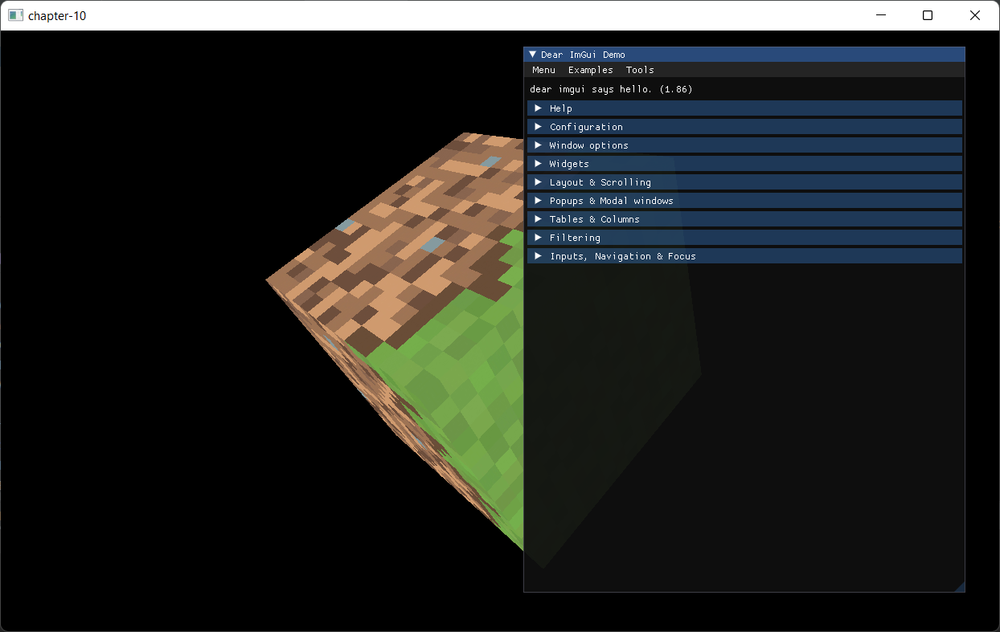

# 第10章 - 使用Imgui绘制GUI

[Dear ImGui](https://github.com/ocornut/imgui)是一个用户界面库，可以使用OpenGL和Vulkan等多种后端。我们将使用它来显示GUI控件或开发HUD。它提供了多种小部件，外观和感觉可以轻松自定义。

你可以在[这里](https://github.com/lwjglgamedev/lwjglbook/tree/main/chapter-10)找到本章的完整源代码。

## Imgui集成

首先是在项目的pom.xml中添加Java Imgui包装器的Maven依赖。我们需要添加编译时和运行时依赖。

```xml
<dependency>
   <groupId>io.github.spair</groupId>
   <artifactId>imgui-java-binding</artifactId>
   <version>${imgui-java.version}</version>
</dependency>
<dependency>
    <groupId>io.github.spair</groupId>
    <artifactId>imgui-java-${native.target}</artifactId>
    <version>${imgui-java.version}</version>
    <scope>runtime</scope>
</dependency>
```

使用Imgui，我们可以像渲染任何其他3D模型一样渲染窗口、面板等，但只使用2D形状。我们设置想要使用的控件，Imgui将其转换为一组顶点缓冲区，我们可以使用着色器进行渲染。这就是为什么它可以与任何后端一起使用的原因。

对于每个顶点，Imgui定义其坐标（2D坐标）、纹理坐标和关联的颜色。因此，我们需要创建一个新类来建模GUI网格并创建相关的VAO和VBO。这个类名为`GuiMesh`，定义如下：

```java
package org.lwjglb.engine.graph;

import imgui.ImDrawData;

import static org.lwjgl.opengl.GL15.*;
import static org.lwjgl.opengl.GL20.*;
import static org.lwjgl.opengl.GL30.*;

public class GuiMesh {

    private int indicesVBO;
    private int vaoId;
    private int verticesVBO;

    public GuiMesh() {
        vaoId = glGenVertexArrays();
        glBindVertexArray(vaoId);

        // 单个VBO
        verticesVBO = glGenBuffers();
        glBindBuffer(GL_ARRAY_BUFFER, verticesVBO);
        glEnableVertexAttribArray(0);
        glVertexAttribPointer(0, 2, GL_FLOAT, false, ImDrawData.sizeOfImDrawVert(), 0);
        glEnableVertexAttribArray(1);
        glVertexAttribPointer(1, 2, GL_FLOAT, false, ImDrawData.sizeOfImDrawVert(), 8);
        glEnableVertexAttribArray(2);
        glVertexAttribPointer(2, 4, GL_UNSIGNED_BYTE, true, ImDrawData.sizeOfImDrawVert(), 16);

        indicesVBO = glGenBuffers();

        glBindBuffer(GL_ARRAY_BUFFER, 0);
        glBindVertexArray(0);
    }

    public void cleanup() {
        glDeleteBuffers(indicesVBO);
        glDeleteBuffers(verticesVBO);
        glDeleteVertexArrays(vaoId);
    }

    public int getIndicesVBO() {
        return indicesVBO;
    }

    public int getVaoId() {
        return vaoId;
    }

    public int getVerticesVBO() {
        return verticesVBO;
    }
}
```

如你所见，我们使用单个VBO，但为位置、纹理坐标和颜色定义了几个属性。在这种情况下，我们不会用数据填充缓冲区，稍后我们将看到如何使用它。

我们还需要让应用程序创建GUI控件并对用户输入做出反应。为了支持这一点，我们将定义一个名为`IGuiInstance`的新接口，定义如下：

```java
package org.lwjglb.engine;

import org.lwjglb.engine.scene.Scene;

public interface IGuiInstance {
    void drawGui();

    boolean handleGuiInput(Scene scene, Window window);
}
```

`drawGui`方法将用于构建GUI，这是我们定义将用于构建GUI网格的窗口和小部件的地方。我们将使用`handleGuiInput`方法来处理GUI中的输入事件。它返回一个布尔值，以表明输入是否已被GUI处理。例如，如果我们显示一个重叠窗口，我们可能不希望在游戏逻辑中继续处理按键。你可以使用返回值来控制这一点。我们将在`Scene`类中存储`IGuiInstance`接口的特定实现。

```java
public class Scene {
    ...
    private IGuiInstance guiInstance;
    ...
    public IGuiInstance getGuiInstance() {
        return guiInstance;
    }
    ...
    public void setGuiInstance(IGuiInstance guiInstance) {
        this.guiInstance = guiInstance;
    }
}
```

下一步是创建一个新类来渲染我们的GUI，它将命名为`GuiRender`，并开始如下：
```java
package org.lwjglb.engine.graph;

import imgui.*;
import imgui.type.ImInt;
import org.joml.Vector2f;
import org.lwjglb.engine.*;
import org.lwjglb.engine.scene.Scene;

import java.nio.ByteBuffer;
import java.util.*;

import static org.lwjgl.opengl.GL32.*;

public class GuiRender {

    private GuiMesh guiMesh;
    private GLFWKeyCallback prevKeyCallBack;
    private Vector2f scale;
    private ShaderProgram shaderProgram;
    private Texture texture;
    private UniformsMap uniformsMap;

    public GuiRender(Window window) {
        List<ShaderProgram.ShaderModuleData> shaderModuleDataList = new ArrayList<>();
        shaderModuleDataList.add(new ShaderProgram.ShaderModuleData("resources/shaders/gui.vert", GL_VERTEX_SHADER));
        shaderModuleDataList.add(new ShaderProgram.ShaderModuleData("resources/shaders/gui.frag", GL_FRAGMENT_SHADER));
        shaderProgram = new ShaderProgram(shaderModuleDataList);
        createUniforms();
        createUIResources(window);
        setupKeyCallBack(window);
    }

    public void cleanup() {
        shaderProgram.cleanup();
        texture.cleanup();
        if (prevKeyCallBack != null) {
            prevKeyCallBack.free();
        }
    }
    ...
}
```

如你所见，这里的大部分内容对你来说会非常熟悉，我们只是设置了着色器和统一变量。由于我们需要设置一个自定义的按键回调来处理ImGui的输入文本控件，我们需要跟踪`prevKeyCallBack`中的先前按键回调以正确使用和释放它。除此之外，还有一个名为`createUIResources`的新方法，定义如下：

```java
public class GuiRender {
    ...
    private void createUIResources(Window window) {
        ImGui.createContext();

        ImGuiIO imGuiIO = ImGui.getIO();
        imGuiIO.setIniFilename(null);
        imGuiIO.setDisplaySize(window.getWidth(), window.getHeight());

        ImFontAtlas fontAtlas = ImGui.getIO().getFonts();
        ImInt width = new ImInt();
        ImInt height = new ImInt();
        ByteBuffer buf = fontAtlas.getTexDataAsRGBA32(width, height);
        texture = new Texture(width.get(), height.get(), buf);

        guiMesh = new GuiMesh();
    }
    ...
}
```

在上面的方法中，我们设置了Imgui，首先创建一个上下文（执行任何操作都需要），并将显示大小设置为窗口大小。Imgui将状态存储在一个ini文件中，由于我们不希望状态在运行之间持久化，我们需要将其设置为null。下一步是初始化字体图集并设置一个纹理，该纹理将在着色器中使用，以便我们可以正确渲染文本等。最后一步是创建`GuiMesh`实例。

`createUniforms`只是创建一个用于缩放的二维浮点向量（稍后我们将看到如何使用它）。

```java
public class GuiRender {
    ...
    private void createUniforms() {
        uniformsMap = new UniformsMap(shaderProgram.getProgramId());
        uniformsMap.createUniform("scale");
        scale = new Vector2f();
    }
    ...
}
```

`setupKeyCallBack`方法是正确处理Imgui中的关键事件所必需的，定义如下：
```java
public class GuiRender {
    ...
    private void setupKeyCallBack(Window window) {
        prevKeyCallBack = glfwSetKeyCallback(window.getWindowHandle(), (handle, key, scancode, action, mods) -> {
            window.keyCallBack(key, action);
            ImGuiIO io = ImGui.getIO();
            if (!io.getWantCaptureKeyboard()) {
                return;
            }
            if (action == GLFW_PRESS) {
                io.addKeyEvent(getImKey(key), true);
            } else if (action == GLFW_RELEASE) {
                io.addKeyEvent(getImKey(key), false);
            }
        }
        );

        glfwSetCharCallback(window.getWindowHandle(), (handle, c) -> {
            ImGuiIO io = ImGui.getIO();
            if (!io.getWantCaptureKeyboard()) {
                return;
            }
            io.addInputCharacter(c);
        });
    }

    private static int getImKey(int key) {
        return switch (key) {
            case GLFW_KEY_TAB -> ImGuiKey.Tab;
            case GLFW_KEY_LEFT -> ImGuiKey.LeftArrow;
            case GLFW_KEY_RIGHT -> ImGuiKey.RightArrow;
            case GLFW_KEY_UP -> ImGuiKey.UpArrow;
            case GLFW_KEY_DOWN -> ImGuiKey.DownArrow;
            case GLFW_KEY_PAGE_UP -> ImGuiKey.PageUp;
            case GLFW_KEY_PAGE_DOWN -> ImGuiKey.PageDown;
            case GLFW_KEY_HOME -> ImGuiKey.Home;
            case GLFW_KEY_END -> ImGuiKey.End;
            case GLFW_KEY_INSERT -> ImGuiKey.Insert;
            case GLFW_KEY_DELETE -> ImGuiKey.Delete;
            case GLFW_KEY_BACKSPACE -> ImGuiKey.Backspace;
            case GLFW_KEY_SPACE -> ImGuiKey.Space;
            case GLFW_KEY_ENTER -> ImGuiKey.Enter;
            case GLFW_KEY_ESCAPE -> ImGuiKey.Escape;
            case GLFW_KEY_APOSTROPHE -> ImGuiKey.Apostrophe;
            case GLFW_KEY_COMMA -> ImGuiKey.Comma;
            case GLFW_KEY_MINUS -> ImGuiKey.Minus;
            case GLFW_KEY_PERIOD -> ImGuiKey.Period;
            case GLFW_KEY_SLASH -> ImGuiKey.Slash;
            case GLFW_KEY_SEMICOLON -> ImGuiKey.Semicolon;
            case GLFW_KEY_EQUAL -> ImGuiKey.Equal;
            case GLFW_KEY_LEFT_BRACKET -> ImGuiKey.LeftBracket;
            case GLFW_KEY_BACKSLASH -> ImGuiKey.Backslash;
            case GLFW_KEY_RIGHT_BRACKET -> ImGuiKey.RightBracket;
            case GLFW_KEY_GRAVE_ACCENT -> ImGuiKey.GraveAccent;
            case GLFW_KEY_CAPS_LOCK -> ImGuiKey.CapsLock;
            case GLFW_KEY_SCROLL_LOCK -> ImGuiKey.ScrollLock;
            case GLFW_KEY_NUM_LOCK -> ImGuiKey.NumLock;
            case GLFW_KEY_PRINT_SCREEN -> ImGuiKey.PrintScreen;
            case GLFW_KEY_PAUSE -> ImGuiKey.Pause;
            case GLFW_KEY_KP_0 -> ImGuiKey.Keypad0;
            case GLFW_KEY_KP_1 -> ImGuiKey.Keypad1;
            case GLFW_KEY_KP_2 -> ImGuiKey.Keypad2;
            case GLFW_KEY_KP_3 -> ImGuiKey.Keypad3;
            case GLFW_KEY_KP_4 -> ImGuiKey.Keypad4;
            case GLFW_KEY_KP_5 -> ImGuiKey.Keypad5;
            case GLFW_KEY_KP_6 -> ImGuiKey.Keypad6;
            case GLFW_KEY_KP_7 -> ImGuiKey.Keypad7;
            case GLFW_KEY_KP_8 -> ImGuiKey.Keypad8;
            case GLFW_KEY_KP_9 -> ImGuiKey.Keypad9;
            case GLFW_KEY_KP_DECIMAL -> ImGuiKey.KeypadDecimal;
            case GLFW_KEY_KP_DIVIDE -> ImGuiKey.KeypadDivide;
            case GLFW_KEY_KP_MULTIPLY -> ImGuiKey.KeypadMultiply;
            case GLFW_KEY_KP_SUBTRACT -> ImGuiKey.KeypadSubtract;
            case GLFW_KEY_KP_ADD -> ImGuiKey.KeypadAdd;
            case GLFW_KEY_KP_ENTER -> ImGuiKey.KeypadEnter;
            case GLFW_KEY_KP_EQUAL -> ImGuiKey.KeypadEqual;
            case GLFW_KEY_LEFT_SHIFT -> ImGuiKey.LeftShift;
            case GLFW_KEY_LEFT_CONTROL -> ImGuiKey.LeftCtrl;
            case GLFW_KEY_LEFT_ALT -> ImGuiKey.LeftAlt;
            case GLFW_KEY_LEFT_SUPER -> ImGuiKey.LeftSuper;
            case GLFW_KEY_RIGHT_SHIFT -> ImGuiKey.RightShift;
            case GLFW_KEY_RIGHT_CONTROL -> ImGuiKey.RightCtrl;
            case GLFW_KEY_RIGHT_ALT -> ImGuiKey.RightAlt;
            case GLFW_KEY_RIGHT_SUPER -> ImGuiKey.RightSuper;
            case GLFW_KEY_MENU -> ImGuiKey.Menu;
            case GLFW_KEY_0 -> ImGuiKey._0;
            case GLFW_KEY_1 -> ImGuiKey._1;
            case GLFW_KEY_2 -> ImGuiKey._2;
            case GLFW_KEY_3 -> ImGuiKey._3;
            case GLFW_KEY_4 -> ImGuiKey._4;
            case GLFW_KEY_5 -> ImGuiKey._5;
            case GLFW_KEY_6 -> ImGuiKey._6;
            case GLFW_KEY_7 -> ImGuiKey._7;
            case GLFW_KEY_8 -> ImGuiKey._8;
            case GLFW_KEY_9 -> ImGuiKey._9;
            case GLFW_KEY_A -> ImGuiKey.A;
            case GLFW_KEY_B -> ImGuiKey.B;
            case GLFW_KEY_C -> ImGuiKey.C;
            case GLFW_KEY_D -> ImGuiKey.D;
            case GLFW_KEY_E -> ImGuiKey.E;
            case GLFW_KEY_F -> ImGuiKey.F;
            case GLFW_KEY_G -> ImGuiKey.G;
            case GLFW_KEY_H -> ImGuiKey.H;
            case GLFW_KEY_I -> ImGuiKey.I;
            case GLFW_KEY_J -> ImGuiKey.J;
            case GLFW_KEY_K -> ImGuiKey.K;
            case GLFW_KEY_L -> ImGuiKey.L;
            case GLFW_KEY_M -> ImGuiKey.M;
            case GLFW_KEY_N -> ImGuiKey.N;
            case GLFW_KEY_O -> ImGuiKey.O;
            case GLFW_KEY_P -> ImGuiKey.P;
            case GLFW_KEY_Q -> ImGuiKey.Q;
            case GLFW_KEY_R -> ImGuiKey.R;
            case GLFW_KEY_S -> ImGuiKey.S;
            case GLFW_KEY_T -> ImGuiKey.T;
            case GLFW_KEY_U -> ImGuiKey.U;
            case GLFW_KEY_V -> ImGuiKey.V;
            case GLFW_KEY_W -> ImGuiKey.W;
            case GLFW_KEY_X -> ImGuiKey.X;
            case GLFW_KEY_Y -> ImGuiKey.Y;
            case GLFW_KEY_Z -> ImGuiKey.Z;
            case GLFW_KEY_F1 -> ImGuiKey.F1;
            case GLFW_KEY_F2 -> ImGuiKey.F2;
            case GLFW_KEY_F3 -> ImGuiKey.F3;
            case GLFW_KEY_F4 -> ImGuiKey.F4;
            case GLFW_KEY_F5 -> ImGuiKey.F5;
            case GLFW_KEY_F6 -> ImGuiKey.F6;
            case GLFW_KEY_F7 -> ImGuiKey.F7;
            case GLFW_KEY_F8 -> ImGuiKey.F8;
            case GLFW_KEY_F9 -> ImGuiKey.F9;
            case GLFW_KEY_F10 -> ImGuiKey.F10;
            case GLFW_KEY_F11 -> ImGuiKey.F11;
            case GLFW_KEY_F12 -> ImGuiKey.F12;
            default -> ImGuiKey.None;
        };
    }
    ...
}
```
首先，我们需要设置一个GLFW按键回调。这个回调会首先调用`Window`的按键回调来处理按键事件，并将GLFW键码转换为Imgui的键码。设置回调时，我们获取之前已设置的回调的引用，以便能够链式调用它们。在这种情况下，如果按键事件未被Imgui处理，我们将调用它。我们没有在代码的其他部分使用字符回调，但如果你使用，请记住也要应用这种链式模式。之后，我们根据按键按下或释放事件设置Imgui的状态。最后，我们需要设置一个字符回调，以便文本输入小部件可以处理这些事件。

让我们现在查看`render`方法：

```java
public class GuiRender {
    ...
    public void render(Scene scene) {
        IGuiInstance guiInstance = scene.getGuiInstance();
        if (guiInstance == null) {
            return;
        }
        guiInstance.drawGui();

        shaderProgram.bind();

        glEnable(GL_BLEND);
        glBlendEquation(GL_FUNC_ADD);
        glBlendFuncSeparate(GL_SRC_ALPHA, GL_ONE_MINUS_SRC_ALPHA, GL_ONE, GL_ONE_MINUS_SRC_ALPHA);
        glDisable(GL_DEPTH_TEST);
        glDisable(GL_CULL_FACE);

        glBindVertexArray(guiMesh.getVaoId());

        glBindBuffer(GL_ARRAY_BUFFER, guiMesh.getVerticesVBO());
        glBindBuffer(GL_ELEMENT_ARRAY_BUFFER, guiMesh.getIndicesVBO());

        ImGuiIO io = ImGui.getIO();
        scale.x = 2.0f / io.getDisplaySizeX();
        scale.y = -2.0f / io.getDisplaySizeY();
        uniformsMap.setUniform("scale", scale);

        ImDrawData drawData = ImGui.getDrawData();
        int numLists = drawData.getCmdListsCount();
        for (int i = 0; i < numLists; i++) {
            glBufferData(GL_ARRAY_BUFFER, drawData.getCmdListVtxBufferData(i), GL_STREAM_DRAW);
            glBufferData(GL_ELEMENT_ARRAY_BUFFER, drawData.getCmdListIdxBufferData(i), GL_STREAM_DRAW);

            int numCmds = drawData.getCmdListCmdBufferSize(i);
            for (int j = 0; j < numCmds; j++) {
                final int elemCount = drawData.getCmdListCmdBufferElemCount(i, j);
                final int idxBufferOffset = drawData.getCmdListCmdBufferIdxOffset(i, j);
                final int indices = idxBufferOffset * ImDrawData.sizeOfImDrawIdx();

                texture.bind();
                glDrawElements(GL_TRIANGLES, elemCount, GL_UNSIGNED_SHORT, indices);
            }
        }

        glEnable(GL_DEPTH_TEST);
        glEnable(GL_CULL_FACE);
        glDisable(GL_BLEND);
    }
    ...
}
```

我们做的第一件事是检查是否设置了`IGuiInstance`接口的实现。如果没有实例，我们直接返回，不需要渲染任何东西。之后我们调用`drawGui`方法。也就是说，在每次渲染调用中，我们都会调用该方法，以便Imgui可以更新其状态以生成正确的顶点数据。绑定着色器后，我们首先启用混合，这将允许我们使用透明度。仅启用混合，透明度仍然不会显示。我们还需要通过`glBlendFunc`函数指示OpenGL如何应用混合。你可以在这里查看关于可以应用的不同函数的详细解释[here](https://learnopengl.com/Advanced-OpenGL/Blending)。

之后，我们需要禁用深度测试和面剔除以使Imgui正常工作。然后，我们绑定定义数据结构的gui网格，并绑定数据和索引缓冲区。Imgui使用屏幕坐标生成顶点数据，即`x`值覆盖`[0, screen width]`范围，`y`值覆盖`[0, screen height]`范围。我们将使用`scale`统一变量将该坐标系映射到OpenGL裁剪空间的`[-1, 1]`范围。

之后，我们检索Imgui生成的数据以渲染GUI。Imgui首先将数据组织在所谓的命令列表中。每个命令列表都有一个缓冲区，用于存储顶点和索引数据，因此我们首先通过调用`glBufferData`将数据转储到GPU。每个命令列表还定义了一组命令，我们将使用这些命令生成绘制调用。每个命令都存储了要绘制的元素数量以及在命令列表中应用于缓冲区的偏移量。当我们绘制完所有元素后，可以重新启用深度测试。

最后，我们需要添加一个`resize`方法，该方法将在窗口调整大小时调用以调整Imgui的显示大小。

```java
public class GuiRender {
    ...
    public void resize(int width, int height) {
        ImGuiIO imGuiIO = ImGui.getIO();
        imGuiIO.setDisplaySize(width, height);
    }
}
```

我们需要更新`UniformsMap`类以添加对2D向量的支持。

后期添加:注意:这里是添加了一个重载的方法而不是修改原有的方法

```java
public class UniformsMap {
    ...
    public void setUniform(String uniformName, Vector2f value) {
        glUniform2f(getUniformLocation(uniformName), value.x, value.y);
    }
}
```

用于渲染GUI的顶点着色器非常简单（`gui.vert`），我们只是转换坐标，使它们在`[-1, 1]`范围内，并输出纹理坐标和颜色，以便在片段着色器中使用：

```glsl
#version 330

layout (location=0) in vec2 inPos;
layout (location=1) in vec2 inTextCoords;
layout (location=2) in vec4 inColor;

out vec2 frgTextCoords;
out vec4 frgColor;

uniform vec2 scale;

void main()
{
    frgTextCoords = inTextCoords;
    frgColor = inColor;
    gl_Position = vec4(inPos * scale + vec2(-1.0, 1.0), 0.0, 1.0);
}
```

在片段着色器（`gui.frag`）中，我们只输出顶点颜色与其纹理坐标关联的纹理颜色的组合：

```glsl
#version 330

in vec2 frgTextCoords;
in vec4 frgColor;

uniform sampler2D txtSampler;

out vec4 outColor;

void main()
{
    outColor = frgColor  * texture(txtSampler, frgTextCoords);
}
```
## 将所有内容整合在一起

现在我们需要将所有前面的部分粘合在一起来渲染GUI。我们首先在`Render`类中使用新的`GuiRender`类。

```java
public class Render {
    ...
    private GuiRender guiRender;
    ...
    public Render(Window window) {
        ...
        guiRender = new GuiRender(window);
    }

    public void cleanup() {
        ...
        guiRender.cleanup();
    }

    public void render(Window window, Scene scene) {
        ...
        guiRender.render(scene);
    }

    public void resize(int width, int height) {
        guiRender.resize(width, height);
    }
}
```

我们还需要修改`Engine`类以在更新循环中包含`IGuiInstance`，并使用其返回值来指示输入是否已被消耗。

```java
public class Engine {
    ...
    public Engine(String windowTitle, Window.WindowOptions opts, IAppLogic appLogic) {
        ...
        render = new Render(window);
        ...
    }
    ...
    private void resize() {
        int width = window.getWidth();
        int height = window.getHeight();
        scene.resize(width, height);
        render.resize(width, height);
    }

    private void run() {
        ...
        IGuiInstance iGuiInstance = scene.getGuiInstance();
        while (running && !window.windowShouldClose()) {
            ...
            if (targetFps <= 0 || deltaFps >= 1) {
                window.getMouseInput().input();
                boolean inputConsumed = iGuiInstance != null && iGuiInstance.handleGuiInput(scene, window);
                appLogic.input(window, scene, now - initialTime, inputConsumed);
            }
            ...
        }
        ...
    }
    ...
}
```

我们还需要更新`IAppLogic`接口以使用输入消耗的返回值。

```java
public interface IAppLogic {
    ...
    void input(Window window, Scene scene, long diffTimeMillis, boolean inputConsumed);
    ...
}
```

最后，我们将在`Main`类中实现`IGuiInstance`：

```java
public class Main implements IAppLogic, IGuiInstance {
    ...
    public static void main(String[] args) {
        ...
        Engine gameEng = new Engine("chapter-10", new Window.WindowOptions(), main);
        ...
    }

    ...
    @Override
    public void drawGui() {
        ImGui.newFrame();
        ImGui.setNextWindowPos(0, 0, ImGuiCond.Always);
        ImGui.showDemoWindow();
        ImGui.endFrame();
        ImGui.render();
    }

    @Override
    public boolean handleGuiInput(Scene scene, Window window) {
        ImGuiIO imGuiIO = ImGui.getIO();
        MouseInput mouseInput = window.getMouseInput();
        Vector2f mousePos = mouseInput.getCurrentPos();
        imGuiIO.addMousePosEvent(mousePos.x, mousePos.y);
        imGuiIO.addMouseButtonEvent(0, mouseInput.isLeftButtonPressed());
        imGuiIO.addMouseButtonEvent(1, mouseInput.isRightButtonPressed());

        return imGuiIO.getWantCaptureMouse() || imGuiIO.getWantCaptureKeyboard();
    }
    ...
    public void input(Window window, Scene scene, long diffTimeMillis, boolean inputConsumed) {
        if (inputConsumed) {
            return;
        }
        ...
    }
}
```

在`drawGui`方法中，我们只是设置一个新帧、窗口位置，并调用`showDemoWindow`来生成Imgui的演示窗口。在结束帧后，调用`render`非常重要，这将根据先前定义的GUI结构生成一组命令。`handleGuiInput`首先获取鼠标位置，并用该信息和鼠标按钮状态更新Imgui的IO类。我们还返回一个布尔值，指示输入是否已被Imgui捕获。最后，我们只需要更新`input`方法以接收该标志。在这种特定情况下，如果输入已被GUI消耗，我们直接返回。

通过这些更改，你将能够看到Imgui演示窗口覆盖在旋转的立方体上。你可以与不同的方法和面板交互，以了解Imgui的功能。



[下一章](11-light.md)