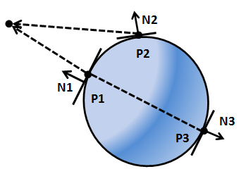

# 第十一章 - 光照

在本章中，我们将学习如何为我们的3D游戏引擎添加光照。我们不会实现一个物理上完美的光照模型，因为暂且不谈其复杂性，它就需要极大量的计算资源。取而代之，我们将实现一种能够提供尚可效果的近似方案：我们会使用一种名为Phong shading的算法（由裴祥风Bui Tuong Phong开发）。另一点需要指出的是，我们只会对光照本身进行建模，而不会对这些光照本应产生的阴影进行建模（这将在另一章节中完成）。

你可以在[此处](https://github.com/lwjglgamedev/lwjglbook/tree/main/chapter-11)找到本章的完整源代码。

## 一些概念

在开始之前，让我们先定义几种光源类型：

*   **点光源（Point light）**: 此类光源模拟的是从空间中一点向所有方向均匀发射的光源。
*   **聚光灯（Spot light）**: 此类光源模拟的是从空间中一点发射的光源，但其发射范围被限制在一个圆锥体内，而非所有方向。
*   **方向光（Directional light）**: 此类光源模拟的是我们从太阳接收到的光线，3D空间中的所有物体都会被来自特定方向的平行光线照射。无论物体远近，所有光线都以相同的角度照射到物体上。
*   **环境光（Ambient light）**: 此类光源来自空间中的各个方向，并以相同的方式照亮所有物体。


因此，要对光照进行建模，我们需要考虑光源的类型，以及它的位置和一些其他参数，比如它的颜色。当然，我们还必须考虑物体受到光线照射时吸收和反射光线的方式。

冯氏着色算法将为我们模型中的每个点（即每个顶点）模拟光照效果。这就是为什么它被称为局部光照模拟，也正是因此，该算法不会计算阴影：它只会计算应用于每个顶点的光照，而不会考虑该顶点是否位于遮挡光线的物体之后。我们将在后续章节中克服这个缺点。但是，正因为如此，它是一个简单快速且能提供非常出色效果的算法。我们将在这里使用一个简化版本，它不深入考虑材质的细节。

冯氏算法考虑了光照的三个组成部分：

*   **环境光（Ambient light）**: 模拟来自四面八方的光线，这将用于以所需强度照亮那些没有被任何直接光源照射到的区域，它就像一种背景光。
*   **漫反射（Diffuse reflectance）**: 考虑到朝向光源的表面会更亮。
*   **镜面反射（Specular reflectance）**: 模拟光线在抛光或金属表面上的反射方式。

最终，我们希望得到一个因子，将该因子乘以赋予片段的颜色，就能根据其接收到的光照使该颜色变亮或变暗。让我们将这些分量命名为：环境光为 $A$，漫反射为 $D$，镜面反射为 $S$。这个因子将是这些分量的总和：

$$L = A + D + S$$

实际上，这些分量本身就是颜色，即每种光照分量所贡献的颜色成分。这是因为光照分量不仅提供一定的强度，它们还可以改变模型的颜色。在我们的片段着色器中，我们只需将该光照颜色乘以原始片段颜色（从纹理或基础颜色中获得）即可。

我们还可以为相同的材质指定不同的颜色，分别用于环境光、漫反射和镜面反射分量。因此，这些分量将受到与材质相关联的颜色所调制。如果材质有纹理，我们将简单地为每个分量使用单一纹理。

所以，对于没有纹理的材质，最终颜色将是：$L = A * \text{ambientColour} + D * \text{diffuseColour} + S * \text{specularColour}$

而对于有纹理的材质，最终颜色将是：

$$L = A * \text{textureColour} + D * \text{textureColour} + S * \text{textureColour}$$

## 法线

在处理光照时，法线是一个关键要素。让我们先来定义它。一个平面的法线是一个垂直于该平面且长度为一的向量。


如上图所示，一个平面可以有两个法线。我们应该使用哪一个呢？在3D图形中，法线用于光照计算，所以我们应该选择朝向光源的那个法线。换句话说，我们应该选择从模型外表面指出的那个法线。

当我们有一个3D模型时，它是由多边形组成的，在我们的例子中是三角形。每个三角形由三个顶点组成。三角形的法向量将是垂直于三角形表面且长度为一的向量。

顶点法线与特定顶点相关联，并且是周围三角形法线的组合（当然其长度也为一）。在这里你可以看到3D网格的顶点法线模型（取自[维基百科](https://en.wikipedia.org/wiki/Vertex_normal#/media/File:Vertex_normals.png)）


## 漫反射

现在我们来讨论漫反射。它模拟了这样一个事实：垂直朝向光源的表面看起来比那些以更间接角度接收光线的表面更亮。这些物体接收到更多的光，光的密度（请允许我这样称呼它）更高。


但是，我们如何计算这个呢？这就是我们首次开始使用法线的地方。让我们为上图中的三个点绘制法线。如你所见，每个点的法线将是垂直于该点切平面的向量。我们将不再绘制从光源发出的光线，而是绘制从每个点指向光源的向量（即，方向相反）。



如你所见，与 $P1$ 相关联的法线，记为 $N1$，与指向光源的向量平行，该向量模拟了光线的反方向（$N1$ 为了便于观察而被画得有所偏移，但数学上是等效的）。$P1$ 与指向光源的向量之间的夹角为 $0$ 度。其表面垂直于光源，$P1$ 将是最亮的点。

与 $P2$ 相关联的法线，记为 $N2$，与指向光源的向量大约成30度角，所以它应该比 $P1$ 暗一些。最后，与 $P3$ 相关联的法线，记为 $N3$，也与指向光源的向量平行，但这两个向量方向相反。$P3$ 与指向光源的向量成180度角，因此根本不应接收到任何光照。

所以，我们似乎有了一个好方法来确定到达一个点的光照强度，这与法线和指向光源的向量所形成的夹角有关。我们如何计算这个呢？

我们可以使用一种数学运算，即点积（dot product）。这个运算取两个向量并产生一个数（一个标量），如果它们之间的夹角是锐角，则该数为正；如果夹角是钝角，则为负。如果两个向量都已归一化，也就是说它们的长度都等于一，那么点积的值将在 $-1$ 和 $1$ 之间。如果两个向量方向完全相同（夹角 $0$ 度），点积为 $1$；如果两个向量成直角，点积为 $0$；如果两个向量方向相反，点积为 $-1$。

让我们定义两个向量，$v1$ 和 $v2$，并设 $alpha$ 为它们之间的夹角。点积由以下公式定义：


如果两个向量都已归一化，它们的长度（模）将等于一，所以点积等于它们之间夹角的余弦值。我们将使用这个运算来计算漫反射分量。

所以我们需要计算指向光源的向量。我们该怎么做呢？我们有每个点的位置（顶点位置），并且我们有光源的位置。首先，这两个坐标必须在同一个坐标空间中。为简化起见，我们假设它们都在世界坐标空间中：那么这些位置就是指向顶点位置（$VP$）和光源（$VS$）的向量的坐标，如下图所示。


如果我们从 $wVP$ 中减去 $VS$，我们就得到了我们正在寻找的向量，称之为 $L$。

现在我们可以计算指向光源的向量与法线之间的点积。这个乘积被称为兰伯特项（Lambert term），以约翰·海因里希·兰伯特（Johann Lambert）命名，他首先提出了用这种关系来模拟表面亮度。

让我们总结一下如何计算它。我们定义以下变量：

*   $vPos$: 我们的顶点在模型视图空间坐标系中的位置。
*   $lPos$: 光源在视图空间坐标系中的位置。
*   $intensity$: 光的强度（从0到1）。
*   $lColour$: 光的颜色。
*   $normal$: 顶点法线。

首先，我们需要计算从当前位置指向光源的向量：$toLightDirection = lPos - vPos$。该运算的结果需要被归一化。

然后我们需要计算漫反射因子（一个标量）：$diffuseFactor = normal \cdot toLightDirection$。它是通过两个向量的点积计算得到的，并且因为我们希望它在 $-1$ 和 $1$ 之间，所以两个向量都需要被归一化。颜色值需要在 $0$ 和 $1$ 之间，所以如果一个值低于 $0$，我们将它设为0。

最后，我们只需要用漫反射因子和光照强度来调制光照颜色：

$$color = diffuseColour * lColour * diffuseFactor * intensity$$

## 镜面反射分量

在考虑镜面反射分量之前，我们首先需要审视光是如何反射的。当光线照射到表面时，一部分被吸收，另一部分被反射。如果你还记得物理课上学过的，反射是指光线从物体表面弹回的现象。


当然，表面并非完全光滑，如果近距离观察，你会看到许多瑕疵。除此之外，有许多光线（实际上是光子）照射到该表面，并以各种角度反射出去。因此，我们看到的是像一束光从表面反射出来。也就是说，光在照射到表面时会发生漫射，这就是我们之前讨论的漫反射分量。


但是当光线照射到抛光表面，例如金属时，光线遭受的漫射较少，大部分会以与其入射方向相反的方向反射出去。


这就是镜面反射分量所模拟的，它取决于材质的特性。关于镜面反射，需要注意的重要一点是，反射光只有在相机处于适当位置时才可见，也就是说，如果相机位于反射光发射的区域内。


既然镜面反射的原理已经阐释清楚，我们就可以开始计算该（镜面反射）分量了。首先，我们需要一个从光源指向顶点的向量。在之前计算漫反射分量时，我们定义的向量 `toLightDirection` 方向恰好相反——它是从顶点指向光源的。因此，这个新的、从光源发出的向量 `fromLightDirection` 就可以计算为：$fromLightDirection = -(toLightDirection)$。

然后，我们需要计算 $fromLightDirection$ 入射到表面（考虑其法线）后产生的反射光。GLSL中有一个函数 `reflect` 正好可以做到这一点。所以，$reflectedLight = reflect(fromLightSource, normal)$。

我们还需要一个指向相机的向量，我们称之为 $cameraDirection$，它将通过相机位置与顶点位置之差计算得出：$cameraDirection = cameraPos - vPos$。相机位置向量和顶点位置需要在同一个坐标系中，并且结果向量需要被归一化。下图大致描绘了我们目前为止计算出的主要分量。


现在我们需要计算我们看到的的光照强度，我们称之为 $specularFactor$。如果 $cameraDirection$ 和 $reflectedLight$ 向量平行且指向相同方向，则该分量会更高；如果它们指向相反方向，则该分量取最小值。为了计算这个，点积再次派上用场。所以 $specularFactor = cameraDirection \cdot reflectedLight$。我们只希望这个值在 $0$ 和 $1$ 之间，所以如果它小于 $0$，它将被设为0。

我们还需要考虑到，如果相机正对着反射光的锥形区域，这种光应该更强烈。这将通过将 $specularFactor$ 提升到一个名为 $specularPower$ 的参数的幂来实现。

$$specularFactor = specularFactor^{specularPower}$$。

最后，我们需要模拟材质的反射率（reflectivity），它也将调制反射光的强度。这将通过另一个名为 reflectance 的参数来完成。所以镜面反射分量的颜色将是：$specularColour * lColour * reflectance * specularFactor * intensity$。

## 衰减

我们现在知道如何计算三个分量，它们将帮助我们用环境光来模拟点光源。但是我们的光照模型仍然不完整，因为物体反射的光与其离光源的距离无关。也就是说，我们需要模拟光的衰减。

衰减是距离和光照的函数。光的强度与距离的平方成反比。这个事实很容易理解，因为光在传播时将其能量分布在一个球体的表面上，该球体的半径等于光传播的距离，而球体的表面积与其半径的平方成正比。我们可以用这个公式计算衰减因子：$1.0 / (atConstant + atLinear * dist + atExponent * dist^{2})$。

为了模拟衰减，我们只需要将最终颜色乘以这个衰减因子。

## 方向光

方向光以平行的光线照射所有物体，这些光线都来自同一个方向。它模拟了那些距离很远但强度很高的光源，例如太阳。


方向光的另一个特点是它不受衰减的影响。再想想阳光：所有被光线照射到的物体都以相同的强度被照亮，因为它们与太阳的距离如此之远，以至于物体的位置无关紧要。事实上，方向光被建模为放置在无穷远处的点光源，如果它受到衰减的影响，它将对任何物体都没有效果（其颜色贡献将等于 $0$）。

除此之外，方向光也由漫反射和镜面反射分量组成。与点光源的唯一区别在于它没有位置，只有一个方向，并且它不受衰减的影响。让我们回到方向光的“方向”属性，想象我们正在模拟太阳在我们的3D世界中移动。如果我们假设北方朝向z轴正方向，下图显示了黎明、正午和黄昏时光源的方向。


## 聚光灯

现在我们将实现聚光灯，它与点光源非常相似，但其发出的光被限制在一个三维圆锥体内。它模拟了来自聚光灯或其他非全向发射光源的光线。聚光灯具有与点光源相同的属性，但增加了两个新参数：锥角和锥向。


聚光灯的贡献计算方式与点光源相同，但有一些例外。那些从顶点位置指向光源的向量不包含在光锥内的点，不受点光源的影响。


我们如何计算它是否在光锥内部呢？我们需要再次对从光源发出的向量和锥体方向向量（两者都已归一化）进行点积运算。


向量 $L$ 和 $C$ 之间的点积等于：$\vec{L}\cdot\vec{C}=|\vec{L}|\cdot|\vec{C}|\cdot Cos(\alpha)$。如果在我们的聚光灯定义中存储了截止角的余弦值，若点积大于该值，我们就知道它在光锥内部（回想一下余弦函数图像，当夹角 $α$ 为 $0$ 时，余弦值为 $1$，夹角越小，余弦值越大）。

第二个区别是，远离锥体向量的点将接收到较少的光，也就是说，衰减会更大。有几种计算方法；我们将选择一种简单的方法，即将衰减乘以以下因子：

$$1 - (1-Cos(\alpha))/(1-Cos(cutOffAngle))$$

（在我们的片段着色器中，我们没有角度值，而是截止角的余弦值。你可以验证上述公式产生的值在0到1之间，当角度等于截止角时为0，当角度为0时为1）。

## 实现光照类

让我们首先创建一组类来模拟不同类型的光源。我们将从模拟点光源的类开始：

```java
package org.lwjglb.engine.scene.lights;

import org.joml.Vector3f;

public class PointLight {

    private Attenuation attenuation;
    private Vector3f color;
    private float intensity;
    private Vector3f position;

    public PointLight(Vector3f color, Vector3f position, float intensity) {
        attenuation = new Attenuation(0, 0, 1); // 衰减参数默认为 (0, 0, 1)
        this.color = color;
        this.position = position;
        this.intensity = intensity;
    }

    public Attenuation getAttenuation() {
        return attenuation;
    }

    public Vector3f getColor() {
        return color;
    }

    public float getIntensity() {
        return intensity;
    }

    public Vector3f getPosition() {
        return position;
    }

    public void setAttenuation(Attenuation attenuation) {
        this.attenuation = attenuation;
    }

    public void setColor(Vector3f color) {
        this.color = color;
    }

    public void setColor(float r, float g, float b) {
        color.set(r, g, b);
    }

    public void setIntensity(float intensity) {
        this.intensity = intensity;
    }

    public void setPosition(float x, float y, float z) {
        position.set(x, y, z);
    }

    public static class Attenuation {

        private float constant;  // 常数项
        private float exponent;  // 指数项
        private float linear;    // 线性项

        public Attenuation(float constant, float linear, float exponent) {
            this.constant = constant;
            this.linear = linear;
            this.exponent = exponent;
        }

        public float getConstant() {
            return constant;
        }

        public float getExponent() {
            return exponent;
        }

        public float getLinear() {
            return linear;
        }

        public void setConstant(float constant) {
            this.constant = constant;
        }

        public void setExponent(float exponent) {
            this.exponent = exponent;
        }

        public void setLinear(float linear) {
            this.linear = linear;
        }
    }
}
```

如你所见，点光源由颜色、强度、位置和衰减模型定义。

环境光仅由颜色和强度定义：

```java
package org.lwjglb.engine.scene.lights;

import org.joml.Vector3f;

public class AmbientLight {

    private Vector3f color; // 颜色

    private float intensity; // 强度

    public AmbientLight(float intensity, Vector3f color) {
        this.intensity = intensity;
        this.color = color;
    }

    public AmbientLight() {
        this(1.0f, new Vector3f(1.0f, 1.0f, 1.0f)); // 默认强度为1，颜色为白色
    }

    public Vector3f getColor() {
        return color;
    }

    public float getIntensity() {
        return intensity;
    }

    public void setColor(Vector3f color) {
        this.color = color;
    }

    public void setColor(float r, float g, float b) {
        color.set(r, g, b);
    }

    public void setIntensity(float intensity) {
        this.intensity = intensity;
    }
}
```

方向光定义如下：

```java
package org.lwjglb.engine.scene.lights;

import org.joml.Vector3f;

public class DirLight { // 方向光类

    private Vector3f color; // 颜色

    private Vector3f direction; // 方向

    private float intensity; // 强度

    public DirLight(Vector3f color, Vector3f direction, float intensity) {
        this.color = color;
        this.direction = direction;
        this.intensity = intensity;
    }

    public Vector3f getColor() {
        return color;
    }

    public Vector3f getDirection() {
        return direction;
    }

    public float getIntensity() {
        return intensity;
    }

    public void setColor(Vector3f color) {
        this.color = color;
    }

    public void setColor(float r, float g, float b) {
        color.set(r, g, b);
    }

    public void setDirection(Vector3f direction) {
        this.direction = direction;
    }

    public void setIntensity(float intensity) {
        this.intensity = intensity;
    }

    public void setPosition(float x, float y, float z) { // 注意：这里方法名是setPosition，但实际设置的是direction
        direction.set(x, y, z);
    }
}
```

最后，聚光灯仅包含一个点光源引用以及光锥参数：

```java
package org.lwjglb.engine.scene.lights;

import org.joml.Vector3f;

public class SpotLight { // 聚光灯类

    private Vector3f coneDirection; // 锥体方向
    private float cutOff;           // 截止角的余弦值
    private float cutOffAngle;      // 截止角（角度制）
    private PointLight pointLight;  // 内含的点光源

    public SpotLight(PointLight pointLight, Vector3f coneDirection, float cutOffAngle) {
        this.pointLight = pointLight;
        this.coneDirection = coneDirection;
        this.cutOffAngle = cutOffAngle;
        setCutOffAngle(cutOffAngle); // 初始化时计算截止角的余弦值
    }

    public Vector3f getConeDirection() {
        return coneDirection;
    }

    public float getCutOff() {
        return cutOff;
    }

    public float getCutOffAngle() {
        return cutOffAngle;
    }

    public PointLight getPointLight() {
        return pointLight;
    }

    public void setConeDirection(float x, float y, float z) {
        coneDirection.set(x, y, z);
    }

    public void setConeDirection(Vector3f coneDirection) {
        this.coneDirection = coneDirection;
    }

    public final void setCutOffAngle(float cutOffAngle) {
        this.cutOffAngle = cutOffAngle;
        cutOff = (float) Math.cos(Math.toRadians(cutOffAngle)); // 将角度转换为弧度并计算余弦
    }

    public void setPointLight(PointLight pointLight) {
        this.pointLight = pointLight;
    }
}
```

所有光源将存储在 `Scene` 类中，为此我们将创建一个名为 `SceneLights` 的新类，它将存储所有类型光源的引用（注意，我们只需要一个环境光实例和一个方向光实例）：

```java
package org.lwjglb.engine.scene.lights;

import org.joml.Vector3f;

import java.util.*;

public class SceneLights { // 场景光照集合类

    private AmbientLight ambientLight;      // 环境光
    private DirLight dirLight;              // 方向光
    private List<PointLight> pointLights;   // 点光源列表
    private List<SpotLight> spotLights;     // 聚光灯列表

    public SceneLights() {
        ambientLight = new AmbientLight(); // 默认环境光
        pointLights = new ArrayList<>();
        spotLights = new ArrayList<>();
        dirLight = new DirLight(new Vector3f(1, 1, 1), new Vector3f(0, 1, 0), 1.0f); // 默认方向光
    }

    public AmbientLight getAmbientLight() {
        return ambientLight;
    }

    public DirLight getDirLight() {
        return dirLight;
    }

    public List<PointLight> getPointLights() {
        return pointLights;
    }

    public List<SpotLight> getSpotLights() {
        return spotLights;
    }

    public void setSpotLights(List<SpotLight> spotLights) { // 原文此处方法名不完整，补充为setSpotLights
        this.spotLights = spotLights;
    }
}
```

我们将在 `Scene` 类中拥有一个 `SceneLights` 的引用：

```java
public class Scene {
    // ...
    private SceneLights sceneLights; // 场景光照
    // ...
    public SceneLights getSceneLights() {
        return sceneLights;
    }
    // ...
    public void setSceneLights(SceneLights sceneLights) {
        this.sceneLights = sceneLights;
    }
}
```

## 模型加载修改

我们需要修改 `ModelLoader` 类以实现：

*   获取材质的更多属性，特别是环境颜色、镜面颜色和高光系数（shininess factor）。
*   为每个网格加载法线数据。

为了获取材质的更多属性，我们需要修改 `processMaterial` 方法：

```java
public class ModelLoader {
    // ...
    private static Material processMaterial(AIMaterial aiMaterial, String modelDir, TextureCache textureCache) {
        Material material = new Material();
        try (MemoryStack stack = MemoryStack.stackPush()) {
            AIColor4D color = AIColor4D.create();

            int result = aiGetMaterialColor(aiMaterial, AI_MATKEY_COLOR_AMBIENT, aiTextureType_NONE, 0,
                    color); // 获取环境光颜色
            if (result == aiReturn_SUCCESS) {
                material.setAmbientColor(new Vector4f(color.r(), color.g(), color.b(), color.a()));
            }

            result = aiGetMaterialColor(aiMaterial, AI_MATKEY_COLOR_DIFFUSE, aiTextureType_NONE, 0,
                    color); // 获取漫反射颜色
            if (result == aiReturn_SUCCESS) {
                material.setDiffuseColor(new Vector4f(color.r(), color.g(), color.b(), color.a()));
            }

            result = aiGetMaterialColor(aiMaterial, AI_MATKEY_COLOR_SPECULAR, aiTextureType_NONE, 0,
                    color); // 获取镜面光颜色
            if (result == aiReturn_SUCCESS) {
                material.setSpecularColor(new Vector4f(color.r(), color.g(), color.b(), color.a()));
            }

            float reflectance = 0.0f; // 反射率/高光强度
            float[] shininessFactor = new float[]{0.0f}; // Assimp中的高光强度
            int[] pMax = new int[]{1}; // 期望读取的浮点数数量
            result = aiGetMaterialFloatArray(aiMaterial, AI_MATKEY_SHININESS_STRENGTH, aiTextureType_NONE, 0, shininessFactor, pMax); // 获取高光强度
            if (result == aiReturn_SUCCESS) { // 原文此处逻辑有误，应为 aiReturn_SUCCESS
                reflectance = shininessFactor[0];
            }
            material.setReflectance(reflectance);

            AIString aiTexturePath = AIString.calloc(stack);
            aiGetMaterialTexture(aiMaterial, aiTextureType_DIFFUSE, 0, aiTexturePath, (IntBuffer) null,
                    null, null, null, null, null); // 获取漫反射纹理路径
            String texturePath = aiTexturePath.dataString();
            if (texturePath != null && texturePath.length() > 0) {
                material.setTexturePath(modelDir + File.separator + new File(texturePath).getName());
                textureCache.createTexture(material.getTexturePath());
                material.setDiffuseColor(Material.DEFAULT_COLOR); // 如果有纹理，将漫反射颜色设为默认值，以纹理为主
            }

            return material;
        }
    }
    // ...
}
```

如你所见，我们通过获取 `AI_MATKEY_COLOR_AMBIENT` 属性来得到材质的环境光颜色。镜面光颜色通过使用 `AI_MATKEY_COLOR_SPECULAR` 属性获得。高光度（Shininess）则通过 `AI_MATKEY_SHININESS_STRENGTH` 标志查询。

为了加载法线，我们需要创建一个名为 `processNormals` 的新方法，并在 `processMesh` 方法中调用它。

```java
public class ModelLoader {
    // ...
    private static Mesh processMesh(AIMesh aiMesh) {
        float[] vertices = processVertices(aiMesh);   // 处理顶点
        float[] normals = processNormals(aiMesh);     // 处理法线
        float[] textCoords = processTextCoords(aiMesh); // 处理纹理坐标
        int[] indices = processIndices(aiMesh);       // 处理索引

        // 纹理坐标可能未被填充。我们至少需要空槽位
        if (textCoords.length == 0) {
            int numElements = (vertices.length / 3) * 2;
            textCoords = new float[numElements];
        }

        return new Mesh(vertices, normals, textCoords, indices); // 创建网格，包含法线数据
    }

    private static float[] processNormals(AIMesh aiMesh) {
        AIVector3D.Buffer buffer = aiMesh.mNormals(); // 获取法线缓冲区
        if (buffer == null) { // 检查法线是否存在
             return new float[]{}; // 如果不存在，返回空数组
        }
        float[] data = new float[buffer.remaining() * 3];
        int pos = 0;
        while (buffer.remaining() > 0) {
            AIVector3D normal = buffer.get();
            data[pos++] = normal.x();
            data[pos++] = normal.y();
            data[pos++] = normal.z();
        }
        return data;
    }
    // ...
}
```

如你所见，我们还需要修改 `Material` 和 `Mesh` 类来存储新的信息。`Material` 类的更改如下：

```java
public class Material {
    // ...
    private Vector4f ambientColor;  // 环境光颜色
    // ...
    private float reflectance;      // 反射率（高光强度）
    private Vector4f specularColor; // 镜面光颜色
    // ...
    public Material() {
        // ...
        ambientColor = DEFAULT_COLOR; // 默认环境光颜色
        specularColor = DEFAULT_COLOR; // 默认镜面光颜色，原文缺失，补充上
        // ...
    }
    // ...
    public Vector4f getAmbientColor() {
        return ambientColor;
    }
    // ...
    public float getReflectance() {
        return reflectance;
    }

    public Vector4f getSpecularColor() {
        return specularColor;
    }
    // ...
    public void setAmbientColor(Vector4f ambientColor) {
        this.ambientColor = ambientColor;
    }
    // ...
    public void setReflectance(float reflectance) {
        this.reflectance = reflectance;
    }

    public void setSpecularColor(Vector4f specularColor) {
        this.specularColor = specularColor;
    }
    // ...
}
```

`Mesh` 类现在接受一个新的浮点数组用于法线数据，并因此为其创建一个新的VBO：

```java
public class Mesh {
    // ...
    public Mesh(float[] positions, float[] normals, float[] textCoords, int[] indices) {
        // ... （顶点VBO的创建代码应在此之前）
        // 法线 VBO
        int vboId = glGenBuffers(); // 原文此处变量名vboId与顶点VBO的vboId重复，应区分或作为列表添加
        vboIdList.add(vboId);
        FloatBuffer normalsBuffer = MemoryUtil.memCallocFloat(normals.length);
        if (normals.length > 0) { // 仅当法线数据存在时填充
            normalsBuffer.put(normals).flip(); // 原文缺失flip()，且put(0, normals)用法存疑，改为标准用法
        }
        glBindBuffer(GL_ARRAY_BUFFER, vboId);
        glBufferData(GL_ARRAY_BUFFER, normalsBuffer, GL_STATIC_DRAW);
        glEnableVertexAttribArray(1); // 属性位置1用于法线
        glVertexAttribPointer(1, 3, GL_FLOAT, false, 0, 0);
        MemoryUtil.memFree(normalsBuffer); // 释放CPU端内存

        // 纹理坐标 VBO
        // ... （纹理坐标VBO的创建代码）
        // 原文此处 glGenBuffers 等代码缺失，但逻辑上应该有
        vboId = glGenBuffers();
        vboIdList.add(vboId);
        FloatBuffer textCoordsBuffer = MemoryUtil.memCallocFloat(textCoords.length);
        if (textCoords.length > 0) {
            textCoordsBuffer.put(textCoords).flip();
        }
        glBindBuffer(GL_ARRAY_BUFFER, vboId);
        glBufferData(GL_ARRAY_BUFFER, textCoordsBuffer, GL_STATIC_DRAW);
        glEnableVertexAttribArray(2); // 属性位置2用于纹理坐标
        glVertexAttribPointer(2, 2, GL_FLOAT, false, 0, 0);
        MemoryUtil.memFree(textCoordsBuffer);

        // 索引 VBO
        // ... （索引VBO的创建代码）
        // 原文此处释放normalsBuffer的位置不当，应在glBufferData之后
        // ...
    }
    // ...
}
```

## 使用光照进行渲染

现在是时候在渲染时使用光照了，让我们从着色器开始，特别是顶点着色器（`scene.vert`）：

=== "本章的顶点着色器"
    ```glsl
    #version 330
    
    layout (location=0) in vec3 position;   // 顶点位置，属性位置0
    layout (location=1) in vec3 normal;     // 顶点法线，属性位置1
    layout (location=2) in vec2 texCoord;   // 纹理坐标，属性位置2
    
    out vec3 outPosition;  // 输出到片段着色器的顶点位置（视图空间）
    out vec3 outNormal;    // 输出到片段着色器的法线（视图空间）
    out vec2 outTextCoord; // 输出到片段着色器的纹理坐标
    
    uniform mat4 projectionMatrix; // 投影矩阵
    uniform mat4 viewMatrix;       // 视图矩阵
    uniform mat4 modelMatrix;      // 模型矩阵
    
    void main()
    {
        mat4 modelViewMatrix = viewMatrix * modelMatrix; // 模型视图矩阵
        vec4 mvPosition =  modelViewMatrix * vec4(position, 1.0); // 转换到视图空间的位置
        gl_Position = projectionMatrix * mvPosition; // 最终裁剪空间位置
        outPosition = mvPosition.xyz; // 将视图空间位置传递给片段着色器
        // 将法线转换到视图空间，并进行归一化。注意w分量为0，以避免平移影响
        outNormal = normalize(transpose(inverse(modelViewMatrix)) * vec4(normal, 0.0)).xyz; // 正确的法线变换
        // 原文的 outNormal = normalize(modelViewMatrix * vec4(normal, 0.0)).xyz; 仅在modelViewMatrix只包含旋转和均匀缩放时正确
        outTextCoord = texCoord; // 传递纹理坐标
    }
    ```

=== "先前的顶点着色器"
    #version 330
    
    layout (location=0) in vec3 position;
    layout (location=1) in vec2 texCoord;
    
    out vec2 outTextCoord;
    
    uniform mat4 projectionMatrix;
    uniform mat4 viewMatrix;
    uniform mat4 modelMatrix;
    
    void main()
    {
    gl_Position = projectionMatrix * viewMatrix * modelMatrix * vec4(position, 1.0);
    outTextCoord = texCoord;
    }

如你所见，我们现在将法线数据作为另一个输入属性，并仅将该数据传递给片段着色器。在我们继续讨论片段着色器之前，有一个非常重要的概念必须强调。从上面的代码中你可以看到，`mvVertexNormal`（应为 `outNormal`）这个包含顶点法线的变量，被转换到了模型视图空间坐标系。这是通过将 `normal` 乘以 `modelViewMatrix`（对于法线，通常是模型视图矩阵的逆转置矩阵）来完成的，就像处理顶点位置一样。但有一个细微的区别，在乘以矩阵之前，该顶点法线的w分量被设置为0：`vec4(vertexNormal, 0.0)`（这里指`normal`）。我们为什么要这样做呢？因为我们希望法线被旋转和缩放，但我们不希望它被平移，我们只关心它的方向而不是它的位置。通过将其w分量设置为0可以实现这一点，这也是使用齐次坐标的优点之一，通过设置w分量我们可以控制应用哪些变换。你可以手动进行矩阵乘法运算，看看为什么会这样。（译者注：对于法线的正确变换，应使用模型视图矩阵的逆转置矩阵，`transpose(inverse(modelViewMatrix))`，以处理非均匀缩放。如果模型视图矩阵只包含旋转和均匀缩放，则直接乘以模型视图矩阵（或其左上3x3部分）在方向上是可行的，但仍需归一化。）

`scene.frag` 片段着色器的更改更为复杂，让我们一步步来：

```glsl
#version 330

const int MAX_POINT_LIGHTS = 5; // 支持的最大点光源数量
const int MAX_SPOT_LIGHTS = 5;  // 支持的最大聚光灯数量
const float SPECULAR_POWER = 10.0; // 镜面高光指数 (原文为10，通常为浮点数)

in vec3 outPosition;  // 从顶点着色器传入的视图空间位置
in vec3 outNormal;    // 从顶点着色器传入的视图空间法线 (已归一化)
in vec2 outTextCoord; // 从顶点着色器传入的纹理坐标

out vec4 fragColor; // 输出的片段颜色
// ...
```

首先，我们为支持的点光源和聚光灯的最大数量定义了一些常量。我们需要这样做，因为这些光源的数据将作为uniform数组传递，而数组在编译时需要有确定的大小。你也可以看到我们从顶点着色器接收法线数据。之后，我们定义了将用于光照数据建模的结构体：

```glsl
// ...
struct Attenuation // 衰减结构体
{
    float constant; // 常数项
    float linear;   // 线性项
    float exponent; // 指数项
};
struct Material // 材质结构体
{
    vec4 ambient;     // 环境光颜色
    vec4 diffuse;     // 漫反射颜色
    vec4 specular;    // 镜面光颜色
    float reflectance; // 反射率/高光强度
};
struct AmbientLight // 环境光结构体
{
    float intensity; // 强度 (原文为 factor，这里改为intensity更一致)
    vec3 color;     // 颜色
};
struct PointLight { // 点光源结构体
    vec3 position;  // 位置 (视图空间)
    vec3 color;     // 颜色
    float intensity; // 强度
    Attenuation att; // 衰减参数
};
struct SpotLight // 聚光灯结构体
{
    PointLight pl;   // 内含的点光源
    vec3 conedir;    // 锥体方向 (视图空间，已归一化)
    float cutoff;    // 截止角的余弦值
};
struct DirLight // 方向光结构体
{
    vec3 color;     // 颜色
    vec3 direction; // 方向 (视图空间，已归一化)
    float intensity; // 强度
};
// ...
```

之后，我们为光照数据定义新的uniform变量：

```glsl
// ...
uniform sampler2D txtSampler; // 纹理采样器
uniform Material material;    // 材质
uniform AmbientLight ambientLight; // 环境光
uniform PointLight pointLights[MAX_POINT_LIGHTS]; // 点光源数组
uniform SpotLight spotLights[MAX_SPOT_LIGHTS];   // 聚光灯数组
uniform DirLight dirLight;    // 方向光 (原文缺失分号，补上)
uniform vec3 cameraPosition; // 相机位置 (视图空间，通常为(0,0,0))
// ...
```

我们现在将定义一些函数来计算每种光源类型的效果，从环境光开始：

```glsl
// ...
// 计算环境光颜色贡献
vec4 calcAmbient(AmbientLight light, vec4 materialAmbientColor) { // 参数名修改以更清晰
    return vec4(light.intensity * light.color, 1.0) * materialAmbientColor;
}
// ...
```

如你所见，我们只是将环境光的颜色乘以一个强度因子，然后应用于材质的环境光颜色。现在我们将定义一个函数，它将规定所有类型光源的光照颜色是如何计算的（主要针对漫反射和镜面反射）：

```glsl
// ...
// 计算漫反射和镜面反射颜色贡献
vec4 calcLightColor(vec4 materialDiffuse, vec4 materialSpecular, vec3 lightColor, float light_intensity, vec3 position_vs, vec3 to_light_dir_vs, vec3 normal_vs, vec3 camera_pos_vs) {
    // position_vs: 片段的视图空间位置
    // to_light_dir_vs: 从片段指向光源的视图空间方向 (已归一化)
    // normal_vs: 片段的视图空间法线 (已归一化)
    // camera_pos_vs: 相机在视图空间的位置

    vec4 diffuseColor = vec4(0, 0, 0, 0); // 初始化漫反射颜色 (alpha应为0)
    vec4 specColor = vec4(0, 0, 0, 0);    // 初始化镜面反射颜色 (alpha应为0)

    // 漫反射光
    // 法线和光照方向的点积，确保结果不为负
    float diffuseFactor = max(dot(normal_vs, to_light_dir_vs), 0.0);
    diffuseColor = materialDiffuse * vec4(lightColor, 1.0) * light_intensity * diffuseFactor;

    // 镜面反射光
    // 计算从片段指向相机的方向 (视图空间)
    vec3 viewDir = normalize(camera_pos_vs - position_vs); // 原文: vec3 camera_direction = normalize(-position); 假设相机在(0,0,0)
    // 计算从光源指向片段的方向
    vec3 from_light_dir_vs = -to_light_dir_vs;
    // 计算反射光线方向
    vec3 reflected_light_vs = normalize(reflect(from_light_dir_vs, normal_vs));
    // 反射光线和视线方向的点积
    float specularFactor = max(dot(viewDir, reflected_light_vs), 0.0);
    // 应用高光指数
    specularFactor = pow(specularFactor, material.reflectance > 0.0 ? SPECULAR_POWER : 0.0); // 原文: pow(specularFactor, SPECULAR_POWER); 可根据材质反射率调整
                                                                                         // 实际上SPECULAR_POWER应与材质的shininess/reflectance关联，或者material.reflectance本身就是高光指数
                                                                                         // 此处假设SPECULAR_POWER是全局的，material.reflectance是镜面反射强度系数

    // specColor = materialSpecular * vec4(lightColor, 1.0) * light_intensity * specularFactor * material.reflectance;
    // 原文的 material.reflectance 是高光系数，而Blinn-Phong中高光颜色、强度、因子和材质高光系数相乘
    // 冯氏模型中，material.reflectance更像是控制镜面反射强度的系数，而SPECULAR_POWER是高光锐利度
    // 此处按原文结构，但注意区分material.reflectance的含义，它可能是高光系数，也可能是镜面反射的强度
    specColor = materialSpecular * vec4(lightColor, 1.0) * light_intensity * specularFactor;
    if (material.reflectance <= 0.0) { // 如果材质没有镜面反射能力
        specColor = vec4(0.0);
    }


    return (diffuseColor + specColor);
}
// ...
```

前面的代码相对直接，它只是计算漫反射分量的颜色，以及镜面反射分量的颜色，并通过光线传播到我们正在处理的顶点时所遭受的衰减来调制它们（衰减在调用函数外部处理）。现在我们可以定义将为每种光源类型调用的函数，我们将从点光源开始：

```glsl
// ...
// 计算点光源的颜色贡献
vec4 calcPointLight(Material mat, PointLight light, vec3 position_vs, vec3 normal_vs, vec3 camera_pos_vs) { // 增加Material参数
    vec3 light_direction_vs = light.position - position_vs; // 从片段到光源的向量
    vec3 to_light_dir_vs  = normalize(light_direction_vs); // 归一化
    vec4 light_color_contrib = calcLightColor(mat.diffuse, mat.specular, light.color, light.intensity, position_vs, to_light_dir_vs, normal_vs, camera_pos_vs);

    // 应用衰减
    float distance = length(light_direction_vs);
    float attenuation = 1.0 / (light.att.constant + light.att.linear * distance +
                        light.att.exponent * distance * distance);
    return light_color_contrib * attenuation; // 原文是 light_color / attenuationInv，等效
}
// ...
```

如你所见，我们只是计算了到光源的方向（作为法线——此处原文描述不准确，应为“方向向量”），并使用该信息来计算光照颜色，使用了材质的漫反射和镜面反射颜色、光的颜色、光的强度、片段位置、光的方向以及法线方向。之后，我们应用衰减。聚光灯的函数如下：

```glsl
// ...
// 计算聚光灯的颜色贡献
vec4 calcSpotLight(Material mat, SpotLight light, vec3 position_vs, vec3 normal_vs, vec3 camera_pos_vs) { // 增加Material参数
    vec3 light_direction_vs = light.pl.position - position_vs; // 从片段到光源的向量
    vec3 to_light_dir_vs  = normalize(light_direction_vs);    // 归一化
    vec3 from_light_dir_vs  = -to_light_dir_vs;               // 从光源到片段的方向
    // 计算片段在光锥内的因子
    float spot_factor = dot(from_light_dir_vs, normalize(light.conedir)); // 原文是 spot_alfa

    vec4 color = vec4(0, 0, 0, 0);

    if (spot_factor > light.cutoff) // 如果在光锥内
    {
        // 计算点光源效果
        color = calcPointLight(mat, light.pl, position_vs, normal_vs, camera_pos_vs);
        // 应用聚光灯的边缘衰减效果
        // 原文公式: color *= (1.0 - (1.0 - spot_alfa)/(1.0 - light.cutoff));
        // 这个公式使得中心最亮(spot_alfa=1)，边缘(spot_alfa=light.cutoff)为0
        // 更常见的平滑过渡是 pow(spot_factor, spotlight_exponent) 或 smoothstep
        // 这里遵循原文公式，但注意 spot_alfa 和 light.cutoff 都是余弦值
        // (1.0 - spot_alfa) 是角度差相关的量，(1.0 - light.cutoff) 也是
        // 当 spot_alfa 接近 1 (cos(0)), 因子接近 1
        // 当 spot_alfa 接近 light.cutoff, 因子接近 0
        float spot_attenuation = (spot_factor - light.cutoff) / (1.0 - light.cutoff); // 简化的线性衰减，从0到1
                                                                                        // 或使用原文的 (1.0 - (1.0 - spot_factor)/(1.0 - light.cutoff))
        spot_attenuation = clamp(spot_attenuation, 0.0, 1.0);
        color *= spot_attenuation; // 使用简化版本，或原文版本
    }
    return color;
}
// ...
```

该过程与点光源类似，不同之处在于我们需要控制片段是否在光锥内部。在光锥内部，我们还需要如前所述应用一些衰减。最后，方向光的函数定义如下：

```glsl
// ...
// 计算方向光的颜色贡献
vec4 calcDirLight(Material mat, DirLight light, vec3 position_vs, vec3 normal_vs, vec3 camera_pos_vs) { // 增加Material参数
    // 对于方向光，to_light_dir 就是光源方向的反方向
    return calcLightColor(mat.diffuse, mat.specular, light.color, light.intensity, position_vs, normalize(light.direction), normal_vs, camera_pos_vs);
}
// ...
```

在这种情况下，我们已经有了指向光源的方向（`light.direction`通常定义为光线传播的方向，所以`to_light_dir`是`normalize(light.direction)`，如果`light.direction`是从物体指向光源，则需要取反），并且由于没有衰减，我们不需要考虑光源位置。最后，在`main`方法中，我们只需遍历不同类型的光源，它们将贡献于最终片段颜色的漫反射-镜面反射分量：

```glsl
// ...
void main() {
    vec4 tex_color = texture(txtSampler, outTextCoord); // 从纹理采样颜色

    // 获取材质属性
    vec4 matAmbient = material.ambient;
    vec4 matDiffuse = material.diffuse;
    vec4 matSpecular = material.specular;

    // 如果有纹理，通常纹理颜色会调制或替换漫反射颜色
    // 原文处理方式: diffuse = text_color + material.diffuse， specular = text_color + material.specular
    // 这意味着纹理颜色和材质颜色相加，可能导致颜色过饱和。
    // 通常做法是: diffuse = tex_color * material.diffuse (如果material.diffuse是白色，则tex_color主导)
    // 或者: if (hasTexture) diffuse = tex_color; else diffuse = material.diffuse;
    // 此处按原文逻辑，但需注意其效果

    if (tex_color.a > 0.0) { // 如果纹理有效 (假设透明度为0表示无纹理或全透明)
        // 根据实际需求，纹理可以影响环境光、漫反射、镜面反射
        // 原文将其简单与材质颜色相加，这里改为更常见的调制方式或替换
        matAmbient = tex_color * material.ambient; // 纹理调制环境色 (或者仅用于漫反射)
        matDiffuse = tex_color * material.diffuse; // 纹理调制漫反射色
        // 镜面反射通常不受漫反射纹理影响，除非有专门的镜面贴图
        // matSpecular = tex_color * material.specular; // 原文也加了，可能需要调整
    }


    // 计算环境光贡献
    vec4 ambient = calcAmbient(ambientLight, matAmbient); // 使用材质环境色

    // 初始化漫反射和镜面反射累加器
    vec4 diffuseSpecularComp = vec4(0.0);

    // 计算方向光贡献
    diffuseSpecularComp += calcDirLight(material, dirLight, outPosition, normalize(outNormal), vec3(0.0) /*cameraPosition*/); // 视图空间相机位置(0,0,0)

    // 计算所有点光源的贡献
    for (int i=0; i<MAX_POINT_LIGHTS; i++) {
        if (pointLights[i].intensity > 0.0) { // 只处理有强度的光源
            diffuseSpecularComp += calcPointLight(material, pointLights[i], outPosition, normalize(outNormal), vec3(0.0));
        }
    }

    // 计算所有聚光灯的贡献
    for (int i=0; i<MAX_SPOT_LIGHTS; i++) {
        if (spotLights[i].pl.intensity > 0.0) { // 只处理有强度的光源
            diffuseSpecularComp += calcSpotLight(material, spotLights[i], outPosition, normalize(outNormal), vec3(0.0));
        }
    }
    fragColor = ambient + diffuseSpecularComp; // 最终颜色 = 环境光 + (漫反射 + 镜面反射)
    fragColor.a = matDiffuse.a; // 保持原始Alpha值 (如果纹理有Alpha)
}
```

现在轮到研究我们将如何修改 `SceneRender` 类以在渲染过程中包含光照。第一步是创建新的uniform变量：

```java
public class SceneRender {

    private static final int MAX_POINT_LIGHTS = 5;
    private static final int MAX_SPOT_LIGHTS = 5;
    // ...
    private void createUniforms(ShaderProgram shaderProgram) { // 传入 shaderProgram
        // ... (其他uniforms)
        uniformsMap.createUniform("material.ambient");
        uniformsMap.createUniform("material.diffuse");
        uniformsMap.createUniform("material.specular");
        uniformsMap.createUniform("material.reflectance");

        uniformsMap.createUniform("ambientLight.intensity"); // 原文是 factor，改为 intensity
        uniformsMap.createUniform("ambientLight.color");

        // uniformsMap.createUniform("cameraPosition"); // 添加相机位置 uniform

        for (int i = 0; i < MAX_POINT_LIGHTS; i++) {
            String name = "pointLights[" + i + "]";
            uniformsMap.createUniform(name + ".position");
            uniformsMap.createUniform(name + ".color");
            uniformsMap.createUniform(name + ".intensity");
            uniformsMap.createUniform(name + ".att.constant");
            uniformsMap.createUniform(name + ".att.linear");
            uniformsMap.createUniform(name + ".att.exponent");
        }
        for (int i = 0; i < MAX_SPOT_LIGHTS; i++) {
            String name = "spotLights[" + i + "]";
            uniformsMap.createUniform(name + ".pl.position");
            uniformsMap.createUniform(name + ".pl.color");
            uniformsMap.createUniform(name + ".pl.intensity");
            uniformsMap.createUniform(name + ".pl.att.constant");
            uniformsMap.createUniform(name + ".pl.att.linear");
            uniformsMap.createUniform(name + ".pl.att.exponent");
            uniformsMap.createUniform(name + ".conedir");
            uniformsMap.createUniform(name + ".cutoff");
        }

        uniformsMap.createUniform("dirLight.color");
        uniformsMap.createUniform("dirLight.direction");
        uniformsMap.createUniform("dirLight.intensity");
    }
    // ...
}
```

当我们使用数组时，我们需要为列表的每个元素创建一个uniform。因此，例如，对于 `pointLights` 数组，我们需要创建一个名为 `pointLights[0]`、`pointLights[1]` 等的uniform。当然，这也同样适用于结构体属性，所以我们将有 `pointLights[0].color`、`pointLights[1].color` 等。

我们将创建一个新方法，在每次渲染调用时更新光照的uniform，该方法名为 `updateLights`，定义如下：

```java
public class SceneRender {
    // ...
    private void updateLights(Scene scene, ShaderProgram shaderProgram) { // 传入 shaderProgram
        Matrix4f viewMatrix = scene.getCamera().getViewMatrix();

        // uniformsMap.setUniform("cameraPosition", scene.getCamera().getPosition()); // 设置相机世界坐标，shader中转视图坐标
                                                                                   // 或直接传 (0,0,0) 如果所有计算都在视图空间

        SceneLights sceneLights = scene.getSceneLights();
        AmbientLight ambientLight = sceneLights.getAmbientLight();
        uniformsMap.setUniform("ambientLight.intensity", ambientLight.getIntensity()); // 原文是 factor
        uniformsMap.setUniform("ambientLight.color", ambientLight.getColor());

        DirLight dirLight = sceneLights.getDirLight();
        // 方向光的方向需要转换到视图空间
        Vector4f auxDir = new Vector4f(dirLight.getDirection(), 0); // w=0 表示方向向量
        auxDir.mul(viewMatrix); // 乘以视图矩阵
        Vector3f dir = new Vector3f(auxDir.x, auxDir.y, auxDir.z).normalize(); // 归一化
        uniformsMap.setUniform("dirLight.color", dirLight.getColor());
        uniformsMap.setUniform("dirLight.direction", dir);
        uniformsMap.setUniform("dirLight.intensity", dirLight.getIntensity());

        List<PointLight> pointLights = sceneLights.getPointLights();
        int numPointLights = pointLights.size();
        for (int i = 0; i < MAX_POINT_LIGHTS; i++) {
            PointLight pointLight = (i < numPointLights) ? pointLights.get(i) : null;
            String name = "pointLights[" + i + "]";
            updatePointLight(pointLight, name, viewMatrix, shaderProgram); // 传入 shaderProgram
        }


        List<SpotLight> spotLights = sceneLights.getSpotLights();
        int numSpotLights = spotLights.size();
        for (int i = 0; i < MAX_SPOT_LIGHTS; i++) {
            SpotLight spotLight = (i < numSpotLights) ? spotLights.get(i) : null;
            String name = "spotLights[" + i + "]";
            updateSpotLight(spotLight, name, viewMatrix, shaderProgram); // 传入 shaderProgram
        }
    }
    // ...
}
```

代码非常直接，我们首先设置环境光和方向光的uniform，然后遍历点光源和聚光灯，它们有专门的方法来为数组中的每个元素设置uniform：

```java
public class SceneRender {
    // ...
    private void updatePointLight(PointLight pointLight, String prefix, Matrix4f viewMatrix, ShaderProgram shaderProgram) { // 传入 shaderProgram
        Vector3f lightPositionVS = new Vector3f(); // 视图空间中的光源位置
        Vector3f color = new Vector3f(0,0,0); // 默认颜色（如果光源为null）
        float intensity = 0.0f;              // 默认强度
        float constant = 1.0f;               // 默认衰减常数项 (避免除以0)
        float linear = 0.0f;
        float exponent = 0.0f;

        if (pointLight != null) {
            Vector4f aux = new Vector4f(pointLight.getPosition(), 1); // w=1 表示位置向量
            aux.mul(viewMatrix); // 转换到视图空间
            lightPositionVS.set(aux.x, aux.y, aux.z);
            color.set(pointLight.getColor());
            intensity = pointLight.getIntensity();
            PointLight.Attenuation attenuation = pointLight.getAttenuation();
            constant = attenuation.getConstant();
            linear = attenuation.getLinear();
            exponent = attenuation.getExponent();
        } else {
            // 如果 pointLight 为 null，我们仍需设置 uniform，通常设为无影响的值（如强度为0）
            // intensity 已经为0.0f，其他值可以保持默认
        }

        uniformsMap.setUniform(prefix + ".position", lightPositionVS);
        uniformsMap.setUniform(prefix + ".color", color);
        uniformsMap.setUniform(prefix + ".intensity", intensity);
        uniformsMap.setUniform(prefix + ".att.constant", constant);
        uniformsMap.setUniform(prefix + ".att.linear", linear);
        uniformsMap.setUniform(prefix + ".att.exponent", exponent);
    }

    private void updateSpotLight(SpotLight spotLight, String prefix, Matrix4f viewMatrix, ShaderProgram shaderProgram) { // 传入 shaderProgram
        PointLight pointLight = null;
        Vector3f coneDirectionVS = new Vector3f(0,0,-1); // 默认锥体方向 (视图空间)
        float cutoff = 0.0f; // 默认截止值

        if (spotLight != null) {
            Vector4f auxConeDir = new Vector4f(spotLight.getConeDirection(), 0); // w=0 锥体方向
            auxConeDir.mul(viewMatrix); // 转换到视图空间
            coneDirectionVS.set(auxConeDir.x, auxConeDir.y, auxConeDir.z).normalize();
            cutoff = spotLight.getCutOff();
            pointLight = spotLight.getPointLight();
        }

        uniformsMap.setUniform(prefix + ".conedir", coneDirectionVS);
        uniformsMap.setUniform(prefix + ".cutoff", cutoff);
        // 更新聚光灯内含的点光源属性
        updatePointLight(pointLight, prefix + ".pl", viewMatrix, shaderProgram);
    }
    // ...
}
```

正如我们所说，这些光照坐标必须在视图空间中。通常我们会在世界空间坐标中设置光照坐标，所以我们需要将它们乘以视图矩阵，以便能够在我们的着色器中使用它们。最后，我们需要更新 `render` 方法以调用 `updateLights` 方法，并正确设置模型材质的新元素：

```java
public class SceneRender {
    // ...
    public void render(Scene scene, ShaderProgram shaderProgram) { // 传入 shaderProgram
        // ...
        shaderProgram.bind(); // 绑定着色器程序

        // 更新投影矩阵、视图矩阵等全局 uniform
        // uniformsMap.setUniform("projectionMatrix", scene.getProjection().getProjMatrix());
        // uniformsMap.setUniform("viewMatrix", scene.getCamera().getViewMatrix());

        updateLights(scene, shaderProgram); // 更新光照相关的uniform

        // 渲染模型
        Map<String, Model> modelsMap = scene.getModels(); // 假设场景中存储了模型
        for (Model model : modelsMap.values()) { // 遍历模型
            // uniformsMap.setUniform("modelMatrix", model.getModelMatrix()); // 设置当前模型的模型矩阵 (假设Model有此方法)
                                                                         // 或者从Entity获取

            List<Entity> entities = scene.getEntitiesByModelId(model.getId()); // 获取使用此模型的实体

            for (Material material : model.getMaterialList()) { // 遍历模型的材质
                // 设置材质相关的uniform
                uniformsMap.setUniform("material.ambient", material.getAmbientColor());
                uniformsMap.setUniform("material.diffuse", material.getDiffuseColor());
                uniformsMap.setUniform("material.specular", material.getSpecularColor());
                uniformsMap.setUniform("material.reflectance", material.getReflectance());

                if (material.hasTexture()) { // 假设Material有hasTexture() 和 getTexture()
                    // 绑定纹理
                    // glActiveTexture(GL_TEXTURE0);
                    // material.getTexture().bind();
                    // uniformsMap.setUniform("txtSampler", 0); // 设置纹理采样器单元
                }

                // 渲染使用此材质的网格/实体
                for (Entity entity : entities) {
                    if (entity.getModelId().equals(model.getId()) /* && entity uses this material */) {
                        // Matrix4f modelMatrix = entity.updateModelMatrix(); // 或者直接获取
                        // uniformsMap.setUniform("modelMatrix", modelMatrix);
                        // 实际渲染调用，可能在Model或Mesh类中
                        // model.render(material); // 或更细粒度的控制
                    }
                }
            }
        }
        shaderProgram.unbind(); // 解绑着色器程序
        // ...
    }
    // ...
}
```

我们还需要向 `UniformsMap` 类添加一对方法，用于创建和设置浮点数和三维向量的uniform：

```java
public class UniformsMap {
    private Map<String, Integer> uniforms; // 存储uniform名称和其位置
    private int shaderProgramId; // 着色器程序ID

    public UniformsMap(int shaderProgramId) {
        this.shaderProgramId = shaderProgramId;
        uniforms = new HashMap<>();
    }

    public void createUniform(String uniformName) {
        int uniformLocation = glGetUniformLocation(shaderProgramId, uniformName);
        if (uniformLocation < 0) {
            // System.err.println("Could not find uniform [" + uniformName + "] in shader program [" + shaderProgramId + "]");
            // 抛出异常或记录日志，原文未处理
            throw new RuntimeException("Could not find uniform [" + uniformName + "]");
        }
        uniforms.put(uniformName, uniformLocation);
    }

    private int getUniformLocation(String uniformName) {
        Integer location = uniforms.get(uniformName);
        if (location == null) {
            // System.err.println("Uniform [" + uniformName + "] has not been created.");
            throw new RuntimeException("Uniform [" + uniformName + "] has not been created.");
        }
        return location;
    }
    // ...
    public void setUniform(String uniformName, float value) {
        glUniform1f(getUniformLocation(uniformName), value);
    }

    public void setUniform(String uniformName, Vector3f value) {
        glUniform3f(getUniformLocation(uniformName), value.x, value.y, value.z);
    }

    public void setUniform(String uniformName, Vector4f value) { // 补充Vector4f的setUniform
        glUniform4f(getUniformLocation(uniformName), value.x, value.y, value.z, value.w);
    }

    public void setUniform(String uniformName, Matrix4f value) { // 补充Matrix4f的setUniform
        try (MemoryStack stack = MemoryStack.stackPush()) {
            FloatBuffer fb = value.get(stack.mallocFloat(16));
            glUniformMatrix4fv(getUniformLocation(uniformName), false, fb);
        }
    }
    // ...
}
```

## 光照控制

最后一步是在 `Main` 类中使用光照。但在此之前，我们将使用 Imgui 创建一个GUI，以提供一些元素来控制光照参数。我们将在一个名为 `LightControls` 的新类中完成此操作。代码虽然冗长，但很容易理解，我们只需要设置一组属性来从GUI控件获取值，并提供一个方法来绘制所需的面板和控件。

```java
package org.lwjglb.game;

import imgui.*;
import imgui.flag.ImGuiCond;
import imgui.type.ImFloat; // 使用 ImGui 的类型
import imgui.type.ImBoolean; // 如有需要
import org.joml.*;
import org.lwjglb.engine.*;
import org.lwjglb.engine.scene.Scene;
import org.lwjglb.engine.scene.lights.*;

public class LightControls implements IGuiInstance {

    // 使用 ImGui 的类型或包装基本类型数组
    private final ImFloat ambientIntensity; // 原文 ambientFactor
    private final float[] ambientColorArr;

    private final float[] dirLightDirectionArr;
    private final float[] dirLightColorArr;
    private final ImFloat dirLightIntensity;

    // 假设只有一个点光源和聚光灯用于GUI控制
    private final float[] pointLightPositionArr;
    private final float[] pointLightColorArr;
    private final ImFloat pointLightIntensity;

    private final float[] spotLightPositionArr;
    private final float[] spotLightColorArr;
    private final ImFloat spotLightIntensity;
    private final float[] spotLightConeDirArr;
    private final ImFloat spotLightCutOffAngle; // 角度值

    public LightControls(Scene scene) {
        SceneLights sceneLights = scene.getSceneLights();

        AmbientLight ambientLight = sceneLights.getAmbientLight();
        ambientIntensity = new ImFloat(ambientLight.getIntensity());
        Vector3f color = ambientLight.getColor();
        ambientColorArr = new float[]{color.x, color.y, color.z};

        DirLight dirLight = sceneLights.getDirLight();
        color = dirLight.getColor();
        dirLightColorArr = new float[]{color.x, color.y, color.z};
        Vector3f dir = dirLight.getDirection();
        dirLightDirectionArr = new float[]{dir.x, dir.y, dir.z};
        dirLightIntensity = new ImFloat(dirLight.getIntensity());

        // 假设场景中至少有一个点光源和聚光灯用于GUI控制
        // 如果列表为空，则应进行相应处理（例如，创建默认光源或禁用GUI部分）
        PointLight pointLight = sceneLights.getPointLights().isEmpty() ?
                new PointLight(new Vector3f(1,1,1), new Vector3f(0,0,0), 0) :
                sceneLights.getPointLights().get(0);
        color = pointLight.getColor();
        pointLightColorArr = new float[]{color.x, color.y, color.z};
        Vector3f pos = pointLight.getPosition();
        pointLightPositionArr = new float[]{pos.x, pos.y, pos.z};
        pointLightIntensity = new ImFloat(pointLight.getIntensity());

        SpotLight spotLight = sceneLights.getSpotLights().isEmpty() ?
                new SpotLight(new PointLight(new Vector3f(1,1,1), new Vector3f(0,0,0), 0), new Vector3f(0,0,-1), 0) :
                sceneLights.getSpotLights().get(0);
        PointLight spotPointLight = spotLight.getPointLight();
        color = spotPointLight.getColor();
        spotLightColorArr = new float[]{color.x, color.y, color.z};
        pos = spotPointLight.getPosition();
        spotLightPositionArr = new float[]{pos.x, pos.y, pos.z};
        spotLightIntensity = new ImFloat(spotPointLight.getIntensity());
        spotLightCutOffAngle = new ImFloat(spotLight.getCutOffAngle());
        Vector3f coneDir = spotLight.getConeDirection();
        spotLightConeDirArr = new float[]{coneDir.x, coneDir.y, coneDir.z};
    }

    @Override
    public void drawGui() {
        ImGui.newFrame();
        ImGui.setNextWindowPos(0, 0, ImGuiCond.Always);
        ImGui.setNextWindowSize(450, 500); // 增加高度以容纳更多控件

        ImGui.begin("光照控制 (Light Controls)");
        if (ImGui.collapsingHeader("环境光 (Ambient Light)")) {
            ImGui.sliderFloat("环境光强度 (Ambient factor)", ambientIntensity.getData(), 0.0f, 1.0f, "%.2f");
            ImGui.colorEdit3("环境光颜色 (Ambient color)", ambientColorArr);
        }

        if (ImGui.collapsingHeader("方向光 (Directional Light)")) {
            ImGui.sliderFloat("方向光 X (Dir Light - x)", dirLightDirectionArr, 0, -1.0f, 1.0f, "%.2f"); // 数组索引0
            ImGui.sliderFloat("方向光 Y (Dir Light - y)", dirLightDirectionArr, 1, -1.0f, 1.0f, "%.2f"); // 数组索引1
            ImGui.sliderFloat("方向光 Z (Dir Light - z)", dirLightDirectionArr, 2, -1.0f, 1.0f, "%.2f"); // 数组索引2
            ImGui.colorEdit3("方向光颜色 (Dir Light color)", dirLightColorArr);
            ImGui.sliderFloat("方向光强度 (Dir Light Intensity)", dirLightIntensity.getData(), 0.0f, 1.0f, "%.2f");
        }

        if (ImGui.collapsingHeader("点光源 (Point Light)")) {
            ImGui.sliderFloat("点光源 X (Point Light - x)", pointLightPositionArr, 0, -10.0f, 10.0f, "%.2f");
            ImGui.sliderFloat("点光源 Y (Point Light - y)", pointLightPositionArr, 1, -10.0f, 10.0f, "%.2f");
            ImGui.sliderFloat("点光源 Z (Point Light - z)", pointLightPositionArr, 2, -10.0f, 10.0f, "%.2f");
            ImGui.colorEdit3("点光源颜色 (Point Light color)", pointLightColorArr);
            ImGui.sliderFloat("点光源强度 (Point Light Intensity)", pointLightIntensity.getData(), 0.0f, 1.0f, "%.2f");
        }

        if (ImGui.collapsingHeader("聚光灯 (Spot Light)")) {
            ImGui.text("光源属性 (Point Light Properties):");
            ImGui.sliderFloat("聚光灯源 X (Spot Light Source - x)", spotLightPositionArr, 0, -10.0f, 10.0f, "%.2f");
            ImGui.sliderFloat("聚光灯源 Y (Spot Light Source - y)", spotLightPositionArr, 1, -10.0f, 10.0f, "%.2f");
            ImGui.sliderFloat("聚光灯源 Z (Spot Light Source - z)", spotLightPositionArr, 2, -10.0f, 10.0f, "%.2f");
            ImGui.colorEdit3("聚光灯源颜色 (Spot Light Source color)", spotLightColorArr);
            ImGui.sliderFloat("聚光灯源强度 (Spot Light Source Intensity)", spotLightIntensity.getData(), 0.0f, 1.0f, "%.2f");
            ImGui.separator();
            ImGui.text("锥体属性 (Cone Properties):");
            ImGui.sliderFloat("聚光灯截止角 (Spot Light cutoff Angle)", spotLightCutOffAngle.getData(), 0.0f, 180.0f, "%.1f"); // 通常角度在0-180
            ImGui.sliderFloat("锥体方向 X (Dir cone - x)", spotLightConeDirArr, 0, -1.0f, 1.0f, "%.2f");
            ImGui.sliderFloat("锥体方向 Y (Dir cone - y)", spotLightConeDirArr, 1, -1.0f, 1.0f, "%.2f");
            ImGui.sliderFloat("锥体方向 Z (Dir cone - z)", spotLightConeDirArr, 2, -1.0f, 1.0f, "%.2f");
        }

        ImGui.end();
        ImGui.endFrame(); // 原文缺失
        ImGui.render();
    }
    // ...
}
```

最后，我们需要一个方法来处理GUI输入，在该方法中，我们根据鼠标状态更新Imgui，并检查输入是否已被GUI控件消耗。如果是，我们只需根据用户输入填充类的属性：

```java
public class LightControls implements IGuiInstance {
    // ...
    @Override
    public boolean handleGuiInput(Scene scene, Window window) {
        ImGuiIO io = ImGui.getIO(); // 原文是 imGuiIO
        MouseInput mouseInput = window.getMouseInput();
        Vector2f mousePos = mouseInput.getCurrentPos();
        io.setMousePos(mousePos.x, mousePos.y); // 原文是 addMousePosEvent，新版API可能是setMousePos
        io.setMouseButtonDown(0, mouseInput.isLeftButtonPressed()); // 原文是 addMouseButtonEvent
        io.setMouseButtonDown(1, mouseInput.isRightButtonPressed());// 原文是 addMouseButtonEvent

        boolean consumed = io.getWantCaptureMouse() || io.getWantCaptureKeyboard();
        if (consumed) {
            SceneLights sceneLights = scene.getSceneLights();

            AmbientLight ambientLight = sceneLights.getAmbientLight();
            ambientLight.setIntensity(ambientIntensity.get());
            ambientLight.setColor(ambientColorArr[0], ambientColorArr[1], ambientColorArr[2]);

            DirLight dirLight = sceneLights.getDirLight();
            dirLight.setDirection(new Vector3f(dirLightDirectionArr[0], dirLightDirectionArr[1], dirLightDirectionArr[2]));
            dirLight.setColor(dirLightColorArr[0], dirLightColorArr[1], dirLightColorArr[2]);
            dirLight.setIntensity(dirLightIntensity.get());


            if (!sceneLights.getPointLights().isEmpty()) {
                PointLight pointLight = sceneLights.getPointLights().get(0);
                pointLight.setPosition(pointLightPositionArr[0], pointLightPositionArr[1], pointLightPositionArr[2]);
                pointLight.setColor(pointLightColorArr[0], pointLightColorArr[1], pointLightColorArr[2]);
                pointLight.setIntensity(pointLightIntensity.get());
            }

            if (!sceneLights.getSpotLights().isEmpty()) {
                SpotLight spotLight = sceneLights.getSpotLights().get(0);
                PointLight spotPointLight = spotLight.getPointLight(); // 原文是 pointLight = spotLight.getPointLight(); 变量名重复
                spotPointLight.setPosition(spotLightPositionArr[0], spotLightPositionArr[1], spotLightPositionArr[2]);
                spotPointLight.setColor(spotLightColorArr[0], spotLightColorArr[1], spotLightColorArr[2]);
                spotPointLight.setIntensity(spotLightIntensity.get());
                spotLight.setCutOffAngle(spotLightCutOffAngle.get()); // 原文 spotLightColor[0] 是一个明显的错误
                spotLight.setConeDirection(new Vector3f(spotLightConeDirArr[0], spotLightConeDirArr[1], spotLightConeDirArr[2]));
            }
        }
        return consumed;
    }
}
```

最后一步是更新 `Main` 类以创建光照，移除之前的 `drawGui` 和 `handleGuiInput` 方法（我们现在在 `LightControls` 类中处理这些）：

```java
public class Main implements IAppLogic {
    // ...
    private LightControls lightControls;
    private Entity cubeEntity; // 声明实体变量

    public static void main(String[] args) {
        // ...
        Main main = new Main(); // 创建 Main 实例
        Engine gameEng = new Engine("chapter-11", new Window.WindowOptions(), main);
        gameEng.run(); // 启动引擎
        // ...
    }
    // ...
    @Override // 确保实现 IAppLogic 接口的方法都有 @Override
    public void init(Window window, Scene scene, Render render) throws Exception { // ModelLoader.loadModel 可能抛出异常
        Model cubeModel = ModelLoader.loadModel("cube-model", "resources/models/cube/cube.obj",
                scene.getTextureCache());
        scene.addModel(cubeModel);

        cubeEntity = new Entity("cube-entity", cubeModel.getId());
        cubeEntity.setPosition(0, 0f, -2);
        // cubeEntity.updateModelMatrix(); // updateModelMatrix 通常在渲染前或位置改变后调用，此处可能不需要立即调用
        scene.addEntity(cubeEntity);

        SceneLights sceneLights = new SceneLights();
        sceneLights.getAmbientLight().setIntensity(0.3f);
        scene.setSceneLights(sceneLights); // 设置场景光照
        sceneLights.getPointLights().add(new PointLight(new Vector3f(1, 1, 1),
                new Vector3f(0, 0, -1.4f), 1.0f));

        Vector3f coneDir = new Vector3f(0, 0, -1);
        // 创建聚光灯时，点光源强度初始可以为0，或根据需要设置
        sceneLights.getSpotLights().add(new SpotLight(new PointLight(new Vector3f(1, 1, 1),
                new Vector3f(0, 0, -1.4f), 1.0f /* 原文为0.0f, GUI可调 */), coneDir, 60.0f /* 原文140.0f，角度可以调整 */));


        lightControls = new LightControls(scene);
        scene.setGuiInstance(lightControls); // 将GUI实例设置到场景中
    }
    // ...
    @Override
    public void input(Window window, Scene scene, long diffTimeMillis) { // 原 update 方法名通常用于逻辑更新
        // 检查GUI是否消耗了输入
        if (scene.getGuiInstance() != null && scene.getGuiInstance().handleGuiInput(scene, window)) {
            return; // 如果GUI消耗了输入，则不处理游戏内输入
        }
        // 此处可以添加游戏逻辑相关的输入处理
    }

    @Override
    public void update(Window window, Scene scene, long diffTimeMillis) {
        // 游戏逻辑更新，例如实体移动、动画等
        // cubeEntity.rotate(0, (float)Math.toRadians(0.5f * diffTimeMillis / 1000.0f), 0); // 示例：让立方体旋转
        // cubeEntity.updateModelMatrix(); // 如果位置或朝向改变，更新模型矩阵
    }
}
```

最终你将能够看到类似这样的东西。


[下一章](./12-sky-box.md)