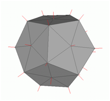
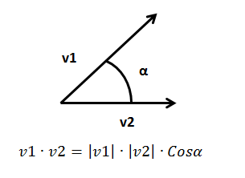
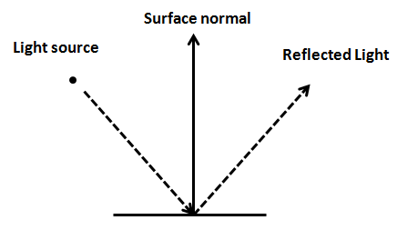
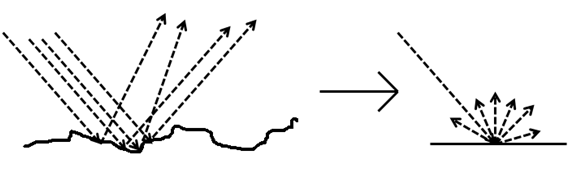

# 第11章 - 光照（Lights）

在本章中，我们将学习如何为我们的3D游戏引擎添加光照。我们不会实现一个物理上完美的光照模型，因为除了复杂性之外，它还需要大量的计算机资源。相反，我们将实现一个近似模型，它将提供不错的效果：我们将使用一个名为Phong着色（由Bui Tuong Phong开发）的算法。另一件重要的事情是，我们将只模拟光照，但不会模拟这些光照应该产生的阴影（这将在另一章中完成）。

您可以在[这里](https://github.com/lwjglgamedev/lwjglbook/tree/main/chapter-11)找到本章的完整源代码。

## 一些概念

在我们开始之前，让我们定义一些光照类型：

* **点光源**：这种类型的光照模拟了从空间中的一个点向所有方向均匀发射的光源。
* **聚光灯**：这种类型的光照模拟了从空间中的一个点发射的光源，但不是向所有方向发射，而是限制在一个圆锥体内。
* **方向光**：这种类型的光照模拟了我们从太阳接收到的光照，3D空间中的所有物体都被来自特定方向的平行光线照射。无论物体是近还是远，所有光线都以相同的角度照射物体。
* **环境光**：这种类型的光照来自空间中的各个地方，并以相同的方式照亮所有物体。


因此，要模拟光照，我们需要考虑光照的类型，以及它的位置和一些其他参数，如它的颜色。当然，我们还必须考虑物体被光线照射后吸收和反射光照的方式。

Phong着色算法将为我们模型中的每个点，即每个顶点，模拟光照效果。这就是为什么它被称为局部光照模拟，也是为什么这个算法不会计算阴影的原因：它只会计算应用于每个顶点的光照，而不考虑顶点是否在阻挡光照的物体后面。我们将在后面的章节中克服这个缺点。但是，正因为如此，它是一个简单快速的算法，可以提供非常好的效果。我们在这里使用一个简化版本，它没有深入考虑材质。

Phong算法考虑了光照的三个组成部分：

* **环境光**：模拟来自各处的光照，这将用于照亮（以所需的强度）未被任何光照照射的区域，就像背景光一样。
* **漫反射**（Diffuse reflectance）：考虑了面向光源的表面更亮的事实。
* **镜面反射**（Specular reflectance）：模拟光照在抛光或金属表面上的反射方式。

最后，我们想要获得一个因子，该因子乘以分配给片段的颜色，将根据它接收到的光照使该颜色变亮或变暗。让我们将这些组成部分分别命名为环境光的$A$，漫反射的$D$和镜面反射的$S$。该因子将是这些组成部分的加法：

$$L = A + D + S$$

实际上，这些组成部分确实是颜色，也就是说，每个光照组成部分贡献的颜色组成部分。这是因为光照组成部分不仅会提供一定程度的强度，而且可以修改模型的颜色。在我们的片段着色器中，我们只需要将该光照颜色乘以原始片段颜色（从纹理或基础颜色获得）。

我们还可以为相同的材质分配不同的颜色，这些颜色将用于环境光、漫反射和镜面反射组成部分。因此，这些组成部分将由与材质相关的颜色进行调制。如果材质有纹理，我们将简单地为每个组成部分使用一个纹理。

因此，非纹理材质的最终颜色将是：$L = A * ambientColour + D * diffuseColour + S * specular Colour$。

纹理材质的最终颜色将是：

$$L = A * textureColour + D * textureColour + S * textureColour$$

## 法线

法线是处理光照时的关键元素。让我们先定义它。平面的法线是垂直于该平面的向量，其长度等于一。


如上图所示，一个平面可以有两个法线。我们应该使用哪一个？3D图形中的法线用于光照，所以我们应该选择朝向光源的法线。换句话说，我们应该选择指向模型外部表面的法线。

当我们有一个3D模型时，它由多边形组成，在我们的例子中是三角形。每个三角形由三个顶点组成。三角形的法向量将是垂直于三角形表面且长度等于一的向量。

顶点法线与特定顶点相关联，是周围三角形法线的组合（当然其长度等于一）。这里您可以看到3D网格的顶点模型（取自[Wikipedia](https://en.wikipedia.org/wiki/Vertex_normal#/media/File:Vertex_normals.png)）



## 漫反射

现在让我们谈谈漫反射。这模拟了垂直于光源的表面看起来比光线以更间接角度接收的表面更亮的事实。这些物体接收到更多的光照，光照密度（让我这样称呼它）更高。


但是，我们如何计算这个呢？这就是我们将首先开始使用法线的地方。让我们在上一图中的三个点上绘制法线。正如您所见，每个点的法线将是垂直于每个点的切平面的向量。我们不是绘制来自光源的光线，而是从每个点绘制指向光源的向量（也就是说，方向相反）。


正如您所见，与$P1$关联的法线，命名为$N1$，与指向光源的向量平行，该向量模拟了光线的反方向（$N1$已被草绘位移，以便您可以看到它，但在数学上是等效的）。$P1$与指向光源的向量夹角等于$0$。它的表面垂直于光源，$P1$将是最亮的点。

与$P2$关联的法线，命名为$N2$，与指向光源的向量夹角约为30度，因此它应该比$P1$暗。最后，与$P3$关联的法线，命名为$N3$，也与指向光源的向量平行，但两个向量方向相反。$P3$与指向光源的向量夹角为180度，并且根本不应该接收到任何光照。

所以看来我们有一个很好的方法来确定到达一个点的光照强度，这与法线与指向光源的向量形成的夹角有关。我们如何计算这个呢？

我们可以使用一种数学运算，点积。这种运算接受两个向量并产生一个数字（一个标量），如果它们之间的夹角是锐角，则为正；如果它们之间的夹角是钝角，则为负。如果两个向量都已归一化，即它们的长度都等于一，则点积将在$-1$和$1$之间。如果两个向量方向完全相同（夹角$0$），则点积为一；如果两个向量形成直角，则为$0$；如果两个向量方向相反，则为$-1$。

让我们定义两个向量$v1$和$v2$，并设$alpha$为它们之间的夹角。点积由以下公式定义。



如果两个向量都已归一化，它们的长度，它们的模将等于一，因此点积等于它们之间夹角的余弦。我们将使用该运算来计算漫反射分量。

所以我们需要计算指向光源的向量。我们如何做到这一点？我们有每个点的位置（顶点位置）和光源的位置。首先，两个坐标必须在同一个坐标空间中。为了简化，假设它们都在世界坐标空间中：那么这些位置是指向顶点位置（$VP$）和光源（$VS$）的向量的坐标，如下图所示。


如果我们从$VP$中减去$VS$，我们就得到了我们正在寻找的向量，它被称为$L$。

现在我们可以计算指向光源的向量与法线之间的点积。这个乘积被称为Lambert项，这是因为Johann Lambert是第一个提出这种关系来模拟表面亮度的人。

让我们总结一下如何计算它。我们定义以下变量：

* $vPos$：顶点在模型视图空间坐标中的位置。
* $lPos$：光照在视图空间坐标中的位置。
* $intensity$：光照强度（从0到1）。
* $lColour$：光照颜色。
* $normal$：顶点法线。

首先，我们需要计算从当前位置指向光源的向量：$toLightDirection = lPos - vPos$。该运算的结果需要归一化。

然后我们需要计算漫反射因子（一个标量）：$diffuseFactor = normal \cdot toLightDirection$。它是通过两个向量的点积计算的，由于我们希望它在$-1$和$1$之间，所以两个向量都需要归一化。颜色需要在$0$和$1$之间，所以如果一个值小于$0$，我们将把它设置为0。

最后，我们只需要用漫反射因子和光照强度来调制光照颜色：

$$color = diffuseColour * lColour * diffuseFactor * intensity$$

## 镜面分量

在考虑镜面分量之前，我们首先需要研究光照是如何反射的。当光线照射到表面时，一部分被吸收，另一部分被反射，如果您还记得物理课上学到的，反射是光线从物体上弹开。



当然，表面并非完全光滑，如果您近距离观察，您会看到许多瑕疵。除此之外，您还有许多光线（实际上是光子），它们照射到该表面，并以各种角度反射。因此，我们看到的是一束光线从表面反射出来。也就是说，光线在照射到表面时会发生漫射，这就是我们之前一直在讨论的漫反射分量。



但是当光线照射到抛光表面，例如金属时，光线会受到较低的漫射，并且大部分光线会以与照射到该表面相反的方向反射。


这就是镜面分量所模拟的，它取决于材质特性。关于镜面反射，重要的是要注意反射光只有在相机处于适当位置时才可见，也就是说，如果相机处于反射光发射的区域。


现在已经解释了镜面反射背后的机制，我们准备计算该分量。首先，我们需要一个从光源指向顶点点的向量。当我们计算漫反射分量时，我们计算的恰好相反，一个指向光源的向量。$toLightDirection$，所以让我们将其计算为$fromLightDirection = -(toLightDirection)$。

然后我们需要计算光线$fromLightDirection$照射到表面后产生的反射光，同时考虑其法线。GLSL函数`reflect`正是做这件事的。所以，$reflectedLight = reflect(fromLightSource, normal)$。

我们还需要一个指向相机的向量，我们称之为$cameraDirection$，它将计算为相机位置和顶点位置之间的差值：$cameraDirection = cameraPos - vPos$。相机位置向量和顶点位置需要在同一个坐标系中，并且结果向量需要归一化。下图草绘了我们目前计算的主要组成部分。


现在我们需要计算我们看到的光照强度，我们称之为$specularFactor$。如果$cameraDirection$和$reflectedLight$向量平行且指向同一方向，则该分量会更高；如果它们指向相反方向，则该分量会取其较低值。为了计算这个，点积再次派上用场。所以$specularFactor = cameraDirection \cdot reflectedLight$。我们只希望这个值在$0$和$1$之间，所以如果它小于$0$，它将被设置为0。

我们还需要考虑如果相机指向反射光锥，则光照必须更强。这将通过将$specularFactor$提高到名为$specularPower$的参数来实现。

$$specularFactor = specularFactor^{specularPower}$$

最后，我们需要模拟材质的反射率，它也将调制反射光的强度。这将通过另一个名为reflectance的参数来完成。因此，镜面分量的颜色将是：$specularColour * lColour * reflectance * specularFactor * intensity$。

## 衰减

我们现在知道如何计算三个分量，这些分量将用于模拟带有环境光的点光源。但是我们的光照模型仍然不完整，因为物体反射的光照与光源的距离无关。也就是说，我们需要模拟光照衰减。

衰减是距离和光照的函数。光照强度与距离的平方成反比。这个事实很容易可视化，因为光照将其能量沿着半径等于光传播距离的球体表面传播，而球体表面与半径的平方成正比。我们可以用以下公式计算衰减因子：$1.0 / (atConstant + atLinear * dist + atExponent * dist^{2})$。

为了模拟衰减，我们只需要将该衰减因子乘以最终颜色。

## 方向光

方向光以平行光线照射所有物体，所有光线都来自同一方向。它模拟了距离很远但强度很高的光源，例如太阳。


方向光的另一个特点是它不受衰减的影响。再次想想阳光：所有被光线照射的物体都以相同的强度被照亮，因为与太阳的距离如此巨大，以至于物体的位置无关紧要。实际上，方向光被建模为放置在无穷远的光源，如果它受到衰减的影响，它将对任何物体都没有影响（其颜色贡献将等于$0$）。

除此之外，方向光也由漫反射和镜面分量组成。与点光源唯一的区别是它没有位置，但有方向，并且不受衰减的影响。让我们回到方向光的方向属性，想象我们正在模拟太阳在我们3D世界中的运动。如果我们假设北方朝向z轴增加的方向，下图显示了黎明、中午和黄昏时指向光源的方向。


git 
## 聚光灯

现在我们将实现聚光灯，它与点光源非常相似，但发射的光线被限制在一个3D圆锥体内。它模拟了从聚光灯或任何其他不向所有方向发射光线的光源发出的光线。聚光灯具有与点光源相同的属性，但增加了两个新参数：圆锥角和圆锥方向。


聚光灯的贡献计算方式与点光源相同，但有一些例外。从顶点位置指向光源的向量不包含在光锥内的点不受点光源的影响。


我们如何计算它是否在光锥内？我们需要再次计算从光源指向的向量与圆锥方向向量之间的点积（两者都已归一化）。


向量$L$和$C$之间的点积等于：$\vec{L}\cdot\vec{C}=|\vec{L}|\cdot|\vec{C}|\cdot Cos(\alpha)$。如果在我们的聚光灯定义中存储了截止角的余弦，如果点积大于该值，我们将知道它在光锥内（回想一下余弦图，当$α$角为$0$时，余弦为$1$，角度越小，余弦越大）。

第二个区别是，远离圆锥向量的点将接收到较少的光照，也就是说，衰减会更高。有几种计算方法；我们将选择一种简单的方法，通过将衰减乘以以下因子：

$$1 - (1-Cos(\alpha))/(1-Cos(cutOffAngle)$$

（在我们的片段着色器中，我们不会有角度，但会有截止角的余弦。您可以检查上面的公式产生的数值范围从0到1，当角度等于截止角时为0，当角度为0时为1）。

## 实现光照类

让我们首先创建一组类来模拟不同类型的光照。我们将从模拟点光源的类开始：

```java
package org.lwjglb.engine.scene.lights;

import org.joml.Vector3f;

public class PointLight {

    private Attenuation attenuation;
    private Vector3f color;
    private float intensity;
    private Vector3f position;

    public PointLight(Vector3f color, Vector3f position, float intensity) {
        attenuation = new Attenuation(0, 0, 1);
        this.color = color;
        this.position = position;
        this.intensity = intensity;
    }

    public Attenuation getAttenuation() {
        return attenuation;
    }

    public Vector3f getColor() {
        return color;
    }

    public float getIntensity() {
        return intensity;
    }

    public Vector3f getPosition() {
        return position;
    }

    public void setAttenuation(Attenuation attenuation) {
        this.attenuation = attenuation;
    }

    public void setColor(Vector3f color) {
        this.color = color;
    }

    public void setColor(float r, float g, float b) {
        color.set(r, g, b);
    }

    public void setIntensity(float intensity) {
        this.intensity = intensity;
    }

    public void setPosition(float x, float y, float z) {
        position.set(x, y, z);
    }

    public static class Attenuation {

        private float constant;
        private float exponent;
        private float linear;

        public Attenuation(float constant, float linear, float exponent) {
            this.constant = constant;
            this.linear = linear;
            this.exponent = exponent;
        }

        public float getConstant() {
            return constant;
        }

        public float getExponent() {
            return exponent;
        }

        public float getLinear() {
            return linear;
        }

        public void setConstant(float constant) {
            this.constant = constant;
        }

        public void setExponent(float exponent) {
            this.exponent = exponent;
        }

        public void setLinear(float linear) {
            this.linear = linear;
        }
    }
}
```

正如您所见，点光源由颜色、强度、位置和衰减模型定义。

环境光仅由颜色和强度定义：

```java
package org.lwjglb.engine.scene.lights;

import org.joml.Vector3f;

public class AmbientLight {

    private Vector3f color;

    private float intensity;

    public AmbientLight(float intensity, Vector3f color) {
        this.intensity = intensity;
        this.color = color;
    }

    public AmbientLight() {
        this(1.0f, new Vector3f(1.0f, 1.0f, 1.0f));
    }

    public Vector3f getColor() {
        return color;
    }

    public float getIntensity() {
        return intensity;
    }

    public void setColor(Vector3f color) {
        this.color = color;
    }

    public void setColor(float r, float g, float b) {
        color.set(r, g, b);
    }

    public void setIntensity(float intensity) {
        this.intensity = intensity;
    }
}
```

方向光定义如下：

```java
package org.lwjglb.engine.scene.lights;

import org.joml.Vector3f;

public class DirLight {

    private Vector3f color;

    private Vector3f direction;

    private float intensity;

    public DirLight(Vector3f color, Vector3f direction, float intensity) {
        this.color = color;
        this.direction = direction;
        this.intensity = intensity;
    }

    public Vector3f getColor() {
        return color;
    }

    public Vector3f getDirection() {
        return direction;
    }

    public float getIntensity() {
        return intensity;
    }

    public void setColor(Vector3f color) {
        this.color = color;
    }

    public void setColor(float r, float g, float b) {
        color.set(r, g, b);
    }

    public void setDirection(Vector3f direction) {
        this.direction = direction;
    }

    public void setIntensity(float intensity) {
        this.intensity = intensity;
    }

    public void setPosition(float x, float y, float z) {
        direction.set(x, y, z);
    }
}
```

最后，聚光灯只包含一个点光源引用以及光锥参数：

```java
package org.lwjglb.engine.scene.lights;

import org.joml.Vector3f;

public class SpotLight {

    private Vector3f coneDirection;
    private float cutOff;
    private float cutOffAngle;
    private PointLight pointLight;

    public SpotLight(PointLight pointLight, Vector3f coneDirection, float cutOffAngle) {
        this.pointLight = pointLight;
        this.coneDirection = coneDirection;
        this.cutOffAngle = cutOffAngle;
        setCutOffAngle(cutOffAngle);
    }

    public Vector3f getConeDirection() {
        return coneDirection;
    }

    public float getCutOff() {
        return cutOff;
    }

    public float getCutOffAngle() {
        return cutOffAngle;
    }

    public PointLight getPointLight() {
        return pointLight;
    }

    public void setConeDirection(float x, float y, float z) {
        coneDirection.set(x, y, z);
    }

    public void setConeDirection(Vector3f coneDirection) {
        this.coneDirection = coneDirection;
    }

    public final void setCutOffAngle(float cutOffAngle) {
        this.cutOffAngle = cutOffAngle;
        cutOff = (float) Math.cos(Math.toRadians(cutOffAngle));
    }

    public void setPointLight(PointLight pointLight) {
        this.pointLight = pointLight;
    }
}
```

所有光照都将存储在Scene类中，为此我们将创建一个名为`SceneLights`的新类，该类将存储对所有类型光照的引用（请注意，我们只需要一个环境光实例和一个方向光实例）：

```java
package org.lwjglb.engine.scene.lights;

import org.joml.Vector3f;

import java.util.*;

public class SceneLights {

    private AmbientLight ambientLight;
    private DirLight dirLight;
    private List<PointLight> pointLights;
    private List<SpotLight> spotLights;

    public SceneLights() {
        ambientLight = new AmbientLight();
        pointLights = new ArrayList<>();
        spotLights = new ArrayList<>();
        dirLight = new DirLight(new Vector3f(1, 1, 1), new Vector3f(0, 1, 0), 1.0f);
    }

    public AmbientLight getAmbientLight() {
        return ambientLight;
    }

    public DirLight getDirLight() {
        return dirLight;
    }

    public List<PointLight> getPointLights() {
        return pointLights;
    }

    public List<SpotLight> getSpotLights() {
        return spotLights;
    }

    public void setSpotLights(List<SpotLight> spotLights) {
        this.spotLights = spotLights;
    }
}
```

我们将在`Scene`类中引用`SceneLights`：

```java
public class Scene {
    ...
    private SceneLights sceneLights;
    ...
    public SceneLights getSceneLights() {
        return sceneLights;
    }
    ...
    public void setSceneLights(SceneLights sceneLights) {
        this.sceneLights = sceneLights;
    }
}
```

## 模型加载修改

我们需要修改`ModelLoader`类以：

* 获取材质的更多属性，特别是环境颜色、镜面颜色和光泽度因子。
* 为每个网格加载法线数据。

为了获取材质的更多属性，我们需要修改`processMaterial`方法：

```java
public class ModelLoader {
    ...
    private static Material processMaterial(AIMaterial aiMaterial, String modelDir, TextureCache textureCache) {
        Material material = new Material();
        try (MemoryStack stack = MemoryStack.stackPush()) {
            AIColor4D color = AIColor4D.create();

            int result = aiGetMaterialColor(aiMaterial, AI_MATKEY_COLOR_AMBIENT, aiTextureType_NONE, 0,
                    color);
            if (result == aiReturn_SUCCESS) {
                material.setAmbientColor(new Vector4f(color.r(), color.g(), color.b(), color.a()));
            }

            result = aiGetMaterialColor(aiMaterial, AI_MATKEY_COLOR_DIFFUSE, aiTextureType_NONE, 0,
                    color);
            if (result == aiReturn_SUCCESS) {
                material.setDiffuseColor(new Vector4f(color.r(), color.g(), color.b(), color.a()));
            }

            result = aiGetMaterialColor(aiMaterial, AI_MATKEY_COLOR_SPECULAR, aiTextureType_NONE, 0,
                    color);
            if (result == aiReturn_SUCCESS) {
                material.setSpecularColor(new Vector4f(color.r(), color.g(), color.b(), color.a()));
            }

            float reflectance = 0.0f;
            float[] shininessFactor = new float[]{0.0f};
            int[] pMax = new int[]{1};
            result = aiGetMaterialFloatArray(aiMaterial, AI_MATKEY_SHININESS_STRENGTH, aiTextureType_NONE, 0, shininessFactor, pMax);
            if (result != aiReturn_SUCCESS) {
                reflectance = shininessFactor[0];
            }
            material.setReflectance(reflectance);

            AIString aiTexturePath = AIString.calloc(stack);
            aiGetMaterialTexture(aiMaterial, aiTextureType_DIFFUSE, 0, aiTexturePath, (IntBuffer) null,
                    null, null, null, null, null);
            String texturePath = aiTexturePath.dataString();
            if (texturePath != null && texturePath.length() > 0) {
                material.setTexturePath(modelDir + File.separator + new File(texturePath).getName());
                textureCache.createTexture(material.getTexturePath());
                material.setDiffuseColor(Material.DEFAULT_COLOR);
            }

            return material;
        }
    }
    ...
}
```

正如您所见，我们通过获取`AI_MATKEY_COLOR_AMBIENT`属性来获取材质的环境颜色。镜面颜色通过使用`AI_MATKEY_COLOR_SPECULAR`属性获取。光泽度通过使用`AI_MATKEY_SHININESS_STRENGTH`标志查询。

为了加载法线，我们需要创建一个名为`processNormals`的新方法，并在`processMesh`方法中调用它。

```java
public class ModelLoader {
    ...
    private static Mesh processMesh(AIMesh aiMesh) {
        float[] vertices = processVertices(aiMesh);
        float[] normals = processNormals(aiMesh);
        float[] textCoords = processTextCoords(aiMesh);
        int[] indices = processIndices(aiMesh);

        // Texture coordinates may not have been populated. We need at least the empty slots
        if (textCoords.length == 0) {
            int numElements = (vertices.length / 3) * 2;
            textCoords = new float[numElements];
        }

        return new Mesh(vertices, normals, textCoords, indices);
    }

    private static float[] processNormals(AIMesh aiMesh) {
        AIVector3D.Buffer buffer = aiMesh.mNormals();
        float[] data = new float[buffer.remaining() * 3];
        int pos = 0;
        while (buffer.remaining() > 0) {
            AIVector3D normal = buffer.get();
            data[pos++] = normal.x();
            data[pos++] = normal.y();
            data[pos++] = normal.z();
        }
        return data;
    }
    ...
}
```

正如您所见，我们还需要修改`Material`和`Mesh`类来存储新信息。`Material`类中的更改如下：

```java
public class Material {
    ...
    private Vector4f ambientColor;
    ...
    private float reflectance;
    private Vector4f specularColor;
    ...
    public Material() {
        ...
        ambientColor = DEFAULT_COLOR;
        ...
    }
    ...
    public Vector4f getAmbientColor() {
        return ambientColor;
    }
    ...
    public float getReflectance() {
        return reflectance;
    }

    public Vector4f getSpecularColor() {
        return specularColor;
    }
    ...
    public void setAmbientColor(Vector4f ambientColor) {
        this.ambientColor = ambientColor;
    }
    ...
    public void setReflectance(float reflectance) {
        this.reflectance = reflectance;
    }

    public void setSpecularColor(Vector4f specularColor) {
        this.specularColor = specularColor;
    }
    ...
}
```

`Mesh`类现在接受一个新的浮点数组用于法线数据，因此为此创建了一个新的VBO：

```java
public class Mesh {
    ...
    public Mesh(float[] positions, float[] normals, float[] textCoords, int[] indices) {
        ...
        // Normals VBO
        vboId = glGenBuffers();
        vboIdList.add(vboId);
        FloatBuffer normalsBuffer = MemoryUtil.memCallocFloat(normals.length);
        normalsBuffer.put(0, normals);
        glBindBuffer(GL_ARRAY_BUFFER, vboId);
        glBufferData(GL_ARRAY_BUFFER, normalsBuffer, GL_STATIC_DRAW);
        glEnableVertexAttribArray(1);
        glVertexAttribPointer(1, 3, GL_FLOAT, false, 0, 0);

        // Texture coordinates VBO
        ...
        glEnableVertexAttribArray(2);
        glVertexAttribPointer(2, 2, GL_FLOAT, false, 0, 0);

        // Index VBO
        ...
        MemoryUtil.memFree(normalsBuffer);
        ...
    }
    ...
}
```

## 使用光照渲染

现在是时候在渲染时使用光照了，让我们从着色器开始，特别是顶点着色器（`scene.vert`）：

```glsl
#version 330

layout (location=0) in vec3 position;
layout (location=1) in vec3 normal;
layout (location=2) in vec2 texCoord;

out vec3 outPosition;
out vec3 outNormal;
out vec2 outTextCoord;

uniform mat4 projectionMatrix;
uniform mat4 viewMatrix;
uniform mat4 modelMatrix;

void main()
{
    mat4 modelViewMatrix = viewMatrix * modelMatrix;
    vec4 mvPosition =  modelViewMatrix * vec4(position, 1.0);
    gl_Position = projectionMatrix * mvPosition;
    outPosition = mvPosition.xyz;
    outNormal = normalize(modelViewMatrix * vec4(normal, 0.0)).xyz;
    outTextCoord = texCoord;
}
```

正如您所见，我们现在将法线数据作为另一个输入属性，并且我们只是将该数据传递给片段着色器。在我们继续片段着色器之前，有一个非常重要的概念必须强调。从上面的代码中您可以看到，包含顶点法线的变量`mvVertexNormal`被转换到模型视图空间坐标。这与顶点位置一样，通过将`normal`乘以`modelViewMatrix`来完成。但是有一个细微的区别，该顶点法线的w分量在乘以矩阵之前被设置为0：`vec4(vertexNormal, 0.0)`。我们为什么要这样做？因为我们确实希望法线被旋转和缩放，但我们不希望它被平移，我们只对其方向感兴趣，而不是其位置。这通过将其w分量设置为0来实现，并且是使用齐次坐标的优点之一，通过设置w分量我们可以控制应用哪些变换。您可以手动进行矩阵乘法，看看为什么会发生这种情况。

`scene.frag`片段着色器中的更改更为复杂，让我们一步一步来：

```glsl
#version 330

const int MAX_POINT_LIGHTS = 5;
const int MAX_SPOT_LIGHTS = 5;
const float SPECULAR_POWER = 10;

in vec3 outPosition;
in vec3 outNormal;
in vec2 outTextCoord;

out vec4 fragColor;
...
```

首先，我们定义了一些常量，用于支持的最大点光源和聚光灯数量。我们需要这样做，因为这些光照的数据将作为统一变量数组传递，该数组需要在编译时具有明确定义的大小。您还可以看到我们从顶点着色器接收法线数据。之后，我们定义将模拟光照数据的结构：

```glsl
...
struct Attenuation
{
    float constant;
    float linear;
    float exponent;
};
struct Material
{
    vec4 ambient;
    vec4 diffuse;
    vec4 specular;
    float reflectance;
};
struct AmbientLight
{
    float factor;
    vec3 color;
};
struct PointLight {
    vec3 position;
    vec3 color;
    float intensity;
    Attenuation att;
};
struct SpotLight
{
    PointLight pl;
    vec3 conedir;
    float cutoff;
};
struct DirLight
{
    vec3 color;
    vec3 direction;
    float intensity;
};
...
```

之后，我们为光照数据定义新的统一变量：

```glsl
...
uniform sampler2D txtSampler;
uniform Material material;
uniform AmbientLight ambientLight;
uniform PointLight pointLights[MAX_POINT_LIGHTS];
uniform SpotLight spotLights[MAX_SPOT_LIGHTS];
uniform DirLight dirLight
...
```

现在我们将定义一些函数来计算每种光照类型的影响，从环境光开始：

```glsl
...
vec4 calcAmbient(AmbientLight ambientLight, vec4 ambient) {
    return vec4(ambientLight.factor * ambientLight.color, 1) * ambient;
}
...
```

正如您所见，我们只是通过一个因子来调制环境光颜色，该因子应用于材质环境颜色。现在我们将定义一个函数，该函数将定义如何计算所有类型光照的颜色：

```glsl
...
vec4 calcLightColor(vec4 diffuse, vec4 specular, vec3 lightColor, float light_intensity, vec3 position, vec3 to_light_dir, vec3 normal) {
    vec4 diffuseColor = vec4(0, 0, 0, 1);
    vec4 specColor = vec4(0, 0, 0, 1);

    // Diffuse Light
    float diffuseFactor = max(dot(normal, to_light_dir), 0.0);
    diffuseColor = diffuse * vec4(lightColor, 1.0) * light_intensity * diffuseFactor;

    // Specular Light
    vec3 camera_direction = normalize(-position);
    vec3 from_light_dir = -to_light_dir;
    vec3 reflected_light = normalize(reflect(from_light_dir, normal));
    float specularFactor = max(dot(camera_direction, reflected_light), 0.0);
    specularFactor = pow(specularFactor, SPECULAR_POWER);
    specColor = specular * light_intensity  * specularFactor * material.reflectance * vec4(lightColor, 1.0);

    return (diffuseColor + specColor);
}
...
```

前面的代码相对简单，它只是计算漫反射分量的颜色，镜面分量的颜色，并通过光线传播到我们正在处理的顶点时所遭受的衰减来调制它们。现在我们可以定义将为每种光照类型调用的函数，我们将从点光源开始：

```glsl
...
vec4 calcPointLight(vec4 diffuse, vec4 specular, PointLight light, vec3 position, vec3 normal) {
    vec3 light_direction = light.position - position;
    vec3 to_light_dir  = normalize(light_direction);
    vec4 light_color = calcLightColor(diffuse, specular, light.color, light.intensity, position, to_light_dir, normal);

    // Apply Attenuation
    float distance = length(light_direction);
    float attenuationInv = light.att.constant + light.att.linear * distance +
    light.att.exponent * distance * distance;
    return light_color / attenuationInv;
}
...
```

正如您所见，我们只是计算指向光照的方向（作为法线），并使用该信息计算光照颜色，使用材质的漫反射和镜面颜色、光照颜色、其强度、位置、其方向和法线方向。之后，我们应用衰减。聚光灯的函数如下：

```glsl
...
vec4 calcSpotLight(vec4 diffuse, vec4 specular, SpotLight light, vec3 position, vec3 normal) {
    vec3 light_direction = light.pl.position - position;
    vec3 to_light_dir  = normalize(light_direction);
    vec3 from_light_dir  = -to_light_dir;
    float spot_alfa = dot(from_light_dir, normalize(light.conedir));

    vec4 color = vec4(0, 0, 0, 0);

    if (spot_alfa > light.cutoff)
    {
        color = calcPointLight(diffuse, specular, light.pl, position, normal);
        color *= (1.0 - (1.0 - spot_alfa)/(1.0 - light.cutoff));
    }
    return color;
}
...
```

过程与点光源类似，不同之处在于我们需要控制是否在光锥内。在光锥内，我们还需要应用一些衰减，如前所述。最后，方向光的函数定义如下：

```glsl
...
vec4 calcDirLight(vec4 diffuse, vec4 specular, DirLight light, vec3 position, vec3 normal) {
    return calcLightColor(diffuse, specular, light.color, light.intensity, position, normalize(light.direction), normal);
}
...
```

在这种情况下，我们已经有了指向光照的方向，并且由于没有衰减，我们不需要考虑光照位置。最后，在`main`方法中，我们只需遍历不同类型的光照，这些光照将对最终片段颜色的漫反射-镜面分量做出贡献：

```glsl
...
void main() {
    vec4 text_color = texture(txtSampler, outTextCoord);
    vec4 ambient = calcAmbient(ambientLight, text_color + material.ambient);
    vec4 diffuse = text_color + material.diffuse;
    vec4 specular = text_color + material.specular;

    vec4 diffuseSpecularComp = calcDirLight(diffuse, specular, dirLight, outPosition, outNormal);

    for (int i=0; i<MAX_POINT_LIGHTS; i++) {
        if (pointLights[i].intensity > 0) {
            diffuseSpecularComp += calcPointLight(diffuse, specular, pointLights[i], outPosition, outNormal);
        }
    }

    for (int i=0; i<MAX_SPOT_LIGHTS; i++) {
        if (spotLights[i].pl.intensity > 0) {
            diffuseSpecularComp += calcSpotLight(diffuse, specular, spotLights[i], outPosition, outNormal);
        }
    }
    fragColor = ambient + diffuseSpecularComp;
}
```

现在轮到检查我们将如何修改`SceneRender`类以在渲染过程中包含光照了。第一步是创建新的统一变量：

```java
public class SceneRender {

    private static final int MAX_POINT_LIGHTS = 5;
    private static final int MAX_SPOT_LIGHTS = 5;
    ...
    private void createUniforms() {
        ...
        uniformsMap.createUniform("material.ambient");
        uniformsMap.createUniform("material.diffuse");
        uniformsMap.createUniform("material.specular");
        uniformsMap.createUniform("material.reflectance");
        uniformsMap.createUniform("ambientLight.factor");
        uniformsMap.createUniform("ambientLight.color");

        for (int i = 0; i < MAX_POINT_LIGHTS; i++) {
            String name = "pointLights[" + i + "]";
            uniformsMap.createUniform(name + ".position");
            uniformsMap.createUniform(name + ".color");
            uniformsMap.createUniform(name + ".intensity");
            uniformsMap.createUniform(name + ".att.constant");
            uniformsMap.createUniform(name + ".att.linear");
            uniformsMap.createUniform(name + ".att.exponent");
        }
        for (int i = 0; i < MAX_SPOT_LIGHTS; i++) {
            String name = "spotLights[" + i + "]";
            uniformsMap.createUniform(name + ".pl.position");
            uniformsMap.createUniform(name + ".pl.color");
            uniformsMap.createUniform(name + ".pl.intensity");
            uniformsMap.createUniform(name + ".pl.att.constant");
            uniformsMap.createUniform(name + ".pl.att.linear");
            uniformsMap.createUniform(name + ".pl.att.exponent");
            uniformsMap.createUniform(name + ".conedir");
            uniformsMap.createUniform(name + ".cutoff");
        }

        uniformsMap.createUniform("dirLight.color");
        uniformsMap.createUniform("dirLight.direction");
        uniformsMap.createUniform("dirLight.intensity");
    }
    ...
}
```

当我们使用数组时，我们需要为列表的每个元素创建一个统一变量。因此，例如，对于$pointLights$数组，我们需要创建一个名为`pointLights[0]`、`pointLights[1]`等的统一变量。当然，这也适用于结构属性，所以我们将有`pointLights[0].color`、`pointLights[1].color`等。

我们将创建一个新方法来更新每次渲染调用的光照统一变量，该方法名为`updateLights`，定义如下：

```java
public class SceneRender {
    ...
    private void updateLights(Scene scene) {
        Matrix4f viewMatrix = scene.getCamera().getViewMatrix();

        SceneLights sceneLights = scene.getSceneLights();
        AmbientLight ambientLight = sceneLights.getAmbientLight();
        uniformsMap.setUniform("ambientLight.factor", ambientLight.getIntensity());
        uniformsMap.setUniform("ambientLight.color", ambientLight.getColor());

        DirLight dirLight = sceneLights.getDirLight();
        Vector4f auxDir = new Vector4f(dirLight.getDirection(), 0);
        auxDir.mul(viewMatrix);
        Vector3f dir = new Vector3f(auxDir.x, auxDir.y, auxDir.z);
        uniformsMap.setUniform("dirLight.color", dirLight.getColor());
        uniformsMap.setUniform("dirLight.direction", dir);
        uniformsMap.setUniform("dirLight.intensity", dirLight.getIntensity());

        List<PointLight> pointLights = sceneLights.getPointLights();
        int numPointLights = pointLights.size();
        PointLight pointLight;
        for (int i = 0; i < MAX_POINT_LIGHTS; i++) {
            if (i < numPointLights) {
                pointLight = pointLights.get(i);
            } else {
                pointLight = null;
            }
            String name = "pointLights[" + i + "]";
            updatePointLight(pointLight, name, viewMatrix);
        }


        List<SpotLight> spotLights = sceneLights.getSpotLights();
        int numSpotLights = spotLights.size();
        SpotLight spotLight;
        for (int i = 0; i < MAX_SPOT_LIGHTS; i++) {
            if (i < numSpotLights) {
                spotLight = spotLights.get(i);
            } else {
                spotLight = null;
            }
            String name = "spotLights[" + i + "]";
            updateSpotLight(spotLight, name, viewMatrix);
        }
    }
    ...
}
```

代码非常直观，我们首先设置环境光和方向光的统一变量，然后遍历点光源和聚光灯，它们有专门的方法来设置数组中每个元素的统一变量：

```java
public class SceneRender {
    ...
    private void updatePointLight(PointLight pointLight, String prefix, Matrix4f viewMatrix) {
        Vector4f aux = new Vector4f();
        Vector3f lightPosition = new Vector3f();
        Vector3f color = new Vector3f();
        float intensity = 0.0f;
        float constant = 0.0f;
        float linear = 0.0f;
        float exponent = 0.0f;
        if (pointLight != null) {
            aux.set(pointLight.getPosition(), 1);
            aux.mul(viewMatrix);
            lightPosition.set(aux.x, aux.y, aux.z);
            color.set(pointLight.getColor());
            intensity = pointLight.getIntensity();
            PointLight.Attenuation attenuation = pointLight.getAttenuation();
            constant = attenuation.getConstant();
            linear = attenuation.getLinear();
            exponent = attenuation.getExponent();
        }
        uniformsMap.setUniform(prefix + ".position", lightPosition);
        uniformsMap.setUniform(prefix + ".color", color);
        uniformsMap.setUniform(prefix + ".intensity", intensity);
        uniformsMap.setUniform(prefix + ".att.constant", constant);
        uniformsMap.setUniform(prefix + ".att.linear", linear);
        uniformsMap.setUniform(prefix + ".att.exponent", exponent);
    }

    private void updateSpotLight(SpotLight spotLight, String prefix, Matrix4f viewMatrix) {
        PointLight pointLight = null;
        Vector3f coneDirection = new Vector3f();
        float cutoff = 0.0f;
        if (spotLight != null) {
            coneDirection = spotLight.getConeDirection();
            cutoff = spotLight.getCutOff();
            pointLight = spotLight.getPointLight();
        }

        uniformsMap.setUniform(prefix + ".conedir", coneDirection);
        uniformsMap.setUniform(prefix + ".cutoff", cutoff);
        updatePointLight(pointLight, prefix + ".pl", viewMatrix);
    }
    ...
}
```

正如我们所说，这些光照的坐标必须在视图空间中。通常我们会在世界空间坐标中设置光照坐标，所以我们需要将它们乘以视图矩阵才能在我们的着色器中使用它们。最后，我们需要更新`render`方法来调用`updateLights`方法，并正确设置模型材质的新元素：

```java
public class SceneRender {
    ...
    public void render(Scene scene) {
        ...
        updateLights(scene);
        ...
        for (Model model : models) {
            List<Entity> entities = model.getEntitiesList();

            for (Material material : model.getMaterialList()) {
                uniformsMap.setUniform("material.ambient", material.getAmbientColor());
                uniformsMap.setUniform("material.diffuse", material.getDiffuseColor());
                uniformsMap.setUniform("material.specular", material.getSpecularColor());
                uniformsMap.setUniform("material.reflectance", material.getReflectance());
                ...
            }
        }
        ...
    }
    ...
}
```

我们还需要在`UniformsMap`类中添加一对方法来创建统一变量，以便为浮点数和3D向量设置值：

```java
public class UniformsMap {
    ...
    public void setUniform(String uniformName, float value) {
        glUniform1f(getUniformLocation(uniformName), value);
    }

    public void setUniform(String uniformName, Vector3f value) {
        glUniform3f(getUniformLocation(uniformName), value.x, value.y, value.z);
    }
    ...
}
```

## 光照控制

最后一步是在`Main`类中使用光照。但是，在此之前，我们将使用Imgui创建一个GUI，以提供一些元素来控制光照参数。我们将在一个名为`LightControls`的新类中完成此操作。代码有点冗长，但非常容易理解，我们只需要设置一组属性来从GUI控件获取值，以及一个方法来绘制所需的面板和小部件。

```java
package org.lwjglb.game;

import imgui.*;
import imgui.flag.ImGuiCond;
import org.joml.*;
import org.lwjglb.engine.*;
import org.lwjglb.engine.scene.Scene;
import org.lwjglb.engine.scene.lights.*;

public class LightControls implements IGuiInstance {

    private float[] ambientColor;
    private float[] ambientFactor;
    private float[] dirConeX;
    private float[] dirConeY;
    private float[] dirConeZ;
    private float[] dirLightColor;
    private float[] dirLightIntensity;
    private float[] dirLightX;
    private float[] dirLightY;
    private float[] dirLightZ;
    private float[] pointLightColor;
    private float[] pointLightIntensity;
    private float[] pointLightX;
    private float[] pointLightY;
    private float[] pointLightZ;
    private float[] spotLightColor;
    private float[] spotLightCuttoff;
    private float[] spotLightIntensity;
    private float[] spotLightX;
    private float[] spotLightY;
    private float[] spotLightZ;

    public LightControls(Scene scene) {
        SceneLights sceneLights = scene.getSceneLights();
        AmbientLight ambientLight = sceneLights.getAmbientLight();
        Vector3f color = ambientLight.getColor();

        ambientFactor = new float[]{ambientLight.getIntensity()};
        ambientColor = new float[]{color.x, color.y, color.z};

        PointLight pointLight = sceneLights.getPointLights().get(0);
        color = pointLight.getColor();
        Vector3f pos = pointLight.getPosition();
        pointLightColor = new float[]{color.x, color.y, color.z};
        pointLightX = new float[]{pos.x};
        pointLightY = new float[]{pos.y};
        pointLightZ = new float[]{pos.z};
        pointLightIntensity = new float[]{pointLight.getIntensity()};

        SpotLight spotLight = sceneLights.getSpotLights().get(0);
        pointLight = spotLight.getPointLight();
        color = pointLight.getColor();
        pos = pointLight.getPosition();
        spotLightColor = new float[]{color.x, color.y, color.z};
        spotLightX = new float[]{pos.x};
        spotLightY = new float[]{pos.y};
        spotLightZ = new float[]{pos.z};
        spotLightIntensity = new float[]{pointLight.getIntensity()};
        spotLightCuttoff = new float[]{spotLight.getCutOffAngle()};
        Vector3f coneDir = spotLight.getConeDirection();
        dirConeX = new float[]{coneDir.x};
        dirConeY = new float[]{coneDir.y};
        dirConeZ = new float[]{coneDir.z};

        DirLight dirLight = sceneLights.getDirLight();
        color = dirLight.getColor();
        pos = dirLight.getDirection();
        dirLightColor = new float[]{color.x, color.y, color.z};
        dirLightX = new float[]{pos.x};
        dirLightY = new float[]{pos.y};
        dirLightZ = new float[]{pos.z};
        dirLightIntensity = new float[]{dirLight.getIntensity()};
    }

    @Override
    public void drawGui() {
        ImGui.newFrame();
        ImGui.setNextWindowPos(0, 0, ImGuiCond.Always);
        ImGui.setNextWindowSize(450, 400);

        ImGui.begin("Lights controls");
        if (ImGui.collapsingHeader("Ambient Light")) {
            ImGui.sliderFloat("Ambient factor", ambientFactor, 0.0f, 1.0f, "%.2f");
            ImGui.colorEdit3("Ambient color", ambientColor);
        }

        if (ImGui.collapsingHeader("Point Light")) {
            ImGui.sliderFloat("Point Light - x", pointLightX, -10.0f, 10.0f, "%.2f");
            ImGui.sliderFloat("Point Light - y", pointLightY, -10.0f, 10.0f, "%.2f");
            ImGui.sliderFloat("Point Light - z", pointLightZ, -10.0f, 10.0f, "%.2f");
            ImGui.colorEdit3("Point Light color", pointLightColor);
            ImGui.sliderFloat("Point Light Intensity", pointLightIntensity, 0.0f, 1.0f, "%.2f");
        }

        if (ImGui.collapsingHeader("Spot Light")) {
            ImGui.sliderFloat("Spot Light - x", spotLightX, -10.0f, 10.0f, "%.2f");
            ImGui.sliderFloat("Spot Light - y", spotLightY, -10.0f, 10.0f, "%.2f");
            ImGui.sliderFloat("Spot Light - z", spotLightZ, -10.0f, 10.0f, "%.2f");
            ImGui.colorEdit3("Spot Light color", spotLightColor);
            ImGui.sliderFloat("Spot Light Intensity", spotLightIntensity, 0.0f, 1.0f, "%.2f");
            ImGui.separator();
            ImGui.sliderFloat("Spot Light cutoff", spotLightCuttoff, 0.0f, 360.0f, "%2.f");
            ImGui.sliderFloat("Dir cone - x", dirConeX, -1.0f, 1.0f, "%.2f");
            ImGui.sliderFloat("Dir cone - y", dirConeY, -1.0f, 1.0f, "%.2f");
            ImGui.sliderFloat("Dir cone - z", dirConeZ, -1.0f, 1.0f, "%.2f");
        }

        if (ImGui.collapsingHeader("Dir Light")) {
            ImGui.sliderFloat("Dir Light - x", dirLightX, -1.0f, 1.0f, "%.2f");
            ImGui.sliderFloat("Dir Light - y", dirLightY, -1.0f, 1.0f, "%.2f");
            ImGui.sliderFloat("Dir Light - z", dirLightZ, -1.0f, 1.0f, "%.2f");
            ImGui.colorEdit3("Dir Light color", dirLightColor);
            ImGui.sliderFloat("Dir Light Intensity", dirLightIntensity, 0.0f, 1.0f, "%.2f");
        }

        ImGui.end();
        ImGui.endFrame();
        ImGui.render();
    }
    ...
}
```

最后，我们需要一个方法来处理GUI输入，在该方法中，我们根据鼠标状态更新Imgui，并检查输入是否已被GUI控件消耗。如果是，我们只需根据用户输入填充类的属性：

```java
public class LightControls implements IGuiInstance {
    ...
    @Override
    public boolean handleGuiInput(Scene scene, Window window) {
        ImGuiIO imGuiIO = ImGui.getIO();
        MouseInput mouseInput = window.getMouseInput();
        Vector2f mousePos = mouseInput.getCurrentPos();
        imGuiIO.addMousePosEvent(mousePos.x, mousePos.y);
        imGuiIO.addMouseButtonEvent(0, mouseInput.isLeftButtonPressed());
        imGuiIO.addMouseButtonEvent(1, mouseInput.isRightButtonPressed());

        boolean consumed = imGuiIO.getWantCaptureMouse() || imGuiIO.getWantCaptureKeyboard();
        if (consumed) {
            SceneLights sceneLights = scene.getSceneLights();
            AmbientLight ambientLight = sceneLights.getAmbientLight();
            ambientLight.setIntensity(ambientFactor[0]);
            ambientLight.setColor(ambientColor[0], ambientColor[1], ambientColor[2]);

            PointLight pointLight = sceneLights.getPointLights().get(0);
            pointLight.setPosition(pointLightX[0], pointLightY[0], pointLightZ[0]);
            pointLight.setColor(pointLightColor[0], pointLightColor[1], pointLightColor[2]);
            pointLight.setIntensity(pointLightIntensity[0]);

            SpotLight spotLight = sceneLights.getSpotLights().get(0);
            pointLight = spotLight.getPointLight();
            pointLight.setPosition(spotLightX[0], spotLightY[0], spotLightZ[0]);
            pointLight.setColor(spotLightColor[0], spotLightColor[1], spotLightColor[2]);
            pointLight.setIntensity(spotLightIntensity[0]);
            spotLight.setCutOffAngle(spotLightColor[0]);
            spotLight.setConeDirection(dirConeX[0], dirConeY[0], dirConeZ[0]);

            DirLight dirLight = sceneLights.getDirLight();
            dirLight.setPosition(dirLightX[0], dirLightY[0], dirLightZ[0]);
            dirLight.setColor(dirLightColor[0], dirLightColor[1], dirLightColor[2]);
            dirLight.setIntensity(dirLightIntensity[0]);
        }
        return consumed;
    }
}
```

最后一步是更新`Main`类以创建光照，删除之前的`drawGui`和`handleGuiInput`方法（我们现在在`LightControls`类中处理这些）：

```java
public class Main implements IAppLogic {
    ...
    private LightControls lightControls;

    public static void main(String[] args) {
        ...
        Engine gameEng = new Engine("chapter-11", new Window.WindowOptions(), main);
        ...
    }
    ...
    public void init(Window window, Scene scene, Render render) {
        Model cubeModel = ModelLoader.loadModel("cube-model", "resources/models/cube/cube.obj",
                scene.getTextureCache());
        scene.addModel(cubeModel);

        cubeEntity = new Entity("cube-entity", cubeModel.getId());
        cubeEntity.setPosition(0, 0f, -2);
        cubeEntity.updateModelMatrix();
        scene.addEntity(cubeEntity);

        SceneLights sceneLights = new SceneLights();
        sceneLights.getAmbientLight().setIntensity(0.3f);
        scene.setSceneLights(sceneLights);
        sceneLights.getPointLights().add(new PointLight(new Vector3f(1, 1, 1),
                new Vector3f(0, 0, -1.4f), 1.0f));

        Vector3f coneDir = new Vector3f(0, 0, -1);
        sceneLights.getSpotLights().add(new SpotLight(new PointLight(new Vector3f(1, 1, 1),
                new Vector3f(0, 0, -1.4f), 0.0f), coneDir, 140.0f));

        lightControls = new LightControls(scene);
        scene.setGuiInstance(lightControls);
    }
    ...
    @Override
    public void update(Window window, Scene scene, long diffTimeMillis) {
        // Nothing to be done here
    }
}
```

最后，您将看到类似这样的内容。


[下一章](./12-sky-box.md)