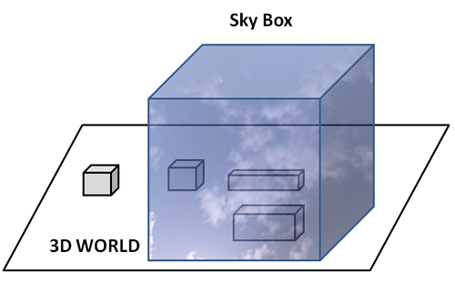

# 第12章 - 天空盒（Sky Box）

在本章中，我们将看到如何创建一个天空盒。天空盒将允许我们设置一个背景，以给人一种我们的3D世界更大的错觉。该背景围绕相机位置包裹，并覆盖整个空间。我们将在这里使用的技术是构建一个大立方体，该立方体将显示在3D场景周围，也就是说，相机位置的中心将是立方体的中心。该立方体的侧面将包裹着带有山丘、蓝天和云彩的纹理，这些纹理将以一种图像看起来像连续景观的方式进行映射。

您可以在[这里](https://github.com/lwjglgamedev/lwjglbook/tree/main/chapter-12)找到本章的完整源代码。

## 天空盒

下图描绘了天空盒的概念。



创建天空盒的过程可以总结为以下步骤：

* 创建一个大立方体。
* 在其上应用一个纹理，该纹理提供我们正在看到一个没有边缘的巨大景观的错觉。
* 渲染立方体，使其侧面位于远处，并且其原点位于相机的中心。

我们将首先创建一个名为`SkyBox`的新类，其构造函数接收包含天空盒立方体（及其纹理）的3D模型的路径以及纹理缓存的引用。该类将加载该模型并创建一个与该模型关联的`Entity`实例。`SkyBox`类的定义如下。

```java
package org.lwjglb.engine.scene;

import org.lwjglb.engine.graph.*;

public class SkyBox {

    private Entity skyBoxEntity;
    private Model skyBoxModel;

    public SkyBox(String skyBoxModelPath, TextureCache textureCache) {
        skyBoxModel = ModelLoader.loadModel("skybox-model", skyBoxModelPath, textureCache);
        skyBoxEntity = new Entity("skyBoxEntity-entity", skyBoxModel.getId());
    }

    public Entity getSkyBoxEntity() {
        return skyBoxEntity;
    }

    public Model getSkyBoxModel() {
        return skyBoxModel;
    }
}
```

我们将在`Scene`类中存储对`SkyBox`类的引用：

```java
public class Scene {
    ...
    private SkyBox skyBox;
    ...
    public SkyBox getSkyBox() {
        return skyBox;
    }
    ...
    public void setSkyBox(SkyBox skyBox) {
        this.skyBox = skyBox;
    }
    ...
}
```

下一步是为天空盒创建另一组顶点和片段着色器。但是，为什么不重用我们已有的场景着色器呢？答案是，实际上，我们将需要的着色器是这些着色器的简化版本。例如，我们不会对天空盒应用光照。下面您可以看到天空盒顶点着色器（`skybox.vert`）。

```glsl
#version 330

layout (location=0) in vec3 position;
layout (location=1) in vec3 normal;
layout (location=2) in vec2 texCoord;

out vec2 outTextCoord;

uniform mat4 projectionMatrix;
uniform mat4 viewMatrix;
uniform mat4 modelMatrix;

void main()
{
    gl_Position = projectionMatrix * viewMatrix * modelMatrix * vec4(position, 1.0);
    outTextCoord = texCoord;
}
```

您可以看到我们仍然使用模型矩阵。由于我们将缩放天空盒，我们需要模型矩阵。您可能会看到一些其他实现，它们在开始时增加模拟天空盒的立方体的大小，并且不需要乘以模型和视图矩阵。我们选择了这种方法，因为它更灵活，并且允许我们在运行时更改天空盒的大小，但如果您愿意，可以轻松切换到其他方法。

片段着色器（`skybox.frag`）也非常简单，我们只是从纹理或漫反射颜色中获取颜色。

```glsl
#version 330

in vec2 outTextCoord;
out vec4 fragColor;

uniform vec4 diffuse;
uniform sampler2D txtSampler;
uniform int hasTexture;

void main()
{
    if (hasTexture == 1) {
        fragColor = texture(txtSampler, outTextCoord);
    } else {
        fragColor = diffuse;
    }
}
```

我们将创建一个名为`SkyBoxRender`的新类来使用这些着色器并执行渲染。该类首先创建着色器程序并设置所需的统一变量。

```java
package org.lwjglb.engine.graph;

import org.joml.Matrix4f;
import org.lwjglb.engine.scene.*;

import java.util.*;

import static org.lwjgl.opengl.GL20.*;
import static org.lwjgl.opengl.GL30.glBindVertexArray;

public class SkyBoxRender {

    private ShaderProgram shaderProgram;

    private UniformsMap uniformsMap;

    private Matrix4f viewMatrix;

    public SkyBoxRender() {
        List<ShaderProgram.ShaderModuleData> shaderModuleDataList = new ArrayList<>();
        shaderModuleDataList.add(new ShaderProgram.ShaderModuleData("resources/shaders/skybox.vert", GL_VERTEX_SHADER));
        shaderModuleDataList.add(new ShaderProgram.ShaderModuleData("resources/shaders/skybox.frag", GL_FRAGMENT_SHADER));
        shaderProgram = new ShaderProgram(shaderModuleDataList);
        viewMatrix = new Matrix4f();
        createUniforms();
    }
    ...
}
```

下一步是为天空盒创建一个新的渲染方法，该方法将在全局渲染方法中调用。

```java
public class SkyBoxRender {
    ...
    public void render(Scene scene) {
        SkyBox skyBox = scene.getSkyBox();
        if (skyBox == null) {
            return;
        }
        shaderProgram.bind();

        uniformsMap.setUniform("projectionMatrix", scene.getProjection().getProjMatrix());
        viewMatrix.set(scene.getCamera().getViewMatrix());
        viewMatrix.m30(0);
        viewMatrix.m31(0);
        viewMatrix.m32(0);
        uniformsMap.setUniform("viewMatrix", viewMatrix);
        uniformsMap.setUniform("txtSampler", 0);

        Model skyBoxModel = skyBox.getSkyBoxModel();
        Entity skyBoxEntity = skyBox.getSkyBoxEntity();
        TextureCache textureCache = scene.getTextureCache();
        for (Material material : skyBoxModel.getMaterialList()) {
            Texture texture = textureCache.getTexture(material.getTexturePath());
            glActiveTexture(GL_TEXTURE0);
            texture.bind();

            uniformsMap.setUniform("diffuse", material.getDiffuseColor());
            uniformsMap.setUniform("hasTexture", texture.getTexturePath().equals(TextureCache.DEFAULT_TEXTURE) ? 0 : 1);

            for (Mesh mesh : material.getMeshList()) {
                glBindVertexArray(mesh.getVaoId());

                uniformsMap.setUniform("modelMatrix", skyBoxEntity.getModelMatrix());
                glDrawElements(GL_TRIANGLES, mesh.getNumVertices(), GL_UNSIGNED_INT, 0);
            }
        }

        glBindVertexArray(0);

        shaderProgram.unbind();
    }
}
```

您将看到我们在将数据加载到关联的统一变量之前修改了视图矩阵。请记住，当我们移动相机时，我们实际上是在移动整个世界。因此，如果我们只是按原样乘以视图矩阵，当相机移动时，天空盒也会被位移。但我们不希望这样，我们希望将其固定在原点坐标（0, 0, 0）处。这通过将包含平移增量的视图矩阵部分（`m30`、`m31`和`m32`分量）设置为0来实现。您可能会认为您可以完全避免使用视图矩阵，因为天空盒必须固定在原点。在这种情况下，您会看到天空盒不会随相机旋转，这不是我们想要的。我们需要它旋转但不平移。要渲染天空盒，我们只需设置统一变量并渲染与天空盒关联的立方体。

在`Render`类中，我们只需要实例化`SkyBoxRender`类并调用渲染方法：

```java
public class Render {
    ...
    private SkyBoxRender skyBoxRender;
    ...

    public Render(Window window) {
        ...
        skyBoxRender = new SkyBoxRender();
    }

    public void render(Window window, Scene scene) {
        glClear(GL_COLOR_BUFFER_BIT | GL_DEPTH_BUFFER_BIT);
        glViewport(0, 0, window.getWidth(), window.getHeight());

        skyBoxRender.render(scene);
        sceneRender.render(scene);
        guiRender.render(scene);
    }
    ...
}
```

您可以看到我们首先渲染天空盒。这是因为如果场景中有带有透明度的3D模型，我们希望它们与天空盒（而不是黑色背景）混合。

最后，在`Main`类中，我们只需在场景中设置天空盒，并创建一组瓦片以给人一种无限地形的错觉。我们设置了一块瓦片，它们随相机位置移动，以便始终显示。

```java
public class Main implements IAppLogic {
    ...
    private static final int NUM_CHUNKS = 4;

    private Entity[][] terrainEntities;

    public static void main(String[] args) {
        ...
        Engine gameEng = new Engine("chapter-12", new Window.WindowOptions(), main);
        ...
    }
    ...

    @Override
    public void init(Window window, Scene scene, Render render) {
        String quadModelId = "quad-model";
        Model quadModel = ModelLoader.loadModel("quad-model", "resources/models/quad/quad.obj",
                scene.getTextureCache());
        scene.addModel(quadModel);

        int numRows = NUM_CHUNKS * 2 + 1;
        int numCols = numRows;
        terrainEntities = new Entity[numRows][numCols];
        for (int j = 0; j < numRows; j++) {
            for (int i = 0; i < numCols; i++) {
                Entity entity = new Entity("TERRAIN_" + j + "_" + i, quadModelId);
                terrainEntities[j][i] = entity;
                scene.addEntity(entity);
            }
        }

        SceneLights sceneLights = new SceneLights();
        sceneLights.getAmbientLight().setIntensity(0.2f);
        scene.setSceneLights(sceneLights);

        SkyBox skyBox = new SkyBox("resources/models/skybox/skybox.obj", scene.getTextureCache());
        skyBox.getSkyBoxEntity().setScale(50);
        scene.setSkyBox(skyBox);

        scene.getCamera().moveUp(0.1f);

        updateTerrain(scene);
    }

    @Override
    public void input(Window window, Scene scene, long diffTimeMillis, boolean inputConsumed) {
        float move = diffTimeMillis * MOVEMENT_SPEED;
        Camera camera = scene.getCamera();
        if (window.isKeyPressed(GLFW_KEY_W)) {
            camera.moveForward(move);
        } else if (window.isKeyPressed(GLFW_KEY_S)) {
            camera.moveBackwards(move);
        }
        if (window.isKeyPressed(GLFW_KEY_A)) {
            camera.moveLeft(move);
        } else if (window.isKeyPressed(GLFW_KEY_D)) {
            camera.moveRight(move);
        }

        MouseInput mouseInput = window.getMouseInput();
        if (mouseInput.isRightButtonPressed()) {
            Vector2f displVec = mouseInput.getDisplVec();
            camera.addRotation((float) Math.toRadians(-displVec.x * MOUSE_SENSITIVITY), (float) Math.toRadians(-displVec.y * MOUSE_SENSITIVITY));
        }
    }

    @Override
    public void update(Window window, Scene scene, long diffTimeMillis) {
        updateTerrain(scene);
    }

    public void updateTerrain(Scene scene) {
        int cellSize = 10;
        Camera camera = scene.getCamera();
        Vector3f cameraPos = camera.getPosition();
        int cellCol = (int) (cameraPos.x / cellSize);
        int cellRow = (int) (cameraPos.z / cellSize);

        int numRows = NUM_CHUNKS * 2 + 1;
        int numCols = numRows;
        int zOffset = -NUM_CHUNKS;
        float scale = cellSize / 2.0f;
        for (int j = 0; j < numRows; j++) {
            int xOffset = -NUM_CHUNKS;
            for (int i = 0; i < numCols; i++) {
                Entity entity = terrainEntities[j][i];
                entity.setScale(scale);
                entity.setPosition((cellCol + xOffset) * 2.0f, 0, (cellRow + zOffset) * 2.0f);
                entity.getModelMatrix().identity().scale(scale).translate(entity.getPosition());
                xOffset++;
            }
            zOffset++;
        }
    }
}
```

[下一章](./13-fog.md)