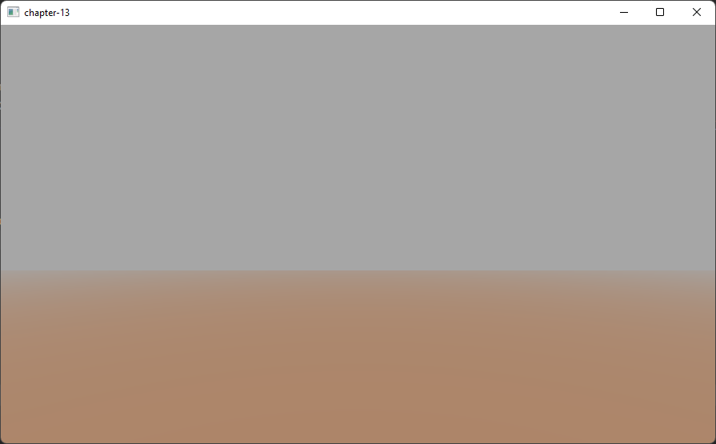

# 第13章 - 雾（Fog）

在本章中，我们将回顾如何在我们的游戏引擎中创建雾效果。通过这种效果，我们将模拟远处物体如何变暗并似乎消失在浓雾中。

您可以在[此处](https://github.com/lwjglgamedev/lwjglbook/tree/main/chapter-13)找到本章的完整源代码。

## 概念（Concepts）

首先，让我们检查定义雾的属性。第一个是雾的颜色。在现实世界中，雾是灰色的，但我们可以使用这种效果来模拟被不同颜色雾侵袭的广阔区域。属性是雾的密度。

因此，为了应用雾效果，我们需要找到一种方法，随着3D场景对象离相机越来越远，将其淡入雾的颜色。靠近相机的对象不会受到雾的影响，但远处的对象将无法区分。所以我们需要能够计算一个因子，该因子可用于混合雾颜色和每个片段颜色，以模拟该效果。该因子需要取决于到相机的距离。

我们将该因子称为$$fogFactor$$，并将其范围设置为0到1。当$$fogFactor$$为1时，表示对象不会受到雾的影响，也就是说，它是一个附近的对象。当$$fogFactor$$取值为0时，表示对象将完全隐藏在雾中。

因此，计算雾颜色所需的方程是：

$$finalColor = (1 - fogFactor) \cdot fogColor + fogFactor \cdot framentColor$$

* $$finalColor$$ 是应用雾效果后产生的颜色。
* $$fogFactor$$ 是控制雾颜色和片段颜色如何混合的参数。它基本上控制着对象的可见性。
* $$fogColor$$ 是雾的颜色。
* $$fragmentColor$$ 是未应用任何雾效果的片段颜色。

现在我们需要找到一种方法来根据距离计算$$fogFactor$$。我们可以选择不同的模型，第一个模型可以是使用线性模型。这是一个模型，给定一个距离，以线性方式改变$$fogFactor$$的值。

线性模型可以通过以下参数定义：

* $$fogStart$$：开始应用雾效果的距离。
* $$fogFinish$$：雾效果达到最大值的距离。
* $$distance$$：到相机的距离。

使用这些参数，要应用的方程是：

$$\displaystyle fogFactor = \frac{(fogFinish - distance)}{(fogFinish - fogStart)}$$

对于距离小于$$fogStart$$的对象，我们只需将$$fogFactor$$设置为$$1$$。下图显示了$$fogFactor$$随距离的变化。


线性模型易于计算，但不够真实，并且没有考虑雾的密度。实际上，雾倾向于以更平滑的方式增长。因此，下一个合适的模型是指数模型。该模型的方程如下：

$$\displaystyle fogFactor = e^{-(distance \cdot fogDensity)^{exponent}} = \frac{1}{e^{(distance \cdot fogDensity)^{exponent}}}$$

引入的新变量是：

* $$fogDensity$$，它模拟雾的厚度或密度。
* $$exponent$$，用于控制雾随距离增加的速度。

下图显示了上述方程在不同指数值（蓝色线为$$2$$，红色线为$$4$$）下的两个图。


在我们的代码中，我们将使用一个将指数值设置为二的公式（您可以轻松修改示例以使用不同的值）。

## 实现（Implementation）

现在理论已经解释清楚，我们可以将其付诸实践。我们将在场景片段**着色器**（Shader）（`scene.frag`）中实现该效果，因为那里有我们需要的所有变量。我们将首先定义一个结构体来模拟雾属性。

```glsl
...
struct Fog
{
    int activeFog;
    vec3 color;
    float density;
};
...
```

`active` 属性将用于激活或停用雾效果。雾将通过另一个名为 `fog` 的**统一变量**（Uniforms）传递给**着色器**（Shader）。

```glsl
...
uniform Fog fog;
...
```

我们将创建一个名为 `calcFog` 的函数，其定义如下。

```glsl
...
vec4 calcFog(vec3 pos, vec4 color, Fog fog, vec3 ambientLight, DirLight dirLight) {
    vec3 fogColor = fog.color * (ambientLight + dirLight.color * dirLight.intensity);
    float distance = length(pos);
    float fogFactor = 1.0 / exp((distance * fog.density) * (distance * fog.density));
    fogFactor = clamp(fogFactor, 0.0, 1.0);

    vec3 resultColor = mix(fogColor, color.xyz, fogFactor);
    return vec4(resultColor.xyz, color.w);
}
...
```

正如您所见，我们首先计算到顶点的距离。顶点坐标在 `pos` 变量中定义，我们只需要计算长度。然后我们使用指数模型计算雾因子，指数为二（相当于乘以两次）。我们将 `fogFactor` 限制在 $$0$$ 到 $$1$$ 的范围内，并使用 `mix` 函数。在 GLSL 中，`mix` 函数用于混合雾颜色和片段颜色（由变量 `color` 定义）。它等效于应用以下方程：

$$resultColor = (1 - fogFactor) \cdot fog.color + fogFactor \cdot color$$

我们还保留了原始颜色的 w 分量，即透明度。我们不希望这个分量受到影响，因为片段应该保持其透明度级别。

在片段**着色器**（Shader）的末尾，应用所有光照效果后，如果雾处于活动状态，我们只需将返回值赋给片段颜色。

```glsl
...
    if (fog.activeFog == 1) {
        fragColor = calcFog(outPosition, fragColor, fog, ambientLight.color, dirLight);
    }
...
```

我们还将创建一个名为 `Fog` 的新类，它是另一个 POJO（Plain Old Java Object），包含雾属性。

```java
package org.lwjglb.engine.scene;

import org.joml.Vector3f;

public class Fog {

    private boolean active;
    private Vector3f color;
    private float density;

    public Fog() {
        active = false;
        color = new Vector3f();
    }

    public Fog(boolean active, Vector3f color, float density) {
        this.color = color;
        this.density = density;
        this.active = active;
    }

    public Vector3f getColor() {
        return color;
    }

    public float getDensity() {
        return density;
    }

    public boolean isActive() {
        return active;
    }

    public void setActive(boolean active) {
        this.active = active;
    }

    public void setColor(Vector3f color) {
        this.color = color;
    }

    public void setDensity(float density) {
        this.density = density;
    }
}
```

我们将在 `Scene` 类中添加一个 `Fog` 实例。

```java
public class Scene {
    ...
    private Fog fog;
    ...
    public Scene(int width, int height) {
        ...
        fog = new Fog();
    }
    ...
    public Fog getFog() {
        return fog;
    }
    ...
    public void setFog(Fog fog) {
        this.fog = fog;
    }
    ...    
}
```

现在我们需要在 `SceneRender` 类中设置所有这些元素。我们首先为 `Fog` 结构体设置**统一变量**（Uniforms）值：

```java
public class SceneRender {
    ...
    private void createUniforms() {
        ...
        uniformsMap.createUniform("fog.activeFog");
        uniformsMap.createUniform("fog.color");
        uniformsMap.createUniform("fog.density");
    }
    ...
}
```

在 `render` 方法中，我们需要先启用混合，然后填充 `Fog` **统一变量**（Uniforms）：

```java
public class SceneRender {
    ...
     public void render(Scene scene) {
        glEnable(GL_BLEND);
        glBlendEquation(GL_FUNC_ADD);
        glBlendFunc(GL_SRC_ALPHA, GL_ONE_MINUS_SRC_ALPHA);
        shaderProgram.bind();
        ...
        Fog fog = scene.getFog();
        uniformsMap.setUniform("fog.activeFog", fog.isActive() ? 1 : 0);
        uniformsMap.setUniform("fog.color", fog.getColor());
        uniformsMap.setUniform("fog.density", fog.getDensity());
        ...
        shaderProgram.unbind();
        glDisable(GL_BLEND);
    }
    ...
}
```

最后，我们将修改 `Main` 类来设置雾，并只使用一个四边形作为地形，并进行缩放以显示雾的效果。

```java
public class Main implements IAppLogic {
    ...
    public static void main(String[] args) {
        ...
        Engine gameEng = new Engine("chapter-13", new Window.WindowOptions(), main);
        ...
    }
    ...
    public void init(Window window, Scene scene, Render render) {
        String terrainModelId = "terrain";
        Model terrainModel = ModelLoader.loadModel(terrainModelId, "resources/models/terrain/terrain.obj",
                scene.getTextureCache());
        scene.addModel(terrainModel);
        Entity terrainEntity = new Entity("terrainEntity", terrainModelId);
        terrainEntity.setScale(100.0f);
        terrainEntity.updateModelMatrix();
        scene.addEntity(terrainEntity);

        SceneLights sceneLights = new SceneLights();
        AmbientLight ambientLight = sceneLights.getAmbientLight();
        ambientLight.setIntensity(0.5f);
        ambientLight.setColor(0.3f, 0.3f, 0.3f);

        DirLight dirLight = sceneLights.getDirLight();
        dirLight.setPosition(0, 1, 0);
        dirLight.setIntensity(1.0f);
        scene.setSceneLights(sceneLights);

        SkyBox skyBox = new SkyBox("resources/models/skybox/skybox.obj", scene.getTextureCache());
        skyBox.getSkyBoxEntity().setScale(50);
        scene.setSkyBox(skyBox);

        scene.setFog(new Fog(true, new Vector3f(0.5f, 0.5f, 0.5f), 0.95f));

        scene.getCamera().moveUp(0.1f);
    }
    ...
    public void update(Window window, Scene scene, long diffTimeMillis) {
        // Nothing to be done here
    }
}
```

需要强调的一点是，我们必须明智地选择雾的颜色。当我们没有**天空盒**（Sky Box）而只有固定颜色背景时，这一点尤为重要。我们应该将雾的颜色设置为与清除颜色相同。如果您取消注释渲染**天空盒**（Sky Box）的代码并重新运行示例，您将得到类似以下内容。

您应该能看到类似这样的画面：



[下一章](./14-normal-mapping.md)