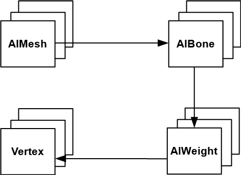
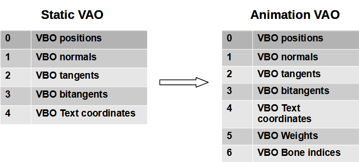
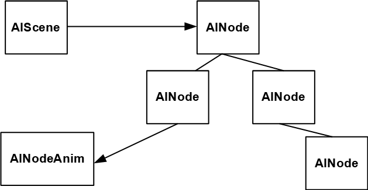

# 第15章 - 动画（Animation）

到目前为止，我们只加载了静态3D模型，但在本章中，我们将学习如何为它们制作动画。在考虑动画时，第一种方法是为每个模型位置创建不同的**网格**（Mesh），将它们加载到GPU中并按顺序绘制它们以创建运动的错觉。虽然这种方法对于某些游戏来说是完美的，但在内存消耗方面效率不高。这就是骨骼动画发挥作用的地方。我们将学习如何使用**Assimp**（Assimp）加载这些模型。

您可以在[此处](https://github.com/lwjglgamedev/lwjglbook/tree/main/chapter-15)找到本章的完整源代码。

## 抗锯齿支持（Anti-aliasing support）

在本章中，我们还将添加对抗锯齿的支持。到目前为止，您可能已经看到模型中锯齿状的边缘。为了消除这些效果，我们将应用抗锯齿，它基本上使用多个样本的值来构建每个像素的最终值。在我们的例子中，我们将使用四个采样值。我们需要在图像创建之前将其设置为窗口提示（并添加一个新的窗口选项来控制它）：

```java
public class Window {
    ...
    public Window(String title, WindowOptions opts, Callable<Void> resizeFunc) {
        ...
        if (opts.antiAliasing) {
            glfwWindowHint(GLFW_SAMPLES, 4);
        }
        glfwWindowHint(GLFW_CONTEXT_VERSION_MAJOR, 3);
        glfwWindowHint(GLFW_CONTEXT_VERSION_MINOR, 2);
        ...
    }
    ...
    public static class WindowOptions {
        public boolean antiAliasing;
        ...
    }
}
```

在`Render`类中，我们需要启用多重采样（除此之外，我们移除面剔除以正确渲染示例模型）：

```java
public class Render {
    ...
    public Render(Window window) {
        GL.createCapabilities();
        glEnable(GL_MULTISAMPLE);
        glEnable(GL_DEPTH_TEST);

        sceneRender = new SceneRender();
        guiRender = new GuiRender(window);
        skyBoxRender = new SkyBoxRender();
    }
    ...
}
```

## 介绍（Introduction）

在骨骼动画中，模型的动画方式由其底层骨骼定义。骨骼由称为骨骼的特殊元素的层次结构定义。这些骨骼由它们的位置和旋转定义。我们还说过它是一个层次结构，这意味着每个骨骼的最终位置受其父骨骼位置的影响。例如，想想手腕：如果角色移动肘部，手腕的位置会改变，如果角色移动肩膀，手腕的位置也会改变。

骨骼不需要代表物理骨骼或关节：它们是允许创意人员建模动画的工件。除了骨骼之外，我们仍然有顶点，即定义构成3D模型的三角形的点。但在骨骼动画中，顶点是根据它们相关的骨骼的位置绘制的。

在本章中，我查阅了许多不同的资料，但我找到了两个提供了关于如何创建动画模型的非常好的解释的资料。这些资料可以在以下网址查阅：

* [http://www.3dgep.com/gpu-skinning-of-md5-models-in-opengl-and-cg/](http://www.3dgep.com/gpu-skinning-of-md5-models-in-opengl-and-cg/)
* [http://ogldev.atspace.co.uk/www/tutorial38/tutorial38.html](http://ogldev.atspace.co.uk/www/tutorial38/tutorial38.html)

如果您使用当前代码加载包含动画的模型，您将获得所谓的绑定姿势。您可以尝试一下（使用前一章的代码），您将能够完美地看到3D模型。绑定姿势定义了模型的位置、法线、**纹理**（Texture）坐标，完全不受动画影响。动画模型本质上定义了以下附加信息：

* 一个树状结构，由骨骼组成，定义了一个可以组合变换的层次结构。
* 每个**网格**（Mesh），除了包含顶点位置、法线等信息外，还将包含关于该顶点与哪些骨骼相关的信息（通过使用骨骼索引）以及它们受影响的程度（即通过使用权重因子来调制效果）。
* 一组动画关键帧，它们定义了应该应用于每个骨骼的特定变换，并因此将修改相关的顶点。一个模型可以定义多个动画，每个动画可能由多个动画关键帧组成。在动画时，我们遍历这些关键帧（它们定义了持续时间），甚至可以在它们之间进行插值。本质上，对于特定的时间瞬间，我们正在对每个顶点应用与相关骨骼相关的变换。

让我们首先回顾一下**Assimp**（Assimp）处理的包含动画信息的结构。我们将首先从骨骼和权重信息开始。对于每个`AIMesh`，我们可以访问顶点位置、**纹理**（Texture）坐标和索引。**网格**（Mesh）还存储骨骼列表。每个骨骼由以下属性定义：

* 一个名称。
* 一个偏移矩阵：稍后将用于计算每个骨骼应使用的最终变换。

骨骼还指向权重列表。每个权重由以下属性定义：

* 一个权重因子，即用于调制与每个顶点相关的骨骼变换影响的数字。
* 一个顶点标识符，即与当前骨骼相关的顶点。

下图显示了所有这些元素之间的关系。



因此，每个顶点，除了包含位置、法线和**纹理**（Texture）坐标外，现在还将有一组影响这些顶点的骨骼索引（通常是四个值）（`jointIndices`）和一组将调制该效果的权重。每个顶点将根据与每个关节相关的变换矩阵进行修改，以计算最终位置。因此，我们需要增加与每个**网格**（Mesh）相关的**顶点数组对象**（Vertex Array Object，简称VAO）以保存该信息，如下图所示。



**Assimp**（Assimp）场景对象定义了一个节点的层次结构。每个节点由一个名称和子节点列表定义。动画使用这些节点来定义应该应用的变换。这个层次结构实际上定义了骨骼的层次结构。每个骨骼都是一个节点，并且有一个父节点（根节点除外），并且可能有一组子节点。有一些特殊的节点不是骨骼，它们用于分组变换，在计算变换时应该处理。另一个问题是，这个节点层次结构是从整个模型定义的，我们没有为每个**网格**（Mesh）单独的层次结构。

场景还定义了一组动画。单个模型可以有多个动画来模拟角色如何行走、奔跑等。这些动画中的每一个都定义了不同的变换。动画具有以下属性：

* 一个名称。
* 一个持续时间。即动画的时间持续时间。名称可能令人困惑，因为动画是应该应用于每个节点在每个不同帧的变换列表。
* 一个动画通道列表。动画通道包含，对于特定的时间瞬间，应该应用于每个节点的平移、旋转和缩放信息。建模动画通道中包含的数据的类是`AINodeAnim`。动画通道可以被视为关键帧。

下图显示了上述所有元素之间的关系。



对于特定的时间瞬间，对于一个帧，应用于骨骼的变换是动画通道中为该瞬间定义的变换，乘以所有父节点直到根节点的变换。因此，我们需要提取场景中存储的信息，过程如下：

* 构建节点层次结构。
* 对于每个动画，遍历每个动画通道（对于每个动画节点），并为所有潜在的动画帧构建每个骨骼的变换矩阵。这些变换矩阵是与骨骼相关的节点的变换矩阵和骨骼变换矩阵的组合。
* 我们从根节点开始，对于每个帧，构建该节点的变换矩阵，它是该节点的变换矩阵乘以该节点在该特定帧的平移、旋转和缩放矩阵的组合。
* 然后我们获取与该节点相关的骨骼，并通过乘以骨骼的偏移矩阵来补充该变换。结果将是与该特定帧相关的骨骼相关的变换矩阵，该矩阵将在**着色器**（Shader）中使用。
* 之后，我们遍历子节点，传递父节点的变换矩阵，以便与子节点变换一起使用。

## 实现（Implementation）

让我们首先分析`ModelLoader`类中的更改：

```java
public class ModelLoader {

    public static final int MAX_BONES = 150;
    private static final Matrix4f IDENTITY_MATRIX = new Matrix4f();
    ...
    public static Model loadModel(String modelId, String modelPath, TextureCache textureCache, boolean animation) {
        return loadModel(modelId, modelPath, textureCache, aiProcess_GenSmoothNormals | aiProcess_JoinIdenticalVertices |
                aiProcess_Triangulate | aiProcess_FixInfacingNormals | aiProcess_CalcTangentSpace | aiProcess_LimitBoneWeights |
                (animation ? 0 : aiProcess_PreTransformVertices));

    }
    ...
}
```

我们需要在`loadModel`方法中添加一个额外的参数（名为`animation`）来指示我们是否正在加载带有动画的模型。如果是，我们不能使用`aiProcess_PreTransformVertices`标志。此标志对加载的数据执行一些变换，以便模型放置在原点，并且坐标被校正以匹配OpenGL坐标系。我们不能将此标志用于动画模型，因为它会删除动画数据信息。

在处理**网格**（Mesh）时，我们还将在处理**网格**（Mesh）时处理与每个顶点相关的骨骼和权重。在处理它们时，我们将存储骨骼列表，以便稍后构建所需的变换：

```java
public class ModelLoader {
    ...
    public static Model loadModel(String modelId, String modelPath, TextureCache textureCache, int flags) {
        ...
        List<Bone> boneList = new ArrayList<>();
        int numMeshes = aiScene.mNumMeshes();
        PointerBuffer aiMeshes = aiScene.mMeshes();
        for (int i = 0; i < numMeshes; i++) {
            AIMesh aiMesh = AIMesh.create(aiMeshes.get(i));
            Mesh mesh = processMesh(aiMesh, boneList);
            ...
        }
        ...
    }
    ...
    private static Mesh processMesh(AIMesh aiMesh, List<Bone> boneList) {
        ...
        AnimMeshData animMeshData = processBones(aiMesh, boneList);
        ...
        return new Mesh(vertices, normals, tangents, bitangents, textCoords, indices, animMeshData.boneIds, animMeshData.weights);
    }
    ...
}
```

新的方法`processBones`定义如下：

```java
public class ModelLoader {
    ...
    private static AnimMeshData processBones(AIMesh aiMesh, List<Bone> boneList) {
        List<Integer> boneIds = new ArrayList<>();
        List<Float> weights = new ArrayList<>();

        Map<Integer, List<VertexWeight>> weightSet = new HashMap<>();
        int numBones = aiMesh.mNumBones();
        PointerBuffer aiBones = aiMesh.mBones();
        for (int i = 0; i < numBones; i++) {
            AIBone aiBone = AIBone.create(aiBones.get(i));
            int id = boneList.size();
            Bone bone = new Bone(id, aiBone.mName().dataString(), toMatrix(aiBone.mOffsetMatrix()));
            boneList.add(bone);
            int numWeights = aiBone.mNumWeights();
            AIVertexWeight.Buffer aiWeights = aiBone.mWeights();
            for (int j = 0; j < numWeights; j++) {
                AIVertexWeight aiWeight = aiWeights.get(j);
                VertexWeight vw = new VertexWeight(bone.boneId(), aiWeight.mVertexId(),
                        aiWeight.mWeight());
                List<VertexWeight> vertexWeightList = weightSet.get(vw.vertexId());
                if (vertexWeightList == null) {
                    vertexWeightList = new ArrayList<>();
                    weightSet.put(vw.vertexId(), vertexWeightList);
                }
                vertexWeightList.add(vw);
            }
        }

        int numVertices = aiMesh.mNumVertices();
        for (int i = 0; i < numVertices; i++) {
            List<VertexWeight> vertexWeightList = weightSet.get(i);
            int size = vertexWeightList != null ? vertexWeightList.size() : 0;
            for (int j = 0; j < Mesh.MAX_WEIGHTS; j++) {
                if (j < size) {
                    VertexWeight vw = vertexWeightList.get(j);
                    weights.add(vw.weight());
                    boneIds.add(vw.boneId());
                } else {
                    weights.add(0.0f);
                    boneIds.add(0);
                }
            }
        }

        return new AnimMeshData(Utils.listFloatToArray(weights), Utils.listIntToArray(boneIds));
    }
    ...
}
```

此方法遍历特定**网格**（Mesh）的骨骼定义，获取它们的权重并填充三个列表：

* `boneList`：它包含骨骼列表及其偏移矩阵。稍后将用于计算最终骨骼变换。已创建名为`Bone`的新类来保存该信息。此列表将包含所有**网格**（Mesh）的骨骼。
* `boneIds`：它仅包含**网格**（Mesh）每个顶点的骨骼标识符。骨骼在渲染时通过其位置进行标识。此列表仅包含特定**网格**（Mesh）的骨骼。
* `weights`：它包含**网格**（Mesh）每个顶点的权重，用于应用于相关的骨骼。

在此方法中检索的信息封装在`AnimMeshData`记录中（在`ModelLoader`类中定义）。新的`Bone`和`VertexWeight`类也是记录。它们的定义如下：

```java
public class ModelLoader {
    ...
    public record AnimMeshData(float[] weights, int[] boneIds) {
    }

    private record Bone(int boneId, String boneName, Matrix4f offsetMatrix) {
    }

    private record VertexWeight(int boneId, int vertexId, float weight) {
    }
}
```

我们还在`Utils`类中创建了两个新方法，用于将`float`和`int`的`List`转换为数组：

```java
public class Utils {
    ...
    public static float[] listFloatToArray(List<Float> list) {
        int size = list != null ? list.size() : 0;
        float[] floatArr = new float[size];
        for (int i = 0; i < size; i++) {
            floatArr[i] = list.get(i);
        }
        return floatArr;
    }

    public static int[] listIntToArray(List<Integer> list) {
        return list.stream().mapToInt((Integer v) -> v).toArray();
    }
    ...
}
```

回到`loadModel`方法，当我们处理完**网格**（Mesh）和材质后，我们将处理动画数据（即与每个动画相关的不同动画关键帧及其变换）。所有这些信息也存储在`Model`类中：

```java
public class ModelLoader {
    ...
    public static Model loadModel(String modelId, String modelPath, TextureCache textureCache, int flags) {
        ...
        List<Model.Animation> animations = new ArrayList<>();
        int numAnimations = aiScene.mNumAnimations();
        if (numAnimations > 0) {
            Node rootNode = buildNodesTree(aiScene.mRootNode(), null);
            Matrix4f globalInverseTransformation = toMatrix(aiScene.mRootNode().mTransformation()).invert();
            animations = processAnimations(aiScene, boneList, rootNode, globalInverseTransformation);
        }

        aiReleaseImport(aiScene);

        return new Model(modelId, materialList, animations);
    }
    ...
}
```

`buildNodesTree`方法非常简单，它只是从根节点开始遍历节点层次结构，构建一个节点树：

```java
public class ModelLoader {
    ...
    private static Node buildNodesTree(AINode aiNode, Node parentNode) {
        String nodeName = aiNode.mName().dataString();
        Node node = new Node(nodeName, parentNode, toMatrix(aiNode.mTransformation()));

        int numChildren = aiNode.mNumChildren();
        PointerBuffer aiChildren = aiNode.mChildren();
        for (int i = 0; i < numChildren; i++) {
            AINode aiChildNode = AINode.create(aiChildren.get(i));
            Node childNode = buildNodesTree(aiChildNode, node);
            node.addChild(childNode);
        }
        return node;
    }
    ...
}
```

`toMatrix`方法只是将**Assimp**（Assimp）矩阵转换为JOML矩阵：

```java
public class ModelLoader {
    ...
    private static Matrix4f toMatrix(AIMatrix4x4 aiMatrix4x4) {
        Matrix4f result = new Matrix4f();
        result.m00(aiMatrix4x4.a1());
        result.m10(aiMatrix4x4.a2());
        result.m20(aiMatrix4x4.a3());
        result.m30(aiMatrix4x4.a4());
        result.m01(aiMatrix4x4.b1());
        result.m11(aiMatrix4x4.b2());
        result.m21(aiMatrix4x4.b3());
        result.m31(aiMatrix4x4.b4());
        result.m02(aiMatrix4x4.c1());
        result.m12(aiMatrix4x4.c2());
        result.m22(aiMatrix4x4.c3());
        result.m32(aiMatrix4x4.c4());
        result.m03(aiMatrix4x4.d1());
        result.m13(aiMatrix4x4.d2());
        result.m23(aiMatrix4x4.d3());
        result.m33(aiMatrix4x4.d4());

        return result;
    }
    ...
}
```

`processAnimations`方法定义如下：

```java
public class ModelLoader {
    ...
    private static List<Model.Animation> processAnimations(AIScene aiScene, List<Bone> boneList,
                                                           Node rootNode, Matrix4f globalInverseTransformation) {
        List<Model.Animation> animations = new ArrayList<>();

        // Process all animations
        int numAnimations = aiScene.mNumAnimations();
        PointerBuffer aiAnimations = aiScene.mAnimations();
        for (int i = 0; i < numAnimations; i++) {
            AIAnimation aiAnimation = AIAnimation.create(aiAnimations.get(i));
            int maxFrames = calcAnimationMaxFrames(aiAnimation);

            List<Model.AnimatedFrame> frames = new ArrayList<>();
            Model.Animation animation = new Model.Animation(aiAnimation.mName().dataString(), aiAnimation.mDuration(), frames);
            animations.add(animation);

            for (int j = 0; j < maxFrames; j++) {
                Matrix4f[] boneMatrices = new Matrix4f[MAX_BONES];
                Arrays.fill(boneMatrices, IDENTITY_MATRIX);
                Model.AnimatedFrame animatedFrame = new Model.AnimatedFrame(boneMatrices);
                buildFrameMatrices(aiAnimation, boneList, animatedFrame, j, rootNode,
                        rootNode.getNodeTransformation(), globalInverseTransformation);
                frames.add(animatedFrame);
            }
        }
        return animations;
    }
    ...
}
```
此方法返回`Model.Animation`实例的`List`。请记住，一个模型可以有多个动画，因此它们按索引存储。对于这些动画中的每一个，我们构建一个动画帧列表（`Model.AnimatedFrame`实例），它们本质上是应用于构成模型的每个骨骼的变换矩阵列表。对于每个动画，我们通过调用`calcAnimationMaxFrames`方法计算最大帧数，该方法定义如下：

```java
public class ModelLoader {
    ...
    private static int calcAnimationMaxFrames(AIAnimation aiAnimation) {
        int maxFrames = 0;
        int numNodeAnims = aiAnimation.mNumChannels();
        PointerBuffer aiChannels = aiAnimation.mChannels();
        for (int i = 0; i < numNodeAnims; i++) {
            AINodeAnim aiNodeAnim = AINodeAnim.create(aiChannels.get(i));
            int numFrames = Math.max(Math.max(aiNodeAnim.mNumPositionKeys(), aiNodeAnim.mNumScalingKeys()),
                    aiNodeAnim.mNumRotationKeys());
            maxFrames = Math.max(maxFrames, numFrames);
        }

        return maxFrames;
    }
    ...
}
```

在继续回顾`ModelLoader`类中的更改之前，让我们回顾一下`Model`类中保存动画信息的更改：

```java
public class Model {
    ...
    private List<Animation> animationList;
    ...
    public Model(String id, List<Material> materialList, List<Animation> animationList) {
        entitiesList = new ArrayList<>();
        this.id = id;
        this.materialList = materialList;
        this.animationList = animationList;
    }
    ...
    public List<Animation> getAnimationList() {
        return animationList;
    }
    ...
    public record AnimatedFrame(Matrix4f[] boneMatrices) {
    }

    public record Animation(String name, double duration, List<AnimatedFrame> frames) {
    }
}
```

如您所见，我们存储与模型相关的动画列表，每个动画由名称、持续时间和动画帧列表定义，动画帧本质上只存储应用于每个骨骼的骨骼变换矩阵。

回到`ModelLoader`类，每个`AINodeAnim`实例定义了一些应用于模型中特定帧的节点的变换。这些变换，对于特定节点，在`AINodeAnim`实例中定义。这些变换以位置平移、旋转和缩放值的形式定义。这里的技巧是，例如，对于特定节点，平移值可以在特定帧停止，但旋转和缩放值可以继续到下一帧。在这种情况下，我们将拥有比旋转或缩放值更少的平移值。因此，计算最大帧数的一个很好的近似方法是使用最大值。问题变得更加复杂，因为这是按节点定义的。一个节点可以只定义前几帧的一些变换，而其余帧不再应用更多修改。在这种情况下，我们应该始终使用最后定义的值。因此，我们获取与节点相关的所有动画的最大值。

回到`processAnimations`方法，有了这些信息，我们就可以遍历不同的帧，并通过调用`buildFrameMatrices`方法构建骨骼的变换矩阵。对于每个帧，我们从根节点开始，并将从节点层次结构的顶部向下递归应用变换。`buildFrameMatrices`定义如下：

```java
public class ModelLoader {
    ...
    private static void buildFrameMatrices(AIAnimation aiAnimation, List<Bone> boneList, Model.AnimatedFrame animatedFrame,
                                           int frame, Node node, Matrix4f parentTransformation, Matrix4f globalInverseTransform) {
        String nodeName = node.getName();
        AINodeAnim aiNodeAnim = findAIAnimNode(aiAnimation, nodeName);
        Matrix4f nodeTransform = node.getNodeTransformation();
        if (aiNodeAnim != null) {
            nodeTransform = buildNodeTransformationMatrix(aiNodeAnim, frame);
        }
        Matrix4f nodeGlobalTransform = new Matrix4f(parentTransformation).mul(nodeTransform);

        List<Bone> affectedBones = boneList.stream().filter(b -> b.boneName().equals(nodeName)).toList();
        for (Bone bone : affectedBones) {
            Matrix4f boneTransform = new Matrix4f(globalInverseTransform).mul(nodeGlobalTransform).
                    mul(bone.offsetMatrix());
            animatedFrame.boneMatrices()[bone.boneId()] = boneTransform;
        }

        for (Node childNode : node.getChildren()) {
            buildFrameMatrices(aiAnimation, boneList, animatedFrame, frame, childNode, nodeGlobalTransform,
                    globalInverseTransform);
        }
    }
    ...
}
```

我们获取与节点相关的变换。然后我们检查此节点是否有关联的动画节点。如果是，我们需要获取适用于我们正在处理的帧的适当平移、旋转和缩放变换。有了这些信息，我们获取与该节点相关的骨骼，并通过乘以以下矩阵来更新每个骨骼在该特定帧的变换矩阵：

* 模型逆全局变换矩阵（根节点变换矩阵的逆）。
* 节点的变换矩阵。
* 骨骼偏移矩阵。

之后，我们遍历子节点，使用节点变换矩阵作为这些子节点的父矩阵。

```java
public class ModelLoader {
    ...
    private static Matrix4f buildNodeTransformationMatrix(AINodeAnim aiNodeAnim, int frame) {
        AIVectorKey.Buffer positionKeys = aiNodeAnim.mPositionKeys();
        AIVectorKey.Buffer scalingKeys = aiNodeAnim.mScalingKeys();
        AIQuatKey.Buffer rotationKeys = aiNodeAnim.mRotationKeys();

        AIVectorKey aiVecKey;
        AIVector3D vec;

        Matrix4f nodeTransform = new Matrix4f();
        int numPositions = aiNodeAnim.mNumPositionKeys();
        if (numPositions > 0) {
            aiVecKey = positionKeys.get(Math.min(numPositions - 1, frame));
            vec = aiVecKey.mValue();
            nodeTransform.translate(vec.x(), vec.y(), vec.z());
        }
        int numRotations = aiNodeAnim.mNumRotationKeys();
        if (numRotations > 0) {
            AIQuatKey quatKey = rotationKeys.get(Math.min(numRotations - 1, frame));
            AIQuaternion aiQuat = quatKey.mValue();
            Quaternionf quat = new Quaternionf(aiQuat.x(), aiQuat.y(), aiQuat.z(), aiQuat.w());
            nodeTransform.rotate(quat);
        }
        int numScalingKeys = aiNodeAnim.mNumScalingKeys();
        if (numScalingKeys > 0) {
            aiVecKey = scalingKeys.get(Math.min(numScalingKeys - 1, frame));
            vec = aiVecKey.mValue();
            nodeTransform.scale(vec.x(), vec.y(), vec.z());
        }

        return nodeTransform;
    }
    ...
}
```

`AINodeAnim`实例定义了一组包含平移、旋转和缩放信息的键。这些键引用特定的时间瞬间。我们假设信息按时间排序，并构建一个矩阵列表，其中包含应用于每个帧的变换。如前所述，其中一些变换可能在特定帧“停止”，我们应该使用最后一帧的最后一个值。

`findAIAnimNode`方法定义如下：

```java
public class ModelLoader {
    ...
    private static AINodeAnim findAIAnimNode(AIAnimation aiAnimation, String nodeName) {
        AINodeAnim result = null;
        int numAnimNodes = aiAnimation.mNumChannels();
        PointerBuffer aiChannels = aiAnimation.mChannels();
        for (int i = 0; i < numAnimNodes; i++) {
            AINodeAnim aiNodeAnim = AINodeAnim.create(aiChannels.get(i));
            if (nodeName.equals(aiNodeAnim.mNodeName().dataString())) {
                result = aiNodeAnim;
                break;
            }
        }
        return result;
    }
    ...
}
```

`Mesh`类需要更新以分配新的**顶点缓冲对象**（Vertex Buffer Objects，VBOs）用于骨骼索引和骨骼权重。您将看到我们最多使用四个权重（以及每个顶点相关的骨骼索引）。

```java
public class Mesh {

    public static final int MAX_WEIGHTS = 4;
    ...
    public Mesh(float[] positions, float[] normals, float[] tangents, float[] bitangents, float[] textCoords, int[] indices) {
        this(positions, normals, tangents, bitangents, textCoords, indices,
                new int[Mesh.MAX_WEIGHTS * positions.length / 3], new float[Mesh.MAX_WEIGHTS * positions.length / 3]);
    }

    public Mesh(float[] positions, float[] normals, float[] tangents, float[] bitangents, float[] textCoords, int[] indices,
                int[] boneIndices, float[] weights) {
        ...
        // Bone weights
        vboId = glGenBuffers();
        vboIdList.add(vboId);
        FloatBuffer weightsBuffer = MemoryUtil.memCallocFloat(weights.length);
        weightsBuffer.put(weights).flip();
        glBindBuffer(GL_ARRAY_BUFFER, vboId);
        glBufferData(GL_ARRAY_BUFFER, weightsBuffer, GL_STATIC_DRAW);
        glEnableVertexAttribArray(5);
        glVertexAttribPointer(5, 4, GL_FLOAT, false, 0, 0);

        // Bone indices
        vboId = glGenBuffers();
        vboIdList.add(vboId);
        IntBuffer boneIndicesBuffer = MemoryUtil.memCallocInt(boneIndices.length);
        boneIndicesBuffer.put(boneIndices).flip();
        glBindBuffer(GL_ARRAY_BUFFER, vboId);
        glBufferData(GL_ARRAY_BUFFER, boneIndicesBuffer, GL_STATIC_DRAW);
        glEnableVertexAttribArray(6);
        glVertexAttribPointer(6, 4, GL_FLOAT, false, 0, 0);
        ...
        MemoryUtil.memFree(weightsBuffer);
        MemoryUtil.memFree(boneIndicesBuffer);
        ...
    }
    ...
}
```

`Node`类只存储与`AINode`相关的数据，并具有管理其子节点的特定方法：

```java
package org.lwjglb.engine.scene;

import org.joml.Matrix4f;

import java.util.*;

public class Node {
    private final List<Node> children;

    private final String name;

    private final Node parent;

    private Matrix4f nodeTransformation;

    public Node(String name, Node parent, Matrix4f nodeTransformation) {
        this.name = name;
        this.parent = parent;
        this.nodeTransformation = nodeTransformation;
        this.children = new ArrayList<>();
    }

    public void addChild(Node node) {
        this.children.add(node);
    }

    public List<Node> getChildren() {
        return children;
    }

    public String getName() {
        return name;
    }

    public Matrix4f getNodeTransformation() {
        return nodeTransformation;
    }

    public Node getParent() {
        return parent;
    }
}
```

现在我们可以看看如何渲染动画模型以及它们如何与静态模型共存。让我们从`SceneRender`类开始。在此类中，我们只需要设置一个新的**统一变量**（Uniforms）来传递骨骼矩阵（分配给当前动画帧），以便它们可以在**着色器**（Shader）中使用。除此之外，静态和动画实体的渲染对此类没有任何额外影响。

```java
public class SceneRender {
    ...
    private void createUniforms() {
        ...
        uniformsMap.createUniform("bonesMatrices");
        ...
    }

    public void render(Scene scene) {
        ...
        for (Model model : models) {
            List<Entity> entities = model.getEntitiesList();

            for (Material material : model.getMaterialList()) {
                ...
                for (Mesh mesh : material.getMeshList()) {
                    glBindVertexArray(mesh.getVaoId());
                    for (Entity entity : entities) {
                        uniformsMap.setUniform("modelMatrix", entity.getModelMatrix());
                        AnimationData animationData = entity.getAnimationData();
                        if (animationData == null) {
                            uniformsMap.setUniform("bonesMatrices", AnimationData.DEFAULT_BONES_MATRICES);
                        } else {
                            uniformsMap.setUniform("bonesMatrices", animationData.getCurrentFrame().boneMatrices());
                        }
                        glDrawElements(GL_TRIANGLES, mesh.getNumVertices(), GL_UNSIGNED_INT, 0);
                    }
                }
            }
        }
    }
    ...
}
```

对于静态模型，我们将传递一个设置为null的矩阵数组。我们还需要修改`UniformsMap`以添加一个新方法来设置矩阵数组的值：

```java
public class UniformsMap {
    ...
    public void setUniform(String uniformName, Matrix4f[] matrices) {
        try (MemoryStack stack = MemoryStack.stackPush()) {
            int length = matrices != null ? matrices.length : 0;
            FloatBuffer fb = stack.mallocFloat(16 * length);
            for (int i = 0; i < length; i++) {
                matrices[i].get(16 * i, fb);
            }
            glUniformMatrix4fv(uniforms.get(uniformName), false, fb);
        }
    }
}
```

我们还创建了一个名为`AnimationData`的新类来控制分配给`Entity`的当前动画：

```java
package org.lwjglb.engine.scene;

import org.joml.Matrix4f;
import org.lwjglb.engine.graph.Model;

import java.util.Arrays;

public class AnimationData {

    public static final Matrix4f[] DEFAULT_BONES_MATRICES = new Matrix4f[ModelLoader.MAX_BONES];

    static {
        Matrix4f zeroMatrix = new Matrix4f().zero();
        Arrays.fill(DEFAULT_BONES_MATRICES, zeroMatrix);
    }

    private Model.Animation currentAnimation;
    private int currentFrameIdx;

    public AnimationData(Model.Animation currentAnimation) {
        currentFrameIdx = 0;
        this.currentAnimation = currentAnimation;
    }

    public Model.Animation getCurrentAnimation() {
        return currentAnimation;
    }

    public Model.AnimatedFrame getCurrentFrame() {
        return currentAnimation.frames().get(currentFrameIdx);
    }

    public int getCurrentFrameIdx() {
        return currentFrameIdx;
    }

    public void nextFrame() {
        int nextFrame = currentFrameIdx + 1;
        if (nextFrame > currentAnimation.frames().size() - 1) {
            currentFrameIdx = 0;
        } else {
            currentFrameIdx = nextFrame;
        }
    }

    public void setCurrentAnimation(Model.Animation currentAnimation) {
        currentFrameIdx = 0;
        this.currentAnimation = currentAnimation;
    }
}
```

当然，我们需要修改`Entity`类以保存对`AnimationData`实例的引用：

```java
public class Entity {
    ...
    private AnimationData animationData;
    ...
    public AnimationData getAnimationData() {
        return animationData;
    }
    ...
    public void setAnimationData(AnimationData animationData) {
        this.animationData = animationData;
    }
    ...
}
```

我们需要修改场景顶点**着色器**（Shader）（`scene.vert`）以使用动画数据。我们首先定义一些常量和新的输入属性，用于骨骼权重和索引（我们每个顶点使用四个元素，因此我们使用`vec4`和`ivec4`）。我们还将与当前动画关联的骨骼矩阵作为**统一变量**（Uniforms）传递。

```glsl
#version 330

const int MAX_WEIGHTS = 4;
const int MAX_BONES = 150;

layout (location=0) in vec3 position;
layout (location=1) in vec3 normal;
layout (location=2) in vec3 tangent;
layout (location=3) in vec3 bitangent;
layout (location=4) in vec2 texCoord;
layout (location=5) in vec4 boneWeights;
layout (location=6) in ivec4 boneIndices;
...
uniform mat4 bonesMatrices[MAX_BONES];
...
```

在`main`函数中，我们将遍历骨骼权重，并使用由关联骨骼索引指定的矩阵修改位置和法线，并由关联权重进行调制。您可以将其视为每个骨骼都会对位置（和法线）修改做出贡献，但通过使用权重进行调制。如果我们使用静态模型，权重将为零，因此我们将保持原始位置和法线值。

```glsl
...
void main()
{
    vec4 initPos = vec4(0, 0, 0, 0);
    vec4 initNormal = vec4(0, 0, 0, 0);
    vec4 initTangent = vec4(0, 0, 0, 0);
    vec4 initBitangent = vec4(0, 0, 0, 0);

    int count = 0;
    for (int i = 0; i < MAX_WEIGHTS; i++) {
        float weight = boneWeights[i];
        if (weight > 0) {
            count++;
            int boneIndex = boneIndices[i];
            vec4 tmpPos = bonesMatrices[boneIndex] * vec4(position, 1.0);
            initPos += weight * tmpPos;

            vec4 tmpNormal = bonesMatrices[boneIndex] * vec4(normal, 0.0);
            initNormal += weight * tmpNormal;

            vec4 tmpTangent = bonesMatrices[boneIndex] * vec4(tangent, 0.0);
            initTangent += weight * tmpTangent;

            vec4 tmpBitangent = bonesMatrices[boneIndex] * vec4(bitangent, 0.0);
            initBitangent += weight * tmpBitangent;
        }
    }
    if (count == 0) {
        initPos = vec4(position, 1.0);
        initNormal = vec4(normal, 0.0);
        initTangent = vec4(tangent, 0.0);
        initBitangent = vec4(bitangent, 0.0);
    }

    mat4 modelViewMatrix = viewMatrix * modelMatrix;
    vec4 mvPosition =  modelViewMatrix * initPos;
    gl_Position   = projectionMatrix * mvPosition;
    outPosition   = mvPosition.xyz;
    outNormal     = normalize(modelViewMatrix * initNormal).xyz;
    outTangent    = normalize(modelViewMatrix * initTangent).xyz;
    outBitangent  = normalize(modelViewMatrix * initBitangent).xyz;
    outTextCoord  = texCoord;
}
```

下图描绘了该过程。


在`Main`类中，我们需要加载动画模型并激活抗锯齿。我们还将每次更新时增加动画帧：

```java
public class Main implements IAppLogic {
    ...
    private AnimationData animationData;
    ...
    public static void main(String[] args) {
        Main main = new Main();
        Window.WindowOptions opts = new Window.WindowOptions();
        opts.antiAliasing = true;
        Engine gameEng = new Engine("chapter-15", opts, main);
        gameEng.start();
    }
    ...
    @Override
    public void init(Window window, Scene scene, Render render) {
        String terrainModelId = "terrain";
        Model terrainModel = ModelLoader.loadModel(terrainModelId, "resources/models/terrain/terrain.obj",
                scene.getTextureCache(), false);
        scene.addModel(terrainModel);
        Entity terrainEntity = new Entity("terrainEntity", terrainModelId);
        terrainEntity.setScale(100.0f);
        terrainEntity.updateModelMatrix();
        scene.addEntity(terrainEntity);

        String bobModelId = "bobModel";
        Model bobModel = ModelLoader.loadModel(bobModelId, "resources/models/bob/boblamp.md5mesh",
                scene.getTextureCache(), true);
        scene.addModel(bobModel);
        Entity bobEntity = new Entity("bobEntity", bobModelId);
        bobEntity.setScale(0.05f);
        bobEntity.updateModelMatrix();
        animationData = new AnimationData(bobModel.getAnimationList().get(0));
        bobEntity.setAnimationData(animationData);
        scene.addEntity(bobEntity);

        SceneLights sceneLights = new SceneLights();
        AmbientLight ambientLight = sceneLights.getAmbientLight();
        ambientLight.setIntensity(0.5f);
        ambientLight.setColor(0.3f, 0.3f, 0.3f);

        DirLight dirLight = sceneLights.getDirLight();
        dirLight.setPosition(0, 1, 0);
        dirLight.setIntensity(1.0f);
        scene.setSceneLights(sceneLights);

        SkyBox skyBox = new SkyBox("resources/models/skybox/skybox.obj", scene.getTextureCache());
        skyBox.getSkyBoxEntity().setScale(100);
        skyBox.getSkyBoxEntity().updateModelMatrix();
        scene.setSkyBox(skyBox);

        scene.setFog(new Fog(true, new Vector3f(0.5f, 0.5f, 0.5f), 0.02f));

        Camera camera = scene.getCamera();
        camera.setPosition(-1.5f, 3.0f, 4.5f);
        camera.addRotation((float) Math.toRadians(15.0f), (float) Math.toRadians(390.f));

        lightAngle = 0;
    }
    ...
    @Override
    public void update(Window window, Scene scene, long diffTimeMillis) {
        animationData.nextFrame();
    }
}
```

最后，我们还需要修改`SkyBox`类，因为`ModelLoader`类中的`loadModel`方法发生了变化：

```java
public class SkyBox {
    ...
    public SkyBox(String skyBoxModelPath, TextureCache textureCache) {
        skyBoxModel = ModelLoader.loadModel("skybox-model", skyBoxModelPath, textureCache, false);
        ...
    }
}
```

您将能够看到类似这样的内容：


[下一章](./16-audio.md)