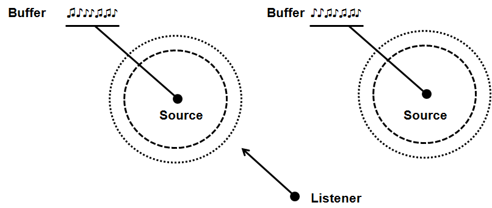

# 第16章 - 音频（Audio）

到目前为止，我们一直在处理图形，但游戏的另一个关键方面是音频。在本章中，我们将添加声音支持。

您可以在[此处](https://github.com/lwjglgamedev/lwjglbook/tree/main/chapter-16)找到本章的完整源代码。

## OpenAL

本章将借助 [**OpenAL**](https://www.openal.org "OpenAL")（Open Audio Library）来解决音频功能。OpenAL 是 OpenGL 在音频方面的对应物，它允许我们通过抽象层播放声音。该层将我们与底层音频子系统的复杂性隔离开来。除此之外，它还允许我们在 3D 场景中“渲染”声音，声音可以设置在特定位置，随距离衰减，并根据其速度进行修改（模拟[多普勒效应](https://en.wikipedia.org/wiki/Doppler_effect)）。

在开始编码之前，我们需要介绍处理 OpenAL 时涉及的主要元素，它们是：

* 缓冲区。
* 声源。
* 监听器。

缓冲区存储音频数据，例如音乐或音效。它们类似于 OpenGL 领域的纹理。OpenAL 要求音频数据采用 PCM（脉冲编码调制）格式（单声道或立体声），因此我们不能直接转储 MP3 或 OGG 文件，而需要先将其转换为 PCM。

下一个元素是声源，它代表 3D 空间中的一个位置（一个点），用于发出声音。声源与一个缓冲区相关联（一次只能关联一个），并且可以通过以下属性来定义：

* 位置，声源的位置（$x$、$y$ 和 $z$ 坐标）。顺便说一下，OpenAL 使用与 OpenGL 相同的右手笛卡尔坐标系，因此您可以假设（为了简化起见）您的世界坐标等同于声音空间坐标空间中的坐标。
* 速度，指定声源移动的速度。这用于模拟多普勒效应。
* 增益，用于修改声音的强度（就像一个放大因子）。

声源还有其他属性，稍后在描述源代码时会展示。

最后，但同样重要的是，监听器是声音应该被听到的地方。监听器代表 3D 音频场景中设置麦克风以接收声音的位置。只有一个监听器。因此，通常说音频渲染是从监听器的角度进行的。监听器共享一些属性，但它有一些额外的属性，例如方向。方向代表监听器面向的方向。

因此，一个音频 3D 场景由一组发出声音的声源和一个接收声音的监听器组成。最终感知到的声音将取决于监听器与不同声源的距离、它们的相对速度以及选择的传播模型。声源可以共享缓冲区并播放相同的数据。下图描绘了一个包含不同元素类型的示例 3D 场景。



## 实现

为了使用 OpenAL，首先需要在项目的 pom.xml 中添加 maven 依赖项。我们需要添加编译时和运行时依赖项。

```xml
...
<dependency>
   <groupId>org.lwjgl</groupId>
   <artifactId>lwjgl-openal</artifactId>
   <version>${lwjgl.version}</version>
</dependency>
...
<dependency>
   <groupId>org.lwjgl</groupId>
   <artifactId>lwjgl-openal</artifactId>
   <version>${lwjgl.version}</version>
   <classifier>${native.target}</classifier>
   <scope>runtime</scope>
</dependency>
...
```

那么，让我们开始编码吧。我们将在 ```org.lwjglb.engine.sound``` 下创建一个新包，该包将包含所有负责处理音频的类。我们将首先从一个名为 ```SoundBuffer``` 的类开始，该类将代表一个 OpenAL 缓冲区。下面显示了该类定义的一部分。

```java
package org.lwjglb.engine.sound;

import org.lwjgl.stb.STBVorbisInfo;
import org.lwjgl.system.*;

import java.nio.*;

import static org.lwjgl.openal.AL10.*;
import static org.lwjgl.stb.STBVorbis.*;
import static org.lwjgl.system.MemoryUtil.NULL;

public class SoundBuffer {
    private final int bufferId;

    private ShortBuffer pcm;

    public SoundBuffer(String filePath) {
        this.bufferId = alGenBuffers();
        try (STBVorbisInfo info = STBVorbisInfo.malloc()) {
            pcm = readVorbis(filePath, info);

            // Copy to buffer
            alBufferData(bufferId, info.channels() == 1 ? AL_FORMAT_MONO16 : AL_FORMAT_STEREO16, pcm, info.sample_rate());
        }
    }

    public void cleanup() {
        alDeleteBuffers(this.bufferId);
        if (pcm != null) {
            MemoryUtil.memFree(pcm);
        }
    }

    public int getBufferId() {
        return this.bufferId;
    }

    private ShortBuffer readVorbis(String filePath, STBVorbisInfo info) {
        try (MemoryStack stack = MemoryStack.stackPush()) {
            IntBuffer error = stack.mallocInt(1);
            long decoder = stb_vorbis_open_filename(filePath, error, null);
            if (decoder == NULL) {
                throw new RuntimeException("Failed to open Ogg Vorbis file. Error: " + error.get(0));
            }

            stb_vorbis_get_info(decoder, info);

            int channels = info.channels();

            int lengthSamples = stb_vorbis_stream_length_in_samples(decoder);

            ShortBuffer result = MemoryUtil.memAllocShort(lengthSamples * channels);

            result.limit(stb_vorbis_get_samples_short_interleaved(decoder, channels, result) * channels);
            stb_vorbis_close(decoder);

            return result;
        }
    }
}
```

该类的构造函数需要一个声音文件路径，并从中创建一个新缓冲区。我们做的第一件事是调用 ```alGenBuffers``` 创建一个 OpenAL 缓冲区。最后，我们的声音缓冲区将由一个整数标识，该整数类似于指向其所持数据的指针。创建缓冲区后，我们将音频数据转储到其中。构造函数需要 OGG 格式的文件，因此我们需要将其转换为 PCM 格式。这在 `readVorbis` 方法中完成。

LWJGL 的早期版本有一个名为 ```WaveData``` 的辅助类，用于加载 WAV 格式的音频文件。此类别在 LWJGL 3 中不再存在。但是，您可以从该类获取源代码并在您的游戏中使用它（可能无需任何更改）。

```SoundBuffer``` 类还提供了一个 `cleanup` 方法，用于在我们使用完资源后释放它们。

让我们继续建模一个 OpenAL，它将由一个名为 ```SoundSource``` 的类实现。该类定义如下。

```java
package org.lwjglb.engine.sound;

import org.joml.Vector3f;

import static org.lwjgl.openal.AL10.*;

public class SoundSource {

    private final int sourceId;

    public SoundSource(boolean loop, boolean relative) {
        this.sourceId = alGenSources();
        alSourcei(sourceId, AL_LOOPING, loop ? AL_TRUE : AL_FALSE);
        alSourcei(sourceId, AL_SOURCE_RELATIVE, relative ? AL_TRUE : AL_FALSE);
    }

    public void cleanup() {
        stop();
        alDeleteSources(sourceId);
    }

    public boolean isPlaying() {
        return alGetSourcei(sourceId, AL_SOURCE_STATE) == AL_PLAYING;
    }

    public void pause() {
        alSourcePause(sourceId);
    }

    public void play() {
        alSourcePlay(sourceId);
    }

    public void setBuffer(int bufferId) {
        stop();
        alSourcei(sourceId, AL_BUFFER, bufferId);
    }

    public void setGain(float gain) {
        alSourcef(sourceId, AL_GAIN, gain);
    }

    public void setPosition(Vector3f position) {
        alSource3f(sourceId, AL_POSITION, position.x, position.y, position.z);
    }

    public void stop() {
        alSourceStop(sourceId);
    }
}
```

声源类提供了一些方法来设置其位置、增益以及控制播放、停止和暂停的方法。请记住，声音控制操作是在声源上进行的（而不是在缓冲区上），请记住多个声源可以共享同一个缓冲区。与 ```SoundBuffer``` 类一样，```SoundSource``` 由一个标识符标识，该标识符在每个操作中使用。该类还提供了一个 ```cleanup``` 方法来释放保留的资源。但让我们检查一下构造函数。我们做的第一件事是调用 ```alGenSources``` 创建声源。然后，我们使用构造函数参数设置一些有趣的属性。

第一个参数 ```loop``` 指示要播放的声音是否应处于循环模式。默认情况下，当在声源上调用播放操作时，当音频数据被消耗完时，播放停止。这对于某些声音来说很好，但对于其他一些声音，例如背景音乐，需要一遍又一遍地播放。我们无需手动控制音频何时停止并重新启动播放过程，只需简单地将循环属性设置为 true：“```alSourcei(sourceId, AL_LOOPING, AL_TRUE);```”。

另一个参数 ```relative``` 控制声源的位置是否相对于监听器。在这种情况下，当我们为声源设置位置时，我们基本上是定义到监听器的距离（用向量表示），而不是 OpenAL 3D 场景中的位置，也不是世界位置。这通过调用“```alSourcei(sourceId, AL_SOURCE_RELATIVE, AL_TRUE);”``` 来激活。但是，我们可以用它做什么呢？这个属性很有趣，例如，对于不应受监听器距离影响（衰减）的背景声音。例如，考虑背景音乐或与玩家控制相关的音效。如果我们将这些声源设置为相对，并将它们的位置设置为 $(0, 0, 0)$，它们将不会衰减。

现在轮到监听器了，令人惊讶的是，它由一个名为 ```SoundListener``` 的类建模。这是该类的定义。

```java
package org.lwjglb.engine.sound;

import org.joml.Vector3f;

import static org.lwjgl.openal.AL10.*;

public class SoundListener {

    public SoundListener(Vector3f position) {
        alListener3f(AL_POSITION, position.x, position.y, position.z);
        alListener3f(AL_VELOCITY, 0, 0, 0);
    }

    public void setOrientation(Vector3f at, Vector3f up) {
        float[] data = new float[6];
        data[0] = at.x;
        data[1] = at.y;
        data[2] = at.z;
        data[3] = up.x;
        data[4] = up.y;
        data[5] = up.z;
        alListenerfv(AL_ORIENTATION, data);
    }

    public void setPosition(Vector3f position) {
        alListener3f(AL_POSITION, position.x, position.y, position.z);
    }

    public void setSpeed(Vector3f speed) {
        alListener3f(AL_VELOCITY, speed.x, speed.y, speed.z);
    }
}
```

您会注意到与之前类的区别在于无需创建监听器。始终会有一个监听器，因此无需创建，它已经存在。因此，在构造函数中，我们只需简单地设置其初始位置。出于同样的原因，无需 ```cleanup``` 方法。该类也有设置监听器位置和速度的方法，与 ```SoundSource``` 类一样，但我们有一个额外的方法用于更改监听器方向。让我们回顾一下方向是什么。监听器方向由两个向量定义，“at”向量和“up”向量，如下图所示。


“at”向量基本上指向监听器面向的方向，默认情况下其坐标为 $(0, 0, -1)$。“up”向量确定监听器向上的方向，默认情况下它指向 $(0, 1, 0)$。因此，这两个向量的每个分量就是 ```alListenerfv``` 方法调用中设置的内容。此方法用于将一组浮点数（可变数量的浮点数）传输到属性，在本例中是方向。

在继续之前，有必要强调一些与声源和监听器速度相关的概念。声源和监听器之间的相对速度将导致 OpenAL 模拟多普勒效应。如果您不知道，多普勒效应是导致靠近您的移动物体似乎以比远离时更高的频率发声的原因。问题是，仅仅通过设置声源或监听器速度，OpenAL 不会为您更新它们的位置。它将使用相对速度计算多普勒效应，但位置不会被修改。因此，如果您想模拟移动的声源或监听器，您必须负责在游戏循环中更新它们的位置。

现在我们已经建模了关键元素，我们可以设置它们来工作；我们需要初始化 OpenAL 库，因此我们将创建一个名为 ```SoundManager``` 的新类来处理此问题，其开头如下：

```java
package org.lwjglb.engine.sound;

import org.joml.*;
import org.lwjgl.openal.*;
import org.lwjglb.engine.scene.Camera;

import java.nio.*;
import java.util.*;

import static org.lwjgl.openal.AL10.alDistanceModel;
import static org.lwjgl.openal.ALC10.*;
import static org.lwjgl.system.MemoryUtil.NULL;

public class SoundManager {

    private final List<SoundBuffer> soundBufferList;
    private final Map<String, SoundSource> soundSourceMap;
    private long context;
    private long device;
    private SoundListener listener;

    public SoundManager() {
        soundBufferList = new ArrayList<>();
        soundSourceMap = new HashMap<>();

        device = alcOpenDevice((ByteBuffer) null);
        if (device == NULL) {
            throw new IllegalStateException("Failed to open the default OpenAL device.");
        }
        ALCCapabilities deviceCaps = ALC.createCapabilities(device);
        this.context = alcCreateContext(device, (IntBuffer) null);
        if (context == NULL) {
            throw new IllegalStateException("Failed to create OpenAL context.");
        }
        alcMakeContextCurrent(context);
        AL.createCapabilities(deviceCaps);
    }
    ...
}
```

此类持有对 ```SoundBuffer``` 和 ```SoundSource``` 实例的引用，以便跟踪并在以后正确清理它们。SoundBuffers 存储在列表中，但 SoundSources 存储在 ```Map``` 中，以便可以通过名称检索它们。构造函数初始化 OpenAL 子系统：

* 打开默认设备。
* 为该设备创建功能。
* 创建一个声音上下文，类似于 OpenGL 上下文，并将其设置为当前上下文。

`SoundManager` 类定义了添加声源和缓冲区的方法，以及一个 `cleanup` 方法来释放所有资源：

```java
public class SoundManager {
    ...
    public void addSoundBuffer(SoundBuffer soundBuffer) {
        this.soundBufferList.add(soundBuffer);
    }

    public void addSoundSource(String name, SoundSource soundSource) {
        this.soundSourceMap.put(name, soundSource);
    }

    public void cleanup() {
        soundSourceMap.values().forEach(SoundSource::cleanup);
        soundSourceMap.clear();
        soundBufferList.forEach(SoundBuffer::cleanup);
        soundBufferList.clear();
        if (context != NULL) {
            alcDestroyContext(context);
        }
        if (device != NULL) {
            alcCloseDevice(device);
        }
    }
    ...
}
```

它还提供了管理监听器和声源的方法，以及 `playSoundSource` 方法，用于通过名称激活声音：

```java
public class SoundManager {
    ...
    public SoundListener getListener() {
        return this.listener;
    }

    public SoundSource getSoundSource(String name) {
        return this.soundSourceMap.get(name);
    }

    public void playSoundSource(String name) {
        SoundSource soundSource = this.soundSourceMap.get(name);
        if (soundSource != null && !soundSource.isPlaying()) {
            soundSource.play();
        }
    }

    public void removeSoundSource(String name) {
        this.soundSourceMap.remove(name);
    }

    public void setAttenuationModel(int model) {
        alDistanceModel(model);
    }

    public void setListener(SoundListener listener) {
        this.listener = listener;
    }
    ...
}
```
```SoundManager``` 类还有一个方法，用于根据相机位置更新监听器方向。在我们的例子中，监听器将放置在相机所在的位置。那么，给定相机位置和旋转信息，我们如何计算“at”和“up”向量呢？答案是使用与相机关联的视图矩阵。我们需要考虑相机旋转来变换“at” $(0, 0, -1)$ 和“up” $(0, 1, 0)$ 向量。设 ```cameraMatrix``` 是与相机关联的视图矩阵。实现此目的的代码是：

```java
public class SoundManager {
    ...
    public void updateListenerPosition(Camera camera) {
        Matrix4f viewMatrix = camera.getViewMatrix();
        listener.setPosition(camera.getPosition());
        Vector3f at = new Vector3f();
        viewMatrix.positiveZ(at).negate();
        Vector3f up = new Vector3f();
        viewMatrix.positiveY(up);
        listener.setOrientation(at, up);
    }
    ...
}
```

上面的代码等同于之前描述的解释，它只是一种更有效的方法。它使用 [JOML](https://github.com/JOML-CI/JOML) 库中提供的一种更快的方法，该方法不需要计算完整的逆矩阵，但能达到相同的结果。此方法由 [JOML 作者](https://github.com/httpdigest)在 LWJGL 论坛中提供，您可以在[此处](http://forum.lwjgl.org/index.php?topic=6080.0)查看更多详细信息。如果您查看源代码，您会发现 ```SoundManager``` 类计算了自己的视图矩阵副本。

就这样。我们拥有播放声音所需的所有基础设施。我们只需要在 `Main` 类中使用它，我们在其中设置背景声音和特定声音，该声音在特定动画帧激活，其强度相对于监听器位置：

```java
public class Main implements IAppLogic {
    ...
    private SoundSource playerSoundSource;
    private SoundManager soundMgr;

    public static void main(String[] args) {
        ...
        Engine gameEng = new Engine("chapter-16", opts, main);
        ...
    }

    @Override
    public void cleanup() {
        soundMgr.cleanup();
    }
    
    @Override
    public void init(Window window, Scene scene, Render render) {
        ...
        lightAngle = 45;
        initSounds(bobEntity.getPosition(), camera);
    }

    private void initSounds(Vector3f position, Camera camera) {
        soundMgr = new SoundManager();
        soundMgr.setAttenuationModel(AL11.AL_EXPONENT_DISTANCE);
        soundMgr.setListener(new SoundListener(camera.getPosition()));

        SoundBuffer buffer = new SoundBuffer("resources/sounds/creak1.ogg");
        soundMgr.addSoundBuffer(buffer);
        playerSoundSource = new SoundSource(false, false);
        playerSoundSource.setPosition(position);
        playerSoundSource.setBuffer(buffer.getBufferId());
        soundMgr.addSoundSource("CREAK", playerSoundSource);

        buffer = new SoundBuffer("resources/sounds/woo_scary.ogg");
        soundMgr.addSoundBuffer(buffer);
        SoundSource source = new SoundSource(true, true);
        source.setBuffer(buffer.getBufferId());
        soundMgr.addSoundSource("MUSIC", source);
        source.play();
    }

    @Override
    public void input(Window window, Scene scene, long diffTimeMillis, boolean inputConsumed) {
        ...
        soundMgr.updateListenerPosition(camera);
    }

    @Override
    public void update(Window window, Scene scene, long diffTimeMillis) {
        animationData.nextFrame();
        if (animationData.getCurrentFrameIdx() == 45) {
            playerSoundSource.play();
        }
    }
}
```

最后一点。OpenAL 还允许您通过使用 alDistanceModel 并传递所需的模型（```AL11.AL_EXPONENT_DISTANCE```、```AL_EXPONENT_DISTANCE_CLAMP``` 等）来更改衰减模型。您可以尝试它们并检查结果。

[下一章](./17-shadows.md)