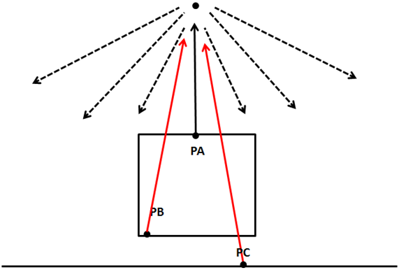
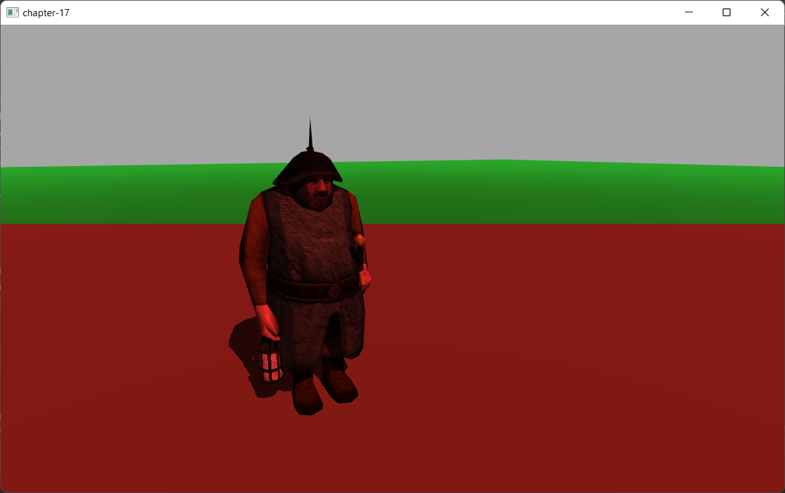

# 第17章 - 阴影（Shadows）

目前，我们能够表示光线如何影响3D场景中的物体。接收到更多光线的物体比未接收到光线的物体显示得更亮。然而，我们仍然无法投射阴影。阴影将增加3D场景的真实感。这就是我们将在本章中做的事情。

您可以在[此处](https://github.com/lwjglgamedev/lwjglbook/tree/main/chapter-17)找到本章的完整源代码。

## 阴影映射（Shadow Mapping）

我们将使用一种名为**阴影映射**（Shadow mapping）的技术，该技术在游戏中广泛使用，并且不会严重影响引擎性能。**阴影映射**（Shadow mapping）可能看起来很简单易懂，但实现起来却有些困难。或者，更准确地说，以一种通用的方式实现它，涵盖所有潜在情况并产生一致的结果，是非常困难的。

所以让我们开始思考如何检查特定区域（实际上是一个片段）是否处于阴影中。在绘制该区域时，如果我们能够向光源投射光线并到达光源而没有任何碰撞，那么该像素就在光线中。如果不能，该像素就在阴影中。

下图显示了点光源的情况：点PA可以到达光源，但点PB和PC不能，因此它们处于阴影中。



我们如何有效地检查是否可以投射该光线而没有碰撞？光源理论上可以投射无限的光线，那么我们如何检查光线是否被阻挡？
我们可以做的是，不是投射光线，而是从光的角度看3D场景，并从该位置渲染场景。我们可以将相机设置在光的位置并渲染场景，这样我们就可以存储每个片段的深度。这相当于计算每个片段到光源的距离。最后，我们所做的是将从光源看到的最小距离存储为**阴影贴图**（shadow map）。

下图显示了一个漂浮在平面上方的立方体和垂直的光线。


从光的角度看场景会是这样的（颜色越深，离光源越近）。


有了这些信息，我们可以像往常一样渲染3D场景，并使用存储在**阴影贴图**（shadow map）中的最小距离检查每个片段到光源的距离。如果距离小于**阴影贴图**（shadow map）中存储的值，则物体在光线中，否则在阴影中。我们可以有几个物体可能被同一条光线击中，但我们存储的是最小距离。

因此，**阴影映射**（Shadow mapping）是一个两步过程：

* 首先，我们从光空间渲染场景到**阴影贴图**（shadow map）中，以获取最小距离。
* 其次，我们从相机视角渲染场景，并使用该深度图来计算物体是否处于阴影中。

为了渲染深度图，我们需要谈谈深度缓冲区。当我们渲染场景时，所有深度信息都存储在一个名为深度缓冲区（或z缓冲区）的缓冲区中。该深度信息是渲染的每个片段的$$z$$值。如果您回想起第一章，我们在渲染场景时所做的是从世界坐标转换为屏幕坐标。我们正在绘制到一个坐标空间，其$$x$$和$$y$$轴的范围从$$0$$到$$1$$。如果一个物体比另一个物体更远，我们必须计算这如何通过**透视投影矩阵**（Perspective Projection Matrix）影响它们的$$x$$和$$y$$坐标。这不是根据$$z$$值自动计算的，而是必须由我们完成。实际上存储在z坐标中的是该片段的深度，仅此而已。

## 级联阴影贴图（Cascaded Shadow Maps）

上面提出的解决方案，就其本身而言，对于开放空间不会产生高质量的结果。原因是阴影分辨率受纹理大小的限制。我们现在覆盖的是一个潜在的巨大区域，而我们用来存储深度信息的纹理没有足够的分辨率来获得好的结果。您可能会认为解决方案只是增加纹理分辨率，但这不足以完全解决问题。您需要巨大的纹理才能做到这一点。因此，一旦解释了基础知识，我们将解释一种称为**级联阴影贴图**（Cascaded Shadow Maps，简称CSM）的技术，它是对普通**阴影贴图**（shadow map）的改进。

关键概念是，靠近相机的物体的阴影需要比远处物体的阴影具有更高的质量。一种方法可能只是为靠近相机的物体渲染阴影，但这会导致阴影在我们穿过场景时出现/消失。

**级联阴影贴图**（CSMs）使用的方法是将视锥体分成几个分割。靠近相机的分割覆盖的空间较小，而远处区域覆盖的空间要宽得多。下图显示了一个分成三个分割的视锥体。


对于这些分割中的每一个，都会渲染深度图，调整光的视图和投影矩阵以适应每个分割。因此，存储深度图的纹理覆盖了视锥体的缩小区域。而且，由于最靠近相机的分割覆盖的空间较少，深度分辨率会增加。

从上面的解释可以推断出，我们将需要与分割数量一样多的深度纹理，并且我们还将更改每个分割的光视图和投影矩阵。因此，应用CSMs的步骤是：

* 将视锥体分成n个分割。

* 在渲染深度图时，对于每个分割：

  * 计算光视图和投影矩阵。

  * 从光的角度渲染场景到单独的深度图中。

* 在渲染场景时：

  * 使用上面计算的深度图。

  * 确定要绘制的片段所属的分割。

  * 像在**阴影贴图**（shadow map）中一样计算阴影因子。

正如您所见，CSMs的主要缺点是我们需要从光的角度为每个分割渲染场景。这就是为什么它通常只用于开放空间（当然，您可以对阴影计算应用缓存以减少开销）。

## 实现（Implementation）

我们将创建的第一个类将负责计算从光角度渲染**阴影贴图**（shadow map）所需的矩阵。该类名为`CascadeShadow`，并将存储特定级联阴影分割的投影视图矩阵（从光角度）（`projViewMatrix`属性）及其正交投影矩阵的远平面距离（`splitDistance`属性）：

```java
public class CascadeShadow {

    public static final int SHADOW_MAP_CASCADE_COUNT = 3;
    
    private Matrix4f projViewMatrix;
    private float splitDistance;

    public CascadeShadow() {
        projViewMatrix = new Matrix4f();
    }
    ...
    public Matrix4f getProjViewMatrix() {
        return projViewMatrix;
    }

    public float getSplitDistance() {
        return splitDistance;
    }
    ...
}
```

`CascadeShadow`类定义了一个静态方法，用于使用适当的值初始化级联阴影实例列表，名为`updateCascadeShadows`。该方法如下所示：

```java
public class CascadeShadow {
    ...
    public static void updateCascadeShadows(List<CascadeShadow> cascadeShadows, Scene scene) {
        Matrix4f viewMatrix = scene.getCamera().getViewMatrix();
        Matrix4f projMatrix = scene.getProjection().getProjMatrix();
        Vector4f lightPos = new Vector4f(scene.getSceneLights().getDirLight().getDirection(), 0);

        float cascadeSplitLambda = 0.95f;

        float[] cascadeSplits = new float[SHADOW_MAP_CASCADE_COUNT];

        float nearClip = projMatrix.perspectiveNear();
        float farClip = projMatrix.perspectiveFar();
        float clipRange = farClip - nearClip;

        float minZ = nearClip;
        float maxZ = nearClip + clipRange;

        float range = maxZ - minZ;
        float ratio = maxZ / minZ;
        ...
    }
    ...
}
```

我们首先检索计算分割数据所需的矩阵，即视图和投影矩阵、光位置以及我们用于渲染场景的透视投影的近裁剪面和远裁剪面。有了这些信息，我们可以计算每个阴影级联的分割距离：

```java
public class CascadeShadow {
    ...
    public static void updateCascadeShadows(List<CascadeShadow> cascadeShadows, Scene scene) {
        ...
        // Calculate split depths based on view camera frustum
        // Based on method presented in https://developer.nvidia.com/gpugems/GPUGems3/gpugems3_ch10.html
        for (int i = 0; i < SHADOW_MAP_CASCADE_COUNT; i++) {
            float p = (i + 1) / (float) (SHADOW_MAP_CASCADE_COUNT);
            float log = (float) (minZ * java.lang.Math.pow(ratio, p));
            float uniform = minZ + range * p;
            float d = cascadeSplitLambda * (log - uniform) + uniform;
            cascadeSplits[i] = (d - nearClip) / clipRange;
        }
        ...
    }
    ...
}
```

用于计算分割位置的算法使用对数方案来更好地分布距离。我们可以使用其他不同的方法，例如均匀分割级联，或根据预设比例分割。对数方案的优点是它为近视图分割使用更少的空间，从而为靠近相机的元素实现更高的分辨率。您可以查看[NVIDIA文章](https://developer.nvidia.com/gpugems/GPUGems3/gpugems3_ch10.html)了解数学细节。`cascadeSplits`数组将包含一系列在[0, 1]范围内的值，我们稍后将使用这些值来执行所需的计算，以获取每个级联的分割距离和投影矩阵。

现在我们定义一个循环来计算级联分割的所有数据。在该循环中，我们首先在NDC（**归一化设备坐标**，Normalized Device Coordinates）空间中创建视锥体角点。之后，我们使用视图和透视矩阵的逆矩阵将这些坐标投影到世界空间。由于我们使用的是**方向光**（Directional light），我们将使用正交投影矩阵来渲染**阴影贴图**（shadow map），这就是为什么我们将NDC坐标设置为包含可见体积的立方体的限制（远处的物体不会像在透视投影中那样渲染得更小）。

```java
public class CascadeShadow {
    ...
    public static void updateCascadeShadows(List<CascadeShadow> cascadeShadows, Scene scene) {
        ...
        // Calculate orthographic projection matrix for each cascade
        float lastSplitDist = 0.0f;
        for (int i = 0; i < SHADOW_MAP_CASCADE_COUNT; i++) {
            float splitDist = cascadeSplits[i];

            Vector3f[] frustumCorners = new Vector3f[]{
                    new Vector3f(-1.0f, 1.0f, -1.0f),
                    new Vector3f(1.0f, 1.0f, -1.0f),
                    new Vector3f(1.0f, -1.0f, -1.0f),
                    new Vector3f(-1.0f, -1.0f, -1.0f),
                    new Vector3f(-1.0f, 1.0f, 1.0f),
                    new Vector3f(1.0f, 1.0f, 1.0f),
                    new Vector3f(1.0f, -1.0f, 1.0f),
                    new Vector3f(-1.0f, -1.0f, 1.0f),
            };

            // Project frustum corners into world space
            Matrix4f invCam = (new Matrix4f(projMatrix).mul(viewMatrix)).invert();
            for (int j = 0; j < 8; j++) {
                Vector4f invCorner = new Vector4f(frustumCorners[j], 1.0f).mul(invCam);
                frustumCorners[j] = new Vector3f(invCorner.x / invCorner.w, invCorner.y / invCorner.w, invCorner.z / invCorner.w);
            }
            ...
        }
        ...
    }
    ...
}
```

此时，`frustumCorners`变量包含包含可见空间的立方体的坐标，但我们需要此特定级联分割的世界坐标。因此，下一步是将方法开头计算的级联距离投入使用。我们根据预先计算的距离调整此特定分割的近平面和远平面的坐标：

```java
public class CascadeShadow {
    ...
    public static void updateCascadeShadows(List<CascadeShadow> cascadeShadows, Scene scene) {
        ...
        for (int i = 0; i < SHADOW_MAP_CASCADE_COUNT; i++) {
            ...
            for (int j = 0; j < 4; j++) {
                Vector3f dist = new Vector3f(frustumCorners[j + 4]).sub(frustumCorners[j]);
                frustumCorners[j + 4] = new Vector3f(frustumCorners[j]).add(new Vector3f(dist).mul(splitDist));
                frustumCorners[j] = new Vector3f(frustumCorners[j]).add(new Vector3f(dist).mul(lastSplitDist));
            }
            ...
        }
        ...
    }
    ...
}
```

之后，我们计算该分割中心的坐标（仍在世界坐标中），以及该分割的半径：

```java
public class CascadeShadow {
    ...
    public static void updateCascadeShadows(List<CascadeShadow> cascadeShadows, Scene scene) {
        ...
        for (int i = 0; i < SHADOW_MAP_CASCADE_COUNT; i++) {
            ...
            // Get frustum center
            Vector3f frustumCenter = new Vector3f(0.0f);
            for (int j = 0; j < 8; j++) {
                frustumCenter.add(frustumCorners[j]);
            }
            frustumCenter.div(8.0f);

            float radius = 0.0f;
            for (int j = 0; j < 8; j++) {
                float distance = (new Vector3f(frustumCorners[j]).sub(frustumCenter)).length();
                radius = java.lang.Math.max(radius, distance);
            }
            radius = (float) java.lang.Math.ceil(radius * 16.0f) / 16.0f;
            ...
        }
        ...
    }
    ...
}
```

有了这些信息，我们现在可以计算从光角度的视图矩阵和正交投影矩阵以及分割距离（在相机视图坐标中）：

```java
public class CascadeShadow {
    ...
    public static void updateCascadeShadows(List<CascadeShadow> cascadeShadows, Scene scene) {
        ...
        for (int i = 0; i < SHADOW_MAP_CASCADE_COUNT; i++) {
            ...
            Vector3f maxExtents = new Vector3f(radius);
            Vector3f minExtents = new Vector3f(maxExtents).mul(-1);

            Vector3f lightDir = (new Vector3f(lightPos.x, lightPos.y, lightPos.z).mul(-1)).normalize();
            Vector3f eye = new Vector3f(frustumCenter).sub(new Vector3f(lightDir).mul(-minExtents.z));
            Vector3f up = new Vector3f(0.0f, 1.0f, 0.0f);
            Matrix4f lightViewMatrix = new Matrix4f().lookAt(eye, frustumCenter, up);
            Matrix4f lightOrthoMatrix = new Matrix4f().ortho
                    (minExtents.x, maxExtents.x, minExtents.y, maxExtents.y, 0.0f, maxExtents.z - minExtents.z, true);

            // Store split distance and matrix in cascade
            CascadeShadow cascadeShadow = cascadeShadows.get(i);
            cascadeShadow.splitDistance = (nearClip + splitDist * clipRange) * -1.0f;
            cascadeShadow.projViewMatrix = lightOrthoMatrix.mul(lightViewMatrix);

            lastSplitDist = cascadeSplits[i];
        }
        ...
    }
    ...
}
```
我们现在已经完成了计算渲染**阴影贴图**（shadow map）所需矩阵的代码。因此，我们可以开始编写执行该渲染所需的类。在这种情况下，我们将渲染到不同的图像（深度图像）。每个级联贴图分割都需要一个纹理。为了管理这一点，我们将创建一个名为`ArrTexture`的新类，该类将创建一组纹理，其定义如下：

```java
package org.lwjglb.engine.graph;

import java.nio.ByteBuffer;

import static org.lwjgl.opengl.GL11.*;
import static org.lwjgl.opengl.GL12.GL_CLAMP_TO_EDGE;
import static org.lwjgl.opengl.GL14.GL_TEXTURE_COMPARE_MODE;

public class ArrTexture {

    private final int[] ids;

    public ArrTexture(int numTextures, int width, int height, int pixelFormat) {
        ids = new int[numTextures];
        glGenTextures(ids);

        for (int i = 0; i < numTextures; i++) {
            glBindTexture(GL_TEXTURE_2D, ids[i]);
            glTexImage2D(GL_TEXTURE_2D, 0, GL_DEPTH_COMPONENT, width, height, 0, pixelFormat, GL_FLOAT, (ByteBuffer) null);
            glTexParameteri(GL_TEXTURE_2D, GL_TEXTURE_MIN_FILTER, GL_LINEAR);
            glTexParameteri(GL_TEXTURE_2D, GL_TEXTURE_MAG_FILTER, GL_LINEAR);
            glTexParameteri(GL_TEXTURE_2D, GL_TEXTURE_COMPARE_MODE, GL_NONE);
            glTexParameteri(GL_TEXTURE_2D, GL_TEXTURE_WRAP_S, GL_CLAMP_TO_EDGE);
            glTexParameteri(GL_TEXTURE_2D, GL_TEXTURE_WRAP_T, GL_CLAMP_TO_EDGE);
        }
    }

    public void cleanup() {
        for (int id : ids) {
            glDeleteTextures(id);
        }
    }

    public int[] getIds() {
        return ids;
    }
}
```

我们将纹理环绕模式设置为`GL_CLAMP_TO_EDGE`，因为我们不希望在超出$$[0, 1]$$范围时纹理重复。

现在我们能够创建空纹理，我们需要能够将场景渲染到其中。为此，我们需要使用**帧缓冲对象**（Frame Buffers Objects，简称FBOs）。**帧缓冲**（Frame Buffer）是可用作渲染目标的缓冲区集合。当我们一直在渲染到屏幕时，我们使用的是OpenGL的默认缓冲区。OpenGL允许我们使用FBOs渲染到用户定义的缓冲区。我们将通过创建一个名为`ShadowBuffer`的新类来隔离创建用于**阴影映射**（shadow mapping）的FBOs的过程的其余代码。这是该类的定义。

```java
package org.lwjglb.engine.graph;

import static org.lwjgl.opengl.GL11.*;
import static org.lwjgl.opengl.GL13.glActiveTexture;
import static org.lwjgl.opengl.GL30.*;

public class ShadowBuffer {

    public static final int SHADOW_MAP_WIDTH = 4096;

    public static final int SHADOW_MAP_HEIGHT = SHADOW_MAP_WIDTH;
    private final ArrTexture depthMap;
    private final int depthMapFBO;

    public ShadowBuffer() {
        // Create a FBO to render the depth map
        depthMapFBO = glGenFramebuffers();

        // Create the depth map textures
        depthMap = new ArrTexture(CascadeShadow.SHADOW_MAP_CASCADE_COUNT, SHADOW_MAP_WIDTH, SHADOW_MAP_HEIGHT, GL_DEPTH_COMPONENT);

        // Attach the the depth map texture to the FBO
        glBindFramebuffer(GL_FRAMEBUFFER, depthMapFBO);
        glFramebufferTexture2D(GL_FRAMEBUFFER, GL_DEPTH_ATTACHMENT, GL_TEXTURE_2D, depthMap.getIds()[0], 0);

        // Set only depth
        glDrawBuffer(GL_NONE);
        glReadBuffer(GL_NONE);

        if (glCheckFramebufferStatus(GL_FRAMEBUFFER) != GL_FRAMEBUFFER_COMPLETE) {
            throw new RuntimeException("Could not create FrameBuffer");
        }

        // Unbind
        glBindFramebuffer(GL_FRAMEBUFFER, 0);
    }

    public void bindTextures(int start) {
        for (int i = 0; i < CascadeShadow.SHADOW_MAP_CASCADE_COUNT; i++) {
            glActiveTexture(start + i);
            glBindTexture(GL_TEXTURE_2D, depthMap.getIds()[i]);
        }
    }

    public void cleanup() {
        glDeleteFramebuffers(depthMapFBO);
        depthMap.cleanup();
    }

    public int getDepthMapFBO() {
        return depthMapFBO;
    }

    public ArrTexture getDepthMapTexture() {
        return depthMap;
    }
}
```

`ShadowBuffer`类定义了两个常量，用于确定将保存深度图的纹理的大小。它还定义了两个属性，一个用于FBO，一个用于纹理。在构造函数中，我们创建一个新的FBO和一个纹理数组。该数组的每个元素将用于渲染每个级联阴影分割的**阴影贴图**（shadow map）。对于FBO，我们将使用常量`GL_DEPTH_COMPONENT`作为像素格式，因为我们只对存储深度值感兴趣。然后我们将FBO附加到纹理实例。

以下几行明确设置FBO不渲染任何颜色。FBO需要一个颜色缓冲区，但我们不需要它。这就是为什么我们将要使用的颜色缓冲区设置为`GL_NONE`。

现在我们可以将所有先前的类投入使用，以渲染**阴影贴图**（shadow map）。我们将在一个名为`ShadowRender`的新类中执行此操作，该类如下所示：

```java
package org.lwjglb.engine.graph;

import org.lwjglb.engine.scene.*;

import java.util.*;

import static org.lwjgl.opengl.GL30.*;

public class ShadowRender {
    private ArrayList<CascadeShadow> cascadeShadows;
    private ShaderProgram shaderProgram;
    private ShadowBuffer shadowBuffer;
    private UniformsMap uniformsMap;

    public ShadowRender() {
        List<ShaderProgram.ShaderModuleData> shaderModuleDataList = new ArrayList<>();
        shaderModuleDataList.add(new ShaderProgram.ShaderModuleData("resources/shaders/shadow.vert", GL_VERTEX_SHADER));
        shaderProgram = new ShaderProgram(shaderModuleDataList);

        shadowBuffer = new ShadowBuffer();

        cascadeShadows = new ArrayList<>();
        for (int i = 0; i < CascadeShadow.SHADOW_MAP_CASCADE_COUNT; i++) {
            CascadeShadow cascadeShadow = new CascadeShadow();
            cascadeShadows.add(cascadeShadow);
        }

        createUniforms();
    }

    public void cleanup() {
        shaderProgram.cleanup();
        shadowBuffer.cleanup();
    }

    private void createUniforms() {
        uniformsMap = new UniformsMap(shaderProgram.getProgramId());
        uniformsMap.createUniform("modelMatrix");
        uniformsMap.createUniform("projViewMatrix");
        uniformsMap.createUniform("bonesMatrices");
    }

    public List<CascadeShadow> getCascadeShadows() {
        return cascadeShadows;
    }

    public ShadowBuffer getShadowBuffer() {
        return shadowBuffer;
    }
    ...
}
```

如您所见，它与其他渲染类非常相似，我们创建**着色器**（Shader）程序、所需的**统一变量**（Uniforms）并提供`cleanup`方法。唯一的例外是：

* 我们只对深度值感兴趣，因此我们根本不需要片段**着色器**（Shader），我们只从顶点**着色器**（Shader）中转储顶点位置，包括其深度。
* 我们创建级联阴影分割（由`CascadeShadow`类实例建模）。此外，我们还提供了一些getter来获取级联**阴影贴图**（shadow map）和我们渲染**阴影贴图**（shadow map）的缓冲区。这些getter将在`SceneRender`类中使用，以访问**阴影贴图**（shadow map）数据。

`ShadowRender`类中的`render`方法定义如下：

```java
public class ShadowRender {
    ...
    public void render(Scene scene) {
        CascadeShadow.updateCascadeShadows(cascadeShadows, scene);

        glBindFramebuffer(GL_FRAMEBUFFER, shadowBuffer.getDepthMapFBO());
        glViewport(0, 0, ShadowBuffer.SHADOW_MAP_WIDTH, ShadowBuffer.SHADOW_MAP_HEIGHT);

        shaderProgram.bind();

        Collection<Model> models = scene.getModelMap().values();
        for (int i = 0; i < CascadeShadow.SHADOW_MAP_CASCADE_COUNT; i++) {
            glFramebufferTexture2D(GL_FRAMEBUFFER, GL_DEPTH_ATTACHMENT, GL_TEXTURE_2D, shadowBuffer.getDepthMapTexture().getIds()[i], 0);
            glClear(GL_DEPTH_BUFFER_BIT);

            CascadeShadow shadowCascade = cascadeShadows.get(i);
            uniformsMap.setUniform("projViewMatrix", shadowCascade.getProjViewMatrix());

            for (Model model : models) {
                List<Entity> entities = model.getEntitiesList();
                for (Material material : model.getMaterialList()) {
                    for (Mesh mesh : material.getMeshList()) {
                        glBindVertexArray(mesh.getVaoId());
                        for (Entity entity : entities) {
                            uniformsMap.setUniform("modelMatrix", entity.getModelMatrix());
                            AnimationData animationData = entity.getAnimationData();
                            if (animationData == null) {
                                uniformsMap.setUniform("bonesMatrices", AnimationData.DEFAULT_BONES_MATRICES);
                            } else {
                                uniformsMap.setUniform("bonesMatrices", animationData.getCurrentFrame().boneMatrices());
                            }
                            glDrawElements(GL_TRIANGLES, mesh.getNumVertices(), GL_UNSIGNED_INT, 0);
                        }
                    }
                }
            }
        }

        shaderProgram.unbind();
        glBindFramebuffer(GL_FRAMEBUFFER, 0);
    }
}
```

我们做的第一件事是更新级联贴图，即每个级联分割的投影矩阵，以便我们可以渲染**阴影贴图**（shadow map）（场景可以更新，相机可以移动，玩家或动画）。这可能是您想要缓存并仅在场景发生变化时重新计算的内容。为了简化，我们每帧都这样做。之后，我们通过调用`glBindFramebuffer`函数绑定我们将渲染**阴影贴图**（shadow map）的帧缓冲区。我们清除它并遍历不同的级联阴影分割。

对于每个分割，我们执行以下操作：

* 通过调用`glFramebufferTexture2D`绑定与级联阴影分割关联的纹理并清除它。
* 根据当前级联阴影分割更新投影矩阵。
* 像我们在`SceneRender`类中那样渲染每个实体。

我们需要一个新的顶点**着色器**（Shader）（`shadow.vert`），其定义如下：

```glsl
#version 330

const int MAX_WEIGHTS = 4;
const int MAX_BONES = 150;

layout (location=0) in vec3 position;
layout (location=1) in vec3 normal;
layout (location=2) in vec3 tangent;
layout (location=3) in vec3 bitangent;
layout (location=4) in vec2 texCoord;
layout (location=5) in vec4 boneWeights;
layout (location=6) in ivec4 boneIndices;

uniform mat4 modelMatrix;
uniform mat4 projViewMatrix;
uniform mat4 bonesMatrices[MAX_BONES];

void main()
{
    vec4 initPos = vec4(0, 0, 0, 0);
    int count = 0;
    for (int i = 0; i < MAX_WEIGHTS; i++) {
        float weight = boneWeights[i];
        if (weight > 0) {
            count++;
            int boneIndex = boneIndices[i];
            vec4 tmpPos = bonesMatrices[boneIndex] * vec4(position, 1.0);
            initPos += weight * tmpPos;
        }
    }
    if (count == 0) {
        initPos = vec4(position, 1.0);
    }

    gl_Position = projViewMatrix * modelMatrix * initPos;
}
```

如您所见，我们接收与场景顶点**着色器**（Shader）相同的输入属性集，我们只投影位置，根据模型矩阵和动画数据更新先前输入的 position。

现在我们需要更新`SceneRender`类，以便在渲染时使用**级联阴影贴图**（cascaded shadow maps）来正确显示阴影。首先，我们将在片段**着色器**（Shader）中将**阴影贴图**（shadow map）作为纹理访问，因此，我们需要为它们创建**统一变量**（Uniforms）。我们还需要将级联分割投影矩阵和分割距离传递给**着色器**（Shader），以便根据顶点位置选择应使用的分割。

```java
public class SceneRender {
    ...
    private void createUniforms() {
        ...
        for (int i = 0; i < CascadeShadow.SHADOW_MAP_CASCADE_COUNT; i++) {
            uniformsMap.createUniform("shadowMap[" + i + "]");
            uniformsMap.createUniform("cascadeshadows[" + i + "]" + ".projViewMatrix");
            uniformsMap.createUniform("cascadeshadows[" + i + "]" + ".splitDistance");
        }
    }
    ...
}
```

在`SceneRender`类的`render`方法中，我们只需要在渲染模型之前填充这些**统一变量**（Uniforms）：

```java
public class SceneRender {
    ...
    public void render(Scene scene, ShadowRender shadowRender) {
        ...
        uniformsMap.setUniform("txtSampler", 0);
        uniformsMap.setUniform("normalSampler", 1);

        int start = 2;
        List<CascadeShadow> cascadeShadows = shadowRender.getCascadeShadows();
        for (int i = 0; i < CascadeShadow.SHADOW_MAP_CASCADE_COUNT; i++) {
            uniformsMap.setUniform("shadowMap[" + i + "]", start + i);
            CascadeShadow cascadeShadow = cascadeShadows.get(i);
            uniformsMap.setUniform("cascadeshadows[" + i + "]" + ".projViewMatrix", cascadeShadow.getProjViewMatrix());
            uniformsMap.setUniform("cascadeshadows[" + i + "]" + ".splitDistance", cascadeShadow.getSplitDistance());
        }

        shadowRender.getShadowBuffer().bindTextures(GL_TEXTURE2);
        ...
    }
    ...
}
```

现在让我们看看场景**着色器**（Shader）的变化。在顶点**着色器**（Shader）（`scene.vert`）中，我们只需要将模型坐标中的顶点位置（不受视图矩阵影响）也传递给片段**着色器**（Shader）：

```glsl
#version 330
...
out vec3 outNormal;
out vec3 outTangent;
out vec3 outBitangent;
out vec2 outTextCoord;
out vec3 outViewPosition;
out vec4 outWorldPosition;
...
void main()
{
    ...
    outViewPosition  = mvPosition.xyz;
    outWorldPosition = modelMatrix * initPos;
    ...
}
```

大多数更改将在片段**着色器**（Shader）（`scene.frag`）中：

```glsl
#version 330
...
const int DEBUG_SHADOWS = 0;
...
const float BIAS = 0.0005;
const float SHADOW_FACTOR = 0.25;
...
in vec3 outViewPosition;
in vec4 outWorldPosition;
```

我们首先定义一组常量：

- `DEBUG_SHADOWS`：这将控制我们是否对片段应用颜色以识别它们将被分配到的级联分割（需要将其值设置为`1`才能激活）。
- `SHADOW_FACTOR`：当片段处于阴影中时将应用于最终片段颜色的变暗因子。
- `BIAS`：在估计片段是否受阴影影响时应用的深度偏差。这用于减少阴影伪影，例如阴影痤疮。阴影痤疮是由存储深度图的纹理分辨率有限引起的，这将产生奇怪的伪影。我们将通过设置一个阈值来解决这个问题，该阈值将减少精度问题。

之后，我们定义新的**统一变量**（Uniforms），它们存储级联分割和**阴影贴图**（shadow map）的纹理。我们还需要将逆视图矩阵传递给**着色器**（Shader）。在上一章中，我们使用投影矩阵的逆矩阵来获取视图坐标中的片段位置。在这种情况下，我们需要更进一步，获取世界坐标中的片段位置，如果我们用逆视图矩阵乘以视图坐标中的片段位置，我们将获得世界坐标。此外，我们需要级联分割的投影视图矩阵以及它们的分割距离。我们还需要一个包含级联信息的**统一变量**（Uniforms）数组和一个**采样器**（sampler）数组，以便作为纹理数组访问阴影渲染过程的结果。您可以使用`sampler2DArray`代替**采样器**（sampler）数组（使用**采样器**（sampler）数组，例如此处使用的数组，您可以使每个**阴影贴图**（shadow map）级联纹理具有不同的大小。因此它提供了一点点灵活性，尽管我们在此处没有利用这一点）

```glsl
...
struct CascadeShadow {
    mat4 projViewMatrix;
    float splitDistance;
};
...
uniform CascadeShadow cascadeshadows[NUM_CASCADES];
uniform sampler2D shadowMap[NUM_CASCADES];
...
```

我们将创建一个名为`calcShadow`的新函数，该函数给定世界位置和级联分割索引，将返回一个将应用于最终片段颜色的阴影因子。如果片段不受阴影影响，结果将为`1`，它不会影响最终颜色：

```glsl
...
float calcShadow(vec4 worldPosition, int idx) {
    vec4 shadowMapPosition = cascadeshadows[idx].projViewMatrix * worldPosition;
    float shadow = 1.0;
    vec4 shadowCoord = (shadowMapPosition / shadowMapPosition.w) * 0.5 + 0.5;
    shadow = textureProj(shadowCoord, vec2(0, 0), idx);
    return shadow;
}
...
```

此函数使用其正交投影将世界坐标空间转换为**方向光**（Directional light）的NDC空间，用于特定的级联分割。也就是说，我们将世界空间乘以指定级联分割的投影视图矩阵。之后，我们需要将这些坐标转换为纹理坐标（即在[0, 1]范围内，从左上角开始）。有了这些信息，我们将使用`textureProj`函数，该函数只选择要使用的适当**阴影贴图**（shadow map）纹理，并根据结果值应用阴影因子：

```glsl
...
float textureProj(vec4 shadowCoord, vec2 offset, int idx) {
    float shadow = 1.0;

    if (shadowCoord.z > -1.0 && shadowCoord.z < 1.0) {
        float dist = 0.0;
        dist = texture(shadowMap[idx], vec2(shadowCoord.xy + offset)).r;
        if (shadowCoord.w > 0 && dist < shadowCoord.z - BIAS) {
            shadow = SHADOW_FACTOR;
        }
    }
    return shadow;
}
...
```

在`main`函数中，以视图位置作为输入，我们遍历为每个级联分割计算的分割距离，以确定此片段所属的级联索引并计算阴影因子：
```glsl
...
void main() {
    ...
    ...
    vec4 diffuseSpecularComp = calcDirLight(diffuse, specular, dirLight, outViewPosition, normal);

    int cascadeIndex = 0;
    for (int i=0; i<NUM_CASCADES - 1; i++) {
        if (outViewPosition.z < cascadeshadows[i].splitDistance) {
            cascadeIndex = i + 1;
        }
    }
    float shadowFactor = calcShadow(outWorldPosition, cascadeIndex);

    for (int i=0; i<MAX_POINT_LIGHTS; i++) {
        if (pointLights[i].intensity > 0) {
            diffuseSpecularComp += calcPointLight(diffuse, specular, pointLights[i], outViewPosition, normal);
        }
    }

    for (int i=0; i<MAX_SPOT_LIGHTS; i++) {
        if (spotLights[i].pl.intensity > 0) {
            diffuseSpecularComp += calcSpotLight(diffuse, specular, spotLights[i], outViewPosition, normal);
        }
    }
    fragColor = ambient + diffuseSpecularComp;
    fragColor.rgb = fragColor.rgb * shadowFactor;

    if (fog.activeFog == 1) {
        fragColor = calcFog(outViewPosition, fragColor, fog, ambientLight.color, dirLight);
    }

    if (DEBUG_SHADOWS == 1) {
        switch (cascadeIndex) {
            case 0:
            fragColor.rgb *= vec3(1.0f, 0.25f, 0.25f);
            break;
            case 1:
            fragColor.rgb *= vec3(0.25f, 1.0f, 0.25f);
            break;
            case 2:
            fragColor.rgb *= vec3(0.25f, 0.25f, 1.0f);
            break;
            default :
            fragColor.rgb *= vec3(1.0f, 1.0f, 0.25f);
            break;
        }
    }
}
```

最终的片段颜色由阴影因子调制。最后，如果调试模式被激活，我们对该片段应用颜色以识别我们正在使用的级联。

最后，我们需要更新`Render`类来实例化和使用`ShadowRender`类。我们还将混合激活代码移动到此类中：

```java
public class Render {
    ...
    private ShadowRender shadowRender;
    ...
    public Render(Window window) {
        ...
        // Support for transparencies
        glEnable(GL_BLEND);
        glBlendFunc(GL_SRC_ALPHA, GL_ONE_MINUS_SRC_ALPHA);
        ...
        shadowRender = new ShadowRender();
    }

    public void cleanup() {
        ...
        shadowRender.cleanup();
    }

    public void render(Window window, Scene scene) {
        shadowRender.render(scene);
        ...
        sceneRender.render(scene, shadowRender);
        ...
    }
    ...
}
```

在`Main`类中，我们只需删除声音代码。最后您将能够看到类似这样的内容：


如果您将`DEBUG_SHADOWS`常量设置为`1`，您将看到级联阴影分割如何



[下一章](./18-3D-object-picking.md)