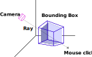
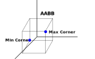
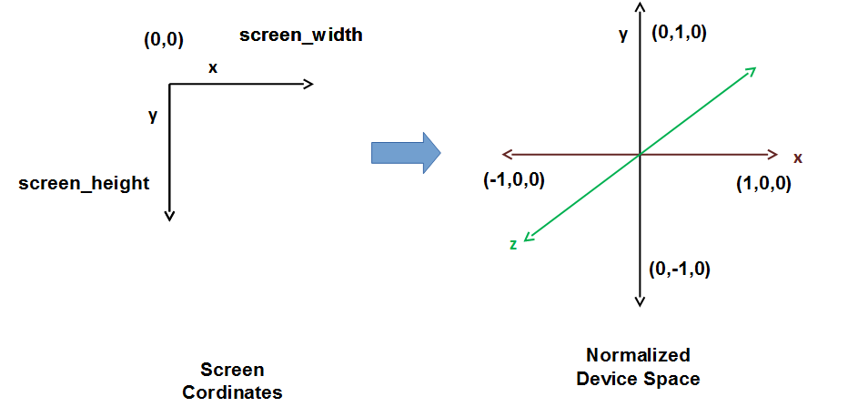
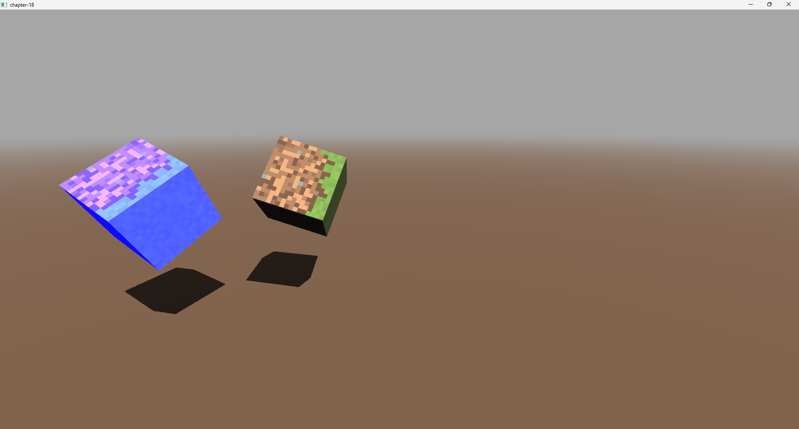

# 第18章 - 3D物体拾取（3D Object Picking）

每个游戏的关键方面之一是与环境交互的能力。这种能力需要能够在3D场景中选择物体。在本章中，我们将探讨如何实现这一点。

您可以在[此处](https://github.com/lwjglgamedev/lwjglbook/tree/main/chapter-18)找到本章的完整源代码。

## 概念

我们将添加通过在屏幕上单击鼠标来选择实体的功能。为此，我们将从相机位置（我们的原点）投射一条光线，使用我们单击鼠标的点作为方向（从鼠标坐标转换为世界坐标）。通过该光线，我们将检查它是否与与每个实体关联的**包围盒**（bounding box）相交（即包含与实体关联的模型的一个立方体）。



我们需要实现以下步骤：

* 为每个模型（实际上是模型的每个网格）关联一个包围盒。
* 将鼠标坐标转换为世界空间坐标，以便从相机位置投射光线。
* 对于每个实体，遍历关联的网格并检查是否与光线相交。
* 我们将选择与光线距离最近的实体。
* 如果我们有一个选定的实体，我们将在片段着色器中突出显示它。

## 代码准备

我们将首先计算我们加载的模型的每个网格的包围盒。我们将通过在加载模型时添加一个额外的标志`aiProcess_GenBoundingBoxes`来让Assimp为我们完成这项工作。此标志将自动为每个网格计算一个包围盒。该盒子将嵌入所有网格并将与轴对齐。您可能会看到缩写词“AABB”用于此，它表示**轴对齐包围盒**（Axis Aligned Bounding Box）。为什么是轴对齐的盒子？因为它将大大简化交集计算。通过使用该标志，Assimp将执行这些计算，这些计算将作为包围盒的角点（具有最小和最大坐标）可用。下图显示了立方体的外观。



启用计算后，我们需要在处理网格时检索该信息：

```java
public class ModelLoader {
    ...
    public static Model loadModel(String modelId, String modelPath, TextureCache textureCache, boolean animation) {
        return loadModel(modelId, modelPath, textureCache, aiProcess_GenSmoothNormals | aiProcess_JoinIdenticalVertices |
                aiProcess_Triangulate | aiProcess_FixInfacingNormals | aiProcess_CalcTangentSpace | aiProcess_LimitBoneWeights |
                aiProcess_GenBoundingBoxes | (animation ? 0 : aiProcess_PreTransformVertices));

    }
    ...
    private static Mesh processMesh(AIMesh aiMesh, List<Bone> boneList) {
        ...
        AIAABB aabb = aiMesh.mAABB();
        Vector3f aabbMin = new Vector3f(aabb.mMin().x(), aabb.mMin().y(), aabb.mMin().z());
        Vector3f aabbMax = new Vector3f(aabb.mMax().x(), aabb.mMax().y(), aabb.mMax().z());

        return new Mesh(vertices, normals, tangents, bitangents, textCoords, indices, animMeshData.boneIds,
                animMeshData.weights, aabbMin, aabbMax);
    }
    ...
}
```

我们需要将该信息存储在`Mesh`类中：

```java
public class Mesh {
    ...
    private Vector3f aabbMax;
    private Vector3f aabbMin;
    ...
    public Mesh(float[] positions, float[] normals, float[] tangents, float[] bitangents, float[] textCoords, int[] indices) {
        this(positions, normals, tangents, bitangents, textCoords, indices,
                new int[Mesh.MAX_WEIGHTS * positions.length / 3], new float[Mesh.MAX_WEIGHTS * positions.length / 3],
                new Vector3f(), new Vector3f());
    }

    public Mesh(float[] positions, float[] normals, float[] tangents, float[] bitangents, float[] textCoords, int[] indices, int[] boneIndices, float[] weights, Vector3f aabbMin, Vector3f aabbMax) {
        this.aabbMin = aabbMin;
        this.aabbMax = aabbMax;
        ...
    }
    ...
    public Vector3f getAabbMax() {
        return aabbMax;
    }

    public Vector3f getAabbMin() {
        return aabbMin;
    }
    ...
}
```

在执行光线交集计算时，我们需要逆视图和投影矩阵，以便从屏幕空间转换为世界空间坐标。因此，我们将修改`Camera`和`Projection`类，以便在它们各自的矩阵更新时自动计算它们的逆矩阵：

```java
public class Camera {
    ...
    private Matrix4f invViewMatrix;
    ...
    public Camera() {
        ...
        invViewMatrix = new Matrix4f();
        ...
    }
    ...
    public Matrix4f getInvViewMatrix() {
        return invViewMatrix;
    }
    ...
    private void recalculate() {
        viewMatrix.identity()
                .rotateX(rotation.x)
                .rotateY(rotation.y)
                .translate(-position.x, -position.y, -position.z);
        invViewMatrix.set(viewMatrix).invert();
    }
    ...
}
```

```java
public class Projection {
    ...
    private Matrix4f invProjMatrix;
    ...
    public Projection(int width, int height) {
        ...
        invProjMatrix = new Matrix4f();
        ...
    }

    public Matrix4f getInvProjMatrix() {
        return invProjMatrix;
    }
    ...
    public void updateProjMatrix(int width, int height) {
        projMatrix.setPerspective(FOV, (float) width / height, Z_NEAR, Z_FAR);
        invProjMatrix.set(projMatrix).invert();
    }
}
```

我们还需要在完成计算后存储选定的`Entity`，我们将在`Scene`类中执行此操作：

```java
public class Scene {
    ...
    private Entity selectedEntity;
    ...
    public Entity getSelectedEntity() {
        return selectedEntity;
    }
    ...
    public void setSelectedEntity(Entity selectedEntity) {
        this.selectedEntity = selectedEntity;
    }
    ...
}
```

最后，我们将在渲染场景时创建一个新的统一变量，如果我们正在渲染一个选定的`Entity`，该统一变量将被激活：

```java
public class SceneRender {
    ...
    private void createUniforms() {
        ...
        uniformsMap.createUniform("selected");
    }

    public void render(Scene scene, ShadowRender shadowRender) {
        ...
        Entity selectedEntity = scene.getSelectedEntity();
        for (Model model : models) {
            List<Entity> entities = model.getEntitiesList();

            for (Material material : model.getMaterialList()) {
                ...
                for (Mesh mesh : material.getMeshList()) {
                    glBindVertexArray(mesh.getVaoId());
                    for (Entity entity : entities) {
                        uniformsMap.setUniform("selected",
                                selectedEntity != null && selectedEntity.getId().equals(entity.getId()) ? 1 : 0);
                        ...
                    }
                    ...
                }
                ...
            }
        }
        ...
    }
    ...
}
```

在片段着色器（`scene.frag`）中，我们将只修改属于选定实体的片段的蓝色分量：

```glsl
#version 330
...
uniform int selected;
...
void main() {
    ...
    if (selected > 0) {
        fragColor = vec4(fragColor.x, fragColor.y, 1, 1);
    }
}
```

## 实体选择

我们现在可以继续编写确定是否应选择`Entity`的代码。在`Main`类中，在`input`方法中，我们将检查是否按下了鼠标左键。如果是，我们将调用一个新方法（`selectEntity`），在该方法中我们将执行计算：

```java
public class Main implements IAppLogic {
    ...
    public void input(Window window, Scene scene, long diffTimeMillis, boolean inputConsumed) {
        ...
        if (mouseInput.isLeftButtonPressed()) {
            selectEntity(window, scene, mouseInput.getCurrentPos());
        }
        ...
    }
    ...
}
```

`selectEntity`方法如下所示：

```java
public class Main implements IAppLogic {
    ...
    private void selectEntity(Window window, Scene scene, Vector2f mousePos) {
        int wdwWidth = window.getWidth();
        int wdwHeight = window.getHeight();

        float x = (2 * mousePos.x) / wdwWidth - 1.0f;
        float y = 1.0f - (2 * mousePos.y) / wdwHeight;
        float z = -1.0f;

        Matrix4f invProjMatrix = scene.getProjection().getInvProjMatrix();
        Vector4f mouseDir = new Vector4f(x, y, z, 1.0f);
        mouseDir.mul(invProjMatrix);
        mouseDir.z = -1.0f;
        mouseDir.w = 0.0f;

        Matrix4f invViewMatrix = scene.getCamera().getInvViewMatrix();
        mouseDir.mul(invViewMatrix);
        ...
    }
    ...
}
```

我们需要使用点击坐标计算该方向向量。但是，我们如何从视口空间中的$(x,y)$坐标转换为世界空间？让我们回顾一下我们如何从模型空间坐标转换为视图空间。为了实现这一点，应用了不同的坐标变换：

* 我们使用模型矩阵从模型坐标转换为世界坐标。
* 我们使用视图矩阵（提供相机效果）从世界坐标转换为视图空间坐标。
* 我们通过应用透视投影矩阵从视图坐标转换为齐次裁剪空间。
* 最终屏幕坐标由OpenGL自动为我们计算。在此之前，它会转换为归一化设备坐标（通过将$x, y,z$坐标除以$w$分量），然后转换为$x,y$屏幕坐标。

所以我们只需要执行逆向路径，从屏幕坐标$(x,y)$到世界坐标。

第一步是从屏幕坐标转换为归一化设备坐标。视口空间中的$(x, y)$坐标在$[0, 屏幕宽度]$ $[0, 屏幕高度]$范围内。屏幕的左上角坐标为$(0, 0)$. 我们需要将其转换为$[-1, 1]$范围内的坐标。



数学很简单：

$$x = 2 \cdot screen_x / screenwidth - 1$$

$$y = 1 - 2 * screen_y / screenheight$$

但是，我们如何计算$z$分量？答案很简单，我们只需将其赋值为$-1$，这样光线就指向最远的可见距离（记住在OpenGL中，$-1$指向屏幕）。现在我们有了归一化设备坐标中的坐标。

为了继续进行变换，我们需要将它们转换为齐次裁剪空间。我们需要有$w$分量，即使用齐次坐标。尽管这个概念在前面的章节中已经介绍过，但让我们回顾一下。为了表示一个3D点，我们只需要$x$、$y$和$z$分量，但我们一直在使用一个额外的分量，即$w$分量。我们需要这个额外的分量才能使用矩阵执行不同的变换。有些变换不需要这个额外的分量，但有些需要。例如，如果我们只有$x$、$y$和$z$分量，平移矩阵就无法工作。因此，我们添加了w分量并将其赋值为$1$，这样我们就可以使用4x4矩阵。

除此之外，大多数变换，或者更准确地说，大多数变换矩阵不会改变$w$分量。一个例外是投影矩阵。该矩阵将$w$值更改为与$z$分量成比例。

从齐次裁剪空间转换为归一化设备坐标是通过将$x$、$y$和$z$分量除以$w$来实现的。由于此分量与z分量成比例，这意味着远处的物体绘制得更小。在我们的例子中，我们需要做相反的事情，我们需要反投影，但由于我们计算的是一条光线，我们可以简单地忽略这一步，将$w$分量设置为$1$，并将其余分量保持其原始值。

现在我们需要回到视图空间。这很容易，我们只需要计算投影矩阵的逆矩阵并将其乘以我们的4分量向量。完成此操作后，我们需要将它们转换为世界空间。同样，我们只需要使用视图矩阵，计算其逆矩阵并将其乘以我们的向量。

请记住，我们只对方向感兴趣，因此，在这种情况下，我们将$w$分量设置为$0$。我们还可以再次将$z$分量设置为$-1$，因为我们希望它指向屏幕。完成此操作并应用逆视图矩阵后，我们就得到了世界空间中的向量。

下一步是遍历实体及其关联的网格，并检查它们的包围盒是否与从相机位置开始的光线相交：

```java
public class Main implements IAppLogic {
    ...
    private void selectEntity(Window window, Scene scene, Vector2f mousePos) {
        ...
        Vector4f min = new Vector4f(0.0f, 0.0f, 0.0f, 1.0f);
        Vector4f max = new Vector4f(0.0f, 0.0f, 0.0f, 1.0f);
        Vector2f nearFar = new Vector2f();

        Entity selectedEntity = null;
        float closestDistance = Float.POSITIVE_INFINITY;
        Vector3f center = scene.getCamera().getPosition();

        Collection<Model> models = scene.getModelMap().values();
        Matrix4f modelMatrix = new Matrix4f();
        for (Model model : models) {
            List<Entity> entities = model.getEntitiesList();
            for (Entity entity : entities) {
                modelMatrix.translate(entity.getPosition()).scale(entity.getScale());
                for (Material material : model.getMaterialList()) {
                    for (Mesh mesh : material.getMeshList()) {
                        Vector3f aabbMin = mesh.getAabbMin();
                        min.set(aabbMin.x, aabbMin.y, aabbMin.z, 1.0f);
                        min.mul(modelMatrix);
                        Vector3f aabMax = mesh.getAabbMax();
                        max.set(aabMax.x, aabMax.y, aabMax.z, 1.0f);
                        max.mul(modelMatrix);
                        if (Intersectionf.intersectRayAab(center.x, center.y, center.z, mouseDir.x, mouseDir.y, mouseDir.z,
                                min.x, min.y, min.z, max.x, max.y, max.z, nearFar) && nearFar.x < closestDistance) {
                            closestDistance = nearFar.x;
                            selectedEntity = entity;
                        }
                    }
                }
                modelMatrix.identity();
            }
        }
        scene.setSelectedEntity(selectedEntity);
    }
    ...
}
```

我们定义一个名为```closestDistance```的变量。此变量将保存最近的距离。对于相交的游戏物品，将计算从相机到交点的距离。如果它小于存储在```closestDistance```中的值，则此物品将成为新的候选者。我们需要平移和缩放每个网格的包围盒。我们不能直接使用模型矩阵，因为它也会考虑旋转（我们不希望这样，因为我们希望盒子与轴对齐）。这就是为什么我们只使用实体的数据应用平移和缩放来构建模型矩阵。但是，我们如何计算交集？这就是光荣的[JOML](https://github.com/JOML-CI/JOML "JOML")库派上用场的地方。我们正在使用[JOML](https://github.com/JOML-CI/JOML "JOML")的```Intersectionf```类，该类提供了几种计算2D和3D交集的方法。具体来说，我们正在使用```intersectRayAab```方法。

此方法实现了测试轴对齐包围盒交集的算法。您可以在[此处](http://people.csail.mit.edu/amy/papers/box-jgt.pdf "here")查看详细信息，如JOML文档中所述。

该方法测试由原点和方向定义的光线是否与由最小和最大角点定义的盒子相交。如前所述，此算法是有效的，因为我们的立方体与轴对齐，如果它们旋转了，此方法将不起作用。此外，在有动画时，您可能需要为每个动画帧设置不同的包围盒（Assimp计算绑定姿势的包围盒）。```intersectRayAab```方法接收以下参数：

* 原点：在我们的例子中，这将是我们的相机位置。
* 方向：这是指向鼠标坐标的光线（世界空间）。
* 盒子的最小角点。
* 最大角点。不言自明。
* 结果向量。这将包含交点的近距离和远距离。

如果存在交集，该方法将返回true。如果为true，我们检查最近的距离并在需要时更新它，并存储候选选定项的引用。

显然，此处介绍的方法远非最优，但它将为您提供基础，以便您自己开发更复杂的方法。场景的某些部分可以轻松丢弃，例如相机后面的物体，因为它们不会相交。除此之外，您可能希望根据到相机的距离对物品进行排序，以加快计算速度。

我们将修改`Main`类以显示两个旋转的立方体来演示该技术：

```java
public class Main implements IAppLogic {
    ...
    private Entity cubeEntity1;
    private Entity cubeEntity2;
    ...
    private float rotation;

    public static void main(String[] args) {
        ...
        Engine gameEng = new Engine("chapter-18", opts, main);
        ...
    }
    ...
    public void init(Window window, Scene scene, Render render) {
        ...
        Model cubeModel = ModelLoader.loadModel("cube-model", "resources/models/cube/cube.obj",
                scene.getTextureCache(), false);
        scene.addModel(cubeModel);
        cubeEntity1 = new Entity("cube-entity-1", cubeModel.getId());
        cubeEntity1.setPosition(0, 2, -1);
        scene.addEntity(cubeEntity1);

        cubeEntity2 = new Entity("cube-entity-2", cubeModel.getId());
        cubeEntity2.setPosition(-2, 2, -1);
        scene.addEntity(cubeEntity2);
        ...
    }
    ...
    public void update(Window window, Scene scene, long diffTimeMillis) {
        rotation += 1.5;
        if (rotation > 360) {
            rotation = 0;
        }
        cubeEntity1.setRotation(1, 1, 1, (float) Math.toRadians(rotation));
        cubeEntity1.updateModelMatrix();

        cubeEntity2.setRotation(1, 1, 1, (float) Math.toRadians(360 - rotation));
        cubeEntity2.updateModelMatrix();
    }
}
```

您将能够看到当用鼠标点击时，立方体如何以蓝色渲染：



[下一章](./19-deferred-shading.md)