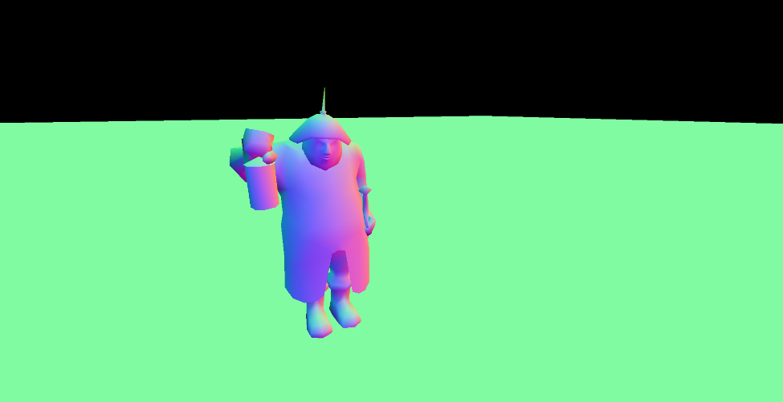
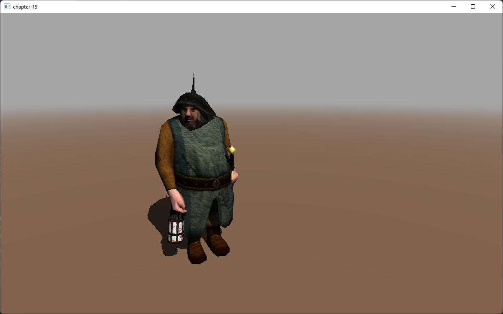

# 第19章 - 延迟着色（Deferred Shading）

到目前为止，我们渲染3D场景的方式称为前向渲染。我们首先渲染3D对象，然后在片段着色器中应用纹理和光照效果。如果我们有一个复杂的片段着色器通道，其中包含许多光源和复杂效果，这种方法效率不高。此外，我们最终可能会将这些效果应用于可能由于**深度测试**（Depth Test）而被丢弃的片段（尽管如果我们启用[早期片段测试](https://www.khronos.org/opengl/wiki/Early_Fragment_Test)，情况并非完全如此）。

为了缓解上述问题，我们可以通过使用一种称为**延迟着色**（deferred shading）的技术来改变我们渲染场景的方式。使用**延迟着色**（deferred shading），我们首先将后续阶段（在片段着色器中）所需的几何信息渲染到缓冲区中。片段着色器所需的复杂计算被推迟到使用这些缓冲区中存储的信息的后续阶段。

您可以在[此处](https://github.com/lwjglgamedev/lwjglbook/tree/main/chapter-19)找到本章的完整源代码。

## 概念

**延迟着色**（Deferred shading）需要执行两个渲染通道。第一个是几何体通道，我们将场景渲染到一个缓冲区中，该缓冲区将包含以下信息：

* 深度值。
* 每个位置的**漫反射**（Diffuse reflectance）颜色和反射因子。
* 每个位置的**镜面反射**（Specular reflectance）分量。
* 每个位置的法线（也在光视图**坐标空间**（coordinate space）中）。

所有这些信息都存储在一个称为**G-缓冲区**（G-Buffer）的缓冲区中。

第二个通道称为光照通道。此通道采用一个填充整个屏幕的四边形，并使用**G-缓冲区**（G-Buffer）中包含的信息为每个片段生成颜色信息。当我们执行光照通道时，**深度测试**（Depth Test）已经移除了所有不会被看到的场景数据。因此，要执行的操作数量仅限于屏幕上显示的内容。

您可能会问，执行额外的渲染通道是否会提高性能。答案是取决于情况。当您有许多不同的光照通道时，通常会使用**延迟着色**（deferred shading）。在这种情况下，额外的渲染步骤通过减少片段着色器中执行的操作来补偿。

## G-缓冲区

所以让我们开始编码。我们将要做的第一项任务是为**G-缓冲区**（G-Buffer）创建一个新类。该类名为`GBuffer`，定义如下：

```java
package org.lwjglb.engine.graph;

import org.lwjgl.opengl.GL30;
import org.lwjgl.system.MemoryStack;
import org.lwjglb.engine.Window;

import java.nio.*;
import java.util.Arrays;

import static org.lwjgl.opengl.GL30.*;

public class GBuffer {

    private static final int TOTAL_TEXTURES = 4;

    private int gBufferId;
    private int height;
    private int[] textureIds;
    private int width;
    ...
}
```

该类定义了一个常量，用于表示要使用的最大缓冲区数量。**G-缓冲区**（G-Buffer）本身的标识符以及用于单个缓冲区的数组。还存储了纹理的大小。

让我们回顾一下构造函数：

```java
public class GBuffer {
    ...
    public GBuffer(Window window) {
        gBufferId = glGenFramebuffers();
        glBindFramebuffer(GL_DRAW_FRAMEBUFFER, gBufferId);

        textureIds = new int[TOTAL_TEXTURES];
        glGenTextures(textureIds);

        this.width = window.getWidth();
        this.height = window.getHeight();

        for (int i = 0; i < TOTAL_TEXTURES; i++) {
            glBindTexture(GL_TEXTURE_2D, textureIds[i]);
            int attachmentType;
            if (i == TOTAL_TEXTURES - 1) {
                glTexImage2D(GL_TEXTURE_2D, 0, GL_DEPTH_COMPONENT32F, width, height, 0, GL_DEPTH_COMPONENT, GL_FLOAT,
                        (ByteBuffer) null);
                attachmentType = GL_DEPTH_ATTACHMENT;
            } else {
                glTexImage2D(GL_TEXTURE_2D, 0, GL_RGBA32F, width, height, 0, GL_RGBA, GL_FLOAT, (ByteBuffer) null);
                attachmentType = GL_COLOR_ATTACHMENT0 + i;
            }
            glTexParameterf(GL_TEXTURE_2D, GL_TEXTURE_MIN_FILTER, GL_NEAREST);
            glTexParameterf(GL_TEXTURE_2D, GL_TEXTURE_MAG_FILTER, GL_NEAREST);

            glFramebufferTexture2D(GL_FRAMEBUFFER, attachmentType, GL_TEXTURE_2D, textureIds[i], 0);
        }

        try (MemoryStack stack = MemoryStack.stackPush()) {
            IntBuffer intBuff = stack.mallocInt(TOTAL_TEXTURES);
            for (int i = 0; i < TOTAL_TEXTURES; i++) {
                intBuff.put(i, GL_COLOR_ATTACHMENT0 + i);
            }
            glDrawBuffers(intBuff);
        }

        glBindFramebuffer(GL_FRAMEBUFFER, 0);
    }
    ...
}
```

我们做的第一件事是创建一个**帧缓冲**（Frame Buffer）。记住，**帧缓冲**（Frame Buffer）只是一个OpenGL对象，可以用来执行渲染操作，而不是渲染到屏幕。然后我们生成一组纹理（4个纹理），这些纹理将与**帧缓冲**（Frame Buffer）关联。

之后，我们使用for循环初始化纹理。我们有以下类型：

* “常规纹理”，将存储位置、法线、**漫反射**（Diffuse reflectance）分量等。
* 用于存储深度缓冲区的纹理。这将是我们的最后一个纹理。

纹理初始化后，我们启用它们的采样并将其附加到**帧缓冲**（Frame Buffer）。每个纹理都使用一个从`GL_COLOR_ATTACHMENT0`开始的标识符附加。每个纹理将该ID增加一，因此位置使用`GL_COLOR_ATTACHMENT0`附加，**漫反射**（Diffuse reflectance）分量使用`GL_COLOR_ATTACHMENT1`（即`GL_COLOR_ATTACHMENT0 + 1`），依此类推。

创建所有纹理后，我们需要启用它们供片段着色器用于渲染。这通过调用`glDrawBuffers`完成。我们只需传递包含使用的颜色附件标识符的数组（`GL_COLOR_ATTACHMENT0`到`GL_COLOR_ATTACHMENT5`）。

该类的其余部分只是getter方法和cleanup方法。

```java
public class GBuffer {
    ...
    public void cleanUp() {
        glDeleteFramebuffers(gBufferId);
        Arrays.stream(textureIds).forEach(GL30::glDeleteTextures);
    }

    public int getGBufferId() {
        return gBufferId;
    }

    public int getHeight() {
        return height;
    }

    public int[] getTextureIds() {
        return textureIds;
    }

    public int getWidth() {
        return width;
    }
}
```

## 几何体通道

让我们检查一下在执行几何体通道时需要应用的更改。我们将这些更改应用于`SceneRender`类和相关的着色器。从`SceneRender`类开始，我们需要移除光照常量和光照**统一变量**（Uniforms），它们在此通道中不会使用（为了简化，我们也不会使用**材质**（Material）的环境颜色，我们需要移除该**统一变量**（Uniform）并移除选定实体**统一变量**（Uniform））：

```java
public class SceneRender {

    private ShaderProgram shaderProgram;
    private UniformsMap uniformsMap;
    ...
    private void createUniforms() {
        uniformsMap = new UniformsMap(shaderProgram.getProgramId());
        uniformsMap.createUniform("projectionMatrix");
        uniformsMap.createUniform("modelMatrix");
        uniformsMap.createUniform("viewMatrix");
        uniformsMap.createUniform("bonesMatrices");
        uniformsMap.createUniform("txtSampler");
        uniformsMap.createUniform("normalSampler");
        uniformsMap.createUniform("material.diffuse");
        uniformsMap.createUniform("material.specular");
        uniformsMap.createUniform("material.reflectance");
        uniformsMap.createUniform("material.hasNormalMap");
    }
    ...
}
```

`render`方法定义如下：

```java
public class SceneRender {
    ...
    public void render(Scene scene, GBuffer gBuffer) {
        glBindFramebuffer(GL_DRAW_FRAMEBUFFER, gBuffer.getGBufferId());
        glClear(GL_COLOR_BUFFER_BIT | GL_DEPTH_BUFFER_BIT);
        glViewport(0, 0, gBuffer.getWidth(), gBuffer.getHeight());
        glDisable(GL_BLEND);

        shaderProgram.bind();

        uniformsMap.setUniform("projectionMatrix", scene.getProjection().getProjMatrix());
        uniformsMap.setUniform("viewMatrix", scene.getCamera().getViewMatrix());

        uniformsMap.setUniform("txtSampler", 0);
        uniformsMap.setUniform("normalSampler", 1);

        Collection<Model> models = scene.getModelMap().values();
        TextureCache textureCache = scene.getTextureCache();
        for (Model model : models) {
            List<Entity> entities = model.getEntitiesList();

            for (Material material : model.getMaterialList()) {
                uniformsMap.setUniform("material.diffuse", material.getDiffuseColor());
                uniformsMap.setUniform("material.specular", material.getSpecularColor());
                uniformsMap.setUniform("material.reflectance", material.getReflectance());
                String normalMapPath = material.getNormalMapPath();
                boolean hasNormalMapPath = normalMapPath != null;
                uniformsMap.setUniform("material.hasNormalMap", hasNormalMapPath ? 1 : 0);
                Texture texture = textureCache.getTexture(material.getTexturePath());
                glActiveTexture(GL_TEXTURE0);
                texture.bind();
                if (hasNormalMapPath) {
                    Texture normalMapTexture = textureCache.getTexture(normalMapPath);
                    glActiveTexture(GL_TEXTURE1);
                    normalMapTexture.bind();
                }

                for (Mesh mesh : material.getMeshList()) {
                    glBindVertexArray(mesh.getVaoId());
                    for (Entity entity : entities) {
                        uniformsMap.setUniform("modelMatrix", entity.getModelMatrix());
                        AnimationData animationData = entity.getAnimationData();
                        if (animationData == null) {
                            uniformsMap.setUniform("bonesMatrices", AnimationData.DEFAULT_BONES_MATRICES);
                        } else {
                            uniformsMap.setUniform("bonesMatrices", animationData.getCurrentFrame().boneMatrices());
                        }
                        glDrawElements(GL_TRIANGLES, mesh.getNumVertices(), GL_UNSIGNED_INT, 0);
                    }
                }
            }
        }

        glBindVertexArray(0);
        glEnable(GL_BLEND);
        shaderProgram.unbind();
    }
}
```

您可以看到，我们现在接收一个`GBuffer`实例作为方法参数。该缓冲区是我们执行渲染的地方，因此我们首先通过调用`glBindFramebuffer`绑定该缓冲区。之后，我们清除该缓冲区并禁用混合。使用**延迟着色**（deferred rendering）时，透明对象有点棘手。方法是在光照通道中渲染它们，或者在几何体通道中丢弃它们。如您所见，我们已经移除了所有光照**统一变量**（Uniforms）设置代码。

顶点着色器（`scene.vert`）中唯一的更改是，现在视图位置是一个四分量向量（`vec4`）：

```glsl
#version 330
...
out vec4 outViewPosition;
...
void main()
{
    ...
    outWorldPosition = modelMatrix * initPos;
    outViewPosition  = viewMatrix * outWorldPosition;
    gl_Position   = projectionMatrix * outViewPosition;
    outNormal     = normalize(modelViewMatrix * initNormal).xyz;
    outTangent    = normalize(modelViewMatrix * initTangent).xyz;
    outBitangent  = normalize(modelViewMatrix * initBitangent).xyz;
    outTextCoord  = texCoord;
}
```

片段着色器（`scene.frag`）已大大简化：

```glsl
#version 330

in vec3 outNormal;
in vec3 outTangent;
in vec3 outBitangent;
in vec2 outTextCoord;
in vec4 outViewPosition;
in vec4 outWorldPosition;

layout (location = 0) out vec4 buffAlbedo;
layout (location = 1) out vec4 buffNormal;
layout (location = 2) out vec4 buffSpecular;

struct Material
{
    vec4 diffuse;
    vec4 specular;
    float reflectance;
    int hasNormalMap;
};

uniform sampler2D txtSampler;
uniform sampler2D normalSampler;
uniform Material material;

vec3 calcNormal(vec3 normal, vec3 tangent, vec3 bitangent, vec2 textCoords) {
    mat3 TBN = mat3(tangent, bitangent, normal);
    vec3 newNormal = texture(normalSampler, textCoords).rgb;
    newNormal = normalize(newNormal * 2.0 - 1.0);
    newNormal = normalize(TBN * newNormal);
    return newNormal;
}

void main() {
    vec4 text_color = texture(txtSampler, outTextCoord);
    vec4 diffuse = text_color + material.diffuse;
    if (diffuse.a < 0.5) {
        discard;
    }
    vec4 specular = text_color + material.specular;

    vec3 normal = outNormal;
    if (material.hasNormalMap > 0) {
        normal = calcNormal(outNormal, outTangent, outBitangent, outTextCoord);
    }

    buffAlbedo   = vec4(diffuse.xyz, material.reflectance);
    buffNormal   = vec4(0.5 * normal + 0.5, 1.0);
    buffSpecular = specular;
}
```

最相关的行是：

```glsl
...
layout (location = 0) out vec4 buffAlbedo;
layout (location = 1) out vec4 buffNormal;
layout (location = 2) out vec4 buffSpecular;
...
```

这是我们引用此片段着色器将写入的纹理的地方。如您所见，我们只转储**漫反射**（Diffuse reflectance）颜色（可以是关联纹理的颜色或**材质**（Material）的一个分量）、**镜面反射**（Specular reflectance）分量、法线以及**阴影贴图**（shadow map）的深度值。您可能会注意到我们没有在纹理中存储位置，这是因为我们可以使用深度值重建片段位置。我们将在光照通道中看到如何做到这一点。

旁注：我们简化了`Material`类的定义，移除了环境颜色分量。

如果您使用OpenGL调试器（例如RenderDoc）调试示例执行，您可以查看几何体通道期间生成的纹理。反照率纹理将如下所示：


保存法线值的纹理将如下所示：



保存**镜面反射**（Specular reflectance）颜色值的纹理将如下所示：


最后，深度纹理将如下所示：


## 光照通道

为了执行光照通道，我们将创建一个名为`LightsRender`的新类，该类如下所示：

```java
package org.lwjglb.engine.graph;

import org.joml.*;
import org.lwjglb.engine.scene.*;
import org.lwjglb.engine.scene.lights.*;

import java.util.*;

import static org.lwjgl.opengl.GL11.*;
import static org.lwjgl.opengl.GL14.*;
import static org.lwjgl.opengl.GL30.*;

public class LightsRender {
    private static final int MAX_POINT_LIGHTS = 5;
    private static final int MAX_SPOT_LIGHTS = 5;

    private final ShaderProgram shaderProgram;

    private QuadMesh quadMesh;
    private UniformsMap uniformsMap;

    public LightsRender() {
        List<ShaderProgram.ShaderModuleData> shaderModuleDataList = new ArrayList<>();
        shaderModuleDataList.add(new ShaderProgram.ShaderModuleData("resources/shaders/lights.vert", GL_VERTEX_SHADER));
        shaderModuleDataList.add(new ShaderProgram.ShaderModuleData("resources/shaders/lights.frag", GL_FRAGMENT_SHADER));
        shaderProgram = new ShaderProgram(shaderModuleDataList);
        quadMesh = new QuadMesh();
        createUniforms();
    }

    public void cleanup() {
        quadMesh.cleanup();
        shaderProgram.cleanup();
    }
    ...
}
```

您可以看到，除了创建一个新的着色器程序外，我们还定义了一个新的`QadMesh`类属性（尚未定义）。在分析渲染方法之前，让我们稍微思考一下如何渲染光源。我们需要使用**G-缓冲区**（G-Buffer）的内容，但为了使用它们，我们需要先渲染一些东西。但是，我们已经绘制了场景，现在我们要渲染什么？答案很简单，我们只需要渲染一个填充整个屏幕的四边形。对于该四边形的每个片段，我们将使用**G-缓冲区**（G-Buffer）中包含的数据并生成正确的输出颜色。这就是`QuadMesh`类发挥作用的地方，它只定义了一个四边形，将用于在光照通道中渲染，其定义如下：

```java
package org.lwjglb.engine.graph;

import org.lwjgl.opengl.GL30;
import org.lwjgl.system.*;

import java.nio.*;
import java.util.*;

import static org.lwjgl.opengl.GL30.*;

public class QuadMesh {

    private int numVertices;
    private int vaoId;
    private List<Integer> vboIdList;

    public QuadMesh() {
        vboIdList = new ArrayList<>();
        float[] positions = new float[]{
                -1.0f, 1.0f, 0.0f,
                1.0f, 1.0f, 0.0f,
                -1.0f, -1.0f, 0.0f,
                1.0f, -1.0f, 0.0f,};
        float[] textCoords = new float[]{
                0.0f, 1.0f,
                1.0f, 1.0f,
                0.0f, 0.0f,
                1.0f, 0.0f,};
        int[] indices = new int[]{0, 2, 1, 1, 2, 3};
        numVertices = indices.length;

        vaoId = glGenVertexArrays();
        glBindVertexArray(vaoId);

        // Positions VBO
        int vboId = glGenBuffers();
        vboIdList.add(vboId);
        FloatBuffer positionsBuffer = MemoryUtil.memCallocFloat(positions.length);
        positionsBuffer.put(0, positions);
        glBindBuffer(GL_ARRAY_BUFFER, vboId);
        glBufferData(GL_ARRAY_BUFFER, positionsBuffer, GL_STATIC_DRAW);
        glEnableVertexAttribArray(0);
        glVertexAttribPointer(0, 3, GL_FLOAT, false, 0, 0);

        // Texture coordinates VBO
        vboId = glGenBuffers();
        vboIdList.add(vboId);
        FloatBuffer textCoordsBuffer = MemoryUtil.memCallocFloat(textCoords.length);
        textCoordsBuffer.put(0, textCoords);
        glBindBuffer(GL_ARRAY_BUFFER, vboId);
        glBufferData(GL_ARRAY_BUFFER, textCoordsBuffer, GL_STATIC_DRAW);
        glEnableVertexAttribArray(1);
        glVertexAttribPointer(1, 2, GL_FLOAT, false, 0, 0);

        // Index VBO
        vboId = glGenBuffers();
        vboIdList.add(vboId);
        IntBuffer indicesBuffer = MemoryUtil.memCallocInt(indices.length);
        indicesBuffer.put(0, indices);
        glBindBuffer(GL_ELEMENT_ARRAY_BUFFER, vboId);
        glBufferData(GL_ELEMENT_ARRAY_BUFFER, indicesBuffer, GL_STATIC_DRAW);

        glBindBuffer(GL_ARRAY_BUFFER, 0);
        glBindVertexArray(0);

        MemoryUtil.memFree(positionsBuffer);
        MemoryUtil.memFree(textCoordsBuffer);
        MemoryUtil.memFree(indicesBuffer);
    }

    public void cleanup() {
        vboIdList.forEach(GL30::glDeleteBuffers);
        glDeleteVertexArrays(vaoId);
    }

    public int getNumVertices() {
        return numVertices;
    }

    public int getVaoId() {
        return vaoId;
    }
}
```

如您所见，我们只需要位置和**纹理坐标**（Texture Coordinates）属性（以便正确访问**G-缓冲区**（G-Buffer）纹理）。回到`LightsRender`类，我们需要一个创建**统一变量**（Uniforms）的方法，您将看到，它恢复了之前在`SceneRender`类中使用的光照**统一变量**（Uniforms），此外还有一组新的**统一变量**（Uniforms）用于映射**G-缓冲区**（G-Buffer）纹理（`albedoSampler`、`normalSampler`、`specularSampler`和`depthSampler`）。除此之外，我们还需要新的**统一变量**（Uniforms）来从深度值计算片段位置，例如`invProjectionMatrix`和`invViewMatrix`。我们将在着色器代码中看到它们如何使用。

```java
public class LightsRender {
    ...
    private void createUniforms() {
        uniformsMap = new UniformsMap(shaderProgram.getProgramId());
        uniformsMap.createUniform("albedoSampler");
        uniformsMap.createUniform("normalSampler");
        uniformsMap.createUniform("specularSampler");
        uniformsMap.createUniform("depthSampler");
        uniformsMap.createUniform("invProjectionMatrix");
        uniformsMap.createUniform("invViewMatrix");
        uniformsMap.createUniform("ambientLight.factor");
        uniformsMap.createUniform("ambientLight.color");

        for (int i = 0; i < MAX_POINT_LIGHTS; i++) {
            String name = "pointLights[" + i + "]";
            uniformsMap.createUniform(name + ".position");
            uniformsMap.createUniform(name + ".color");
            uniformsMap.createUniform(name + ".intensity");
            uniformsMap.createUniform(name + ".att.constant");
            uniformsMap.createUniform(name + ".att.linear");
            uniformsMap.createUniform(name + ".att.exponent");
        }
        for (int i = 0; i < MAX_SPOT_LIGHTS; i++) {
            String name = "spotLights[" + i + "]";
            uniformsMap.createUniform(name + ".pl.position");
            uniformsMap.createUniform(name + ".pl.color");
            uniformsMap.createUniform(name + ".pl.intensity");
            uniformsMap.createUniform(name + ".pl.att.constant");
            uniformsMap.createUniform(name + ".pl.att.linear");
            uniformsMap.createUniform(name + ".pl.att.exponent");
            uniformsMap.createUniform(name + ".conedir");
            uniformsMap.createUniform(name + ".cutoff");
        }

        uniformsMap.createUniform("dirLight.color");
        uniformsMap.createUniform("dirLight.direction");
        uniformsMap.createUniform("dirLight.intensity");

        uniformsMap.createUniform("fog.activeFog");
        uniformsMap.createUniform("fog.color");
        uniformsMap.createUniform("fog.density");

        for (int i = 0; i < CascadeShadow.SHADOW_MAP_CASCADE_COUNT; i++) {
            uniformsMap.createUniform("shadowMap_" + i);
            uniformsMap.createUniform("cascadeshadows[" + i + "]" + ".projViewMatrix");
            uniformsMap.createUniform("cascadeshadows[" + i + "]" + ".splitDistance");
        }
    }
    ...
}
```

`render`方法定义如下：

```java
public class LightsRender {
    ...
    public void render(Scene scene, ShadowRender shadowRender, GBuffer gBuffer) {
        shaderProgram.bind();

        updateLights(scene);

        // Bind the G-Buffer textures
        int[] textureIds = gBuffer.getTextureIds();
        int numTextures = textureIds != null ? textureIds.length : 0;
        for (int i = 0; i < numTextures; i++) {
            glActiveTexture(GL_TEXTURE0 + i);
            glBindTexture(GL_TEXTURE_2D, textureIds[i]);
        }

        uniformsMap.setUniform("albedoSampler", 0);
        uniformsMap.setUniform("normalSampler", 1);
        uniformsMap.setUniform("specularSampler", 2);
        uniformsMap.setUniform("depthSampler", 3);

        Fog fog = scene.getFog();
        uniformsMap.setUniform("fog.activeFog", fog.isActive() ? 1 : 0);
        uniformsMap.setUniform("fog.color", fog.getColor());
        uniformsMap.setUniform("fog.density", fog.getDensity());

        int start = 4;
        List<CascadeShadow> cascadeShadows = shadowRender.getCascadeShadows();
        for (int i = 0; i < CascadeShadow.SHADOW_MAP_CASCADE_COUNT; i++) {
            glActiveTexture(GL_TEXTURE0 + start + i);
            uniformsMap.setUniform("shadowMap_" + i, start + i);
            CascadeShadow cascadeShadow = cascadeShadows.get(i);
            uniformsMap.setUniform("cascadeshadows[" + i + "]" + ".projViewMatrix", cascadeShadow.getProjViewMatrix());
            uniformsMap.setUniform("cascadeshadows[" + i + "]" + ".splitDistance", cascadeShadow.getSplitDistance());
        }
        shadowRender.getShadowBuffer().bindTextures(GL_TEXTURE0 + start);

        uniformsMap.setUniform("invProjectionMatrix", scene.getProjection().getInvProjMatrix());
        uniformsMap.setUniform("invViewMatrix", scene.getCamera().getInvViewMatrix());

        glBindVertexArray(quadMesh.getVaoId());
        glDrawElements(GL_TRIANGLES, quadMesh.getNumVertices(), GL_UNSIGNED_INT, 0);

        shaderProgram.unbind();
    }
    ...
}
```

更新光源后，我们激活保存几何体通道结果的纹理。之后，我们设置雾和级联阴影**统一变量**（Uniforms）并只绘制一个四边形。

那么，光照通道的顶点着色器是什么样的呢（`lights.vert`）？

```glsl
#version 330

layout (location=0) in vec3 inPos;
layout (location=1) in vec2 inCoord;

out vec2 outTextCoord;

void main()
{
    outTextCoord = inCoord;
    gl_Position = vec4(inPos, 1.0f);
}
```

上面的代码只是直接转储顶点并将**纹理坐标**（Texture Coordinates）传递给片段着色器。片段着色器（`lights.frag`）定义如下：

```glsl
#version 330

const int MAX_POINT_LIGHTS = 5;
const int MAX_SPOT_LIGHTS = 5;
const float SPECULAR_POWER = 10;
const int NUM_CASCADES = 3;
const float BIAS = 0.0005;
const float SHADOW_FACTOR = 0.25;

in vec2 outTextCoord;
out vec4 fragColor;

struct Attenuation
{
    float constant;
    float linear;
    float exponent;
};
struct AmbientLight
{
    float factor;
    vec3 color;
};
struct PointLight {
    vec3 position;
    vec3 color;
    float intensity;
    Attenuation att;
};
struct SpotLight
{
    PointLight pl;
    vec3 conedir;
    float cutoff;
};
struct DirLight
{
    vec3 color;
    vec3 direction;
    float intensity;
};
struct Fog
{
    int activeFog;
    vec3 color;
    float density;
};
struct CascadeShadow {
    mat4 projViewMatrix;
    float splitDistance;
};

uniform sampler2D albedoSampler;
uniform sampler2D normalSampler;
uniform sampler2D specularSampler;
uniform sampler2D depthSampler;

uniform mat4 invProjectionMatrix;
uniform mat4 invViewMatrix;

uniform AmbientLight ambientLight;
uniform PointLight pointLights[MAX_POINT_LIGHTS];
uniform SpotLight spotLights[MAX_SPOT_LIGHTS];
uniform DirLight dirLight;
uniform Fog fog;
uniform CascadeShadow cascadeshadows[NUM_CASCADES];
uniform sampler2D shadowMap_0;
uniform sampler2D shadowMap_1;
uniform sampler2D shadowMap_2;

vec4 calcAmbient(AmbientLight ambientLight, vec4 ambient) {
    return vec4(ambientLight.factor * ambientLight.color, 1) * ambient;
}

vec4 calcLightColor(vec4 diffuse, vec4 specular, float reflectance, vec3 lightColor, float light_intensity, vec3 position, vec3 to_light_dir, vec3 normal) {
    vec4 diffuseColor = vec4(0, 0, 0, 1);
    vec4 specColor = vec4(0, 0, 0, 1);

    // Diffuse Light
    float diffuseFactor = max(dot(normal, to_light_dir), 0.0);
    diffuseColor = diffuse * vec4(lightColor, 1.0) * light_intensity * diffuseFactor;

    // Specular Light
    vec3 camera_direction = normalize(-position);
    vec3 from_light_dir = -to_light_dir;
    vec3 reflected_light = normalize(reflect(from_light_dir, normal));
    float specularFactor = max(dot(camera_direction, reflected_light), 0.0);
    specularFactor = pow(specularFactor, SPECULAR_POWER);
    specColor = specular * light_intensity  * specularFactor * reflectance * vec4(lightColor, 1.0);

    return (diffuseColor + specColor);
}

vec4 calcPointLight(vec4 diffuse, vec4 specular, float reflectance, PointLight light, vec3 position, vec3 normal) {
    vec3 light_direction = light.position - position;
    vec3 to_light_dir  = normalize(light_direction);
    vec4 light_color = calcLightColor(diffuse, specular, reflectance, light.color, light.intensity, position, to_light_dir, normal);

    // Apply Attenuation
    float distance = length(light_direction);
    float attenuationInv = light.att.constant + light.att.linear * distance +
    light.att.exponent * distance * distance;
    return light_color / attenuationInv;
}

vec4 calcSpotLight(vec4 diffuse, vec4 specular, float reflectance, SpotLight light, vec3 position, vec3 normal) {
    vec3 light_direction = light.pl.position - position;
    vec3 to_light_dir  = normalize(light_direction);
    vec3 from_light_dir  = -to_light_dir;
    float spot_alfa = dot(from_light_dir, normalize(light.conedir));

    vec4 color = vec4(0, 0, 0, 0);

    if (spot_alfa > light.cutoff)
    {
        color = calcPointLight(diffuse, specular, reflectance, light.pl, position, normal);
        color *= (1.0 - (1.0 - spot_alfa)/(1.0 - light.cutoff));
    }
    return color;
}

vec4 calcDirLight(vec4 diffuse, vec4 specular, float reflectance, DirLight light, vec3 position, vec3 normal) {
    return calcLightColor(diffuse, specular, reflectance, light.color, light.intensity, position, normalize(light.direction), normal);
}

vec4 calcFog(vec3 pos, vec4 color, Fog fog, vec3 ambientLight, DirLight dirLight) {
    vec3 fogColor = fog.color * (ambientLight + dirLight.color * dirLight.intensity);
    float distance = length(pos);
    float fogFactor = 1.0 / exp((distance * fog.density) * (distance * fog.density));
    fogFactor = clamp(fogFactor, 0.0, 1.0);

    vec3 resultColor = mix(fogColor, color.xyz, fogFactor);
    return vec4(resultColor.xyz, color.w);
}

float textureProj(vec4 shadowCoord, vec2 offset, int idx) {
    float shadow = 1.0;

    if (shadowCoord.z > -1.0 && shadowCoord.z < 1.0) {
        float dist = 0.0;
        if (idx == 0) {
            dist = texture(shadowMap_0, vec2(shadowCoord.xy + offset)).r;
        } else if (idx == 1) {
            dist = texture(shadowMap_1, vec2(shadowCoord.xy + offset)).r;
        } else {
            dist = texture(shadowMap_2, vec2(shadowCoord.xy + offset)).r;
        }
        if (shadowCoord.w > 0 && dist < shadowCoord.z - BIAS) {
            shadow = SHADOW_FACTOR;
        }
    }
    return shadow;
}

float calcShadow(vec4 worldPosition, int idx) {
    vec4 shadowMapPosition = cascadeshadows[idx].projViewMatrix * worldPosition;
    float shadow = 1.0;
    vec4 shadowCoord = (shadowMapPosition / shadowMapPosition.w) * 0.5 + 0.5;
    shadow = textureProj(shadowCoord, vec2(0, 0), idx);
    return shadow;
}

void main()
{
    vec4 albedoSamplerValue = texture(albedoSampler, outTextCoord);
    vec3 albedo  = albedoSamplerValue.rgb;
    vec4 diffuse = vec4(albedo, 1);

    float reflectance = albedoSamplerValue.a;
    vec3 normal = normalize(2.0 * texture(normalSampler, outTextCoord).rgb  - 1.0);
    vec4 specular = texture(specularSampler, outTextCoord);

    // Retrieve position from depth
    float depth = texture(depthSampler, outTextCoord).x * 2.0 - 1.0;
    if (depth == 1) {
        discard;
    }
    vec4 clip      = vec4(outTextCoord.x * 2.0 - 1.0, outTextCoord.y * 2.0 - 1.0, depth, 1.0);
    vec4 view_w    = invProjectionMatrix * clip;
    vec3 view_pos  = view_w.xyz / view_w.w;
    vec4 world_pos = invViewMatrix * vec4(view_pos, 1);

    vec4 diffuseSpecularComp = calcDirLight(diffuse, specular, reflectance, dirLight, view_pos, normal);

    int cascadeIndex = 0;
    for (int i=0; i<NUM_CASCADES - 1; i++) {
        if (view_pos.z < cascadeshadows[i].splitDistance) {
            cascadeIndex = i + 1;
        }
    }
    float shadowFactor = calcShadow(world_pos, cascadeIndex);

    for (int i=0; i<MAX_POINT_LIGHTS; i++) {
        if (pointLights[i].intensity > 0) {
            diffuseSpecularComp += calcPointLight(diffuse, specular, reflectance, pointLights[i], view_pos, normal);
        }
    }

    for (int i=0; i<MAX_SPOT_LIGHTS; i++) {
        if (spotLights[i].pl.intensity > 0) {
            diffuseSpecularComp += calcSpotLight(diffuse, specular, reflectance, spotLights[i], view_pos, normal);
        }
    }
    vec4 ambient = calcAmbient(ambientLight, diffuse);
    fragColor = ambient + diffuseSpecularComp;
    fragColor.rgb = fragColor.rgb * shadowFactor;

    if (fog.activeFog == 1) {
        fragColor = calcFog(view_pos, fragColor, fog, ambientLight.color, dirLight);
    }
}
```

如您所见，它包含您应该熟悉的功能。它们在前面的章节中用于场景片段着色器。这里需要注意的重要事项是以下几行：

```glsl
uniform sampler2D albedoSampler;
uniform sampler2D normalSampler;
uniform sampler2D specularSampler;
uniform sampler2D depthSampler;
```

我们首先根据当前片段坐标采样反照率、法线贴图（从[0, -1]转换为[-1, 1]范围）和**镜面反射**（Specular reflectance）附件。除此之外，还有一段您可能觉得新的代码片段。我们需要片段位置来执行光照计算。但是，我们没有位置附件。这就是深度附件和逆投影矩阵发挥作用的地方。有了这些信息，我们可以重建世界位置（视图空间坐标），而无需另一个存储位置的附件。您将在其他教程中看到，它们为位置设置了特定的附件，但这样做效率更高。请始终记住，延迟附件消耗的内存越少越好。有了所有这些信息，我们只需简单地遍历光源来计算光对最终颜色的贡献。

其余代码与场景渲染的片段着色器中的代码非常相似。

最后，我们需要更新`Render`类以使用新类：

```java
public class Render {
    ...
    private GBuffer gBuffer;
    ...
    private LightsRender lightsRender;
    ...
    public Render(Window window) {
        ...
        lightsRender = new LightsRender();
        gBuffer = new GBuffer(window);
    }

    public void cleanup() {
        ...
        lightsRender.cleanup();
        gBuffer.cleanUp();
    }

    private void lightRenderFinish() {
        glBlendFunc(GL_SRC_ALPHA, GL_ONE_MINUS_SRC_ALPHA);
    }

    private void lightRenderStart(Window window) {
        glBindFramebuffer(GL_FRAMEBUFFER, 0);
        glClear(GL_COLOR_BUFFER_BIT | GL_DEPTH_BUFFER_BIT);
        glViewport(0, 0, window.getWidth(), window.getHeight());

        glEnable(GL_BLEND);
        glBlendEquation(GL_FUNC_ADD);
        glBlendFunc(GL_ONE, GL_ONE);

        glBindFramebuffer(GL_READ_FRAMEBUFFER, gBuffer.getGBufferId());
    }

    public void render(Window window, Scene scene) {
        shadowRender.render(scene);
        sceneRender.render(scene, gBuffer);
        lightRenderStart(window);
        lightsRender.render(scene, shadowRender, gBuffer);
        skyBoxRender.render(scene);
        lightRenderFinish();
        guiRender.render(scene);
    }

    public void resize(int width, int height) {
        guiRender.resize(width, height);
    }
}
```

最后您将能够看到类似这样的内容：



[下一章](./20-indirect-drawing.md)