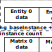

# 第20章 - 间接绘制（静态模型）（Indirect drawing (static models)）

直到本章，我们通过绑定模型的**材质**（Material）**统一变量**（Uniforms）、**纹理**（Texture）、顶点和**索引缓冲**（Index Buffer），并为它们组成的每个**网格**（Mesh）提交一个绘制**命令列表**（Command List）来渲染模型。在本章中，我们将开始一种更高效的渲染方式，我们将开始实现无绑定渲染（至少几乎无绑定）。在这种类型的渲染中，我们不调用一堆绘制**命令列表**（Command List）来绘制场景，而是用指令填充一个**缓冲区**（Buffers），这些指令将允许GPU渲染它们。这称为**间接绘制**（indirect drawing），它是一种更高效的绘制方式，因为：

- 我们消除了在绘制每个**网格**（Mesh）之前执行多次绑定操作的需要。
- 我们只需要调用一个绘制调用。
- 我们可以执行GPU内部操作，例如视锥体剔除，从而减轻CPU端的负载。

如您所见，最终目标是最大限度地利用GPU，同时消除CPU端可能出现的潜在瓶颈以及由于CPU到GPU通信引起的延迟。在本章中，我们将把我们的渲染转换为使用**间接绘制**（indirect drawing），从静态模型开始。动画模型将在下一章处理。

您可以在[此处](https://github.com/lwjglgamedev/lwjglbook/tree/main/chapter-20)找到本章的完整源代码。

## 概念（Concepts）

在解释代码之前，让我们解释一下**间接绘制**（indirect drawing）背后的概念。本质上，我们需要创建一个**缓冲区**（Buffers），该**缓冲区**（Buffers）存储将用于渲染顶点的绘制参数。您可以将其视为指令块或绘制**命令列表**（Command List），GPU将读取这些指令块或绘制**命令列表**（Command List），并指示其执行绘制。填充**缓冲区**（Buffers）后，我们调用`glMultiDrawElementsIndirect`来触发该过程。**缓冲区**（Buffers）中存储的每个绘制**命令列表**（Command List）由以下参数定义（如果您使用C，这由`DrawElementsIndirectCommand`结构建模）：

* `count`：要绘制的顶点数量（将顶点理解为将位置、法线信息、**纹理坐标**（Texture Coordinates）等分组的结构）。这应该包含与我们在渲染**网格**（Mesh）时调用`glDrawElements`时使用的顶点数量相同的值。
* `instanceCount`：要绘制的实例数量。我们可能有多个实体共享同一个模型。与其为每个实体存储一个绘制指令，我们可以只提交一个绘制指令，但设置我们要绘制的实体数量。这称为**实例化渲染**（instance rendering），将节省大量计算时间。如果没有**间接绘制**（indirect drawing），您可以通过为每个**顶点数组对象**（Vertex Array Object，简称VAO）设置特定属性来获得相同的结果。我认为使用这种技术甚至更简单。
* `firstIndex`：将保存用于此绘制指令的索引值的**缓冲区**（Buffers）的偏移量（偏移量以索引数量衡量，而不是字节偏移量）。
* `baseVertex`：将保存顶点数据的**缓冲区**（Buffers）的偏移量（偏移量以顶点数量衡量，而不是字节偏移量）。
* `baseInstance`：我们可以使用此参数设置一个将由所有要绘制的实例共享的值。将此值与要绘制的实例编号结合使用，我们将能够访问该**缓冲区**（Buffers）内的每个实例数据（我们稍后会看到，我们将使用**统一变量**（Uniforms）数组而不是**缓冲区**（Buffers），但您也可以为此使用更简单的**缓冲区**（Buffers））。在该**缓冲区**（Buffers）内，我们将保存索引以访问另外两个**缓冲区**（Buffers）：

* 一个将保存模型矩阵数据。
* 一个将保存**材质**（Material）数据（反照率颜色等）。

对于**纹理**（Texture），我们将使用**纹理**（Texture）数组，这不应与**纹理**（Texture）数组混淆。**纹理**（Texture）数组是包含具有**纹理**（Texture）信息的数组值的**纹理**（Texture），具有相同大小的多个图像。**纹理**（Texture）数组是映射到常规**纹理**（Texture）的**采样器**（sampler）列表，因此它们可以具有不同的大小。**纹理**（Texture）数组有一个限制，其长度不能是任意长度，它们有一个限制，在示例中我们将设置为16个**纹理**（Texture）（尽管您可能希望在设置该限制之前检查您的GPU的功能）。如果您使用多个模型，16个**纹理**（Texture）不是一个高值，为了规避此限制，您可能有两种选择：

* 使用**纹理图集**（texture atlas）（一个巨大的**纹理**（Texture）文件，它组合了单个**纹理**（Texture））。即使您不使用**间接绘制**（indirect drawing），您也应该尽量使用**纹理图集**（texture atlas），因为它限制了绑定调用。
* 使用**无绑定纹理**（bindless textures）。这种方法基本上允许我们传递句柄（64位整数值）来标识**纹理**（Texture），并使用该标识符在**着色器**（Shader）程序中获取**采样器**（sampler）。如果您可以的话，这绝对是**间接绘制**（indirect rendering）的方式（这不是核心功能，而是从4.4版本开始的扩展）。我们不会使用这种方法，因为RenderDoc目前不支持此功能（失去在没有RenderDoc的情况下进行调试的能力对我来说是一个障碍）。

下图描绘了**间接绘制**（indirect drawing）中涉及的**缓冲区**（Buffers）和结构（请记住，这仅在渲染静态模型时有效。我们将在下一章中看到渲染动画模型时需要使用的新结构）。



请记住，我们将使用**统一变量**（Uniforms）数组来存储每个实体数据、**材质**（Material）和模型矩阵（最终数组是一个**缓冲区**（Buffers），但我们将能够通过使用**统一变量**（Uniforms）以方便的方式访问数据）。

## 实现（Implementation）

为了使用**间接绘制**（indirect drawing），我们至少需要使用OpenGL 4.6版本。因此，第一步是更新我们用于窗口创建的窗口提示的主要和次要版本：

```java
public class Window {
    ...
    public Window(String title, WindowOptions opts, Callable<Void> resizeFunc) {
        ...
        glfwWindowHint(GLFW_CONTEXT_VERSION_MAJOR, 4);
        glfwWindowHint(GLFW_CONTEXT_VERSION_MINOR, 6);
        ...
    }
    ...
}
```

下一步是修改代码以将所有**网格**（Mesh）加载到单个**缓冲区**（Buffers）中，但是，在此之前，我们将修改存储模型、**材质**（Material）和**网格**（Mesh）的类层次结构。到目前为止，模型拥有一组关联的**材质**（Material），这些**材质**（Material）拥有一组**网格**（Mesh）。此类的层次结构是为了优化绘制调用而设置的，我们首先遍历模型，然后遍历**材质**（Material），最后遍历**网格**（Mesh）。我们将更改此结构，不再在**材质**（Material）下存储**网格**（Mesh）。相反，**网格**（Mesh）将直接存储在模型下。我们将**材质**（Material）存储在某种缓存中，并将引用该缓存中的一个键用于**网格**（Mesh）。此外，之前，我们为每个模型**网格**（Mesh）创建了一个`Mesh`实例，该实例本质上包含一个**顶点数组对象**（Vertex Array Object，简称VAO）和关联的**顶点缓冲对象**（Vertex Buffer Objects，VBOs）用于**网格**（Mesh）数据。由于我们将为所有**网格**（Mesh）使用单个**缓冲区**（Buffers），因此我们只需要一个**顶点数组对象**（Vertex Array Object，简称VAO）及其关联的**顶点缓冲对象**（Vertex Buffer Objects，VBOs）用于场景中的所有**网格**（Mesh）。因此，我们将在`Model`类下存储用于构建绘制参数的数据，例如顶点**缓冲区**（Buffers）的偏移量、**索引缓冲**（Index Buffer）的偏移量等，而不是存储`Mesh`实例列表。让我们逐一检查更改。

我们将从`MaterialCache`类开始，该类定义如下：

```java
package org.lwjglb.engine.graph;

import java.util.*;

public class MaterialCache {

    public static final int DEFAULT_MATERIAL_IDX = 0;

    private List<Material> materialsList;

    public MaterialCache() {
        materialsList = new ArrayList<>();
        Material defaultMaterial = new Material();
        materialsList.add(defaultMaterial);
    }

    public void addMaterial(Material material) {
        materialsList.add(material);
        material.setMaterialIdx(materialsList.size() - 1);
    }

    public Material getMaterial(int idx) {
        return materialsList.get(idx);
    }

    public List<Material> getMaterialsList() {
        return materialsList;
    }
}
```

如您所见，我们只是将`Material`实例存储在`List`中。因此，为了标识`Material`，我们只需要该实例在列表中的索引。（这种方法可能会使动态添加新**材质**（Material）变得更加困难，但对于此示例的目的来说已经足够简单了。您可能希望更改它，并在您的代码中提供对添加新模型、**材质**（Material）等的强大支持。）我们需要修改`Material`类以移除`Mesh`实例列表，并在**材质**（Material）缓存中存储**材质**（Material）索引：

```java
public class Material {
    ...
    private Vector4f ambientColor;
    private Vector4f diffuseColor;
    private int materialIdx;
    private String normalMapPath;
    private float reflectance;
    private Vector4f specularColor;
    private String texturePath;

    public Material() {
        diffuseColor = DEFAULT_COLOR;
        ambientColor = DEFAULT_COLOR;
        specularColor = DEFAULT_COLOR;
        materialIdx = 0;
    }
    ...
    public int getMaterialIdx() {
        return materialIdx;
    }
    ...
    public void setMaterialIdx(int materialIdx) {
        this.materialIdx = materialIdx;
    }
    ...
}
```

如前所述，我们需要更改`Model`类以移除对**材质**（Material）的引用。相反，我们将保留两个主要引用：

* `MeshData`实例列表（一个新类），它将保存使用Assimp读取的**网格**（Mesh）数据。
* `RenderBuffers.MeshDrawData`实例列表（也是一个新类），它将包含**间接绘制**（indirect drawing）所需的信息（主要是与上面解释的数据**缓冲区**（Buffers）相关的偏移信息）。

我们将首先在加载模型时使用assimp填充`MeshData`实例列表，之后我们将构建保存数据的全局**缓冲区**（Buffers），填充`RenderBuffers.MeshDrawData`实例。之后，我们可以移除对`MeshData`实例的引用。这不是一个非常优雅的解决方案，但它足够简单，可以在不引入更多复杂性的情况下解释概念，而无需使用加载前和加载后层次结构。`Model`类中的更改如下：

```java
public class Model {
    ...
    private final String id;
    private List<Animation> animationList;
    private List<Entity> entitiesList;
    private List<MeshData> meshDataList;
    private List<RenderBuffers.MeshDrawData> meshDrawDataList;

    public Model(String id, List<MeshData> meshDataList, List<Animation> animationList) {
        entitiesList = new ArrayList<>();
        this.id = id;
        this.meshDataList = meshDataList;
        this.animationList = animationList;
        meshDrawDataList = new ArrayList<>();
    }
    ...
    public List<MeshData> getMeshDataList() {
        return meshDataList;
    }

    public List<RenderBuffers.MeshDrawData> getMeshDrawDataList() {
        return meshDrawDataList;
    }

    public boolean isAnimated() {
        return animationList != null && !animationList.isEmpty();
    }
    ...
}
```

`MeshData`类的定义非常简单。它只存储顶点位置、**纹理坐标**（Texture Coordinates）等：
```java
package org.lwjglb.engine.graph;

import org.joml.Vector3f;

public class MeshData {

    private Vector3f aabbMax;
    private Vector3f aabbMin;
    private float[] bitangents;
    private int[] boneIndices;
    private int[] indices;
    private int materialIdx;
    private float[] normals;
    private float[] positions;
    private float[] tangents;
    private float[] textCoords;
    private float[] weights;

    public MeshData(float[] positions, float[] normals, float[] tangents, float[] bitangents,
                    float[] textCoords, int[] indices, int[] boneIndices, float[] weights,
                    Vector3f aabbMin, Vector3f aabbMax) {
        materialIdx = 0;
        this.positions = positions;
        this.normals = normals;
        this.tangents = tangents;
        this.bitangents = bitangents;
        this.textCoords = textCoords;
        this.indices = indices;
        this.boneIndices = boneIndices;
        this.weights = weights;
        this.aabbMin = aabbMin;
        this.aabbMax = aabbMax;
    }

    public Vector3f getAabbMax() {
        return aabbMax;
    }

    public Vector3f getAabbMin() {
        return aabbMin;
    }

    public float[] getBitangents() {
        return bitangents;
    }

    public int[] getBoneIndices() {
        return boneIndices;
    }

    public int[] getIndices() {
        return indices;
    }

    public int getMaterialIdx() {
        return materialIdx;
    }

    public float[] getNormals() {
        return normals;
    }

    public float[] getPositions() {
        return positions;
    }

    public float[] getTangents() {
        return tangents;
    }

    public float[] getTextCoords() {
        return textCoords;
    }

    public float[] getWeights() {
        return weights;
    }

    public void setMaterialIdx(int materialIdx) {
        this.materialIdx = materialIdx;
    }
}
```

`ModelLoader`类中的更改也非常简单，我们需要使用**材质**（Material）缓存并将读取的数据存储在新的`MeshData`类中（而不是之前的`Mesh`类）。此外，**材质**（Material）将不再引用**网格**（Mesh）数据，而是**网格**（Mesh）数据将引用**材质**（Material）在缓存中的索引：

```java
public class ModelLoader {
    ...
    public static Model loadModel(String modelId, String modelPath, TextureCache textureCache, MaterialCache materialCache,
                                  boolean animation) {
        return loadModel(modelId, modelPath, textureCache, materialCache, aiProcess_GenSmoothNormals | aiProcess_JoinIdenticalVertices |
                aiProcess_Triangulate | aiProcess_FixInfacingNormals | aiProcess_CalcTangentSpace | aiProcess_LimitBoneWeights |
                aiProcess_GenBoundingBoxes | (animation ? 0 : aiProcess_PreTransformVertices));
    }

    public static Model loadModel(String modelId, String modelPath, TextureCache textureCache,
                                  MaterialCache materialCache, int flags) {
        ...

        for (int i = 0; i < numMaterials; i++) {
            AIMaterial aiMaterial = AIMaterial.create(aiScene.mMaterials().get(i));
            Material material = processMaterial(aiMaterial, modelDir, textureCache);
            materialCache.addMaterial(material);
            materialList.add(material);
        }

        int numMeshes = aiScene.mNumMeshes();
        PointerBuffer aiMeshes = aiScene.mMeshes();
        List<MeshData> meshDataList = new ArrayList<>();
        List<Bone> boneList = new ArrayList<>();
        for (int i = 0; i < numMeshes; i++) {
            AIMesh aiMesh = AIMesh.create(aiMeshes.get(i));
            MeshData meshData = processMesh(aiMesh, boneList);
            int materialIdx = aiMesh.mMaterialIndex();
            if (materialIdx >= 0 && materialIdx < materialList.size()) {
                meshData.setMaterialIdx(materialList.get(materialIdx).getMaterialIdx());
            } else {
                meshData.setMaterialIdx(MaterialCache.DEFAULT_MATERIAL_IDX);
            }
            meshDataList.add(meshData);
        }
        ...
        return new Model(modelId, meshDataList, animations);
    }
    ...
    private static MeshData processMesh(AIMesh aiMesh, List<Bone> boneList) {
        ...
        return new MeshData(vertices, normals, tangents, bitangents, textCoords, indices, animMeshData.boneIds,
                animMeshData.weights, aabbMin, aabbMax);
    }
}
```

`Scene`类将是保存**材质**（Material）缓存的类（此外，不再需要`cleanup`方法，因为**顶点数组对象**（Vertex Array Objects，VAOs）和**顶点缓冲对象**（Vertex Buffer Objects，VBOs）将不再链接到模型映射）：

```java
public class Scene {
    ...
    private MaterialCache materialCache;
    ...
    public Scene(int width, int height) {
        ...
        materialCache = new MaterialCache();
        ...
    }
    ...
    public MaterialCache getMaterialCache() {
        return materialCache;
    }
    ...    
}
```

`Mesh`类中的更改是由于我们引入了`MeshData`类（只是更改构造函数参数和方法的问题）：

```java
public class Mesh {
    ...
    public Mesh(MeshData meshData) {
        this.aabbMin = meshData.getAabbMin();
        this.aabbMax = meshData.getAabbMax();
        numVertices = meshData.getIndices().length;
        ...
        FloatBuffer positionsBuffer = MemoryUtil.memCallocFloat(meshData.getPositions().length);
        positionsBuffer.put(0, meshData.getPositions());
        ...
        FloatBuffer normalsBuffer = MemoryUtil.memCallocFloat(meshData.getNormals().length);
        normalsBuffer.put(0, meshData.getNormals());
        ...
        FloatBuffer tangentsBuffer = MemoryUtil.memCallocFloat(meshData.getTangents().length);
        tangentsBuffer.put(0, meshData.getTangents());
        ...
        FloatBuffer bitangentsBuffer = MemoryUtil.memCallocFloat(meshData.getBitangents().length);
        bitangentsBuffer.put(0, meshData.getBitangents());
        ...
        FloatBuffer textCoordsBuffer = MemoryUtil.memCallocFloat(meshData.getTextCoords().length);
        textCoordsBuffer.put(0, meshData.getTextCoords());
        ...
        FloatBuffer weightsBuffer = MemoryUtil.memCallocFloat(meshData.getWeights().length);
        weightsBuffer.put(meshData.getWeights()).flip();
        ...
        IntBuffer boneIndicesBuffer = MemoryUtil.memCallocInt(meshData.getBoneIndices().length);
        boneIndicesBuffer.put(meshData.getBoneIndices()).flip();
        ...
        IntBuffer indicesBuffer = MemoryUtil.memCallocInt(meshData.getIndices().length);
        indicesBuffer.put(0, meshData.getIndices());
    }
    ...
}
```

现在轮到我们将为**间接绘制**（indirect drawing）创建的新关键类之一，即`RenderBuffers`类。此类将创建一个单独的**顶点数组对象**（Vertex Array Object，简称VAO），该**顶点数组对象**（Vertex Array Object，简称VAO）将保存包含所有**网格**（Mesh）数据的**顶点缓冲对象**（Vertex Buffer Objects，VBOs）。在这种情况下，我们将只支持静态模型，因此只需要一个**顶点数组对象**（Vertex Array Object，简称VAO）。`RenderBuffers`类如下所示：

```java
public class RenderBuffers {

    private int staticVaoId;
    private List<Integer> vboIdList;

    public RenderBuffers() {
        vboIdList = new ArrayList<>();
    }

    public void cleanup() {
        vboIdList.forEach(GL30::glDeleteBuffers);
        glDeleteVertexArrays(staticVaoId);
    }
    ...
}
```

此类定义了两种加载模型的方法：
* `loadAnimatedModels`用于动画模型。本章不实现此功能。
* `loadStaticModels`用于没有动画的模型。

这些方法定义如下：

```java
public class RenderBuffers {
    ...
    public final int getStaticVaoId() {
        return staticVaoId;
    }

    public void loadAnimatedModels(Scene scene) {
        // To be completed
    }

    public void loadStaticModels(Scene scene) {
        List<Model> modelList = scene.getModelMap().values().stream().filter(m -> !m.isAnimated()).toList();
        staticVaoId = glGenVertexArrays();
        glBindVertexArray(staticVaoId);
        int positionsSize = 0;
        int normalsSize = 0;
        int textureCoordsSize = 0;
        int indicesSize = 0;
        int offset = 0;
        for (Model model : modelList) {
            List<RenderBuffers.MeshDrawData> meshDrawDataList = model.getMeshDrawDataList();
            for (MeshData meshData : model.getMeshDataList()) {
                positionsSize += meshData.getPositions().length;
                normalsSize += meshData.getNormals().length;
                textureCoordsSize += meshData.getTextCoords().length;
                indicesSize += meshData.getIndices().length;

                int meshSizeInBytes = meshData.getPositions().length * 14 * 4;
                meshDrawDataList.add(new MeshDrawData(meshSizeInBytes, meshData.getMaterialIdx(), offset,
                        meshData.getIndices().length));
                offset = positionsSize / 3;
            }
        }

        int vboId = glGenBuffers();
        vboIdList.add(vboId);
        FloatBuffer meshesBuffer = MemoryUtil.memAllocFloat(positionsSize + normalsSize * 3 + textureCoordsSize);
        for (Model model : modelList) {
            for (MeshData meshData : model.getMeshDataList()) {
                populateMeshBuffer(meshesBuffer, meshData);
            }
        }
        meshesBuffer.flip();
        glBindBuffer(GL_ARRAY_BUFFER, vboId);
        glBufferData(GL_ARRAY_BUFFER, meshesBuffer, GL_STATIC_DRAW);
        MemoryUtil.memFree(meshesBuffer);

        defineVertexAttribs();

        // Index VBO
        vboId = glGenBuffers();
        vboIdList.add(vboId);
        IntBuffer indicesBuffer = MemoryUtil.memAllocInt(indicesSize);
        for (Model model : modelList) {
            for (MeshData meshData : model.getMeshDataList()) {
                indicesBuffer.put(meshData.getIndices());
            }
        }
        indicesBuffer.flip();
        glBindBuffer(GL_ELEMENT_ARRAY_BUFFER, vboId);
        glBufferData(GL_ELEMENT_ARRAY_BUFFER, indicesBuffer, GL_STATIC_DRAW);
        MemoryUtil.memFree(indicesBuffer);

        glBindBuffer(GL_ARRAY_BUFFER, 0);
        glBindVertexArray(0);
    }
    ...
}
```

我们首先创建一个**顶点数组对象**（Vertex Array Object，简称VAO）（将用于静态模型），然后遍历模型的**网格**（Mesh）。我们将使用一个**缓冲区**（Buffers）来保存所有数据，因此我们只需遍历这些元素以获取最终**缓冲区**（Buffers）大小。我们将计算位置元素、法线等的数量。我们使用第一个循环来填充我们将存储在包含`RenderBuffers.MeshDrawData`实例的列表中的偏移信息。之后，我们将创建一个单独的**顶点缓冲对象**（Vertex Buffer Object，简称VBO）。您会发现与`Mesh`类中执行类似任务（创建**顶点数组对象**（Vertex Array Object，简称VAO）和**顶点缓冲对象**（Vertex Buffer Objects，VBOs））的**顶点缓冲对象**（Vertex Buffer Object，简称VBO）有很大不同。在这种情况下，我们为位置、法线等使用一个单独的**顶点缓冲对象**（Vertex Buffer Object，简称VBO）。我们只是逐行加载所有数据，而不是使用单独的**顶点缓冲对象**（Vertex Buffer Objects，VBOs）。这在`populateMeshBuffer`中完成（我们将在之后看到）。之后，我们创建索引**顶点缓冲对象**（Vertex Buffer Object，简称VBO），它将包含所有模型的所有**网格**（Mesh）的索引。

`MeshDrawData`类定义如下：

```java
public class RenderBuffers {
    ...
    public record MeshDrawData(int sizeInBytes, int materialIdx, int offset, int vertices) {
    }
}
```

它基本上存储**网格**（Mesh）的大小（以字节为单位）（`sizeInBytes`）、与之关联的**材质**（Material）索引、保存顶点信息的**缓冲区**（Buffers）中的偏移量以及顶点，即此**网格**（Mesh）的索引数量。偏移量以“行”为单位衡量。您可以认为**网格**（Mesh）中保存位置、法线和**纹理坐标**（Texture Coordinates）的部分是一行。这一行保存与单个顶点关联的所有信息，并将在顶点**着色器**（Shader）中处理。这就是为什么我们只将位置元素的数量除以三，每一行将有三个位置元素，并且位置数据中的行数将与法线数据中的行数等匹配。

`populateMeshBuffer`定义如下：

```java
public class RenderBuffers {
    ...
    private void populateMeshBuffer(FloatBuffer meshesBuffer, MeshData meshData) {
        float[] positions = meshData.getPositions();
        float[] normals = meshData.getNormals();
        float[] tangents = meshData.getTangents();
        float[] bitangents = meshData.getBitangents();
        float[] textCoords = meshData.getTextCoords();

        int rows = positions.length / 3;
        for (int row = 0; row < rows; row++) {
            int startPos = row * 3;
            int startTextCoord = row * 2;
            meshesBuffer.put(positions[startPos]);
            meshesBuffer.put(positions[startPos + 1]);
            meshesBuffer.put(positions[startPos + 2]);
            meshesBuffer.put(normals[startPos]);
            meshesBuffer.put(normals[startPos + 1]);
            meshesBuffer.put(normals[startPos + 2]);
            meshesBuffer.put(tangents[startPos]);
            meshesBuffer.put(tangents[startPos + 1]);
            meshesBuffer.put(tangents[startPos + 2]);
            meshesBuffer.put(bitangents[startPos]);
            meshesBuffer.put(bitangents[startPos + 1]);
            meshesBuffer.put(bitangents[startPos + 2]);
            meshesBuffer.put(textCoords[startTextCoord]);
            meshesBuffer.put(textCoords[startTextCoord + 1]);
        }
    }
    ...
}
```

如您所见，我们只是遍历数据的“行”，并将位置、法线和**纹理坐标**（Texture Coordinates）打包到**缓冲区**（Buffers）中。`defineVertexAttribs`定义如下：

```java
public class RenderBuffers {
    ...
    private void defineVertexAttribs() {
        int stride = 3 * 4 * 4 + 2 * 4;
        int pointer = 0;
        // Positions
        glEnableVertexAttribArray(0);
        glVertexAttribPointer(0, 3, GL_FLOAT, false, stride, pointer);
        pointer += 3 * 4;
        // Normals
        glEnableVertexAttribArray(1);
        glVertexAttribPointer(1, 3, GL_FLOAT, false, stride, pointer);
        pointer += 3 * 4;
        // Tangents
        glEnableVertexAttribArray(2);
        glVertexAttribPointer(2, 3, GL_FLOAT, false, stride, pointer);
        pointer += 3 * 4;
        // Bitangents
        glEnableVertexAttribArray(3);
        glVertexAttribPointer(3, 3, GL_FLOAT, false, stride, pointer);
        pointer += 3 * 4;
        // Texture coordinates
        glEnableVertexAttribArray(4);
        glVertexAttribPointer(4, 2, GL_FLOAT, false, stride, pointer);
    }
    ...
}
```

我们只是像前面的示例一样为**顶点数组对象**（Vertex Array Object，简称VAO）定义顶点属性。这里唯一的区别是我们为它们使用了一个单独的**顶点缓冲对象**（Vertex Buffer Object，简称VBO）。

在检查`SceneRender`类中的更改之前，让我们从顶点**着色器**（Shader）（`scene.vert`）开始，它如下所示：

```glsl
#version 460

const int MAX_DRAW_ELEMENTS = 100;
const int MAX_ENTITIES = 50;

layout (location=0) in vec3 position;
layout (location=1) in vec3 normal;
layout (location=2) in vec3 tangent;
layout (location=3) in vec3 bitangent;
layout (location=4) in vec2 texCoord;

out vec3 outNormal;
out vec3 outTangent;
out vec3 outBitangent;
out vec2 outTextCoord;
out vec4 outViewPosition;
out vec4 outWorldPosition;
flat out uint outMaterialIdx;

struct DrawElement
{
    int modelMatrixIdx;
    int materialIdx;
};

uniform mat4 projectionMatrix;
uniform mat4 viewMatrix;
uniform mat4 modelMatrix;
uniform DrawElement drawElements[MAX_DRAW_ELEMENTS];
uniform mat4 modelMatrices[MAX_ENTITIES];
...
```

您会注意到的第一件事是我们已将版本提高到`460`。我们还移除了与动画相关的常量（`MAX_WEIGHTS`和`MAX_BONES`）、骨骼索引的属性以及骨骼矩阵的**统一变量**（Uniform）。您将在下一章中看到，我们在此处不需要这些信息来进行动画。我们创建了两个新常量来定义`drawElements`和`modelMatrices`**统一变量**（Uniforms）的大小。`drawElements`**统一变量**（Uniform）将保存`DrawElement`实例。它将为每个**网格**（Mesh）和关联的实体包含一个项目。如果您还记得，我们将记录一个指令来绘制与**网格**（Mesh）关联的所有项目，并设置要绘制的实例数量。但是，我们需要特定的每个实体数据，例如模型矩阵。这将保存在`drawElements`数组中，该数组还将指向要使用的**材质**（Material）索引。`modelMatrices`数组将只保存每个实体的模型矩阵。**材质**（Material）信息将在片段**着色器**（Shader）中使用，因此我们使用`outMaterialIdx`输出变量传递它。

`main`函数，由于我们不需要处理动画，已经大大简化：

```glsl
...
void main()
{
    vec4 initPos = vec4(position, 1.0);
    vec4 initNormal = vec4(normal, 0.0);
    vec4 initTangent = vec4(tangent, 0.0);
    vec4 initBitangent = vec4(bitangent, 0.0);

    uint idx = gl_BaseInstance + gl_InstanceID;
    DrawElement drawElement = drawElements[idx];
    outMaterialIdx = drawElement.materialIdx;
    mat4 modelMatrix =  modelMatrices[drawElement.modelMatrixIdx];
    mat4 modelViewMatrix = viewMatrix * modelMatrix;
    outWorldPosition = modelMatrix * initPos;
    outViewPosition  = viewMatrix * outWorldPosition;
    gl_Position   = projectionMatrix * outViewPosition;
    outNormal     = normalize(modelViewMatrix * initNormal).xyz;
    outTangent    = normalize(modelViewMatrix * initTangent).xyz;
    outBitangent  = normalize(modelViewMatrix * initBitangent).xyz;
    outTextCoord  = texCoord;
}
```

这里的关键是获取正确的索引来访问`drawElements`大小。我们使用内置变量`gl_BaseInstance`和`gl_InstanceID`。在记录**间接绘制**（indirect drawing）的指令时，我们将使用`baseInstance`属性。该属性的值将与内置变量`gl_BaseInstance`关联。`gl_InstanceID`将在我们从一个**网格**（Mesh）切换到另一个**网格**（Mesh）时从`0`开始，并为与模型关联的实体的每个实例增加。因此，通过组合这两个变量，我们将能够访问`drawElements`数组中每个实体的特定信息。一旦我们有了正确的索引，我们就像在**着色器**（Shader）的先前版本中一样转换位置和法线信息。

场景片段**着色器**（Shader）（`scene.frag`）定义如下：

```glsl
#version 400

const int MAX_MATERIALS  = 20;
const int MAX_TEXTURES = 16;

in vec3 outNormal;
in vec3 outTangent;
in vec3 outBitangent;
in vec2 outTextCoord;
in vec4 outViewPosition;
in vec4 outWorldPosition;
flat in uint outMaterialIdx;

layout (location = 0) out vec4 buffAlbedo;
layout (location = 1) out vec4 buffNormal;
layout (location = 2) out vec4 buffSpecular;

struct Material
{
    vec4 diffuse;
    vec4 specular;
    float reflectance;
    int normalMapIdx;
    int textureIdx;
};

uniform sampler2D txtSampler[MAX_TEXTURES];
uniform Material materials[MAX_MATERIALS];

vec3 calcNormal(int idx, vec3 normal, vec3 tangent, vec3 bitangent, vec2 textCoords) {
    mat3 TBN = mat3(tangent, bitangent, normal);
    vec3 newNormal = texture(txtSampler[idx], textCoords).rgb;
    newNormal = normalize(newNormal * 2.0 - 1.0);
    newNormal = normalize(TBN * newNormal);
    return newNormal;
}

void main() {
    Material material = materials[outMaterialIdx];
    vec4 text_color = texture(txtSampler[material.textureIdx], outTextCoord);
    vec4 diffuse = text_color + material.diffuse;
    if (diffuse.a < 0.5) {
        discard;
    }
    vec4 specular = text_color + material.specular;

    vec3 normal = outNormal;
    if (material.normalMapIdx > 0) {
        normal = calcNormal(material.normalMapIdx, outNormal, outTangent, outBitangent, outTextCoord);
    }

    buffAlbedo   = vec4(diffuse.xyz, material.reflectance);
    buffNormal   = vec4(0.5 * normal + 0.5, 1.0);
    buffSpecular = specular;
}
```

主要更改与我们访问**材质**（Material）信息和**纹理**（Texture）的方式有关。我们现在将拥有一个**材质**（Material）信息数组，该数组将通过我们在顶点**着色器**（Shader）中计算的索引访问，该索引现在位于`outMaterialIdx`输入变量中（该变量具有`flat`修饰符，表示该值不应从顶点阶段插值到片段阶段）。我们将使用**纹理**（Texture）数组来访问常规**纹理**（Texture）或法线贴图。这些**纹理**（Texture）的索引现在存储在`Material`结构中。由于我们将使用非常量表达式访问**采样器**（sampler）数组，因此我们需要将GLSL版本升级到400（该功能仅在OpenGL 4.0之后可用）。

现在轮到检查`SceneRender`类中的更改了。我们将首先定义一组将在代码中使用的常量，一个用于保存**间接绘制**（indirect drawing）指令的**缓冲区**（Buffers）的句柄（`staticRenderBufferHandle`）和绘制**命令列表**（Command List）的数量（`staticDrawCount`）。我们还需要根据前面显示的**着色器**（Shader）中的更改修改`createUniforms`方法：

```java
public class SceneRender {
    ...
    public static final int MAX_DRAW_ELEMENTS = 100;
    public static final int MAX_ENTITIES = 50;
    private static final int COMMAND_SIZE = 5 * 4;
    private static final int MAX_MATERIALS = 20;
    private static final int MAX_TEXTURES = 16;
    ...
    private Map<String, Integer> entitiesIdxMap;
    ...
    private int staticDrawCount;
    private int staticRenderBufferHandle;
    ...
    public SceneRender() {
        ...
        entitiesIdxMap = new HashMap<>();
    }

    private void createUniforms() {
        uniformsMap = new UniformsMap(shaderProgram.getProgramId());
        uniformsMap.createUniform("projectionMatrix");
        uniformsMap.createUniform("viewMatrix");

        for (int i = 0; i < MAX_TEXTURES; i++) {
            uniformsMap.createUniform("txtSampler[" + i + "]");
        }

        for (int i = 0; i < MAX_MATERIALS; i++) {
            String name = "materials[" + i + "]";
            uniformsMap.createUniform(name + ".diffuse");
            uniformsMap.createUniform(name + ".specular");
            uniformsMap.createUniform(name + ".reflectance");
            uniformsMap.createUniform(name + ".normalMapIdx");
            uniformsMap.createUniform(name + ".textureIdx");
        }

        for (int i = 0; i < MAX_DRAW_ELEMENTS; i++) {
            String name = "drawElements[" + i + "]";
            uniformsMap.createUniform(name + ".modelMatrixIdx");
            uniformsMap.createUniform(name + ".materialIdx");
        }

        for (int i = 0; i < MAX_ENTITIES; i++) {
            uniformsMap.createUniform("modelMatrices[" + i + "]");
        }
    }
    ...
}
```

`entitiesIdxMap`将存储与模型关联的实体列表中每个实体所在的位置。我们将该信息存储在`Map`中，使用实体标识符作为键。我们稍后需要此信息，因为**间接绘制**（indirect drawing）**命令列表**（Command List）将记录在与每个模型关联的**网格**（Mesh）上迭代。主要更改在`render`方法中，该方法定义如下：

```java
public class SceneRender {
    ...
    public void render(Scene scene, RenderBuffers renderBuffers, GBuffer gBuffer) {
        glBindFramebuffer(GL_DRAW_FRAMEBUFFER, gBuffer.getGBufferId());
        glClear(GL_COLOR_BUFFER_BIT | GL_DEPTH_BUFFER_BIT);
        glViewport(0, 0, gBuffer.getWidth(), gBuffer.getHeight());
        glDisable(GL_BLEND);

        shaderProgram.bind();

        uniformsMap.setUniform("projectionMatrix", scene.getProjection().getProjMatrix());
        uniformsMap.setUniform("viewMatrix", scene.getCamera().getViewMatrix());

        TextureCache textureCache = scene.getTextureCache();
        List<Texture> textures = textureCache.getAll().stream().toList();
        int numTextures = textures.size();
        if (numTextures > MAX_TEXTURES) {
            Logger.warn("Only " + MAX_TEXTURES + " textures can be used");
        }
        for (int i = 0; i < Math.min(MAX_TEXTURES, numTextures); i++) {
            uniformsMap.setUniform("txtSampler[" + i + "]", i);
            Texture texture = textures.get(i);
            glActiveTexture(GL_TEXTURE0 + i);
            texture.bind();
        }

        int entityIdx = 0;
        for (Model model : scene.getModelMap().values()) {
            List<Entity> entities = model.getEntitiesList();
            for (Entity entity : entities) {
                uniformsMap.setUniform("modelMatrices[" + entityIdx + "]", entity.getModelMatrix());
                entityIdx++;
            }
        }

        // Static meshes
        int drawElement = 0;
        for (Model model: scene.getModelMap().values()) {
            if (model.isAnimated()) {
                continue;
            }
            List<Entity> entities = model.getEntitiesList();
            for (RenderBuffers.MeshDrawData meshDrawData : model.getMeshDrawDataList()) {
                for (Entity entity : entities) {
                    String name = "drawElements[" + drawElement + "]";
                    uniformsMap.setUniform(name + ".modelMatrixIdx", entitiesIdxMap.get(entity.getId()));
                    uniformsMap.setUniform(name + ".materialIdx", meshDrawData.materialIdx());
                    drawElement++;
                }
            }
        }
        glBindBuffer(GL_DRAW_INDIRECT_BUFFER, staticRenderBufferHandle);
        glBindVertexArray(renderBuffers.getStaticVaoId());
        glMultiDrawElementsIndirect(GL_TRIANGLES, GL_UNSIGNED_INT, 0, staticDrawCount, 0);
        glBindVertexArray(0);

        glEnable(GL_BLEND);
        shaderProgram.unbind();
    }
    ...
}
```

您可以看到，我们现在必须绑定**纹理采样器**（Texture Sampler）数组并激活所有**纹理单元**（Texture Unit）。此外，我们遍历实体并为模型矩阵设置**统一变量**（Uniform）值。下一步是使用适当的值设置`drawElements`数组**统一变量**（Uniform），这些值将指向模型矩阵的索引和**材质**（Material）索引。之后，我们调用`glMultiDrawElementsIndirect`函数执行**间接绘制**（indirect drawing）。在此之前，我们需要绑定保存绘制指令（绘制**命令列表**（Command List））的**缓冲区**（Buffers）以及保存**网格**（Mesh）和索引数据的**顶点数组对象**（Vertex Array Object，简称VAO）。但是，我们何时填充**间接绘制**（indirect drawing）的**缓冲区**（Buffers）？答案是，如果实体数量没有变化，则无需在每次渲染调用时执行此操作，您可以记录该**缓冲区**（Buffers）一次，并在每次渲染调用中使用它。在此特定示例中，我们只在启动时填充该**缓冲区**（Buffers）。这意味着，如果您想更改实体数量，则需要再次重新创建该**缓冲区**（Buffers）（您应该在自己的引擎中这样做）。

实际构建**间接绘制**（indirect draw）**缓冲区**（Buffers）的方法称为`setupStaticCommandBuffer`，其定义如下：
```java
public class SceneRender {
    ...
    private void setupStaticCommandBuffer(Scene scene) {
        List<Model> modelList = scene.getModelMap().values().stream().filter(m -> !m.isAnimated()).toList();
        int numMeshes = 0;
        for (Model model : modelList) {
            numMeshes += model.getMeshDrawDataList().size();
        }

        int firstIndex = 0;
        int baseInstance = 0;
        ByteBuffer commandBuffer = MemoryUtil.memAlloc(numMeshes * COMMAND_SIZE);
        for (Model model : modelList) {
            List<Entity> entities = model.getEntitiesList();
            int numEntities = entities.size();
            for (RenderBuffers.MeshDrawData meshDrawData : model.getMeshDrawDataList()) {
                // count
                commandBuffer.putInt(meshDrawData.vertices());
                // instanceCount
                commandBuffer.putInt(numEntities);
                commandBuffer.putInt(firstIndex);
                // baseVertex
                commandBuffer.putInt(meshDrawData.offset());
                commandBuffer.putInt(baseInstance);

                firstIndex += meshDrawData.vertices();
                baseInstance += entities.size();
            }
        }
        commandBuffer.flip();

        staticDrawCount = commandBuffer.remaining() / COMMAND_SIZE;

        staticRenderBufferHandle = glGenBuffers();
        glBindBuffer(GL_DRAW_INDIRECT_BUFFER, staticRenderBufferHandle);
        glBufferData(GL_DRAW_INDIRECT_BUFFER, commandBuffer, GL_DYNAMIC_DRAW);

        MemoryUtil.memFree(commandBuffer);
    }
    ...
}
```

我们首先计算**网格**（Mesh）的总数。之后，我们将创建保存**间接绘制**（indirect drawing）指令的**缓冲区**（Buffers）并填充它。如您所见，我们首先分配一个`ByteBuffer`。此**缓冲区**（Buffers）将保存与**网格**（Mesh）数量一样多的指令集。每组绘制指令由五个属性组成，每个属性长度为4字节（每组参数的总长度定义了`COMMAND_SIZE`常量）。一旦我们有了**缓冲区**（Buffers），我们就开始遍历与模型关联的**网格**（Mesh）。您可以查看本章开头以检查绘制间接所需的结构。此外，我们还使用之前计算的`Map`填充`drawElements`**统一变量**（Uniform），以便正确获取每个实体的模型矩阵索引。最后，我们只需创建一个GPU**缓冲区**（Buffers）并将数据转储到其中。

我们需要更新`cleanup`方法以释放**间接绘制**（indirect drawing）**缓冲区**（Buffers）：

```java
public class SceneRender {
    ...
    public void cleanup() {
        shaderProgram.cleanup();
        glDeleteBuffers(staticRenderBufferHandle);
    }
    ...
}
```

我们需要一个新的方法来设置**材质**（Material）**统一变量**（Uniform）的值：

```java
public class SceneRender {
    ...
    private void setupMaterialsUniform(TextureCache textureCache, MaterialCache materialCache) {
        List<Texture> textures = textureCache.getAll().stream().toList();
        int numTextures = textures.size();
        if (numTextures > MAX_TEXTURES) {
            Logger.warn("Only " + MAX_TEXTURES + " textures can be used");
        }
        Map<String, Integer> texturePosMap = new HashMap<>();
        for (int i = 0; i < Math.min(MAX_TEXTURES, numTextures); i++) {
            texturePosMap.put(textures.get(i).getTexturePath(), i);
        }

        shaderProgram.bind();
        List<Material> materialList = materialCache.getMaterialsList();
        int numMaterials = materialList.size();
        for (int i = 0; i < numMaterials; i++) {
            Material material = materialCache.getMaterial(i);
            String name = "materials[" + i + "]";
            uniformsMap.setUniform(name + ".diffuse", material.getDiffuseColor());
            uniformsMap.setUniform(name + ".specular", material.getSpecularColor());
            uniformsMap.setUniform(name + ".reflectance", material.getReflectance());
            String normalMapPath = material.getNormalMapPath();
            int idx = 0;
            if (normalMapPath != null) {
                idx = texturePosMap.computeIfAbsent(normalMapPath, k -> 0);
            }
            uniformsMap.setUniform(name + ".normalMapIdx", idx);
            Texture texture = textureCache.getTexture(material.getTexturePath());
            idx = texturePosMap.computeIfAbsent(texture.getTexturePath(), k -> 0);
            uniformsMap.setUniform(name + ".textureIdx", idx);
        }
        shaderProgram.unbind();
    }
    ...
}
```

我们只需检查我们没有超过支持的最大**纹理**（Texture）数量（`MAX_TEXTURES`），并使用我们在前几章中使用的信息创建一个**材质**（Material）信息数组。唯一的更改是我们需要在**材质**（Material）信息中存储关联**纹理**（Texture）和法线贴图的索引。

我们需要另一个方法来更新实体索引映射：
```java
public class SceneRender {
    ...
    private void setupEntitiesData(Scene scene) {
        entitiesIdxMap.clear();
        int entityIdx = 0;
        for (Model model : scene.getModelMap().values()) {
            List<Entity> entities = model.getEntitiesList();
            for (Entity entity : entities) {
                entitiesIdxMap.put(entity.getId(), entityIdx);
                entityIdx++;
            }
        }
    }
    ...
}
```

为了完成`SceneRender`类中的更改，我们将创建一个包装`setupXX`的方法，以便可以从`Render`类中调用它：

```java
public class SceneRender {
    ...
    public void setupData(Scene scene) {
        setupEntitiesData(scene);
        setupStaticCommandBuffer(scene);
        setupMaterialsUniform(scene.getTextureCache(), scene.getMaterialCache());
    }
    ...
}
```

我们还将更改阴影渲染过程以使用**间接绘制**（indirect drawing）。顶点**着色器**（Shader）（`shadow.vert`）中的更改非常相似，我们将不使用动画信息，并且需要使用`gl_BaseInstance`和`gl_InstanceID`内置变量的组合来访问适当的模型矩阵。在这种情况下，我们不需要**材质**（Material）信息，因此片段**着色器**（Shader）（`shadow.frag`）没有更改。

```glsl
#version 460

const int MAX_DRAW_ELEMENTS = 100;
const int MAX_ENTITIES = 50;

layout (location=0) in vec3 position;
layout (location=1) in vec3 normal;
layout (location=2) in vec3 tangent;
layout (location=3) in vec3 bitangent;
layout (location=4) in vec2 texCoord;

struct DrawElement
{
    int modelMatrixIdx;
};

uniform mat4 modelMatrix;
uniform mat4 projViewMatrix;
uniform DrawElement drawElements[MAX_DRAW_ELEMENTS];
uniform mat4 modelMatrices[MAX_ENTITIES];

void main()
{
    vec4 initPos = vec4(position, 1.0);
    uint idx = gl_BaseInstance + gl_InstanceID;
    int modelMatrixIdx = drawElements[idx].modelMatrixIdx;
    mat4 modelMatrix = modelMatrices[modelMatrixIdx];
    gl_Position = projViewMatrix * modelMatrix * initPos;
}
```

`ShadowRender`中的更改也与`SceneRender`类中的更改非常相似：

```java
public class ShadowRender {

    private static final int COMMAND_SIZE = 5 * 4;
    ...
    private Map<String, Integer> entitiesIdxMap;
    ...
    private int staticRenderBufferHandle;
    ...
    public ShadowRender() {
        ...
        entitiesIdxMap = new HashMap<>();
    }

    public void cleanup() {
        shaderProgram.cleanup();
        shadowBuffer.cleanup();
        glDeleteBuffers(staticRenderBufferHandle);
    }

    private void createUniforms() {
        ...
        for (int i = 0; i < SceneRender.MAX_DRAW_ELEMENTS; i++) {
            String name = "drawElements[" + i + "]";
            uniformsMap.createUniform(name + ".modelMatrixIdx");
        }

        for (int i = 0; i < SceneRender.MAX_ENTITIES; i++) {
            uniformsMap.createUniform("modelMatrices[" + i + "]");
        }
    }
    ...
}
```

`createUniforms`方法需要更新以使用新的**统一变量**（Uniforms），并且`cleanup`方法需要释放**间接绘制**（indirect draw）**缓冲区**（Buffers）。`render`方法现在将使用`glMultiDrawElementsIndirect`而不是为**网格**（Mesh）和实体提交单独的绘制**命令列表**（Command List）：

```java
public class ShadowRender {
    ...
    public void render(Scene scene, RenderBuffers renderBuffers) {
        CascadeShadow.updateCascadeShadows(cascadeShadows, scene);

        glBindFramebuffer(GL_FRAMEBUFFER, shadowBuffer.getDepthMapFBO());
        glViewport(0, 0, ShadowBuffer.SHADOW_MAP_WIDTH, ShadowBuffer.SHADOW_MAP_HEIGHT);

        shaderProgram.bind();

        int entityIdx = 0;
        for (Model model : scene.getModelMap().values()) {
            List<Entity> entities = model.getEntitiesList();
            for (Entity entity : entities) {
                uniformsMap.setUniform("modelMatrices[" + entityIdx + "]", entity.getModelMatrix());
                entityIdx++;
            }
        }

        for (int i = 0; i < CascadeShadow.SHADOW_MAP_CASCADE_COUNT; i++) {
            glFramebufferTexture2D(GL_FRAMEBUFFER, GL_DEPTH_ATTACHMENT, GL_TEXTURE_2D, shadowBuffer.getDepthMapTexture().getIds()[i], 0);
            glClear(GL_DEPTH_BUFFER_BIT);
        }

        // Static meshes
        int drawElement = 0;
        for (Model model: scene.getModelMap().values()) {
            if (model.isAnimated()) {
                continue;
            }
            List<Entity> entities = model.getEntitiesList();
            for (RenderBuffers.MeshDrawData meshDrawData : model.getMeshDrawDataList()) {
                for (Entity entity : entities) {
                    String name = "drawElements[" + drawElement + "]";
                    uniformsMap.setUniform(name + ".modelMatrixIdx", entitiesIdxMap.get(entity.getId()));
                    drawElement++;
                }
            }
        }
        glBindBuffer(GL_DRAW_INDIRECT_BUFFER, staticRenderBufferHandle);
        glBindVertexArray(renderBuffers.getStaticVaoId());
        for (int i = 0; i < CascadeShadow.SHADOW_MAP_CASCADE_COUNT; i++) {
            glFramebufferTexture2D(GL_FRAMEBUFFER, GL_DEPTH_ATTACHMENT, GL_TEXTURE_2D, shadowBuffer.getDepthMapTexture().getIds()[i], 0);

            CascadeShadow shadowCascade = cascadeShadows.get(i);
            uniformsMap.setUniform("projViewMatrix", shadowCascade.getProjViewMatrix());

            glMultiDrawElementsIndirect(GL_TRIANGLES, GL_UNSIGNED_INT, 0, staticDrawCount, 0);
        }
        glBindVertexArray(0);

        shaderProgram.unbind();
        glBindFramebuffer(GL_FRAMEBUFFER, 0);
    }
    ...
}
```
最后，我们需要一个类似的方法来设置**间接绘制**（indirect draw）**缓冲区**（Buffers）和实体映射：

```java
public class ShadowRender {
    ...
    public void setupData(Scene scene) {
        setupEntitiesData(scene);
        setupStaticCommandBuffer(scene);
    }

    private void setupEntitiesData(Scene scene) {
        entitiesIdxMap.clear();
        int entityIdx = 0;
        for (Model model : scene.getModelMap().values()) {
            List<Entity> entities = model.getEntitiesList();
            for (Entity entity : entities) {
                entitiesIdxMap.put(entity.getId(), entityIdx);
                entityIdx++;
            }
        }
    }

    private void setupStaticCommandBuffer(Scene scene) {
        List<Model> modelList = scene.getModelMap().values().stream().filter(m -> !m.isAnimated()).toList();
        Map<String, Integer> entitiesIdxMap = new HashMap<>();
        int entityIdx = 0;
        int numMeshes = 0;
        for (Model model : scene.getModelMap().values()) {
            List<Entity> entities = model.getEntitiesList();
            numMeshes += model.getMeshDrawDataList().size();
            for (Entity entity : entities) {
                entitiesIdxMap.put(entity.getId(), entityIdx);
                entityIdx++;
            }
        }

        int firstIndex = 0;
        int baseInstance = 0;
        int drawElement = 0;
        shaderProgram.bind();
        ByteBuffer commandBuffer = MemoryUtil.memAlloc(numMeshes * COMMAND_SIZE);
        for (Model model : modelList) {
            List<Entity> entities = model.getEntitiesList();
            int numEntities = entities.size();
            for (RenderBuffers.MeshDrawData meshDrawData : model.getMeshDrawDataList()) {
                // count
                commandBuffer.putInt(meshDrawData.vertices());
                // instanceCount
                commandBuffer.putInt(numEntities);
                commandBuffer.putInt(firstIndex);
                // baseVertex
                commandBuffer.putInt(meshDrawData.offset());
                commandBuffer.putInt(baseInstance);

                firstIndex += meshDrawData.vertices();
                baseInstance += entities.size();

                for (Entity entity : entities) {
                    String name = "drawElements[" + drawElement + "]";
                    uniformsMap.setUniform(name + ".modelMatrixIdx", entitiesIdxMap.get(entity.getId()));
                    drawElement++;
                }
            }
        }
        commandBuffer.flip();
        shaderProgram.unbind();

        staticDrawCount = commandBuffer.remaining() / COMMAND_SIZE;

        staticRenderBufferHandle = glGenBuffers();
        glBindBuffer(GL_DRAW_INDIRECT_BUFFER, staticRenderBufferHandle);
        glBufferData(GL_DRAW_INDIRECT_BUFFER, commandBuffer, GL_DYNAMIC_DRAW);

        MemoryUtil.memFree(commandBuffer);
    }
}
```

在`Render`类中，我们只需要实例化`RenderBuffers`类并提供一个新方法`setupData`，该方法可以在创建所有模型和实体后调用，以创建**间接绘制**（indirect drawing）**缓冲区**（Buffers）和关联数据。

```java
public class Render {
    ...
    private RenderBuffers renderBuffers;
    ...
    public Render(Window window) {
        ...
        renderBuffers = new RenderBuffers();
    }

    public void cleanup() {
        ...
        renderBuffers.cleanup();
    }
    ...
    public void render(Window window, Scene scene) {
        shadowRender.render(scene, renderBuffers);
        sceneRender.render(scene, renderBuffers, gBuffer);
        ...
    }
    ...
    public void setupData(Scene scene) {
        renderBuffers.loadStaticModels(scene);
        renderBuffers.loadAnimatedModels(scene);
        sceneRender.setupData(scene);
        shadowRender.setupData(scene);
        List<Model> modelList = new ArrayList<>(scene.getModelMap().values());
        modelList.forEach(m -> m.getMeshDataList().clear());
    }
}
```

我们需要更新`TextureCache`类以提供一个返回所有**纹理**（Texture）的方法：

```java
public class TextureCache {
    ...
    public Collection<Texture> getAll() {
        return textureMap.values();
    }
    ...
}
```

由于我们修改了处理模型和**材质**（Material）的类层次结构，我们需要更新`SkyBox`类（加载单个模型现在需要额外的步骤）：

```java
public class SkyBox {

    private Material material;
    private Mesh mesh;
    ...
    public SkyBox(String skyBoxModelPath, TextureCache textureCache, MaterialCache materialCache) {
        skyBoxModel = ModelLoader.loadModel("skybox-model", skyBoxModelPath, textureCache, materialCache, false);
        MeshData meshData = skyBoxModel.getMeshDataList().get(0);
        material = materialCache.getMaterial(meshData.getMaterialIdx());
        mesh = new Mesh(meshData);
        skyBoxModel.getMeshDataList().clear();
        skyBoxEntity = new Entity("skyBoxEntity-entity", skyBoxModel.getId());
    }

    public void cleanuo() {
        mesh.cleanup();
    }

    public Material getMaterial() {
        return material;
    }

    public Mesh getMesh() {
        return mesh;
    }
    ...
}
```

这些更改也影响了`SkyBoxRender`类。对于**天空盒**（Sky Box）渲染，我们将不使用**间接绘制**（indirect drawing）（不值得，因为我们将只渲染一个**网格**（Mesh））：

```java
public class SkyBoxRender {
    ...
    public void render(Scene scene) {
        SkyBox skyBox = scene.getSkyBox();
        if (skyBox == null) {
            return;
        }
        shaderProgram.bind();

        uniformsMap.setUniform("projectionMatrix", scene.getProjection().getProjMatrix());
        viewMatrix.set(scene.getCamera().getViewMatrix());
        viewMatrix.m30(0);
        viewMatrix.m31(0);
        viewMatrix.m32(0);
        uniformsMap.setUniform("viewMatrix", viewMatrix);
        uniformsMap.setUniform("txtSampler", 0);

        Entity skyBoxEntity = skyBox.getSkyBoxEntity();
        TextureCache textureCache = scene.getTextureCache();
        Material material = skyBox.getMaterial();
        Mesh mesh = skyBox.getMesh();
        Texture texture = textureCache.getTexture(material.getTexturePath());
        glActiveTexture(GL_TEXTURE0);
        texture.bind();

        uniformsMap.setUniform("diffuse", material.getDiffuseColor());
        uniformsMap.setUniform("hasTexture", texture.getTexturePath().equals(TextureCache.DEFAULT_TEXTURE) ? 0 : 1);

        glBindVertexArray(mesh.getVaoId());

        uniformsMap.setUniform("modelMatrix", skyBoxEntity.getModelMatrix());
        glDrawElements(GL_TRIANGLES, mesh.getNumVertices(), GL_UNSIGNED_INT, 0);

        glBindVertexArray(0);

        shaderProgram.unbind();
    }
    ...
}
```

在`Scene`类中，我们只需要不调用`Scene`的`cleanup`方法（因为与**缓冲区**（Buffers）关联的数据在`RenderBuffers`类中）：

```java
public class Engine {
    ...
    private void cleanup() {
        appLogic.cleanup();
        render.cleanup();
        window.cleanup();
    }
    ...
}
```

最后，在`Main`类中，我们将加载与立方体模型关联的两个实体。我们将独立旋转它们以检查代码是否正常工作。最重要的部分是在加载所有内容后调用`Render`类的`setupData`方法。

```java
public class Main implements IAppLogic {
    ...
    private Entity cubeEntity1;
    private Entity cubeEntity2;
    ...
    private float rotation;

    public static void main(String[] args) {
        ...
        Engine gameEng = new Engine("chapter-20", opts, main);
        ...
    }

    public void init(Window window, Scene scene, Render render) {
        ...
        Model terrainModel = ModelLoader.loadModel(terrainModelId, "resources/models/terrain/terrain.obj",
                scene.getTextureCache(), scene.getMaterialCache(), false);
        ...
        Model cubeModel = ModelLoader.loadModel("cube-model", "resources/models/cube/cube.obj",
                scene.getTextureCache(), scene.getMaterialCache(), false);
        scene.addModel(cubeModel);
        cubeEntity1 = new Entity("cube-entity-1", cubeModel.getId());
        cubeEntity1.setPosition(0, 2, -1);
        cubeEntity1.updateModelMatrix();
        scene.addEntity(cubeEntity1);

        cubeEntity2 = new Entity("cube-entity-2", cubeModel.getId());
        cubeEntity2.setPosition(-2, 2, -1);
        cubeEntity2.updateModelMatrix();
        scene.addEntity(cubeEntity2);

        render.setupData(scene);
        ...
        SkyBox skyBox = new SkyBox("resources/models/skybox/skybox.obj", scene.getTextureCache(),
                scene.getMaterialCache());
        ...
    }
    ...
    public void update(Window window, Scene scene, long diffTimeMillis) {
        rotation += 1.5;
        if (rotation > 360) {
            rotation = 0;
        }
        cubeEntity1.setRotation(1, 1, 1, (float) Math.toRadians(rotation));
        cubeEntity1.updateModelMatrix();

        cubeEntity2.setRotation(1, 1, 1, (float) Math.toRadians(360 - rotation));
        cubeEntity2.updateModelMatrix();
    }
}

```

完成所有这些更改后，您应该能够看到类似这样的内容。


[下一章](./21-indirect-drawing-and-copute-shaders.md)