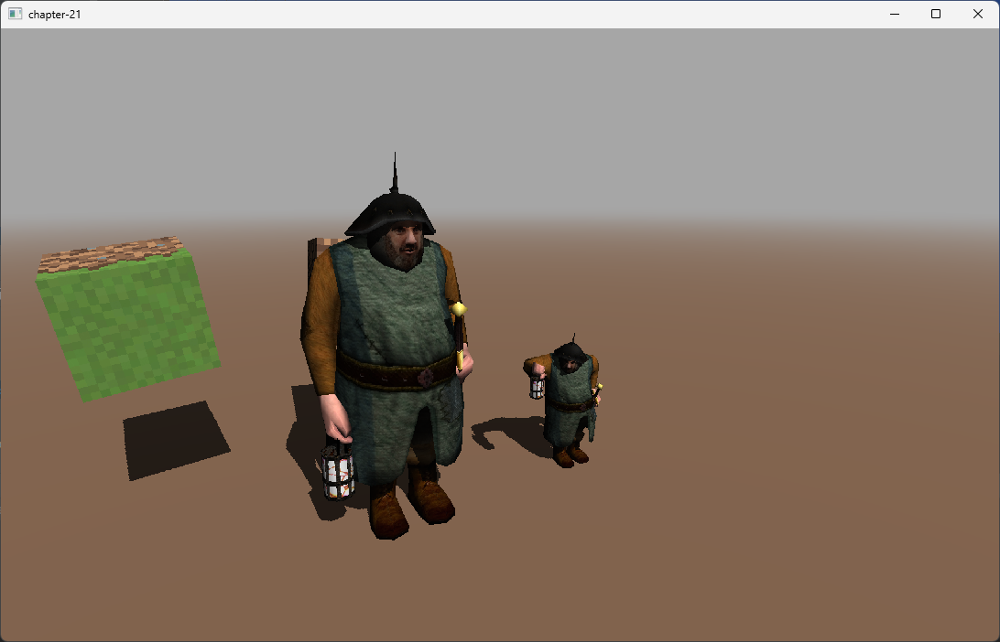

# 第21章 - 间接绘制（动画模型）和计算着色器（Indirect drawing (animated models) and compute shaders）

在本章中，我们将在使用**间接绘制**（indirect drawing）时添加对动画模型的支持。为此，我们将引入一个新主题，**计算着色器**（compute shaders）。我们将使用**计算着色器**（compute shaders）将模型顶点从绑定姿势转换为最终位置（根据当前动画）。完成此操作后，我们可以使用常规**着色器**（Shader）渲染它们，渲染时无需区分动画模型和非动画模型。此外，我们将能够将动画变换与渲染过程解耦。通过这样做，我们将能够以与渲染速率不同的速率更新动画模型（如果它们没有改变，我们不需要在每一帧中转换动画顶点）。

您可以在[此处](https://github.com/lwjglgamedev/lwjglbook/tree/main/chapter-20)找到本章的完整源代码。

## 概念

在解释代码之前，让我们解释一下动画模型**间接绘制**（indirect drawing）背后的概念。我们将遵循的方法与上一章中使用的方法大致相同。我们将有一个全局**缓冲区**（Buffers），其中包含顶点数据。主要区别在于，我们将首先使用**计算着色器**（compute shaders）将顶点从绑定姿势转换为最终姿势。此外，我们不会为模型使用多个实例。原因在于，即使我们有多个实体共享同一个动画模型，它们也可能处于不同的动画状态（动画可能稍后开始，更新速率较低，甚至模型的特定选定动画也可能不同）。因此，在包含动画顶点的全局**缓冲区**（Buffers）中，我们需要为每个实体提供一个单独的数据块。

我们仍然需要保留绑定数据，我们将为场景中的所有**网格**（Mesh）创建另一个全局**缓冲区**（Buffers）。在这种情况下，我们不需要为每个实体设置单独的数据块，每个**网格**（Mesh）只需要一个。**计算着色器**（compute shaders）将访问该绑定姿势数据**缓冲区**（Buffers），为每个实体处理该数据，并将结果存储到另一个全局**缓冲区**（Buffers）中，其结构类似于用于静态模型的结构。

## 模型加载

我们需要更新`Model`类，因为我们将不再在此类中存储骨骼矩阵数据。相反，该信息将存储在公共**缓冲区**（Buffers）中。因此，内部类`AnimatedFrame`不能再是记录（记录是不可变的）。

```java
public class Model {
    ...
    public static class AnimatedFrame {
        private Matrix4f[] bonesMatrices;
        private int offset;

        public AnimatedFrame(Matrix4f[] bonesMatrices) {
            this.bonesMatrices = bonesMatrices;
        }

        public void clearData() {
            bonesMatrices = null;
        }

        public Matrix4f[] getBonesMatrices() {
            return bonesMatrices;
        }

        public int getOffset() {
            return offset;
        }

        public void setOffset(int offset) {
            this.offset = offset;
        }
    }
    ...
}
```

从记录更改为常规内部类，更改了我们访问`Model`类属性的方式，这需要在`ModelLoader`类中进行细微修改：
```java
public class ModelLoader {
    ...
    private static void buildFrameMatrices(AIAnimation aiAnimation, List<Bone> boneList, Model.AnimatedFrame animatedFrame,
                                           int frame, Node node, Matrix4f parentTransformation, Matrix4f globalInverseTransform) {
        ...
        for (Bone bone : affectedBones) {
            ...
            animatedFrame.getBonesMatrices()[bone.boneId()] = boneTransform;
        }
        ...
    }
    ...
}
```

现在让我们回顾一下我们将需要的新全局**缓冲区**（Buffers），这些**缓冲区**（Buffers）将在`RenderBuffers`类中进行管理：

```java
public class RenderBuffers {

    private int animVaoId;
    private int bindingPosesBuffer;
    private int bonesIndicesWeightsBuffer;
    private int bonesMatricesBuffer;
    private int destAnimationBuffer;
    ...
    public void cleanup() {
        ...
        glDeleteVertexArrays(animVaoId);
    }
    ...
    public int getAnimVaoId() {
        return animVaoId;
    }

    public int getBindingPosesBuffer() {
        return bindingPosesBuffer;
    }

    public int getBonesIndicesWeightsBuffer() {
        return bonesIndicesWeightsBuffer;
    }

    public int getBonesMatricesBuffer() {
        return bonesMatricesBuffer;
    }

    public int getDestAnimationBuffer() {
        return destAnimationBuffer;
    }
    ...
}
```

`animVaoId`将存储定义将包含转换后的动画顶点的数据的**顶点数组对象**（Vertex Array Object，简称VAO），即经过**计算着色器**（compute shaders）处理后的数据（记住每个**网格**（Mesh）和实体一个数据块）。数据本身将存储在**缓冲区**（Buffers）中，其句柄将存储在`destAnimationBuffer`中。我们需要在**计算着色器**（compute shaders）中访问该**缓冲区**（Buffers），它不理解**顶点数组对象**（Vertex Array Objects，VAOs），只理解**缓冲区**（Buffers）。我们还需要将骨骼矩阵和索引以及权重存储到分别由`bonesMatricesBuffer`和`bonesIndicesWeightsBuffer`表示的两个**缓冲区**（Buffers）中。在`cleanup`方法中，我们不能忘记清理新的**顶点数组对象**（Vertex Array Object，简称VAO）。我们还需要为新属性添加getter。

我们现在可以实现`loadAnimatedModels`，它如下所示：
```java
public class RenderBuffers {
    ...
    public void loadAnimatedModels(Scene scene) {
        List<Model> modelList = scene.getModelMap().values().stream().filter(Model::isAnimated).toList();
        loadBindingPoses(modelList);
        loadBonesMatricesBuffer(modelList);
        loadBonesIndicesWeights(modelList);

        animVaoId = glGenVertexArrays();
        glBindVertexArray(animVaoId);
        int positionsSize = 0;
        int normalsSize = 0;
        int textureCoordsSize = 0;
        int indicesSize = 0;
        int offset = 0;
        int chunkBindingPoseOffset = 0;
        int bindingPoseOffset = 0;
        int chunkWeightsOffset = 0;
        int weightsOffset = 0;
        for (Model model : modelList) {
            List<Entity> entities = model.getEntitiesList();
            for (Entity entity : entities) {
                List<RenderBuffers.MeshDrawData> meshDrawDataList = model.getMeshDrawDataList();
                bindingPoseOffset = chunkBindingPoseOffset;
                weightsOffset = chunkWeightsOffset;
                for (MeshData meshData : model.getMeshDataList()) {
                    positionsSize += meshData.getPositions().length;
                    normalsSize += meshData.getNormals().length;
                    textureCoordsSize += meshData.getTextCoords().length;
                    indicesSize += meshData.getIndices().length;

                    int meshSizeInBytes = (meshData.getPositions().length + meshData.getNormals().length * 3 + meshData.getTextCoords().length) * 4;
                    meshDrawDataList.add(new MeshDrawData(meshSizeInBytes, meshData.getMaterialIdx(), offset,
                            meshData.getIndices().length, new AnimMeshDrawData(entity, bindingPoseOffset, weightsOffset)));
                    bindingPoseOffset += meshSizeInBytes / 4;
                    int groupSize = (int) Math.ceil((float) meshSizeInBytes / (14 * 4));
                    weightsOffset += groupSize * 2 * 4;
                    offset = positionsSize / 3;
                }
            }
            chunkBindingPoseOffset += bindingPoseOffset;
            chunkWeightsOffset += weightsOffset;
        }

        destAnimationBuffer = glGenBuffers();
        vboIdList.add(destAnimationBuffer);
        FloatBuffer meshesBuffer = MemoryUtil.memAllocFloat(positionsSize + normalsSize * 3 + textureCoordsSize);
        for (Model model : modelList) {
            model.getEntitiesList().forEach(e -> {
                for (MeshData meshData : model.getMeshDataList()) {
                    populateMeshBuffer(meshesBuffer, meshData);
                }
            });
        }
        meshesBuffer.flip();
        glBindBuffer(GL_ARRAY_BUFFER, destAnimationBuffer);
        glBufferData(GL_ARRAY_BUFFER, meshesBuffer, GL_STATIC_DRAW);
        MemoryUtil.memFree(meshesBuffer);

        defineVertexAttribs();

        // Index VBO
        int vboId = glGenBuffers();
        vboIdList.add(vboId);
        IntBuffer indicesBuffer = MemoryUtil.memAllocInt(indicesSize);
        for (Model model : modelList) {
            model.getEntitiesList().forEach(e -> {
                for (MeshData meshData : model.getMeshDataList()) {
                    indicesBuffer.put(meshData.getIndices());
                }
            });
        }
        indicesBuffer.flip();
        glBindBuffer(GL_ELEMENT_ARRAY_BUFFER, vboId);
        glBufferData(GL_ELEMENT_ARRAY_BUFFER, indicesBuffer, GL_STATIC_DRAW);
        MemoryUtil.memFree(indicesBuffer);

        glBindBuffer(GL_ARRAY_BUFFER, 0);
        glBindVertexArray(0);
    }
    ...
}
```

我们稍后将看到以下方法是如何定义的，但目前：
* `loadBindingPoses`：存储与动画模型关联的所有**网格**（Mesh）的绑定姿势信息。
* `loadBonesMatricesBuffer`：存储动画模型的每个动画的骨骼矩阵。
* `loadBonesIndicesWeights`：存储动画模型的骨骼索引和权重信息。

代码与`loadStaticModels`非常相似，我们首先为动画模型创建一个**顶点数组对象**（Vertex Array Object，简称VAO），然后遍历模型的**网格**（Mesh）。我们将使用一个**缓冲区**（Buffers）来保存所有数据，因此我们只需遍历这些元素以获取最终**缓冲区**（Buffers）大小。请注意，第一个循环与静态版本略有不同。我们需要遍历与模型关联的实体，并为每个实体计算所有关联**网格**（Mesh）的大小。

让我们检查一下`loadBindingPoses`方法：

```java
public class RenderBuffers {
    ...
    private void loadBindingPoses(List<Model> modelList) {
        int meshSize = 0;
        for (Model model : modelList) {
            for (MeshData meshData : model.getMeshDataList()) {
                meshSize += meshData.getPositions().length + meshData.getNormals().length * 3 +
                        meshData.getTextCoords().length + meshData.getIndices().length;
            }
        }

        bindingPosesBuffer = glGenBuffers();
        vboIdList.add(bindingPosesBuffer);
        FloatBuffer meshesBuffer = MemoryUtil.memAllocFloat(meshSize);
        for (Model model : modelList) {
            for (MeshData meshData : model.getMeshDataList()) {
                populateMeshBuffer(meshesBuffer, meshData);
            }
        }
        meshesBuffer.flip();
        glBindBuffer(GL_SHADER_STORAGE_BUFFER, bindingPosesBuffer);
        glBufferData(GL_SHADER_STORAGE_BUFFER, meshesBuffer, GL_STATIC_DRAW);
        MemoryUtil.memFree(meshesBuffer);

        glBindBuffer(GL_ARRAY_BUFFER, 0);
    }
    ...
}
```

`loadBindingPoses`遍历所有动画模型，获取总大小以容纳所有关联的**网格**（Mesh）。使用该大小，创建一个**缓冲区**（Buffers）并使用前面章节中已有的`populateMeshBuffer`填充它。因此，我们将动画模型所有**网格**（Mesh）的绑定姿势顶点存储到单个**缓冲区**（Buffers）中。我们将在**计算着色器**（compute shaders）中访问此**缓冲区**（Buffers），因此您可以看到我们在绑定时使用了`GL_SHADER_STORAGE_BUFFER`标志。

`loadBonesMatricesBuffer`方法定义如下：

```java
public class RenderBuffers {
    ...
    private void loadBonesMatricesBuffer(List<Model> modelList) {
        int bufferSize = 0;
        for (Model model : modelList) {
            List<Model.Animation> animationsList = model.getAnimationList();
            for (Model.Animation animation : animationsList) {
                List<Model.AnimatedFrame> frameList = animation.frames();
                for (Model.AnimatedFrame frame : frameList) {
                    Matrix4f[] matrices = frame.getBonesMatrices();
                    bufferSize += matrices.length * 64;
                }
            }
        }

        bonesMatricesBuffer = glGenBuffers();
        vboIdList.add(bonesMatricesBuffer);
        ByteBuffer dataBuffer = MemoryUtil.memAlloc(bufferSize);
        int matrixSize = 4 * 4 * 4;
        for (Model model : modelList) {
            List<Model.Animation> animationsList = model.getAnimationList();
            for (Model.AnimatedFrame frame : frameList) {
                frame.setOffset(dataBuffer.position() / matrixSize);
                Matrix4f[] matrices = frame.getBonesMatrices();
                for (Matrix4f matrix : matrices) {
                    matrix.get(dataBuffer);
                    dataBuffer.position(dataBuffer.position() + matrixSize);
                }
                frame.clearData();
            }
        }
        dataBuffer.flip();

        glBindBuffer(GL_SHADER_STORAGE_BUFFER, bonesMatricesBuffer);
        glBufferData(GL_SHADER_STORAGE_BUFFER, dataBuffer, GL_STATIC_DRAW);
        MemoryUtil.memFree(dataBuffer);
    }
    ...
}
```

我们开始遍历每个模型的动画数据，获取每个动画帧的关联变换矩阵（用于所有骨骼），以便计算将保存所有这些信息的**缓冲区**（Buffers）。一旦我们有了大小，我们就创建**缓冲区**（Buffers）并开始用这些矩阵填充它（在第二个循环中）。与上一个**缓冲区**（Buffers）一样，我们将在**计算着色器**（compute shaders）中访问此**缓冲区**（Buffers），因此我们需要使用`GL_SHADER_STORAGE_BUFFER`标志。

`loadBonesIndicesWeights`方法定义如下：

```java
public class RenderBuffers {
    ...
    private void loadBonesIndicesWeights(List<Model> modelList) {
        int bufferSize = 0;
        for (Model model : modelList) {
            for (MeshData meshData : model.getMeshDataList()) {
                bufferSize += meshData.getBoneIndices().length * 4 + meshData.getWeights().length * 4;
            }
        }
        ByteBuffer dataBuffer = MemoryUtil.memAlloc(bufferSize);
        for (Model model : modelList) {
            for (MeshData meshData : model.getMeshDataList()) {
                int[] bonesIndices = meshData.getBoneIndices();
                float[] weights = meshData.getWeights();
                int rows = bonesIndices.length / 4;
                for (int row = 0; row < rows; row++) {
                    int startPos = row * 4;
                    dataBuffer.putFloat(weights[startPos]);
                    dataBuffer.putFloat(weights[startPos + 1]);
                    dataBuffer.putFloat(weights[startPos + 2]);
                    dataBuffer.putFloat(weights[startPos + 3]);
                    dataBuffer.putFloat(bonesIndices[startPos]);
                    dataBuffer.putFloat(bonesIndices[startPos + 1]);
                    dataBuffer.putFloat(bonesIndices[startPos + 2]);
                    dataBuffer.putFloat(bonesIndices[startPos + 3]);
                }
            }
        }
        dataBuffer.flip();

        bonesIndicesWeightsBuffer = glGenBuffers();
        vboIdList.add(bonesIndicesWeightsBuffer);
        glBindBuffer(GL_SHADER_STORAGE_BUFFER, bonesIndicesWeightsBuffer);
        glBufferData(GL_SHADER_STORAGE_BUFFER, dataBuffer, GL_STATIC_DRAW);
        MemoryUtil.memFree(dataBuffer);

        glBindBuffer(GL_SHADER_STORAGE_BUFFER, 0);
    }
    ...
}
```

与之前的方法一样，我们将权重和骨骼索引信息存储到单个**缓冲区**（Buffers）中，因此我们需要首先计算其大小，然后填充它。与之前的**缓冲区**（Buffers）一样，我们将在**计算着色器**（compute shaders）中访问这些**缓冲区**（Buffers），因此我们需要使用`GL_SHADER_STORAGE_BUFFER`标志。

## 计算着色器

现在轮到通过**计算着色器**（compute shaders）实现动画变换了。如前所述，**着色器**（Shader）就像任何其他**着色器**（Shader）一样，但它对其输入和输出没有任何限制。我们将使用它们来转换数据，它们将访问保存绑定姿势和动画变换矩阵信息的全局**缓冲区**（Buffers），并将结果转储到另一个**缓冲区**（Buffers）中，其结构类似于用于静态模型的结构。动画的**着色器**（Shader）代码（`anim.comp`）定义如下：

```glsl
#version 460

layout (std430, binding=0) readonly buffer srcBuf {
    float data[];
} srcVector;

layout (std430, binding=1) readonly buffer weightsBuf {
    float data[];
} weightsVector;

layout (std430, binding=2) readonly buffer bonesBuf {
    mat4 data[];
} bonesMatrices;

layout (std430, binding=3) buffer dstBuf {
    float data[];
} dstVector;

struct DrawParameters
{
    int srcOffset;
    int srcSize;
    int weightsOffset;
    int bonesMatricesOffset;
    int dstOffset;
};
uniform DrawParameters drawParameters;

layout (local_size_x=1, local_size_y=1, local_size_z=1) in;

void main()
{
    int baseIdx = int(gl_GlobalInvocationID.x) * 14;
    uint baseIdxWeightsBuf  = drawParameters.weightsOffset + int(gl_GlobalInvocationID.x) * 8;
    uint baseIdxSrcBuf = drawParameters.srcOffset + baseIdx;
    uint baseIdxDstBuf = drawParameters.dstOffset + baseIdx;
    if (baseIdx >= drawParameters.srcSize) {
        return;
    }

    vec4 weights = vec4(weightsVector.data[baseIdxWeightsBuf], weightsVector.data[baseIdxWeightsBuf + 1], weightsVector.data[baseIdxWeightsBuf + 2], weightsVector.data[baseIdxWeightsBuf + 3]);
    ivec4 bonesIndices = ivec4(weightsVector.data[baseIdxWeightsBuf + 4], weightsVector.data[baseIdxWeightsBuf + 5], weightsVector.data[baseIdxWeightsBuf + 6], weightsVector.data[baseIdxWeightsBuf + 7]);

    vec4 position = vec4(srcVector.data[baseIdxSrcBuf], srcVector.data[baseIdxSrcBuf + 1], srcVector.data[baseIdxSrcBuf + 2], 1);
    position =
    weights.x * bonesMatrices.data[drawParameters.bonesMatricesOffset + bonesIndices.x] * position +
    weights.y * bonesMatrices.data[drawParameters.bonesMatricesOffset + bonesIndices.y] * position +
    weights.z * bonesMatrices.data[drawParameters.bonesMatricesOffset + bonesIndices.z] * position +
    weights.w * bonesMatrices.data[drawParameters.bonesMatricesOffset + bonesIndices.w] * position;
    dstVector.data[baseIdxDstBuf] = position.x / position.w;
    dstVector.data[baseIdxDstBuf + 1] = position.y / position.w;
    dstVector.data[baseIdxDstBuf + 2] = position.z / position.w;

    baseIdxSrcBuf += 3;
    baseIdxDstBuf += 3;
    vec4 normal = vec4(srcVector.data[baseIdxSrcBuf], srcVector.data[baseIdxSrcBuf + 1], srcVector.data[baseIdxSrcBuf + 2], 0);
    normal =
    weights.x * bonesMatrices.data[drawParameters.bonesMatricesOffset + bonesIndices.x] * normal +
    weights.y * bonesMatrices.data[drawParameters.bonesMatricesOffset + bonesIndices.y] * normal +
    weights.z * bonesMatrices.data[drawParameters.bonesMatricesOffset + bonesIndices.z] * normal +
    weights.w * bonesMatrices.data[drawParameters.bonesMatricesOffset + bonesIndices.w] * normal;
    dstVector.data[baseIdxDstBuf] = normal.x;
    dstVector.data[baseIdxDstBuf + 1] = normal.y;
    dstVector.data[baseIdxDstBuf + 2] = normal.z;

    baseIdxSrcBuf += 3;
    baseIdxDstBuf += 3;
    vec4 tangent = vec4(srcVector.data[baseIdxSrcBuf], srcVector.data[baseIdxSrcBuf + 1], srcVector.data[baseIdxSrcBuf + 2], 0);
    tangent =
    weights.x * bonesMatrices.data[drawParameters.bonesMatricesOffset + bonesIndices.x] * tangent +
    weights.y * bonesMatrices.data[drawParameters.bonesMatricesOffset + bonesIndices.y] * tangent +
    weights.z * bonesMatrices.data[drawParameters.bonesMatricesOffset + bonesIndices.z] * tangent +
    weights.w * bonesMatrices.data[drawParameters.bonesMatricesOffset + bonesIndices.w] * tangent;
    dstVector.data[baseIdxDstBuf] = tangent.x;
    dstVector.data[baseIdxDstBuf + 1] = tangent.y;
    dstVector.data[baseIdxDstBuf + 2] = tangent.z;

    baseIdxSrcBuf += 3;
    baseIdxDstBuf += 3;
    vec4 bitangent = vec4(srcVector.data[baseIdxSrcBuf], srcVector.data[baseIdxSrcBuf + 1], srcVector.data[baseIdxSrcBuf + 2], 0);
    bitangent =
    weights.x * bonesMatrices.data[drawParameters.bonesMatricesOffset + bonesIndices.x] * bitangent +
    weights.y * bonesMatrices.data[drawParameters.bonesMatricesOffset + bonesIndices.y] * bitangent +
    weights.z * bonesMatrices.data[drawParameters.bonesMatricesOffset + bonesIndices.z] * bitangent +
    weights.w * bonesMatrices.data[drawParameters.bonesMatricesOffset + bonesIndices.w] * bitangent;
    dstVector.data[baseIdxDstBuf] = bitangent.x;
    dstVector.data[baseIdxDstBuf + 1] = bitangent.y;
    dstVector.data[baseIdxDstBuf + 2] = bitangent.z;

    baseIdxSrcBuf += 3;
    baseIdxDstBuf += 3;
    vec2 textCoords = vec2(srcVector.data[baseIdxSrcBuf], srcVector.data[baseIdxSrcBuf + 1]);
    dstVector.data[baseIdxDstBuf] = textCoords.x;
    dstVector.data[baseIdxDstBuf + 1] = textCoords.y;
}
```

如您所见，代码与前几章中用于动画的代码非常相似（展开循环）。您会注意到，由于数据现在存储在公共**缓冲区**（Buffers）中，因此每个**网格**（Mesh）都需要应用偏移量。为了支持**计算着色器**（compute shaders）中的推送常量。输入/输出数据定义为一组**缓冲区**（Buffers）：
* `srcVector`：此**缓冲区**（Buffers）将包含顶点信息（位置、法线等）。
* `weightsVector`：此**缓冲区**（Buffers）将包含特定**网格**（Mesh）和实体的当前动画状态的权重。
* `bonesMatrices`：相同，但包含骨骼矩阵信息。
* `dstVector`：此**缓冲区**（Buffers）将保存应用动画变换的结果。

有趣的是我们如何计算该偏移量。`gl_GlobalInvocationID`变量将包含当前在**计算着色器**（compute shaders）中执行的工作项的索引。在我们的例子中，我们将创建与全局**缓冲区**（Buffers）中的“块”一样多的工作项。一个块模拟顶点数据，即其位置、法线、**纹理坐标**（Texture Coordinates）等。因此，对于顶点数据，每次工作项增加时，我们需要在**缓冲区**（Buffers）中向前移动14个位置（14个浮点数：3个用于位置，3个用于法线，3个用于副切线，3个用于切线，2个用于**纹理坐标**（Texture Coordinates））。权重**缓冲区**（Buffers）也适用，它保存与每个顶点关联的权重（4个浮点数）和骨骼索引（4个浮点数）的数据。我们还使用顶点偏移量沿绑定姿势**缓冲区**（Buffers）和目标**缓冲区**（Buffers）移动，以及指向每个**网格**（Mesh）和实体的基本偏移量的`drawParameters`数据。

我们将在一个名为`AnimationRender`的新类中使用此**着色器**（Shader），该类定义如下：

```java
package org.lwjglb.engine.graph;

import org.lwjglb.engine.scene.*;

import java.util.*;

import static org.lwjgl.opengl.GL43.*;

public class AnimationRender {

    private ShaderProgram shaderProgram;
    private UniformsMap uniformsMap;

    public AnimationRender() {
        List<ShaderProgram.ShaderModuleData> shaderModuleDataList = new ArrayList<>();
        shaderModuleDataList.add(new ShaderProgram.ShaderModuleData("resources/shaders/anim.comp", GL_COMPUTE_SHADER));
        shaderProgram = new ShaderProgram(shaderModuleDataList);
        createUniforms();
    }

    public void cleanup() {
        shaderProgram.cleanup();
    }

    private void createUniforms() {
        uniformsMap = new UniformsMap(shaderProgram.getProgramId());
        uniformsMap.createUniform("drawParameters.srcOffset");
        uniformsMap.createUniform("drawParameters.srcSize");
        uniformsMap.createUniform("drawParameters.weightsOffset");
        uniformsMap.createUniform("drawParameters.bonesMatricesOffset");
        uniformsMap.createUniform("drawParameters.dstOffset");
    }

    public void render(Scene scene, RenderBuffers globalBuffer) {
        shaderProgram.bind();
        glBindBufferBase(GL_SHADER_STORAGE_BUFFER, 0, globalBuffer.getBindingPosesBuffer());
        glBindBufferBase(GL_SHADER_STORAGE_BUFFER, 1, globalBuffer.getBonesIndicesWeightsBuffer());
        glBindBufferBase(GL_SHADER_STORAGE_BUFFER, 2, globalBuffer.getBonesMatricesBuffer());
        glBindBufferBase(GL_SHADER_STORAGE_BUFFER, 3, globalBuffer.getDestAnimationBuffer());

        int dstOffset = 0;
        for (Model model : scene.getModelMap().values()) {
            if (model.isAnimated()) {
                for (RenderBuffers.MeshDrawData meshDrawData : model.getMeshDrawDataList()) {
                    RenderBuffers.AnimMeshDrawData animMeshDrawData = meshDrawData.animMeshDrawData();
                    Entity entity = animMeshDrawData.entity();
                    Model.AnimatedFrame frame = entity.getAnimationData().getCurrentFrame();
                    int groupSize = (int) Math.ceil((float) meshDrawData.sizeInBytes() / (14 * 4));
                    uniformsMap.setUniform("drawParameters.srcOffset", animMeshDrawData.bindingPoseOffset());
                    uniformsMap.setUniform("drawParameters.srcSize", meshDrawData.sizeInBytes() / 4);
                    uniformsMap.setUniform("drawParameters.weightsOffset", animMeshDrawData.weightsOffset());
                    uniformsMap.setUniform("drawParameters.bonesMatricesOffset", frame.getOffset());
                    uniformsMap.setUniform("drawParameters.dstOffset", dstOffset);
                    glDispatchCompute(groupSize, 1, 1);
                    dstOffset += meshDrawData.sizeInBytes() / 4;
                }
            }
        }

        glMemoryBarrier(GL_SHADER_STORAGE_BARRIER_BIT);
        shaderProgram.unbind();
    }
}
```

如您所见，定义非常简单，创建**着色器**（Shader）时，我们需要设置`GL_COMPUTE_SHADER`以指示这是**计算着色器**（compute shaders）。我们将使用的**统一变量**（Uniforms）将包含绑定姿势**缓冲区**（Buffers）、权重和矩阵**缓冲区**（Buffers）以及目标**缓冲区**（Buffers）中的偏移量。在`render`方法中，我们只需遍历模型并获取每个实体的**网格**（Mesh）绘制数据，通过调用`glDispatchCompute`向**计算着色器**（compute shaders）分派调用。关键仍然是`groupSize`变量。如您所见，我们需要调用**着色器**（Shader）的次数与**网格**（Mesh）中的顶点块数相同。

## 其他更改

我们需要更新`SceneRender`类以渲染与动画模型关联的实体。更改如下所示：

```java
public class SceneRender {
    ...
    private int animDrawCount;
    private int animRenderBufferHandle;
    ...
    public void cleanup() {
        ...
        glDeleteBuffers(animRenderBufferHandle);
    }
    ...
    public void render(Scene scene, RenderBuffers renderBuffers, GBuffer gBuffer) {
        ...
        // Animated meshes
        drawElement = 0;
        for (Model model: scene.getModelMap().values()) {
            if (!model.isAnimated()) {
                continue;
            }
            for (RenderBuffers.MeshDrawData meshDrawData : model.getMeshDrawDataList()) {
                RenderBuffers.AnimMeshDrawData animMeshDrawData = meshDrawData.animMeshDrawData();
                Entity entity = animMeshDrawData.entity();
                String name = "drawElements[" + drawElement + "]";
                uniformsMap.setUniform(name + ".modelMatrixIdx", entitiesIdxMap.get(entity.getId()));
                uniformsMap.setUniform(name + ".materialIdx", meshDrawData.materialIdx());
                drawElement++;
            }
        }
        glBindBuffer(GL_DRAW_INDIRECT_BUFFER, animRenderBufferHandle);
        glBindVertexArray(renderBuffers.getAnimVaoId());
        glMultiDrawElementsIndirect(GL_TRIANGLES, GL_UNSIGNED_INT, 0, animDrawCount, 0);

        glBindVertexArray(0);
        glEnable(GL_BLEND);
        shaderProgram.unbind();
    }

    private void setupAnimCommandBuffer(Scene scene) {
        List<Model> modelList = scene.getModelMap().values().stream().filter(m -> m.isAnimated()).toList();
        int numMeshes = 0;
        for (Model model : modelList) {
            numMeshes += model.getMeshDrawDataList().size();
        }

        int firstIndex = 0;
        int baseInstance = 0;
        ByteBuffer commandBuffer = MemoryUtil.memAlloc(numMeshes * COMMAND_SIZE);
        for (Model model : modelList) {
            for (RenderBuffers.MeshDrawData meshDrawData : model.getMeshDrawDataList()) {
                RenderBuffers.AnimMeshDrawData animMeshDrawData = meshDrawData.animMeshDrawData();
                Entity entity = animMeshDrawData.entity();
                // count
                commandBuffer.putInt(meshDrawData.vertices());
                // instanceCount
                commandBuffer.putInt(1);
                commandBuffer.putInt(firstIndex);
                // baseVertex
                commandBuffer.putInt(meshDrawData.offset());
                commandBuffer.putInt(baseInstance);

                firstIndex += meshDrawData.vertices();
                baseInstance++;
            }
        }
        commandBuffer.flip();

        animDrawCount = commandBuffer.remaining() / COMMAND_SIZE;

        animRenderBufferHandle = glGenBuffers();
        glBindBuffer(GL_DRAW_INDIRECT_BUFFER, animRenderBufferHandle);
        glBufferData(GL_DRAW_INDIRECT_BUFFER, commandBuffer, GL_DYNAMIC_DRAW);

        MemoryUtil.memFree(commandBuffer);
    }

    public void setupData(Scene scene) {
        ...
        setupAnimCommandBuffer(scene);
        ...
    }
    ...
}
```

渲染动画模型的代码与用于静态实体的代码非常相似。区别在于我们没有对共享同一模型的实体进行分组，我们需要为每个实体和关联的**网格**（Mesh）记录绘制指令。

我们还需要更新`ShadowRender`类以渲染动画模型：

```java
public class ShadowRender {
    ...
    private int animDrawCount;
    private int animRenderBufferHandle;
    ...
    public void cleanup() {
        ...
        glDeleteBuffers(animRenderBufferHandle);
    }
    ...
    public void render(Scene scene, RenderBuffers renderBuffers) {
        ...
        // Animated meshes
        drawElement = 0;
        for (Model model: scene.getModelMap().values()) {
            if (!model.isAnimated()) {
                continue;
            }
            for (RenderBuffers.MeshDrawData meshDrawData : model.getMeshDrawDataList()) {
                RenderBuffers.AnimMeshDrawData animMeshDrawData = meshDrawData.animMeshDrawData();
                Entity entity = animMeshDrawData.entity();
                String name = "drawElements[" + drawElement + "]";
                uniformsMap.setUniform(name + ".modelMatrixIdx", entitiesIdxMap.get(entity.getId()));
                drawElement++;
            }
        }
        glBindBuffer(GL_DRAW_INDIRECT_BUFFER, animRenderBufferHandle);
        glBindVertexArray(renderBuffers.getAnimVaoId());
        for (int i = 0; i < CascadeShadow.SHADOW_MAP_CASCADE_COUNT; i++) {
            glFramebufferTexture2D(GL_FRAMEBUFFER, GL_DEPTH_ATTACHMENT, GL_TEXTURE_2D, shadowBuffer.getDepthMapTexture().getIds()[i], 0);

            CascadeShadow shadowCascade = cascadeShadows.get(i);
            uniformsMap.setUniform("projViewMatrix", shadowCascade.getProjViewMatrix());

            glMultiDrawElementsIndirect(GL_TRIANGLES, GL_UNSIGNED_INT, 0, animDrawCount, 0);
        }

        glBindVertexArray(0);
    }

    private void setupAnimCommandBuffer(Scene scene) {
        List<Model> modelList = scene.getModelMap().values().stream().filter(m -> m.isAnimated()).toList();
        int numMeshes = 0;
        for (Model model : modelList) {
            numMeshes += model.getMeshDrawDataList().size();
        }

        int firstIndex = 0;
        int baseInstance = 0;
        ByteBuffer commandBuffer = MemoryUtil.memAlloc(numMeshes * COMMAND_SIZE);
        for (Model model : modelList) {
            for (RenderBuffers.MeshDrawData meshDrawData : model.getMeshDrawDataList()) {
                RenderBuffers.AnimMeshDrawData animMeshDrawData = meshDrawData.animMeshDrawData();
                Entity entity = animMeshDrawData.entity();
                // count
                commandBuffer.putInt(meshDrawData.vertices());
                // instanceCount
                commandBuffer.putInt(1);
                commandBuffer.putInt(firstIndex);
                // baseVertex
                commandBuffer.putInt(meshDrawData.offset());
                commandBuffer.putInt(baseInstance);

                firstIndex += meshDrawData.vertices();
                baseInstance++;
            }
        }
        commandBuffer.flip();

        animDrawCount = commandBuffer.remaining() / COMMAND_SIZE;

        animRenderBufferHandle = glGenBuffers();
        glBindBuffer(GL_DRAW_INDIRECT_BUFFER, animRenderBufferHandle);
        glBufferData(GL_DRAW_INDIRECT_BUFFER, commandBuffer, GL_DYNAMIC_DRAW);

        MemoryUtil.memFree(commandBuffer);
    }
}
```

在`Render`类中，我们只需要实例化`AnimationRender`类，并在`render`循环和`cleanup`方法中使用它。在`render`循环中，我们将在最开始调用`AnimationRender`类的`render`方法，以便在渲染场景之前应用动画变换。

```java
public class Render {

    private AnimationRender animationRender;
    ...
    public Render(Window window) {
        ...
        animationRender = new AnimationRender();
        ...
    }

    public void cleanup() {
        ...
        animationRender.cleanup();
        ...
    }

    public void render(Window window, Scene scene) {
        animationRender.render(scene, renderBuffers);
        ...
    }    
    ...
}
```

最后，在`Main`类中，我们将创建两个动画实体，它们将具有不同的动画更新速率，以检查我们是否正确分离了每个实体的信息：

```java
public class Main implements IAppLogic {
    ...
    private AnimationData animationData1;
    private AnimationData animationData2;
    ...
    public static void main(String[] args) {
        ...
        Engine gameEng = new Engine("chapter-21", opts, main);
        ...
    }
    ...
    public void init(Window window, Scene scene, Render render) {
        ...
        String bobModelId = "bobModel";
        Model bobModel = ModelLoader.loadModel(bobModelId, "resources/models/bob/boblamp.md5mesh",
                scene.getTextureCache(), scene.getMaterialCache(), true);
        scene.addModel(bobModel);
        Entity bobEntity = new Entity("bobEntity-1", bobModelId);
        bobEntity.setScale(0.05f);
        bobEntity.updateModelMatrix();
        animationData1 = new AnimationData(bobModel.getAnimationList().get(0));
        bobEntity.setAnimationData(animationData1);
        scene.addEntity(bobEntity);

        Entity bobEntity2 = new Entity("bobEntity-2", bobModelId);
        bobEntity2.setPosition(2, 0, 0);
        bobEntity2.setScale(0.025f);
        bobEntity2.updateModelMatrix();
        animationData2 = new AnimationData(bobModel.getAnimationList().get(0));
        bobEntity2.setAnimationData(animationData2);
        scene.addEntity(bobEntity2);
        ...
    }
    ...
    public void update(Window window, Scene scene, long diffTimeMillis) {
        animationData1.nextFrame();
        if (diffTimeMillis % 2 == 0) {
            animationData2.nextFrame();
        }
        ...
    }
}
```

完成所有这些更改后，您应该能够看到类似这样的内容。

