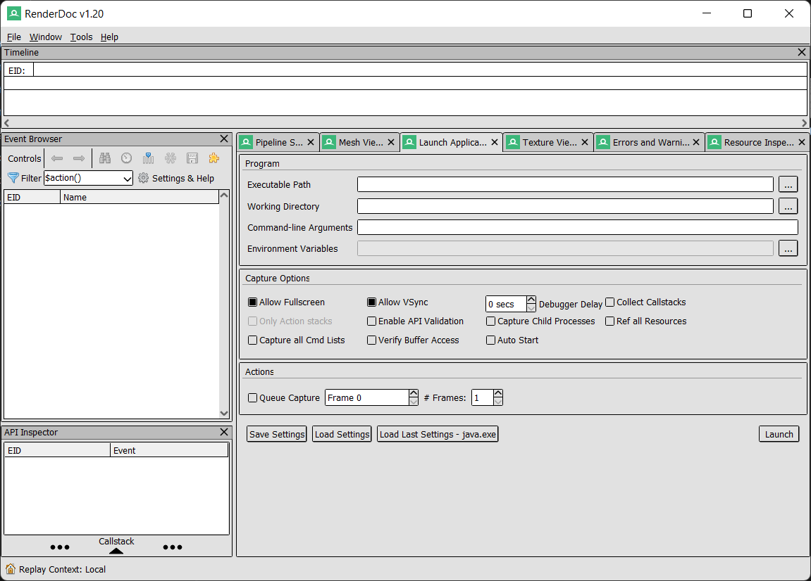
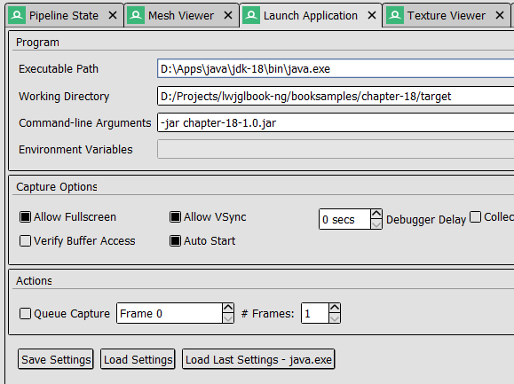
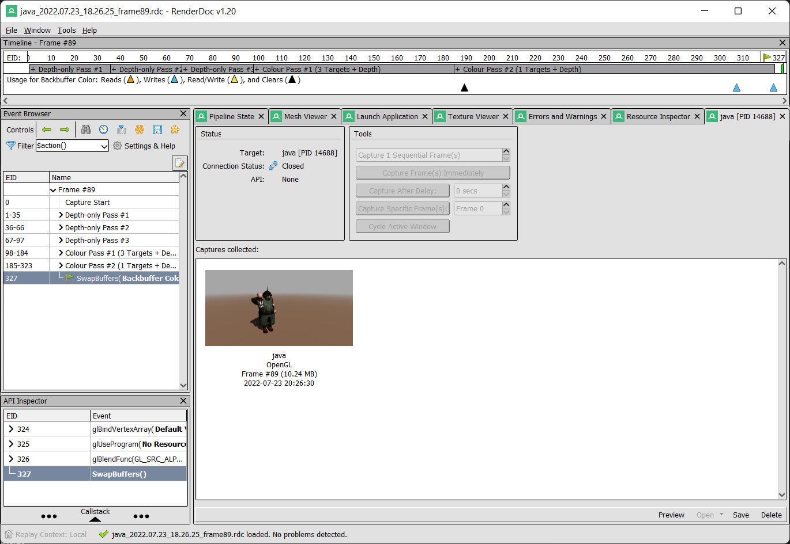

# 附录 A - OpenGL 调试

调试 OpenGL 程序可能是一项艰巨的任务。大多数时候，你只会看到一个黑屏，而不知道发生了什么。为了缓解这个问题，我们可以使用一些现有的工具来提供关于渲染过程的更多信息。

在本附录中，我们将介绍如何使用 [RenderDoc](https://renderdoc.org/ "RenderDoc") 工具来调试我们的 LWJGL 程序。RenderDoc 是一个图形调试工具，可用于 Direct3D、Vulkan 和 OpenGL。在 OpenGL 的情况下，它仅支持从 3.2 到 4.5 的核心配置文件。

那么让我们开始吧。你需要下载并安装适用于你操作系统的 RenderDoc 版本。安装完成后，启动 RenderDoc，你将看到类似如下的界面。

第一步是配置 RenderDoc 以执行并监控我们的示例程序。在 “Capture Executable” 标签页中，我们需要设置以下参数：

* **Executable path（可执行文件路径）**：在我们的例子中，这应该指向 JVM 启动器（例如，“C:\Program Files\Java\jdk-XX\bin\java.exe”）。
* **Working Directory（工作目录）**：这是为你的程序设置的工作目录。在我们的例子中，应设置为 Maven 输出结果的目标目录。这样设置可以使依赖库被正确加载（例如："D:/Projects/booksamples/chapter-18/target"）。
* **Command line arguments（命令行参数）**：这将包含 JVM 执行我们示例所需的参数。在我们的例子中，只需传递要执行的 jar 文件（例如，“-jar chapter-18-1.0.jar”）。

该标签页中还有许多其它选项可以配置捕获选项。你可以在 [RenderDoc 文档](https://renderdoc.org/docs/index.html "RenderDoc documentation") 中查看它们的用途。一旦一切设置完毕，你可以点击 “Launch” 按钮来执行你的程序。你将看到如下所示的界面：

一旦进程启动，你将看到一个新的标签页被添加，名称为 “java [PID XXXX]”（其中 XXXX 是 Java 进程的 PID，即进程标识符）。

在该标签页中，你可以通过点击 “Trigger capture” 按钮来捕获程序的状态。生成捕获后，你将在同一标签页中看到一个小的快照。

如果你双击该捕获，所有收集到的数据将会被加载，你就可以开始检查它了。“Event Browser” 面板会被填充上一个渲染周期中执行的所有相关 OpenGL 调用。

你可以看到以下事件：
* 用于级联阴影的三个深度通道。
* 几何通道。如果你点击一个 glDrawElements 事件，并选择 “Mesh” 标签，你可以看到所绘制的网格、其顶点着色器的输入和输出。
* 光照通道。

你还可以查看该绘图操作所使用的输入纹理（点击 “Texture Viewer” 标签）。

在中间面板中，你可以看到输出内容，在右侧面板中可以看到作为输入使用的纹理列表。你还可以逐个查看输出纹理。这对于展示延迟着色（deferred shading）是非常直观的。

如你所见，这个工具提供了大量关于渲染过程中的信息。在调试渲染问题时可以节省大量宝贵时间。它甚至可以显示渲染管线中使用的着色器信息。

